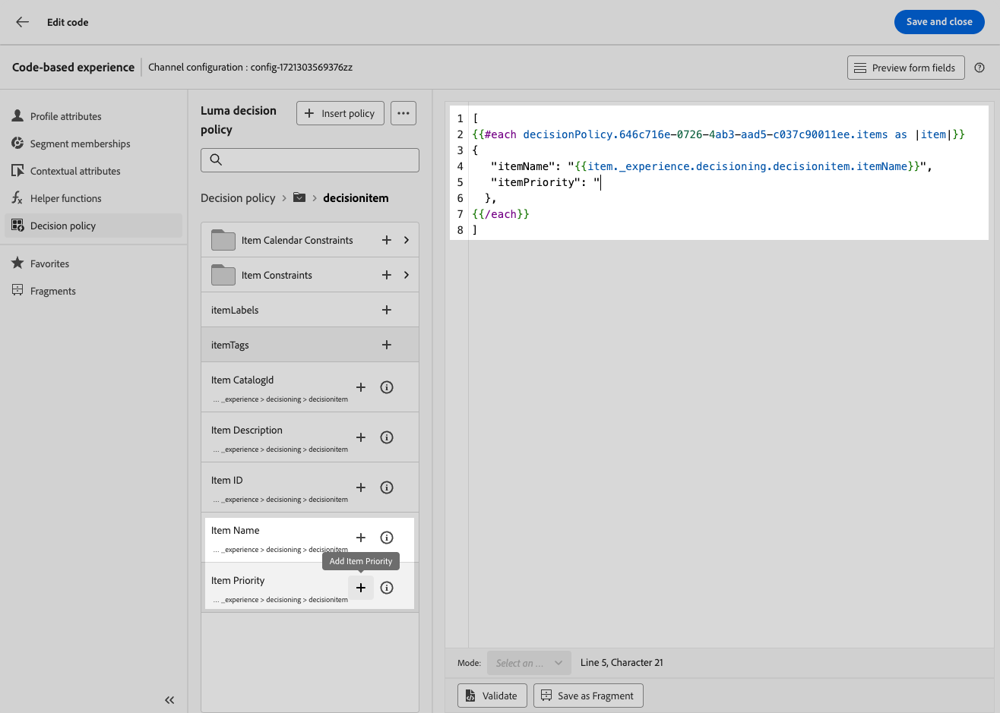
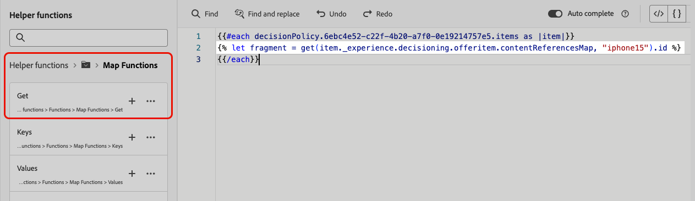

# Utilizzare i criteri di decisione nei messaggi {#create-decision}

Una volta creato un criterio di decisione, il criterio e gli attributi collegati agli elementi di decisione restituiti possono essere utilizzati nel contenuto per la personalizzazione. A questo scopo, il codice associato al criterio di decisione deve prima essere inserito nel contenuto. Al termine, puoi sfruttarne gli attributi per la personalizzazione.

## Inserire il codice del criterio di decisione {#insert-code}

>[!BEGINTABS]

>[!TAB Esperienza basata su codice]

1. Apri l&#39;editor di personalizzazione e accedi al menu **[!UICONTROL Criteri di decisione]**.

1. Selezionare **[!UICONTROL Inserisci criterio]** per aggiungere il codice corrispondente al criterio di decisione.

   

   >[!NOTE]
   >
   >Se il pulsante di inserimento del codice non viene visualizzato, è possibile che per il componente principale sia già stato configurato un criterio di decisione.

1. Viene aggiunto il codice per il criterio di decisione. Questa sequenza verrà ripetuta il numero di volte che si desidera che venga restituito il criterio di decisione. Ad esempio, se si sceglie di restituire 2 elementi durante la [creazione della decisione](#add-decision), la stessa sequenza verrà ripetuta due volte.

>[!TAB E-mail]

1. Apri l&#39;editor di personalizzazione e accedi al menu **[!UICONTROL Criteri di decisione]**.

1. Selezionare **[!UICONTROL Inserisci sintassi]** per aggiungere il codice corrispondente al criterio di decisione.

   

   >[!NOTE]
   >
   >Se il pulsante di inserimento del codice non viene visualizzato, è possibile che per il componente principale sia già stato configurato un criterio di decisione.

1. Se non è stato precedentemente associato alcun posizionamento al componente, selezionarne uno dall&#39;elenco e fare clic su **[!UICONTROL Assegna]**.

   

>[!ENDTABS]

Una volta aggiunto il codice per il criterio di decisione, questa sequenza verrà ripetuta il numero di volte che si desidera che il criterio di decisione venga restituito. Ad esempio, se si sceglie di restituire 2 elementi durante la [creazione della decisione](#add-decision), la stessa sequenza verrà ripetuta due volte.

## Sfruttare gli attributi degli elementi di decisione {#attributes}

Ora puoi aggiungere tutti gli attributi di decisione desiderati all’interno di tale codice. Gli attributi disponibili sono archiviati nello schema del catalogo **[!UICONTROL Offerte]**. Gli attributi personalizzati sono archiviati nella cartella **`_<imsOrg`>** e gli attributi standard nella cartella **`_experience`**. [Ulteriori informazioni sullo schema del catalogo delle offerte](catalogs.md)


>[!NOTE]
>
>Per il tracciamento degli elementi dei criteri di decisione, è necessario aggiungere l&#39;attributo `trackingToken` come segue per il contenuto dei criteri di decisione:
>`trackingToken: {{item._experience.decisioning.decisionitem.trackingToken}}`

Per aggiungere un attributo, fai clic sull’icona &quot;+&quot; accanto a esso. Puoi aggiungere al codice tutti gli attributi che desideri.



Assicurarsi di racchiudere il loop `#each` in una coppia di parentesi quadre `[ ]` e aggiungere una virgola immediatamente prima del `/each` di chiusura.


Puoi anche aggiungere qualsiasi altro attributo disponibile nell’editor di personalizzazione, ad esempio gli attributi del profilo.


## Utilizzo dei frammenti (esperienza basata su codice) {#fragments}

Se il criterio di decisione contiene elementi di decisione, inclusi frammenti, puoi sfruttarli nel codice del criterio di decisione. [Ulteriori informazioni sui frammenti](../content-management/fragments.md)

>[!AVAILABILITY]
>
>Questa funzionalità è attualmente disponibile solo per il canale di esperienza basato su codice e per un set di organizzazioni (disponibilità limitata). Per ulteriori informazioni, contatta il tuo rappresentante Adobe.

Ad esempio, supponiamo che tu voglia visualizzare contenuti diversi per diversi modelli di dispositivi mobili. Accertati di aver aggiunto frammenti corrispondenti a tali dispositivi all’elemento decisionale utilizzato nel criterio di decisione. [Scopri come](items.md#attributes).

{width=70%}

Al termine, puoi utilizzare uno dei seguenti metodi:

>[!BEGINTABS]

>[!TAB Inserisci direttamente il codice]

È sufficiente copiare e incollare il blocco di codice riportato di seguito nel codice del criterio di decisione. Sostituisci `variable` con l&#39;ID frammento e `placement` con la chiave di riferimento frammento:

```

{{fragment id = variable}}
```

>[!TAB Segui i passaggi dettagliati]

1. Passare alle **[!UICONTROL Funzioni helper]** e aggiungere la funzione **Let** ` {{variable}}` al riquadro del codice, in cui è possibile dichiarare la variabile per il frammento.

   

1. Utilizza la **Mappa** > **Ottieni** funzione `` per generare la tua espressione. La mappa è il frammento a cui si fa riferimento nell&#39;elemento di decisione e la stringa può essere il modello di dispositivo immesso nell&#39;elemento di decisione come **[!UICONTROL chiave di riferimento frammento]**.

   

1. Puoi anche utilizzare un attributo contestuale che contenga questo ID modello dispositivo.

   

1. Aggiungi la variabile scelta per il frammento come ID frammento.

   

>[!ENDTABS]

L&#39;ID frammento e la chiave di riferimento verranno selezionati dalla sezione **[!UICONTROL Frammenti]** dell&#39;elemento di decisione.

>[!WARNING]
>
>Se la chiave del frammento non è corretta o se il contenuto del frammento non è valido, il rendering non riuscirà e verrà generato un errore nella chiamata di Edge.

### Guardrail quando si utilizzano frammenti {#fragments-guardrails}

**Attributi di contesto ed elemento della decisione**

Gli attributi degli elementi decisionali e gli attributi contestuali non sono supportati per impostazione predefinita nei frammenti [!DNL Journey Optimizer]. Tuttavia, puoi utilizzare in alternativa le variabili globali, come descritto di seguito.

Supponiamo che desideri utilizzare la variabile *sport* nel frammento.

1. Fai riferimento a questa variabile nel frammento, ad esempio:

   ```
   Elevate your practice with new {{sport}} gear!
   ```

1. Definisci la variabile con la funzione **Let** all&#39;interno del blocco dei criteri di decisione. Nell&#39;esempio seguente, *sport* è definito con l&#39;attributo elemento decisione:

   ```
   {#each decisionPolicy.13e1d23d-b8a7-4f71-a32e-d833c51361e0.items as |item|}}
   
   {{fragment id = get(item._experience.decisioning.offeritem.contentReferencesMap, "placement1").id }}
   {{/each}}
   ```

**Convalida del contenuto del frammento di elemento decisione**

* A causa della natura dinamica di questi frammenti, quando vengono utilizzati in una campagna, la convalida del messaggio durante la creazione del contenuto della campagna viene ignorata per i frammenti a cui si fa riferimento negli elementi decisionali.

* La convalida del contenuto del frammento viene eseguita solo durante la creazione e la pubblicazione del frammento.

* In caso di frammenti JSON, la validità dell’oggetto JSON non è garantita. Assicurati che il contenuto del frammento di espressione sia un JSON valido in modo che possa essere utilizzato negli elementi decisionali.

In fase di esecuzione, viene convalidato il contenuto della campagna (incluso il contenuto del frammento dagli elementi decisionali). In caso di errore di convalida, la campagna non verrà rappresentata.

## Passaggi successivi {#final-steps}

Una volta che il contenuto è pronto, rivedi e pubblica la campagna o il percorso:

* [Pubblicare un percorso](../building-journeys/publish-journey.md)
* [Rivedere attivare una campagna](../campaigns/review-activate-campaign.md)
* [Pubblicare e attivare un’esperienza basata su codice](../code-based/publish-code-based.md)

Per le esperienze basate su codice, non appena lo sviluppatore effettua una chiamata API o SDK per recuperare il contenuto per la superficie definita nella configurazione del canale, le modifiche verranno applicate alla pagina web o all’app.

>[!NOTE]
>
>Attualmente non è possibile simulare contenuti dall&#39;interfaccia utente in una campagna o in un percorso [esperienza basata su codice](../code-based/create-code-based.md) utilizzando le decisioni. Una soluzione alternativa è disponibile in [questa sezione](../code-based/code-based-decisioning-implementations.md).

Per visualizzare le prestazioni delle decisioni, puoi creare [dashboard di reporting di Customer Journey Analytics](cja-reporting.md) personalizzati.

