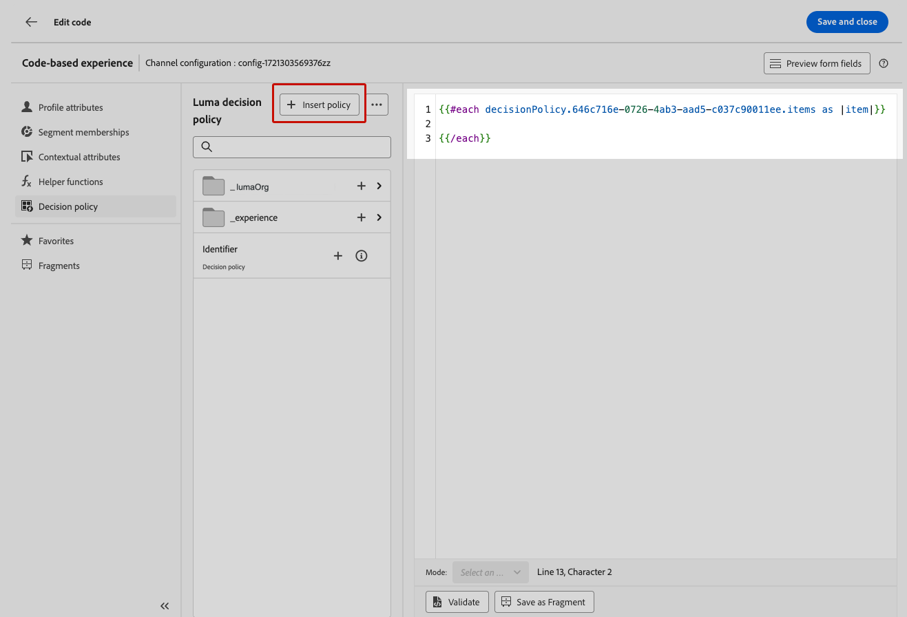
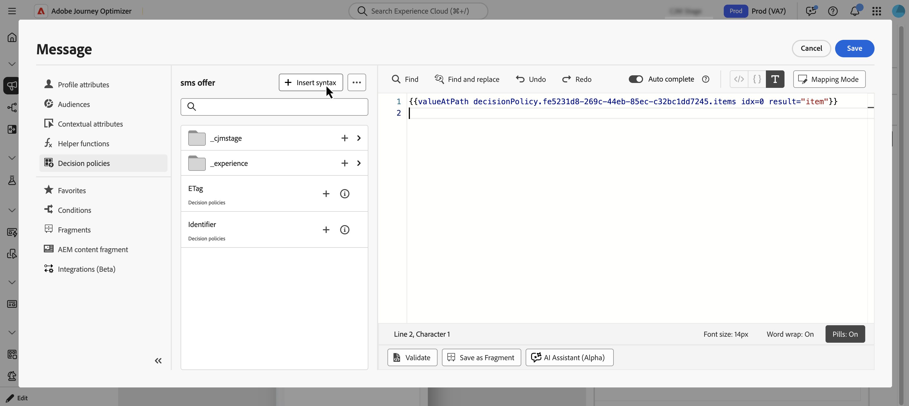

# Utilizzare i criteri di decisione nei messaggi {#create-decision}

Dopo aver aggiunto al contenuto un criterio di decisione, puoi utilizzare per la personalizzazione gli attributi degli elementi di decisione restituiti. A tal fine, inserisci innanzitutto il codice del criterio di decisione nel contenuto.

>[!CAUTION]
>
>I criteri delle decisioni sono disponibili per tutti i clienti per i canali **Esperienza basata su codice**, **SMS**, **Notifica push** e **E-mail**.

## Inserire il codice del criterio di decisione {#insert}

>[!BEGINTABS]

>[!TAB Esperienza basata su codice]

1. Modifica l&#39;esperienza basata su codice e passa a **[!UICONTROL Criterio decisionale]**.

2. Selezionare **[!UICONTROL Inserisci criterio]** per aggiungere il codice del criterio di decisione.

   

>[!NOTE]
>
>Per le esperienze basate su codice, se il criterio di decisione contiene elementi di decisione, compresi i frammenti, puoi sfruttarli nel codice del criterio di decisione. [Scopri come sfruttare i frammenti](fragments-decision-policies.md)

>[!TAB E-mail]

1. Apri **Personalization Editor** e passa a **[!UICONTROL Criteri di decisione]**.

2. Seleziona **[!UICONTROL Inserisci sintassi]** per aggiungere il codice per il criterio decisionale.

   

   >[!NOTE]
   >
   >Se l’opzione di inserimento non viene visualizzata, è possibile che per il componente principale sia già configurato un criterio di decisione.

3. Se al componente non è ancora stato assegnato alcun posizionamento, selezionarne uno dall&#39;elenco e fare clic su **[!UICONTROL Assegna]**.

   

   >[!NOTE]
   >
   >Se utilizzi più criteri di decisione nella stessa e-mail (ad esempio, uno per l’intestazione e uno per il piè di pagina), la stessa offerta viene deduplicata tra i posizionamenti: non viene sottoposta a rendering due volte. Il secondo criterio di decisione non restituirà alcun contenuto e visualizzerà uno spazio vuoto, a meno che non sia stata configurata un’offerta di fallback, nel qual caso verrà visualizzato il fallback.

>[!TAB SMS]

1. Apri **Personalization Editor** e passa a **[!UICONTROL Criteri di decisione]**.

2. Seleziona **[!UICONTROL Inserisci sintassi]** per aggiungere il codice per il criterio decisionale.

   

>[!TAB Invia]

1. Apri **Personalization Editor** e passa a **[!UICONTROL Criteri di decisione]**.

2. Seleziona **[!UICONTROL Inserisci sintassi]** per aggiungere il codice per il criterio decisionale.

   

>[!IMPORTANT]
>
>Experience Decisioning con notifiche push richiede una versione specifica del SDK mobile. Prima di implementare questa funzione, controlla le [note sulla versione](https://developer.adobe.com/client-sdks/home/release-notes){target="_blank"} per identificare la versione richiesta e assicurarti di aver effettuato l&#39;aggiornamento di conseguenza. Puoi anche visualizzare tutte le versioni di SDK disponibili per la tua piattaforma in [questa sezione](https://developer.adobe.com/client-sdks/home/current-sdk-versions){target="_blank"}.

>[!ENDTABS]

Viene aggiunto il codice del criterio di decisione. Ora puoi utilizzare gli attributi degli elementi decisionali restituiti per personalizzare il contenuto.

>[!NOTE]
>
>Per l’esperienza basata su codice e i canali e-mail, ripeti questa sequenza una volta per ogni elemento decisionale che desideri restituire. Ad esempio, se hai scelto di restituire 2 elementi durante la [creazione della decisione](create-decision-policy.md), ripeti la sequenza due volte. Per i canali SMS e Push, è possibile restituire un solo elemento decisionale.

## Personalizzare con gli attributi degli elementi di decisione {#attributes}

Dopo aver aggiunto il codice per un criterio di decisione nel contenuto, tutti gli attributi degli elementi di decisione restituiti diventano disponibili per la personalizzazione. [Scopri come utilizzare la personalizzazione](../personalization/personalize.md).

Gli attributi sono archiviati nello schema [catalogo](catalogs.md) delle &quot;Offerte&quot;. Vengono visualizzati nelle seguenti cartelle dell’editor di personalizzazione:
* **Attributi personalizzati**: cartella `_\<imsOrg\>`
* **Attributi standard**: cartella `_experience`

Gli attributi degli elementi decisionali e gli attributi contestuali non sono supportati per impostazione predefinita nei frammenti [!DNL Journey Optimizer]. Tuttavia, puoi utilizzare in alternativa le variabili globali, come descritto di seguito.

Per aggiungere un attributo, fare clic sull&#39;icona **`+`** accanto all&#39;attributo. Puoi aggiungere tutti gli attributi necessari. Puoi anche includere altri attributi di personalizzazione, ad esempio i dati del profilo.

* Per i canali **Email** e **Code-based**, racchiudi gli attributi nel loop `#each` tra parentesi quadre `[ ]` e aggiungi una virgola prima del tag `/each` di chiusura.

  +++Vedi esempio

  

  +++

* Per i canali **SMS** e **Push**, accertati di inserire gli attributi dopo il codice di sintassi per il criterio di decisione. Questa sintassi deve essere sempre mantenuta alla riga 1.

  +++Vedi esempio

  

  +++

  >[!NOTE]
  >Se inserisci un attributo di risorsa immagine nel contenuto SMS o Push (ad esempio, nel titolo o nel corpo), il valore dell’attributo viene visualizzato come URL. L’immagine stessa non viene rappresentata in questi campi.

* Per abilitare il tracciamento dell&#39;elemento di decisione, aggiungere l&#39;attributo `trackingToken`: `trackingToken: {{item._experience.decisioning.decisionitem.trackingToken}}`

## Anteprima e test del contenuto

Dopo aver generato il contenuto, visualizzalo in anteprima e testalo prima di attivare il percorso o la campagna. Gli elementi decisionali eseguono il rendering in base ai profili selezionati nell’interfaccia di simulazione. [Scopri come visualizzare in anteprima e verificare il contenuto](../content-management/preview-test.md).

## Passaggi successivi {#final-steps}

Una volta che il contenuto è pronto, rivedi e pubblica la campagna o il percorso:

* [Pubblicare un percorso](../building-journeys/publish-journey.md)
* [Rivedere e attivare una campagna](../campaigns/review-activate-campaign.md)

Per le esperienze basate su codice, non appena lo sviluppatore effettua una chiamata API o SDK per recuperare il contenuto per la superficie definita nella configurazione del canale, le modifiche verranno applicate alla pagina web o all’app.

## Utilizzare le dashboard di reporting

Per visualizzare le prestazioni delle decisioni, puoi visualizzare le metriche di decisione predefinite nel rapporto della campagna o del percorso, oppure puoi creare dashboard di Customer Journey Analytics personalizzati per misurare le prestazioni e ottenere informazioni approfondite sul modo in cui i criteri decisionali e le offerte vengono consegnati e utilizzati. [Ulteriori informazioni sul reporting di Decisioning](cja-reporting.md).

