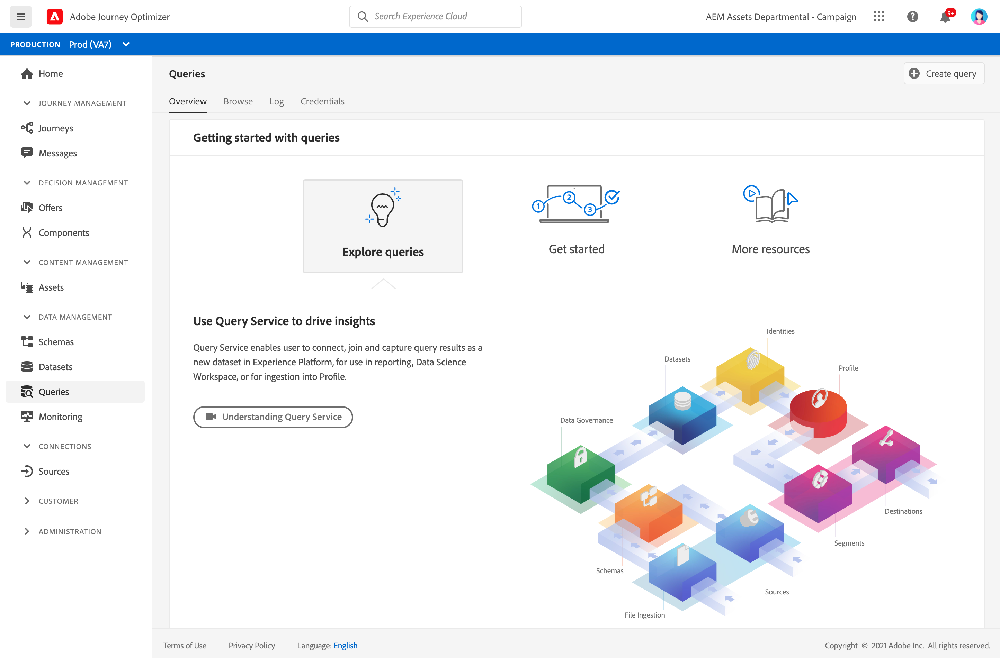

# Guida introduttiva alle query {#queries-gs}

Query Editor è uno strumento interattivo fornito da Adobe Experience Platform Query Service che consente di scrivere, convalidare ed eseguire query per i dati sulla customer experience all’interno dell’interfaccia utente [!DNL Adobe Journey Optimizer].

L’editor delle query supporta lo sviluppo di query per l’analisi e l’esplorazione dei dati e consente di eseguire query interattive a scopo di sviluppo, nonché query non interattive per compilare [set di dati](get-started-datasets.md).

Scopri come utilizzare l’editor delle query in [questa documentazione](https://experienceleague.adobe.com/docs/experience-platform/query/ui/user-guide.html){target=&quot;_blank&quot;}.

**Consulta anche**

* [Documentazione del servizio query](https://experienceleague-review.corp.adobe.com/docs/experience-platform/query/home.html){target=&quot;_blank&quot;}
* [Video introduttivo sul servizio query](https://experienceleague-review.corp.adobe.com/docs/platform-learn/tutorials/queries/understanding-query-service.html){target=&quot;_blank&quot;}
