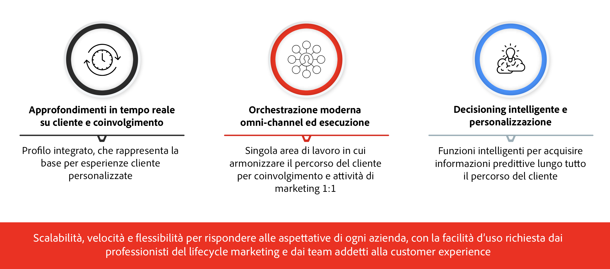

# Introduzione a Journey Optimizer {#cjm-gs}

>[!CONTEXTUALHELP]
>id="test_id"
>title="Contenuto a scopo di test"
>abstract="Verifica il contenuto dell’integrazione dell’aiuto contestuale in AJO."

## Cos’è [!DNL Adobe Journey Optimizer]?{#about-cjm}

[!DNL Adobe Journey Optimizer] aiuta le aziende a fornire ai loro clienti esperienze connesse, contestuali e personalizzate. Il percorso del cliente è l’intero processo di interazione del cliente con il marchio, dal primo momento di contatto fino a quando il cliente se ne va. Inizia con la fase di consapevolezza, in cui il cliente viene a conoscenza del marchio e inizia a essere coinvolto. Il cliente potrà quindi interagire ulteriormente con il marchio, visitare siti online e fisici e fare acquisti, inviare messaggi o pubblicare recensioni.

[!DNL Adobe Journey Optimizer] è basato su  [!DNL Adobe Experience Platform] e combina un profilo cliente unificato e in tempo reale, un framework aperto API-first, un offer decisioning centralizzato e intelligenza artificiale (AI) e machine learning (ML) per la personalizzazione e l’ottimizzazione. Journey Optimizer consente ai marchi di determinare in modo intelligente la migliore interazione con scalabilità, velocità e flessibilità nell&#39;intero percorso di clienti. Con [!DNL Adobe Journey Optimizer], le aziende possono creare e distribuire sia campagne di marketing pianificate (come le promozioni settimanali per un negozio al dettaglio) che comunicazioni personalizzate (come una notifica push per un articolo che un cliente di app fedeltà potrebbe aver visto che era precedentemente esaurito) all&#39;interno della stessa applicazione.

## Casi di utilizzo

* Gli addetti al marketing possono utilizzare [!DNL Adobe Journey Optimizer] per inviare comunicazioni personalizzate e comunicazioni batch basate sul pubblico. Ad esempio, un negozio di abbigliamento invia in genere sondaggi post-acquisto a tutti i clienti che hanno acquistato prodotti nell’ultima settimana. A causa del tempo di inclusione, alcune spedizioni hanno avuto ritardi. Visto quali clienti non hanno ricevuto le loro spedizioni, il negozio di abbigliamento può escluderli dalla soddisfazione pianificata del cliente inviando invece un’e-mail personalizzata che si scuso del ritardo e offre un codice sconto con raccomandazioni sui prodotti in base agli acquisti effettuati in passato dal cliente.

   Gli addetti al marketing possono inoltre utilizzare l’applicazione per inviare comunicazioni basate sul comportamento in tempo reale. Ad esempio, lo stesso rivenditore potrebbe coinvolgere un cliente fedele che si ritira in tempo reale nel parcheggio del negozio inviando loro una notifica push su un maglione che è di nuovo in magazzino nelle dimensioni del cliente.

* I non addetti al marketing, come i team operativi e l’assistenza clienti coinvolti nella customer experience, possono utilizzare [!DNL Adobe Journey Optimizer] per gestire una serie di attività, come le notifiche operative o anche per monitorare il processo di onboarding. Prendiamo ad esempio un parco divertimenti in cui i visitatori del parco scaricano un&#39;app mobile come parte della loro esperienza nel parco. Il personale di manutenzione può utilizzare [!DNL Adobe Journey Optimizer] per informare i visitatori del parco dei percorsi attualmente chiusi a causa di manutenzione.

## Funzionalità principali

[!DNL Adobe Journey Optimizer] è un’applicazione agile e scalabile per creare e distribuire esperienze cliente personalizzate, connesse e puntuali in qualsiasi app, dispositivo o canale.

Le funzionalità principali includono:

* **Real-time Customer Insights &amp; Engagement** : un profilo integrato fonde i dati live provenienti da tutte le fonti nei diversi punti di contatto dei clienti, inclusi i dati comportamentali, transazionali, finanziari e operativi, per ottimizzare le esperienze personali e contestuali dei clienti nel loro tempo.

* **Orchestrazione ed esecuzione omnicanale moderna** : un&#39;unica area di lavoro su cui armonizzare e ottimizzare il percorso dei clienti per un coinvolgimento e un&#39;attività di marketing 1:1, per aiutare i brand a offrire più valore nel ciclo di vita del cliente. I percorsi dei clienti progettati in [!DNL Adobe Journey Optimizer] possono essere dinamici e basati su eventi per aiutare i brand a reagire a segnali in tempo reale e a collegare tali interazioni con campagne pianificate, in modo da poter prendere le decisioni giuste sulle comunicazioni da inviare ai clienti, quando e attraverso quali canali.

* **Decisioning &amp; Personalizzazione intelligente** : i brand possono applicare decisioni centralizzate e incorporare intelligenza artificiale e machine learning per acquisire informazioni predittive in tutta l’esperienza del cliente, semplificando l’automazione delle decisioni e ottimizzando l’esperienza su larga scala. L&#39;Offer decisioning potenzia le offerte centralizzate su tutti i canali su larga scala attraverso [!DNL Adobe Journey Optimizer].

>[!NOTE]
>
> Le linee guida e le procedure generali sulla privacy di Adobe Experience Cloud sono applicabili anche a [!DNL Journey Optimizer]. [Ulteriori informazioni sulla privacy di Adobe Experience Cloud](https://www.adobe.com/it/privacy/experience-cloud.html).
> È inoltre necessario essere a conoscenza di [Guardrail per i dati del profilo cliente in tempo reale prima di avviare](https://experienceleague.adobe.com/docs/experience-platform/profile/guardrails.html).

**Consulta anche**

* [Passaggi chiave per iniziare](quick-start.md)
* [Creare il primo messaggio](get-started-content.md)
* [Progettare i percorsi e inviare i messaggi](building-journeys/journey-gs.md)
* [Rapporti live](reports/live-report.md)
* [Domande frequenti su Journey Optimizer](assets/do-not-localize/AJO-FAQ.pdf)  (PDF)
