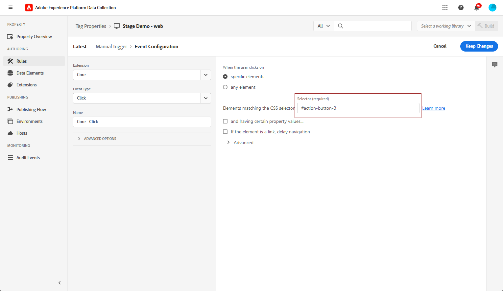
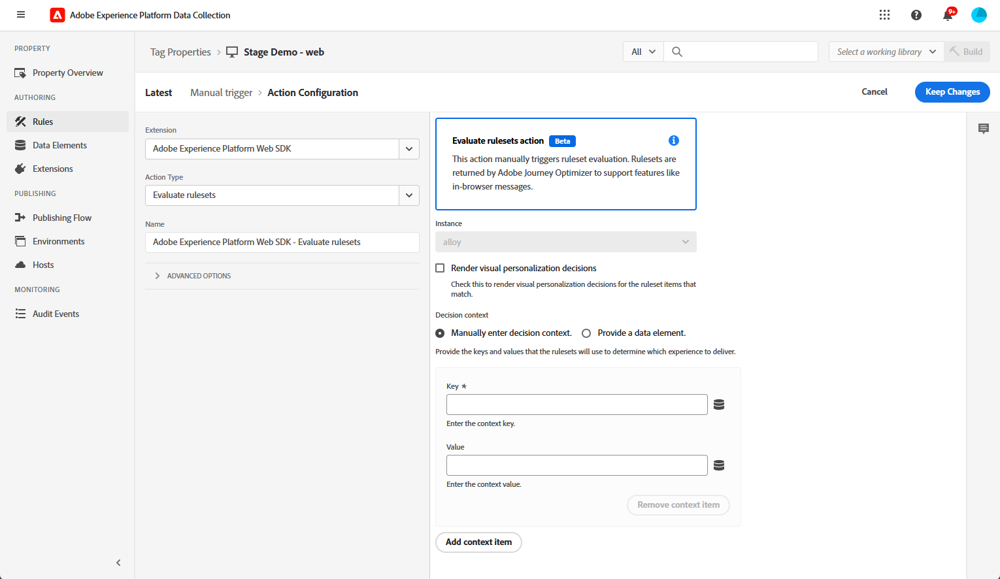
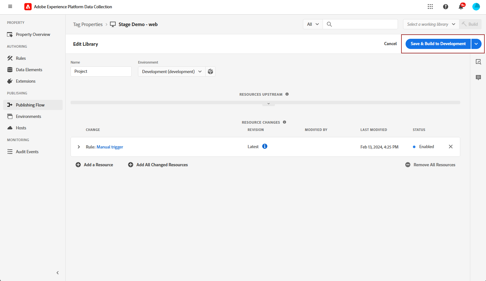

# Configurare il canale Web in-app {#configure-in-app-web}

## Prerequisiti {#prerequisites}

* Assicurati di utilizzare la versione più recente per l&#39;estensione **Adobe Experience Platform Web SDK**.

* Installa l&#39;estensione **Adobe Experience Platform Web SDK** nelle **proprietà tag** e abilita l&#39;opzione **Personalization Storage**.

  Questa configurazione è essenziale per l’archiviazione della cronologia degli eventi sul client, un prerequisito per l’implementazione delle Regole di frequenza nel Generatore di regole. [Ulteriori informazioni](https://experienceleague.adobe.com/docs/experience-platform/tags/extensions/client/web-sdk/web-sdk-extension-configuration.html?lang=it){target="_blank"}

  

## Configurare la regola Dati inviati alla piattaforma {#configure-sent-data-trigger}

1. Accedi all&#39;istanza di **Adobe Experience Platform Data Collection** e passa a **Tag Properties** configurate con l&#39;estensione **Adobe Experience Platform Web SDK**.

1. Dal menu **Authoring**, seleziona **Regole**, quindi **Crea nuova regola** o **Aggiungi regola**.

   

1. Nella sezione **Eventi**, fai clic su **Aggiungi** e configuralo come segue:

   * **Estensione**: Core

   * **Tipo evento**: libreria caricata (parte superiore della pagina).

   

1. Fai clic su **Mantieni modifiche** per salvare la configurazione dell&#39;evento.

1. Nella sezione **Azioni**, fai clic su **Aggiungi** e configuralo come segue:

   * **Estensione**: Adobe Experience Platform Web SDK

   * **Tipo azione**: invia evento

   

1. Nella sezione **Personalization** del tipo **Action**, abilita l&#39;opzione **Decisioni di personalizzazione visiva**.

   

1. Nella sezione **Contesto decisionale**, definisci le coppie **Chiave** e **Valore** che determinano l&#39;esperienza da consegnare.

   

1. Salva la configurazione di **Azione** facendo clic su **Mantieni modifiche**.

1. Passare al menu **Flusso di pubblicazione**. Crea una nuova **Libreria** o seleziona una **Libreria** esistente e aggiungi la **Regola** appena creata. [Ulteriori informazioni](https://experienceleague.adobe.com/docs/experience-platform/tags/publish/libraries.html?lang=it#create-a-library){target="_blank"}

1. Dalla **libreria**, seleziona **Salva e genera in sviluppo**.

   

## Configura regola manuale {#configure-manual-trigger}

1. Accedi all&#39;istanza di **Adobe Experience Platform Data Collection** e passa a **Tag Properties** configurate con l&#39;estensione **Adobe Experience Platform Web SDK**.

1. Dal menu **Authoring**, seleziona **Regole**, quindi **Crea nuova regola** o **Aggiungi regola**.

   

1. Nella sezione **Eventi**, fai clic su **Aggiungi** e configuralo come segue:

   * **Estensione**: Core

   * **Tipo evento**: fare clic

   

1. Nella **Configurazione clic**, definire il **Selettore** che verrà valutato.

   

1. Fai clic su **Mantieni modifiche** per salvare la configurazione di **Evento**.

1. Nella sezione **Azioni**, fai clic su **Aggiungi** e configuralo come segue:

   * **Estensione**: Adobe Experience Platform Web SDK

   * **Tipo azione**: Valuta set di regole

   

1. Nella sezione **Valuta azione set di regole** del tipo **Azione**, abilita l&#39;opzione **Esegui rendering decisioni di personalizzazione visiva**.

   

1. Nella sezione **Contesto decisionale**, definisci le coppie **Chiave** e **Valore** che determinano l&#39;esperienza da consegnare.

1. Accedi al menu **Flusso di pubblicazione**, crea una nuova **Libreria** o seleziona una **Libreria** esistente e aggiungi la **Regola** appena creata. [Ulteriori informazioni](https://experienceleague.adobe.com/docs/experience-platform/tags/publish/libraries.html?lang=it#create-a-library){target="_blank"}

1. Dalla **libreria**, seleziona **Salva e genera in sviluppo**.

   

## Creare una configurazione web in-app {#in-app-config}

1. Accedi al menu **[!UICONTROL Canali]** > **[!UICONTROL Impostazioni generali]** > **[!UICONTROL Configurazioni canale]**, quindi fai clic su **[!UICONTROL Crea configurazione canale]**.

   

1. Immetti un nome e una descrizione (facoltativa) per la configurazione, quindi seleziona il canale da configurare.

   >[!NOTE]
   >
   > I nomi devono iniziare con una lettera (A-Z). Può contenere solo caratteri alfanumerici. È inoltre possibile utilizzare i caratteri trattino basso `_`, punto `.` e trattino `-`.

1. Per assegnare etichette di utilizzo dei dati personalizzate o di base alla configurazione, è possibile selezionare **[!UICONTROL Gestisci accesso]**. [Ulteriori informazioni sul controllo degli accessi a livello di oggetto](../administration/object-based-access.md).

1. Seleziona **[!UICONTROL Azione di marketing]** per associare i criteri di consenso ai messaggi utilizzando questa configurazione. Tutti i criteri di consenso associati all’azione di marketing vengono utilizzati per rispettare le preferenze dei clienti. [Ulteriori informazioni](../action/consent.md#surface-marketing-actions)

1. Seleziona il canale **Messaggistica in-app**.

1. Definisci una configurazione di app. Sono disponibili due opzioni per apportare modifiche:

   * È possibile immettere un **[!UICONTROL URL pagina]** per applicare le modifiche a una pagina specifica.

   * Puoi creare una regola per eseguire il targeting di più URL che seguono lo stesso pattern.

     +++ Come creare una regola di corrispondenza Pagine.

      1. Seleziona **[!UICONTROL Regola di corrispondenza pagine]** come configurazione app e immetti il tuo **[!UICONTROL URL pagina]**.

      1. Nella finestra **[!UICONTROL Modifica regola di configurazione]**, definisci i criteri per i campi **[!UICONTROL Dominio]** e **[!UICONTROL Pagina]**.
      1. Dai menu a discesa delle condizioni, personalizza ulteriormente i criteri.

         Qui, ad esempio, per modificare gli elementi visualizzati in tutte le pagine dei prodotti di vendita del sito web Luma, seleziona Dominio > Inizia con > luma e Pagina > Contiene > vendite.

         

      1. Fai clic su **[!UICONTROL Aggiungi un&#39;altra regola di pagina]** per creare un&#39;altra regola, se necessario.

      1. Selezionare l&#39;**[!UICONTROL URL predefinito per l&#39;authoring e l&#39;anteprima]**.

      1. Salva le modifiche. La regola viene visualizzata nella schermata **[!UICONTROL Crea campagna]**.

     +++

1. Invia la configurazione Web in-app.

Ora puoi [creare un Web in-app](../in-app/create-in-app-web.md) all&#39;interno di una campagna.
