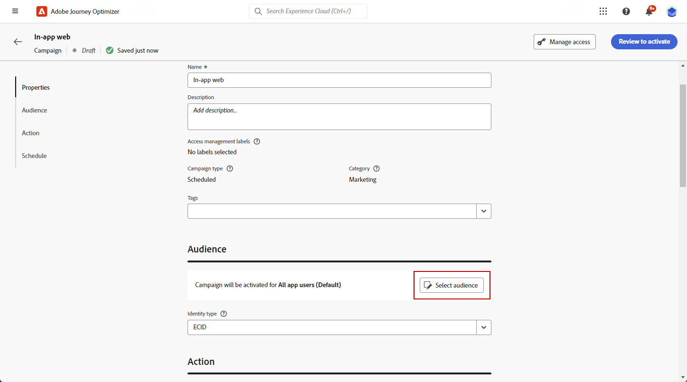

# Creare un messaggio in-app per il web {#create-in-app-web}

## Configurare il canale Web in-app {#configure-web-inapp}

Per configurare il tuo canale Web in-app, segui i passaggi seguenti:

* Installa l’estensione tag Web SDK per supportare la messaggistica in-app web. [Ulteriori informazioni](https://experienceleague.adobe.com/docs/experience-platform/tags/extensions/client/web-sdk/web-sdk-extension-configuration.html?lang=en)

* Personalizza i trigger. La messaggistica Web in-app supporta due tipi di trigger: Inviati dati alla piattaforma e Manuali. [Ulteriori informazioni](https://experienceleague.adobe.com/docs/experience-platform/edge/personalization/ajo/web-in-app-messaging.html)

## Creare la campagna di messaggi in-app Web {#create-inapp-web-campaign}

1. Accedi al menu **[!UICONTROL Campagne]**, quindi fai clic su **[!UICONTROL Crea campagna]**.

1. Nella sezione **[!UICONTROL Proprietà]**, seleziona il tipo di esecuzione della campagna: Pianificato o Attivato da API. Ulteriori informazioni sui tipi di campagna in [questa pagina](../campaigns/create-campaign.md#campaigntype).

1. Nella sezione **[!UICONTROL Azioni]** scegliere il **[!UICONTROL messaggio in-app]**. Dal menu a discesa **[!UICONTROL Invia a]**, selezionare Web.

   

1. Definisci una superficie app. Sono disponibili due opzioni per apportare modifiche:

   * È possibile immettere un **[!UICONTROL URL pagina]** per applicare le modifiche a una pagina specifica.

   * Puoi creare una regola per eseguire il targeting di più URL che seguono lo stesso pattern.

+++ Come creare una regola di corrispondenza Pagine.

      1. Seleziona **[!UICONTROL Regola di corrispondenza pagine]** come superficie app.
      1. Fai clic su **[!UICONTROL Crea regola]**.

         

      1. Nella finestra **[!UICONTROL Modifica regola di superficie]**, definisci i criteri per i campi **[!UICONTROL Dominio]** e **[!UICONTROL Pagina]**.
      1. Dai menu a discesa delle condizioni, personalizza ulteriormente i criteri.

         Qui, ad esempio, per modificare gli elementi visualizzati in tutte le pagine dei prodotti di vendita del sito web Luma, seleziona Dominio > Inizia con > luma e Pagina > Contiene > vendite.

         

      1. Salva le modifiche. La regola viene visualizzata nella schermata **[!UICONTROL Crea campagna]**.

+++

   

1. Dopo aver selezionato e configurato la superficie dell&#39;app, fai clic su **[!UICONTROL Crea]**.

## Definire la campagna di messaggi in-app web {#configure-inapp}

1. Dalla sezione **[!UICONTROL Proprietà]**, immetti il **[!UICONTROL Titolo]** e la descrizione **[!UICONTROL Descrizione]**.

1. Per assegnare etichette di utilizzo dei dati personalizzate o di base al messaggio in-app, seleziona **[!UICONTROL Gestisci accesso]**. [Ulteriori informazioni](../administration/object-based-access.md).

1. Fai clic sul pulsante **[!UICONTROL Seleziona pubblico]** per definire il pubblico di destinazione dall&#39;elenco dei tipi di pubblico di Adobe Experience Platform disponibili. [Ulteriori informazioni](../audience/about-audiences.md).

   

1. Nel campo **[!UICONTROL Spazio dei nomi identità]**, scegli lo spazio dei nomi da utilizzare per identificare i singoli utenti del pubblico selezionato. [Ulteriori informazioni](../event/about-creating.md#select-the-namespace).

1. Nel menu **[!UICONTROL Azione]**, puoi trovare le impostazioni precedentemente configurate come **[!UICONTROL Superficie app]**. Se necessario, puoi apportare modifiche qui o aggiornare la regola facendo clic su **[!UICONTROL Modifica regola]**.

1. Fai clic su **[!UICONTROL Crea esperimento]** per iniziare a configurare l&#39;esperimento sui contenuti e creare trattamenti per misurarne le prestazioni e identificare l&#39;opzione migliore per il pubblico di destinazione. [Ulteriori informazioni](../content-management/content-experiment.md)

1. Fai clic su **[!UICONTROL Modifica trigger]** per scegliere gli eventi e i criteri che attiveranno il messaggio. I generatori di regole consentono agli utenti di specificare criteri e valori che, se soddisfatti, attivano un set di azioni, ad esempio l’invio di un messaggio in-app.

   1. Se necessario, fai clic sul menu a discesa evento per modificare il trigger.

      +++Consulta Triggers disponibili.

      | Pacchetto | Trigger | Definizione |
      |---|---|---|
      | Piattaforma | Dati inviati a Platform | Attivazione quando l’app mobile genera un evento di esperienza Edge per inviare dati a Adobe Experience Platform. Di solito la chiamata API [sendEvent](https://developer.adobe.com/client-sdks/documentation/edge-network/api-reference/#sendevent) dall&#39;estensione AEP Edge. |
      | Manuale | Attivazione manuale | Due elementi dati associati: una chiave, che è una costante che definisce il set di dati (ad esempio, genere, colore, prezzo) e un valore, che è una variabile che appartiene al set (ad esempio, maschio/femmina, verde, 100). |

+++

   1. Fare clic su **[!UICONTROL Aggiungi condizione]** se si desidera che il trigger consideri più eventi o criteri.

   1. Scegli la condizione **[!UICONTROL Or]** se desideri aggiungere altri **[!UICONTROL Triggers]** per espandere ulteriormente la regola.

      

   1. Scegli la condizione **[!UICONTROL And]** se desideri aggiungere una **[!UICONTROL caratteristica]** personalizzata e perfezionare meglio la regola.

      +++Vedi Caratteristiche disponibili.

      | Pacchetto | Caratteristica | Definizione |
      |---|---|---|
      | Piattaforma | Tipo di evento XDM | Attivazione quando viene soddisfatto il tipo di evento specificato. |
      | Piattaforma | Valore XDM | Attivazione quando viene soddisfatto il valore XDM specificato. |

+++

      

   1. Fai clic su **[!UICONTROL Crea gruppo]** per raggruppare i trigger.

1. Scegli la frequenza del trigger quando il messaggio in-app è attivo. Sono disponibili le seguenti opzioni:

   * **[!UICONTROL Ogni volta]**: mostra sempre il messaggio quando si verificano gli eventi selezionati nel menu a discesa **[!UICONTROL Attivatore app mobile]**.
   * **[!UICONTROL Una volta]**: mostra questo messaggio solo la prima volta che si verificano gli eventi selezionati nel menu a discesa **[!UICONTROL Attivatore app mobile]**.
   * **[!UICONTROL Fino al click-through]**: visualizza questo messaggio quando gli eventi selezionati nel menu a discesa **[!UICONTROL Attivatore app mobile]** si verificano fino a quando l&#39;SDK non invia un evento di interazione con l&#39;azione &quot;cliccato&quot;.
   * **[!UICONTROL X volte]**: visualizza questo messaggio X volte.

1. Se necessario, scegli il **[!UICONTROL giorno della settimana]** o **[!UICONTROL ora del giorno]** in cui verrà visualizzato il messaggio in-app.

1. Le campagne sono progettate per essere eseguite in una data specifica o con una frequenza ricorrente. Scopri come configurare la **[!UICONTROL pianificazione]** della campagna in [questa sezione](../campaigns/create-campaign.md#schedule).

   

1. Ora puoi iniziare a progettare il contenuto con il pulsante **[!UICONTROL Modifica contenuto]**. [Ulteriori informazioni](design-in-app.md)

   

**Argomenti correlati:**

* [Testare e inviare il messaggio in-app](send-in-app.md)
* [Rapporto in-app](../reports/campaign-global-report.md#inapp-report)
* [Configurazione in-app](inapp-configuration.md)
