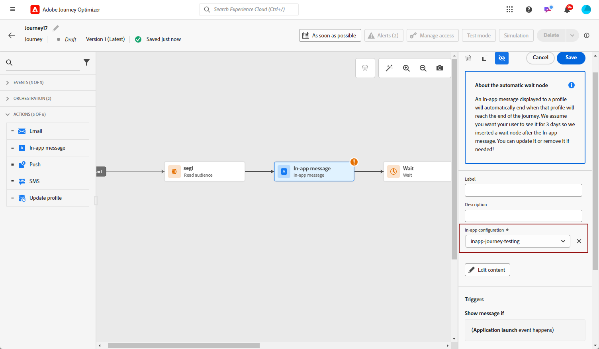
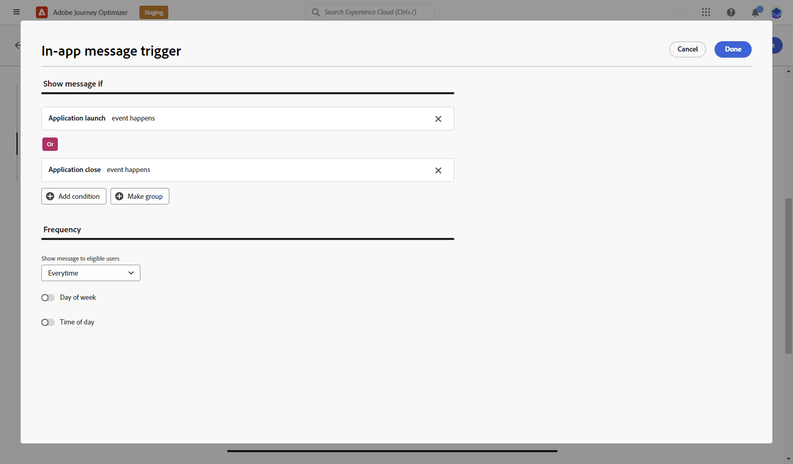

# Creare un messaggio in-app {#create-in-app}

>[!CONTEXTUALHELP]
>id="ajo_campaigns_inapp_triggers"
>title="Gestire i trigger in-app"
>abstract="Controlla in modo efficiente i trigger selezionando gli eventi e i criteri specifici che attiveranno i messaggi. Con il Generatore di regole, gli utenti possono definire condizioni e valori precisi. Quando queste condizioni vengono soddisfatte, avviano una serie di azioni, inclusa la consegna di messaggi in-app."

Puoi aggiungere un messaggio in-app in una campagna o in un percorso. Segui i passaggi descritti di seguito per creare un messaggio in-app in entrambi i contesti.

I messaggi in-app non sono influenzati dalla scelta dell’utente di dare il consenso o rinunciare alle notifiche push nel sistema operativo.

>[!BEGINTABS]

>[!TAB Aggiungere un messaggio in-app a un percorso]

Per aggiungere un messaggio in-app in un percorso, effettua le seguenti operazioni:

1. Apri il percorso, quindi trascina e rilascia un&#39;attività **[!UICONTROL In-app]** dalla sezione **[!UICONTROL Azioni]** della palette.

   Quando un profilo raggiunge la fine del percorso, tutti i messaggi in-app visualizzati scadranno automaticamente. Per questo motivo, dopo l’attività in-app viene aggiunta automaticamente un’attività Attendi per garantire la tempistica corretta.

   

1. Immetti un **[!UICONTROL Etichetta]** e una **[!UICONTROL Descrizione]** per il messaggio.

1. Scegli la tua [configurazione in-app](inapp-configuration.md#channel-prerequisites) da utilizzare.

   

1. Ora puoi iniziare a progettare il contenuto con il pulsante **[!UICONTROL Modifica contenuto]**. [Ulteriori informazioni](design-in-app.md)

1. Fai clic su **[!UICONTROL Modifica trigger]** per scegliere gli eventi e i criteri che attiveranno il messaggio. I generatori di regole consentono agli utenti di specificare criteri e valori che, se soddisfatti, attivano un set di azioni, ad esempio l’invio di un messaggio in-app.

   

   1. Se necessario, fai clic sul menu a discesa evento per modificare il trigger.

      +++Consulta Triggers disponibili.

      | Pacchetto | Trigger | Definizione |
      |---|---|---|
      | Inviare dati a Platform | Dati inviati a Platform | Attivazione quando l’app mobile genera un evento di esperienza Edge per inviare dati a Adobe Experience Platform. Di solito la chiamata API [sendEvent](https://developer.adobe.com/client-sdks/documentation/edge-network/api-reference/#sendevent) dall&#39;estensione AEP Edge. |
      | Tracciamento di base | Azione di tracciamento | Attivazione quando viene chiamata la funzionalità legacy offerta nell&#39;API del codice mobile [trackAction](https://developer.adobe.com/client-sdks/documentation/mobile-core/api-reference/#trackaction). |
      | Tracciamento di base | Tracciare lo stato | Attivazione quando viene chiamata la funzionalità legacy offerta nell&#39;API del codice mobile [trackState](https://developer.adobe.com/client-sdks/documentation/mobile-core/api-reference/#trackstate). |
      | Tracciamento di base | Raccogli PII | Attivazione quando viene chiamata la funzionalità legacy offerta nell&#39;API del codice mobile [collectPII](https://developer.adobe.com/client-sdks/documentation/mobile-core/api-reference/#collectpii). |
      | Ciclo di vita dell&#39;applicazione | Avvio applicazione | Attivazione a ogni esecuzione, comprese quelle a seguito di arresti anomali e installazioni. Questa metrica viene attivata anche in seguito alla ripresa dal background oltre il tempo di timeout della sessione del ciclo di vita. |
      | Ciclo di vita dell&#39;applicazione | Installazione applicazione | Attivazione alla prima esecuzione dopo l&#39;installazione o reinstallazione. |
      | Ciclo di vita dell&#39;applicazione | Aggiornamento applicazione | Attivazione alla prima esecuzione dopo un aggiornamento o quando cambia il numero di versione. |
      | Ciclo di vita dell&#39;applicazione | Chiusura applicazione | Attivazione quando l’applicazione viene chiusa. |
      | Ciclo di vita dell&#39;applicazione | Arresto anomalo dell’applicazione | Attivazione quando l&#39;applicazione non viene messa in background prima della chiusura. L&#39;evento viene inviato all&#39;avvio dell&#39;applicazione dopo l&#39;arresto anomalo. La reportistica di Adobe Mobile sugli arresti anomali non implementa un handler globale per eccezioni non rilevate. |
      | Places | Inserisci POI | Attivato da Places SDK quando il cliente accede al punto di interesse configurato. |
      | Places | Esci da POI | Attivato da Places SDK quando il cliente esce dal punto di interesse configurato. |

      +++

   1. Fare clic su **[!UICONTROL Aggiungi condizione]** se si desidera che il trigger consideri più eventi o criteri.

   1. Scegli la condizione **[!UICONTROL Or]** se desideri aggiungere altri **[!UICONTROL Triggers]** per espandere ulteriormente la regola.

      

   1. Scegli la condizione **[!UICONTROL And]** se desideri aggiungere **[!UICONTROL Caratteristiche]** e perfezionare meglio la regola.

      +++Consulta Caratteristiche disponibili.

      | Pacchetto | Caratteristiche | Definizione |
      |---|---|---|
      | Informazioni dispositivo | Nome gestore | Attivazione quando viene soddisfatto uno dei nomi dei gestori dell&#39;elenco. |
      | Informazioni dispositivo | Nome dispositivo | Attivazione quando viene raggiunto uno dei nomi di dispositivo. |
      | Informazioni dispositivo | Lingua | Attivazione quando viene soddisfatta una delle lingue dell’elenco. |
      | Informazioni dispositivo | Versione sistema operativo | Attivazione quando viene soddisfatta una delle versioni del sistema operativo specificate. |
      | Informazioni dispositivo | Versione precedente del sistema operativo | Attivazione quando viene soddisfatta una delle versioni del sistema operativo precedente specificate. |
      | Informazioni dispositivo | Modalità di esecuzione | Attivazione se la modalità di esecuzione è un&#39;applicazione o un&#39;estensione. |
      | Ciclo di vita dell&#39;applicazione | ID app | Attivazione quando viene soddisfatto l&#39;ID app specificato. |
      | Ciclo di vita dell&#39;applicazione | Giorno della settimana | Attivazione quando viene raggiunto il giorno della settimana specificato. |
      | Ciclo di vita dell&#39;applicazione | Giorno dal primo utilizzo | Attivazione quando viene raggiunto il numero di giorni specificato dal primo utilizzo. |
      | Ciclo di vita dell&#39;applicazione | Giorno dall’ultimo utilizzo | Attivazione quando viene raggiunto il numero di giorni specificato dall&#39;ultimo utilizzo. |
      | Ciclo di vita dell&#39;applicazione | Giorno dall&#39;aggiornamento | Attivazione quando viene raggiunto il numero di giorni specificato dall&#39;ultimo aggiornamento. |
      | Ciclo di vita dell&#39;applicazione | Data di installazione | Attivazione quando viene soddisfatta la data di installazione specificata. |
      | Ciclo di vita dell&#39;applicazione | Lanci | Attivazione quando viene raggiunto il numero specificato di avvii. |
      | Ciclo di vita dell&#39;applicazione | Ora del giorno | Attivazione quando viene soddisfatta l’ora specificata. |
      | Places | POI corrente | Attivato da Places SDK quando il cliente accede al punto di interesse specificato (POI). |
      | Places | Ultimo POI inserito | Attivato da Places SDK a seconda dell’ultimo punto di interesse (POI) inserito dal cliente. |
      | Places | Ultimo punto di interesse chiuso | Attivato da Places SDK a seconda dell’ultimo punto di interesse (POI) lasciato dal cliente. |

      +++

      

   1. Fai clic su **[!UICONTROL Crea gruppo]** per raggruppare i trigger.

      

   1. Scegli la frequenza del trigger quando il messaggio in-app è attivo:

      * **[!UICONTROL Mostra ogni volta]**: mostra sempre il messaggio quando si verificano gli eventi selezionati nel menu a discesa **[!UICONTROL Attivatore app mobile]**.
      * **[!UICONTROL Mostra una volta]**: questo messaggio viene visualizzato una sola volta per sessione utente e rimane visibile in tutte le finestre o attività fino alla chiusura. Per limitarla a una determinata schermata o farla chiudere automaticamente, utilizza una logica personalizzata con il delegato alla messaggistica.
      * **[!UICONTROL Mostra fino al click-through]**: visualizza questo messaggio quando gli eventi selezionati nel menu a discesa **[!UICONTROL Attiva app mobile]** si verificano fino a quando un evento di interazione non viene inviato dal SDK con l&#39;azione &quot;cliccato&quot;.

1. Se necessario, completa il flusso di percorso trascinando altre azioni o eventi. [Ulteriori informazioni](../building-journeys/about-journey-activities.md)

1. Una volta che il messaggio in-app è pronto, finalizza la configurazione e pubblica il percorso per attivarlo.

Per ulteriori informazioni su come configurare un percorso, consultare [questa pagina](../building-journeys/journey-gs.md).

>[!NOTE]
>
>Se desideri visualizzare un messaggio in-app poco dopo aver inviato una notifica push, utilizza un&#39;attività **Attendi** per consentire la propagazione del tempo di payload del messaggio in-app. In genere si consiglia un’attesa di 5-15 minuti, ma i tempi esatti possono variare a seconda della complessità del payload e delle esigenze di personalizzazione.

>[!TAB Aggiungere un messaggio in-app a una campagna]

Per aggiungere un messaggio in-app in una campagna, effettua le seguenti operazioni:

1. Accedi al menu **[!UICONTROL Campagne]**, quindi fai clic su **[!UICONTROL Crea campagna]**.

1. Seleziona il tipo di campagna da eseguire

   * **Pianificato - Marketing**: esegui la campagna immediatamente o in una data specificata. Le campagne pianificate hanno lo scopo di inviare messaggi di marketing. Vengono configurati ed eseguiti dall’interfaccia utente di.

   * **Attivato da API - Marketing/Transazionale**: esegui la campagna utilizzando una chiamata API. Le campagne attivate da API hanno lo scopo di inviare messaggi di marketing o transazionali, ovvero messaggi inviati in seguito a un’azione eseguita da un individuo: reimpostazione della password, acquisto del carrello, ecc.

1. Dalla sezione **[!UICONTROL Proprietà]**, immetti il **[!UICONTROL Titolo]** e la descrizione **[!UICONTROL Descrizione]**.

1. Per assegnare etichette di utilizzo dei dati personalizzate o di base al messaggio in-app, seleziona **[!UICONTROL Gestisci accesso]**. [Ulteriori informazioni](../administration/object-based-access.md).

1. Fai clic sul pulsante **[!UICONTROL Seleziona pubblico]** per definire il pubblico di destinazione dall&#39;elenco dei tipi di pubblico di Adobe Experience Platform disponibili. [Ulteriori informazioni](../audience/about-audiences.md).

   

1. Nel campo **[!UICONTROL Spazio dei nomi identità]**, scegli lo spazio dei nomi da utilizzare per identificare i singoli utenti del pubblico selezionato. [Ulteriori informazioni](../event/about-creating.md#select-the-namespace).

1. Nella sezione **[!UICONTROL Azioni]**, scegli il **[!UICONTROL messaggio in-app]** e seleziona o crea una nuova configurazione.

   Ulteriori informazioni sulla configurazione in-app in [questa pagina](inapp-configuration.md).

   

1. Fai clic su **[!UICONTROL Crea esperimento]** per iniziare a configurare l&#39;esperimento sui contenuti e creare trattamenti per misurarne le prestazioni e identificare l&#39;opzione migliore per il pubblico di destinazione. [Ulteriori informazioni](../content-management/content-experiment.md)

1. Fai clic su **[!UICONTROL Modifica trigger]** per scegliere gli eventi e i criteri che attiveranno il messaggio. I generatori di regole consentono agli utenti di specificare criteri e valori che, se soddisfatti, attivano un set di azioni, ad esempio l’invio di un messaggio in-app.

   1. Se necessario, fai clic sul menu a discesa evento per modificare il trigger.

      +++Consulta Triggers disponibili.

      | Pacchetto | Trigger | Definizione |
      |---|---|---|
      | Inviare dati a Platform | Dati inviati a Platform | Attivazione quando l’app mobile genera un evento di esperienza Edge per inviare dati a Adobe Experience Platform. Di solito la chiamata API [sendEvent](https://developer.adobe.com/client-sdks/documentation/edge-network/api-reference/#sendevent) dall&#39;estensione AEP Edge. |
      | Tracciamento di base | Azione di tracciamento | Attivazione quando viene chiamata la funzionalità legacy offerta nell&#39;API del codice mobile [trackAction](https://developer.adobe.com/client-sdks/documentation/mobile-core/api-reference/#trackaction). |
      | Tracciamento di base | Tracciare lo stato | Attivazione quando viene chiamata la funzionalità legacy offerta nell&#39;API del codice mobile [trackState](https://developer.adobe.com/client-sdks/documentation/mobile-core/api-reference/#trackstate). |
      | Tracciamento di base | Raccogli PII | Attivazione quando viene chiamata la funzionalità legacy offerta nell&#39;API del codice mobile [collectPII](https://developer.adobe.com/client-sdks/documentation/mobile-core/api-reference/#collectpii). |
      | Ciclo di vita dell&#39;applicazione | Avvio applicazione | Attivazione a ogni esecuzione, comprese quelle a seguito di arresti anomali e installazioni. Questa metrica viene attivata anche in seguito alla ripresa dal background oltre il tempo di timeout della sessione del ciclo di vita. |
      | Ciclo di vita dell&#39;applicazione | Installazione applicazione | Attivazione alla prima esecuzione dopo l&#39;installazione o reinstallazione. |
      | Ciclo di vita dell&#39;applicazione | Aggiornamento applicazione | Attivazione alla prima esecuzione dopo un aggiornamento o quando cambia il numero di versione. |
      | Ciclo di vita dell&#39;applicazione | Chiusura applicazione | Attivazione quando l’applicazione viene chiusa. |
      | Ciclo di vita dell&#39;applicazione | Arresto anomalo dell’applicazione | Attivazione quando l&#39;applicazione non viene messa in background prima della chiusura. L&#39;evento viene inviato all&#39;avvio dell&#39;applicazione dopo l&#39;arresto anomalo. La reportistica di Adobe Mobile sugli arresti anomali non implementa un handler globale per eccezioni non rilevate. |
      | Places | Inserisci POI | Attivato da Places SDK quando il cliente accede al punto di interesse configurato. |
      | Places | Esci da POI | Attivato da Places SDK quando il cliente esce dal punto di interesse configurato. |

      +++

   1. Fare clic su **[!UICONTROL Aggiungi condizione]** se si desidera che il trigger consideri più eventi o criteri.

   1. Scegli la condizione **[!UICONTROL Or]** se desideri aggiungere altri **[!UICONTROL Triggers]** per espandere ulteriormente la regola.

      

   1. Scegli la condizione **[!UICONTROL And]** se desideri aggiungere **[!UICONTROL Caratteristiche]** e perfezionare meglio la regola.

      +++Consulta Caratteristiche disponibili.

      | Pacchetto | Caratteristiche | Definizione |
      |---|---|---|
      | Informazioni dispositivo | Nome gestore | Attivazione quando viene soddisfatto uno dei nomi dei gestori dell&#39;elenco. |
      | Informazioni dispositivo | Nome dispositivo | Attivazione quando viene raggiunto uno dei nomi di dispositivo. |
      | Informazioni dispositivo | Lingua | Attivazione quando viene soddisfatta una delle lingue dell’elenco. |
      | Informazioni dispositivo | Versione sistema operativo | Attivazione quando viene soddisfatta una delle versioni del sistema operativo specificate. |
      | Informazioni dispositivo | Versione precedente del sistema operativo | Attivazione quando viene soddisfatta una delle versioni del sistema operativo precedente specificate. |
      | Informazioni dispositivo | Modalità di esecuzione | Attivazione se la modalità di esecuzione è un&#39;applicazione o un&#39;estensione. |
      | Ciclo di vita dell&#39;applicazione | ID app | Attivazione quando viene soddisfatto l&#39;ID app specificato. |
      | Ciclo di vita dell&#39;applicazione | Giorno della settimana | Attivazione quando viene raggiunto il giorno della settimana specificato. |
      | Ciclo di vita dell&#39;applicazione | Giorno dal primo utilizzo | Attivazione quando viene raggiunto il numero di giorni specificato dal primo utilizzo. |
      | Ciclo di vita dell&#39;applicazione | Giorno dall’ultimo utilizzo | Attivazione quando viene raggiunto il numero di giorni specificato dall&#39;ultimo utilizzo. |
      | Ciclo di vita dell&#39;applicazione | Giorno dall&#39;aggiornamento | Attivazione quando viene raggiunto il numero di giorni specificato dall&#39;ultimo aggiornamento. |
      | Ciclo di vita dell&#39;applicazione | Data di installazione | Attivazione quando viene soddisfatta la data di installazione specificata. |
      | Ciclo di vita dell&#39;applicazione | Lanci | Attivazione quando viene raggiunto il numero specificato di avvii. |
      | Ciclo di vita dell&#39;applicazione | Ora del giorno | Attivazione quando viene soddisfatta l’ora specificata. |
      | Places | POI corrente | Attivato da Places SDK quando il cliente accede al punto di interesse specificato (POI). |
      | Places | Ultimo POI inserito | Attivato da Places SDK a seconda dell’ultimo punto di interesse (POI) inserito dal cliente. |
      | Places | Ultimo punto di interesse chiuso | Attivato da Places SDK a seconda dell’ultimo punto di interesse (POI) lasciato dal cliente. |

      +++

      

   1. Fai clic su **[!UICONTROL Crea gruppo]** per raggruppare i trigger.

1. Scegli la frequenza del trigger quando il messaggio in-app è attivo. Sono disponibili le seguenti opzioni:

   * **[!UICONTROL Ogni volta]**: mostra sempre il messaggio quando si verificano gli eventi selezionati nel menu a discesa **[!UICONTROL Attivatore app mobile]**.
   * **[!UICONTROL Una volta]**: mostra questo messaggio solo la prima volta che si verificano gli eventi selezionati nel menu a discesa **[!UICONTROL Attivatore app mobile]**.
   * **[!UICONTROL Fino al click-through]**: visualizza questo messaggio quando gli eventi selezionati nel menu a discesa **[!UICONTROL Attivatore app mobile]** si verificano fino a quando un evento di interazione non viene inviato dal SDK con l&#39;azione &quot;cliccato&quot;.
   * **[!UICONTROL X volte]**: visualizza questo messaggio X volte.

1. Se necessario, scegli il **[!UICONTROL giorno della settimana]** o **[!UICONTROL ora del giorno]** in cui verrà visualizzato il messaggio in-app.

1. Le campagne sono progettate per essere eseguite in una data specifica o con una frequenza ricorrente. Scopri come configurare la **[!UICONTROL pianificazione]** della campagna in [questa sezione](../campaigns/create-campaign.md#schedule).

   

1. Ora puoi iniziare a progettare il contenuto con il pulsante **[!UICONTROL Modifica contenuto]**. [Ulteriori informazioni](design-in-app.md)

   

>[!ENDTABS]

## Video sulle procedure{#video}

* Il video seguente mostra come creare, configurare e pubblicare messaggi in-app nelle campagne.

  +++Guarda il video

  >[!VIDEO](https://video.tv.adobe.com/v/3451890?captions=ita&quality=12&learn=on)

  +++

* Il video seguente mostra come configurare e analizzare gli esperimenti di contenuto per testare i messaggi in-app A/B.

  +++Guarda il video

  >[!VIDEO](https://video.tv.adobe.com/v/3445296/?captions=ita&learn=on&autoplay=true)

  +++

* Il video seguente mostra come creare un messaggio in-app in un percorso e come testare e pubblicare il percorso.

  +++Guarda il video

  >[!VIDEO](https://video.tv.adobe.com/v/3423077/?learn=on&autoplay=true)

  +++

**Argomenti correlati:**

* [Progettare un messaggio in-app](design-in-app.md)
* [Testare e inviare il messaggio in-app](send-in-app.md)
* [Rapporto in-app](../reports/campaign-global-report-cja-inapp.md)
* [Configurazione in-app](inapp-configuration.md)