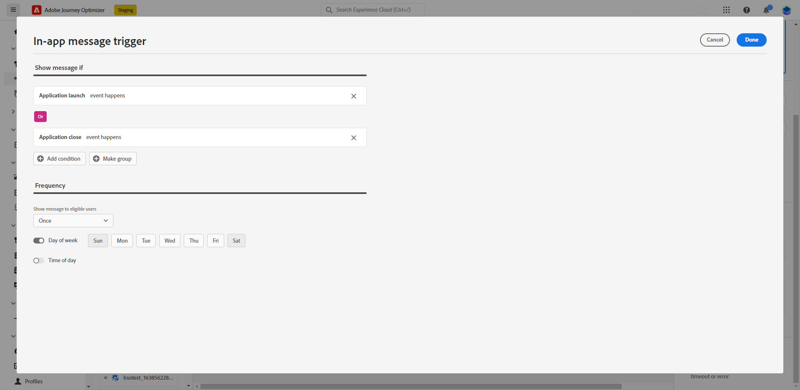

# Creare un messaggio in-app {#create-in-app}

I messaggi in-app vengono creati nel contesto di una campagna.

>[!BEGINTABS]

>[!TAB Aggiungere un messaggio in-app a un percorso]

>[!AVAILABILITY]
>
>L’attività in-app è attualmente disponibile come versione beta solo per alcuni utenti. Per partecipare al programma beta, contatta l’Assistenza clienti Adobe.

1. Apri il percorso, quindi trascina e rilascia una **[!UICONTROL In-app]** attività dal **[!UICONTROL Azioni]** della palette.

   Quando un profilo raggiunge la fine del percorso, tutti i messaggi in-app visualizzati scadranno automaticamente. Per questo motivo, dopo l’attività in-app viene aggiunta automaticamente un’attività Attendi per garantire la corretta tempistica.

   

1. Inserisci un **[!UICONTROL Etichetta]** e **[!UICONTROL Descrizione]** per il tuo messaggio.

1. Scegli la [Superficie in-app](inapp-configuration.md) da utilizzare.

   

1. Ora puoi iniziare a progettare i contenuti con **[!UICONTROL Modifica contenuto]** pulsante . [Ulteriori informazioni](design-in-app.md)

1. Fai clic su **[!UICONTROL Modifica trigger]** per configurare il trigger.

   

1. Scegli la frequenza del trigger quando il messaggio in-app è attivo:

   * **[!UICONTROL Mostra ogni volta]**: Mostra sempre il messaggio quando gli eventi selezionati nella **[!UICONTROL Attivazione app mobile]** si verificano a discesa.
   * **[!UICONTROL Mostra una volta]**: Mostra questo messaggio solo la prima volta che gli eventi selezionati nel **[!UICONTROL Attivazione app mobile]** si verificano a discesa.
   * **[!UICONTROL Mostra fino a click-through]**: Mostra questo messaggio quando gli eventi selezionati nella **[!UICONTROL Attivazione app mobile]** si verifica fino a quando un evento interattivo non viene inviato dall&#39;SDK con un&#39;azione di &quot;clic&quot;.

1. Da **[!UICONTROL Attivazione app mobile]** a discesa, scegli gli eventi e i criteri che attiveranno il messaggio:

   1. Dall’elenco a discesa a sinistra, seleziona l’evento necessario per attivare il messaggio.
   1. Dall’elenco a discesa a destra, seleziona la convalida richiesta per l’evento selezionato.
   1. Fai clic sul pulsante **[!UICONTROL Aggiungi]** se desideri che il trigger consideri più eventi o criteri. Quindi, ripeti i passaggi precedenti.
   1. Seleziona il collegamento degli eventi, ad esempio scegli **[!UICONTROL E]** se vuoi **entrambi** trigger impostati su true per mostrare o scegliere un messaggio **[!UICONTROL Oppure]** se desideri che il messaggio venga visualizzato se **o** dei trigger sono true.
   1. Fai clic su **[!UICONTROL Salva]** quando i trigger sono stati configurati.

   

1. Se necessario, completa il flusso di percorso trascinando e rilasciando azioni o eventi aggiuntivi. [Ulteriori informazioni](../building-journeys/about-journey-activities.md)

1. Quando il messaggio in-app è pronto, finalizza la configurazione e pubblica il percorso per attivarla.

Per ulteriori informazioni su come configurare un percorso, consulta [questa pagina](../building-journeys/journey-gs.md).

>[!TAB Aggiungere un messaggio in-app a una campagna]

1. Accedere al **[!UICONTROL Campagne]** menu, quindi fai clic su **[!UICONTROL Creare una campagna]**.

1. In **[!UICONTROL Proprietà]** , seleziona il tipo di esecuzione della campagna: Pianificata o attivata dall’API. Ulteriori informazioni sui tipi di campagne in [questa pagina](../campaigns/create-campaign.md#campaigntype).

1. In **[!UICONTROL Azioni]** scegli la sezione **[!UICONTROL Messaggio in-app]** e **[!UICONTROL Superficie dell&#39;app]** configurato in precedenza per il messaggio in-app. Quindi, fai clic su **[!UICONTROL Crea]**.

   Ulteriori informazioni sulla configurazione in-app in [questa pagina](inapp-configuration.md).

   

1. Da **[!UICONTROL Proprietà]** nella sezione **[!UICONTROL Titolo]** e **[!UICONTROL Descrizione]** descrizione.

1. Per assegnare etichette di utilizzo dati personalizzate o di base al messaggio in-app, seleziona **[!UICONTROL Gestisci accesso]**. [Maggiori informazioni](../administration/object-based-access.md).

1. Fai clic sul pulsante **[!UICONTROL Selezionare il pubblico]** per definire il pubblico di cui eseguire il targeting dall’elenco dei segmenti Adobe Experience Platform disponibili. [Maggiori informazioni](../segment/about-segments.md).

   

1. In **[!UICONTROL Spazio dei nomi identità]** scegli lo spazio dei nomi da utilizzare per identificare gli individui del segmento selezionato. [Maggiori informazioni](../event/about-creating.md#select-the-namespace).

1. Fai clic su **[!UICONTROL Modifica trigger]** per scegliere gli eventi e i criteri che attiveranno il messaggio:

   1. Fai clic su **Aggiungi condizione** se desideri che il trigger prenda in considerazione più eventi o criteri.
   1. Seleziona il collegamento degli eventi, ad esempio scegli **[!UICONTROL E]** se vuoi **entrambi** trigger impostati su true per mostrare o scegliere un messaggio **[!UICONTROL Oppure]** se desideri che il messaggio venga visualizzato se **o** dei trigger sono true.
   1. Fai clic su **[!UICONTROL Crea gruppo]** per raggruppare gli attivatori.

   

1. Scegli la frequenza del trigger quando il messaggio in-app è attivo. Sono disponibili le seguenti opzioni:

   * **[!UICONTROL Ogni]**: Mostra sempre il messaggio quando gli eventi selezionati nella **[!UICONTROL Attivazione app mobile]** si verificano a discesa.
   * **[!UICONTROL Una volta]**: Mostra questo messaggio solo la prima volta che gli eventi selezionati nel **[!UICONTROL Attivazione app mobile]** si verificano a discesa.
   * **[!UICONTROL Fino al click-through]**: Mostra questo messaggio quando gli eventi selezionati nella **[!UICONTROL Attivazione app mobile]** si verifica fino a quando un evento interattivo non viene inviato dall&#39;SDK con un&#39;azione di &quot;clic&quot;.
   * **[!UICONTROL X numero di volte]**: Mostra questo messaggio X ora.

1. Se necessario, scegli quale **[!UICONTROL Giorno della settimana]** o **[!UICONTROL Ora del giorno]** verrà visualizzato il messaggio in-app.

1. Le campagne sono progettate per essere eseguite in una data specifica o su una frequenza ricorrente. Scopri come configurare il **[!UICONTROL Pianificazione]** della campagna in [questa sezione](../campaigns/create-campaign.md#schedule).

   

1. Ora puoi iniziare a progettare i contenuti con **[!UICONTROL Modifica contenuto]** pulsante . [Ulteriori informazioni](design-in-app.md)

   

>[!ENDTABS]

## Video introduttivo{#video}

Il video seguente mostra come creare, configurare e pubblicare messaggi in-app nelle campagne.

>[!VIDEO](https://video.tv.adobe.com/v/3410430?quality=12&learn=on)

**Argomenti correlati:**

* [Progettare un messaggio in-app](design-in-app.md)
* [Test e invio del messaggio in-app](send-in-app.md)
* [Rapporto in-app](../reports/campaign-global-report.md#inapp-report)
* [Configurazione in-app](inapp-configuration.md)