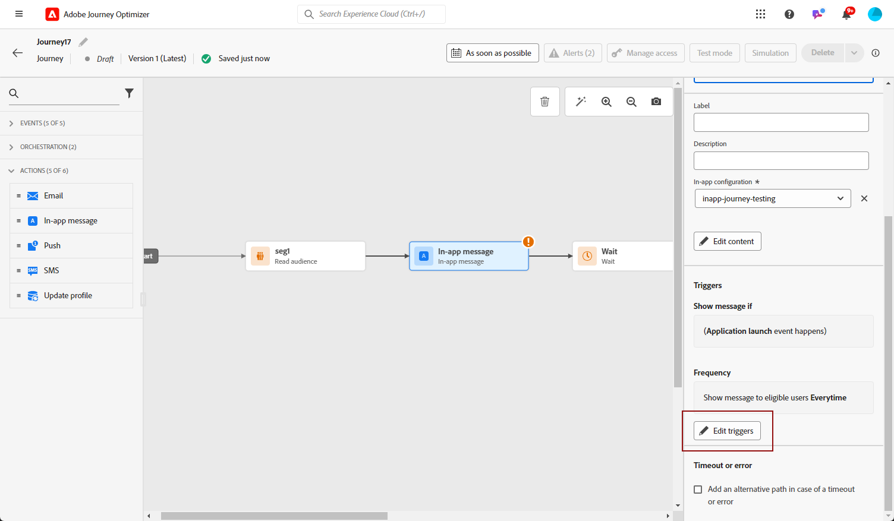

# Creare un messaggio in-app in una campagna {#create-in-app}

<!--
>[!BEGINTABS]

>[!TAB Add an In-app message to a journey]

>[!AVAILABILITY]
>
>The In-app activity is currently available as a beta to select users only. To join the beta program, contact Adobe Customer Care.

1. Open your journey, then drag and drop an **[!UICONTROL In-app]** activity from the **[!UICONTROL Actions]** section of the palette.

    When a profile reaches the end of their journey, any in-app messages displayed to them will automatically expire. For that reason, a Wait activity is automatically added after your In-app activity to ensure proper timing.

    

1. Enter a **[!UICONTROL Label]** and **[!UICONTROL Description]** for your message.

1. Choose the [In-app surface](inapp-configuration.md) to use.

    

1. You can now start designing your content with the **[!UICONTROL Edit content]** button. [Learn more](design-in-app.md)

1. Click **[!UICONTROL Edit trigger]** to configure your Trigger. 

    

1. Choose the frequency of your trigger when your In-app message is active:

    * **[!UICONTROL Show every time]**: Always show the message when the events selected in the **[!UICONTROL Mobile app trigger]** drop-down occur.
    * **[!UICONTROL Show once]**: Only show this message the first time the events selected in the **[!UICONTROL Mobile app trigger]** drop-down occur.
    * **[!UICONTROL Show until click through]**: Show this message when the events selected in the **[!UICONTROL Mobile app trigger]** drop-down occur until an interact event is sent by the SDK with an action of "clicked".

1. From the **[!UICONTROL Mobile app trigger]** dropdown(s), choose the event(s) and criteria that will trigger your message:

    1. From the left drop-down, select the event required to trigger the message.
    1. From the right drop-down, select the validation required on the selected event.
    1. Click the **[!UICONTROL Add]** button if you want the trigger to consider multiple events or criteria. Then, repeat the steps above.
    1. Select how your events are linked, e.g. choose **[!UICONTROL And]** if you want **both** triggers to be true in order for a message to be shown or choose **[!UICONTROL Or]** if you want the message to be shown if **either** of the triggers are true.
    1. Click **[!UICONTROL Save]** when your Triggers have been configured.

    
    
1. If necessary, complete your journey flow by dragging and dropping additional actions or events. [Learn more](../building-journeys/about-journey-activities.md)

1. Once your In-app message is ready, finalize the configuration and publish your journey to activate it.

For more information on how to configure a journey, refer to [this page](../building-journeys/journey-gs.md).

>[!TAB Add an In-app message to a campaign]
-->

Per aggiungere un messaggio in-app in una campagna, effettua le seguenti operazioni:

1. Accedere a **[!UICONTROL Campagne]** , quindi fai clic su **[!UICONTROL Crea campagna]**.

1. In **[!UICONTROL Proprietà]** , seleziona quando il tipo di esecuzione della campagna è Pianificato o Attivato da API. Ulteriori informazioni sui tipi di campagna in [questa pagina](../campaigns/create-campaign.md#campaigntype).

1. In **[!UICONTROL Azioni]** , scegli il **[!UICONTROL Messaggio in-app]** e **[!UICONTROL Superficie app]** precedentemente configurato per il messaggio in-app. Quindi, fai clic su **[!UICONTROL Crea]**.

   Ulteriori informazioni sulla configurazione in-app in [questa pagina](inapp-configuration.md).

   

1. Dalla sezione **[!UICONTROL Proprietà]** , immetti il **[!UICONTROL Titolo]** e **[!UICONTROL Descrizione]** descrizione.

1. Per assegnare etichette di utilizzo dei dati personalizzate o di base al messaggio in-app, seleziona **[!UICONTROL Gestisci accesso]**. [Ulteriori informazioni](../administration/object-based-access.md).

1. Fai clic su **[!UICONTROL Seleziona pubblico]** per definire il pubblico di destinazione dall’elenco dei tipi di pubblico di Adobe Experience Platform disponibili. [Ulteriori informazioni](../audience/about-audiences.md).

   

1. In **[!UICONTROL Spazio dei nomi dell’identità]** , scegli lo spazio dei nomi da utilizzare per identificare i singoli utenti del pubblico selezionato. [Ulteriori informazioni](../event/about-creating.md#select-the-namespace).

1. Clic **[!UICONTROL Crea esperimento]** per iniziare a configurare l’esperimento sui contenuti e creare trattamenti per misurarne le prestazioni e identificare l’opzione migliore per il pubblico di destinazione. [Ulteriori informazioni](../campaigns/content-experiment.md)

1. Clic **[!UICONTROL Modifica trigger]** per scegliere gli eventi e i criteri che attiveranno il messaggio. I generatori di regole consentono agli utenti di specificare criteri e valori che, se soddisfatti, attivano un set di azioni, ad esempio l’invio di un messaggio in-app.

   1. Se necessario, fai clic sul menu a discesa evento per modificare il trigger.

   1. Clic **[!UICONTROL Aggiungi condizione]** se desideri che il trigger consideri più eventi o criteri.

   1. Scegli la **[!UICONTROL Oppure]** condizione per aggiungere altri **[!UICONTROL Triggers]** per espandere ulteriormente la regola.

      

   1. Scegli la **[!UICONTROL E]** condizione se si desidera aggiungere **[!UICONTROL Caratteristiche]** e perfeziona meglio la regola.

      +++Vedi Caratteristiche disponibili.

      | Pacchetto | Caratteristiche  | Definizione |
      |---|---|---|
      | Informazioni dispositivo | Nome gestore | Attivazione quando viene soddisfatto uno dei nomi dei gestori dell&#39;elenco. |
      | Informazioni dispositivo | Nome dispositivo | Attivazione quando viene raggiunto uno dei nomi di dispositivo. |
      | Informazioni dispositivo | Lingua | Attivazione quando viene soddisfatta una delle lingue dell’elenco. |
      | Informazioni dispositivo | Versione sistema operativo | Attivazione quando viene soddisfatta una delle versioni del sistema operativo specificate. |
      | Informazioni dispositivo | Versione precedente del sistema operativo | Attivazione quando viene soddisfatta una delle versioni del sistema operativo precedente specificate. |
      | Informazioni dispositivo | Modalità di esecuzione | Attivazione se la modalità di esecuzione è un&#39;applicazione o un&#39;estensione. |
      | Ciclo di vita dell&#39;applicazione | ID app | Attivazione quando viene soddisfatto l&#39;ID app specificato. |
      | Ciclo di vita dell&#39;applicazione | Giorno della settimana | Attivazione quando viene raggiunto il giorno della settimana specificato. |
      | Ciclo di vita dell&#39;applicazione | Giorno dal primo utilizzo | Attivazione quando viene raggiunto il numero di giorni specificato dal primo utilizzo. |
      | Ciclo di vita dell&#39;applicazione | Giorno dall’ultimo utilizzo | Attivazione quando viene raggiunto il numero di giorni specificato dall&#39;ultimo utilizzo. |
      | Ciclo di vita dell&#39;applicazione | Giorno dall&#39;aggiornamento | Attivazione quando viene raggiunto il numero di giorni specificato dall&#39;ultimo aggiornamento. |
      | Ciclo di vita dell&#39;applicazione | Data di installazione | Attivazione quando viene soddisfatta la data di installazione specificata. |
      | Ciclo di vita dell&#39;applicazione | Avvii | Attivazione quando viene raggiunto il numero specificato di avvii. |
      | Ciclo di vita dell&#39;applicazione | Ora del giorno | Attivazione quando viene soddisfatta l’ora specificata. |
      | Places | POI corrente | Attivato dall’SDK Places quando il cliente accede al punto di interesse specificato (POI). |
      | Places | Ultimo POI inserito | Attivato dall’SDK Places a seconda dell’ultimo punto di interesse (POI) inserito dal cliente. |
      | Places | Ultimo punto di interesse chiuso | Attivato dall’SDK di Places a seconda dell’ultimo punto di interesse (POI) lasciato dal cliente. |

+++

      

   1. Clic **[!UICONTROL Crea gruppo]** per raggruppare i trigger.

1. Scegli la frequenza del trigger quando il messaggio in-app è attivo. Sono disponibili le seguenti opzioni:

   * **[!UICONTROL Ogni volta]**: mostra sempre il messaggio quando gli eventi selezionati nel **[!UICONTROL Attivatore app mobile]** a discesa.
   * **[!UICONTROL Una volta]**: mostra questo messaggio solo la prima volta che gli eventi selezionati nel **[!UICONTROL Attivatore app mobile]** a discesa.
   * **[!UICONTROL Fino al click-through]**: mostra questo messaggio quando gli eventi selezionati nel **[!UICONTROL Attivatore app mobile]** Questo si verifica finché un evento di interazione non viene inviato dall’SDK con l’azione &quot;clicked&quot;.
   * **[!UICONTROL X numero di volte]**: mostra questo messaggio X volta.

1. Se necessario, scegliere quale **[!UICONTROL Giorno della settimana]** o **[!UICONTROL Ora del giorno]** verrà visualizzato il messaggio in-app.

1. Le campagne sono progettate per essere eseguite in una data specifica o con una frequenza ricorrente. Scopri come configurare **[!UICONTROL Pianificazione]** della campagna in [questa sezione](../campaigns/create-campaign.md#schedule).

   

1. Ora puoi iniziare a progettare il contenuto con **[!UICONTROL Modifica contenuto]** pulsante. [Ulteriori informazioni](design-in-app.md)

   

<!--
>[!ENDTABS]
-->

## Video sulle procedure{#video}

* Il video seguente mostra come creare, configurare e pubblicare messaggi in-app nelle campagne.

  >[!VIDEO](https://video.tv.adobe.com/v/3410430?quality=12&learn=on)

* Il video seguente mostra come configurare e analizzare gli esperimenti di contenuto per testare i messaggi in-app A/B.

  >[!VIDEO](https://video.tv.adobe.com/v/3419898)

**Argomenti correlati:**

* [Progettare un messaggio in-app](design-in-app.md)
* [Testare e inviare il messaggio in-app](send-in-app.md)
* [Rapporto in-app](../reports/campaign-global-report.md#inapp-report)
* [Configurazione in-app](inapp-configuration.md)