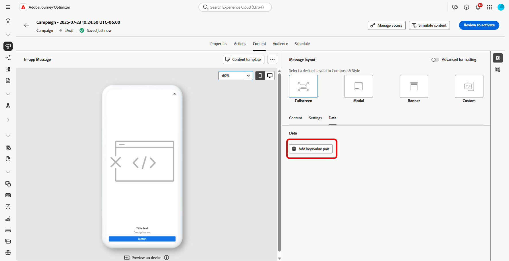

# Creare contenuti in-app {#design-content}

>[!CONTEXTUALHELP]
>id="ajo_campaigns_inapp_content"
>title="Definire il contenuto in-app"
>abstract="Personalizza il contenuto e lo stile dei messaggi in-app. Puoi anche aggiungere pulsanti di azione e multimediali, per rendere i messaggi più coinvolgenti ed efficaci."

Puoi modificare il contenuto in-app per configurare le opzioni dell’esperienza:

* In una **[!UICONTROL campagna]**, dal menu **[!UICONTROL Azione]**, fai clic sul pulsante **[!UICONTROL Modifica contenuto]** per configurare il contenuto del messaggio.

  

* In un **[!UICONTROL Percorso]**, dal menu avanzato della **[!UICONTROL azione]** in-app, puoi iniziare a progettare il contenuto con il pulsante **[!UICONTROL Modifica contenuto]**.

  

L&#39;opzione **[!UICONTROL Formattazione avanzata]** attiva altre opzioni per personalizzare l&#39;esperienza.

Una volta creato il messaggio in-app e definito e personalizzato il relativo contenuto, puoi rivederlo e attivarlo. Le notifiche verranno quindi inviate in base alla pianificazione della campagna. Ulteriori informazioni sono disponibili in [questa pagina](send-in-app.md).

## Layout messaggio {#message-layout}

>[!CONTEXTUALHELP]
>id="ajo_campaigns_inapp_authoring_message_layout"
>title="Definire il contenuto in-app"
>abstract="Il layout del messaggio fornisce modelli comunemente utilizzati per dare una struttura al messaggio. Il layout personalizzato fornisce opzioni per caricare o comporre messaggi HTML personalizzati."

Dalla sezione **[!UICONTROL Layout messaggio]**, seleziona una delle quattro opzioni di layout disponibili a seconda delle tue esigenze di messaggistica.

* **[!UICONTROL Schermo intero]**: questo tipo di layout copre l&#39;intero schermo dei dispositivi per il pubblico.

  Supporta i componenti per contenuti multimediali (immagine, video), di testo e i pulsanti.

* **[!UICONTROL Modale]**: questo layout viene visualizzato in una grande finestra in stile avviso. L&#39;applicazione rimane visibile in background.

  Supporta i componenti per contenuti multimediali (immagine, video), di testo e i pulsanti.

* **[!UICONTROL Banner]**: questo tipo di layout viene visualizzato come messaggio di avviso del sistema operativo nativo.

  Puoi aggiungere al messaggio solo un **[!UICONTROL Intestazione]** e un **[!UICONTROL Corpo]**.

* **[!UICONTROL Personalizzato]**: la modalità messaggio personalizzato ti consente di importare e modificare direttamente uno dei messaggi di HTML preconfigurati.

   * Seleziona **[!UICONTROL Componi]** per immettere o incollare il codice HTML non elaborato.

     Utilizza il riquadro a sinistra per sfruttare le funzionalità di personalizzazione di Journey Optimizer. Per ulteriori informazioni al riguardo, consulta [questa sezione](../personalization/personalize.md).

   * Seleziona **[!UICONTROL Importa]** per importare il file HTML o .zip contenente il contenuto di HTML.

## Scheda Contenuto {#content-tab}

Dalla scheda **Contenuto**, puoi definire e personalizzare il contenuto della notifica e lo stile del pulsante **Chiudi**. Puoi anche aggiungere un file multimediale alla notifica in-app e i pulsanti di azione da questa scheda.

### Chiudi pulsante {#close-button}

>[!CONTEXTUALHELP]
>id="ajo_campaigns_inapp_authoring_close"
>title="Scegli lo stile del pulsante Chiudi."
>abstract="La sezione del pulsante Chiudi consente di selezionare le varianti del pulsante di chiusura messaggi e fornisce l’opzione di caricare un’immagine personalizzata."

Scegli lo **[!UICONTROL stile]** del **[!UICONTROL pulsante Chiudi]**.

Gli stili disponibili sono:

* **[!UICONTROL Semplice]**
* **[!UICONTROL Cerchio]**
* **[!UICONTROL Immagine personalizzata]** da un URL multimediale o dal tuo Assets.

+++Altre opzioni con formattazione avanzata

Se la modalità di formattazione **[!UICONTROL Avanzata]** è attivata, è possibile selezionare l&#39;opzione **[!UICONTROL Colore]** per scegliere il colore e l&#39;opacità del pulsante.

+++

### Media {#add-media}

>[!CONTEXTUALHELP]
>id="ajo_campaigns_inapp_authoring_media"
>title="Aggiungi contenuti multimediali al messaggio in-app per creare un’esperienza coinvolgente per l’utente finale."
>abstract="Fornisci un collegamento diretto al contenuto oppure utilizza il selettore delle risorse per scegliere i contenuti multimediali da aggiungere al tuo messaggio in Asset Essentials."

Il campo **[!UICONTROL Media]** consente di aggiungere contenuti multimediali al messaggio in-app per creare un&#39;esperienza coinvolgente per l&#39;utente finale.

Digita l&#39;URL del file multimediale o fai clic sull&#39;icona **[!UICONTROL Seleziona Assets]** per aggiungere direttamente al messaggio in-app le risorse memorizzate nella libreria Assets. [Ulteriori informazioni sulla gestione delle risorse](../integrations/assets.md).
È inoltre possibile aggiungere un **[!UICONTROL testo alternativo]** per le applicazioni di lettura dello schermo.

+++Altre opzioni con formattazione avanzata

Se la **[!UICONTROL modalità di formattazione avanzata]** è attivata, puoi personalizzare **[!UICONTROL l&#39;altezza massima]** e **[!UICONTROL la larghezza massima]** del contenuto multimediale.

+++

### Contenuto {#title-body}

>[!CONTEXTUALHELP]
>id="ajo_campaigns_inapp_authoring_content"
>title="Per comporre il messaggio, immetti il contenuto nei campi Intestazione e Corpo."
>abstract="Qui è possibile aggiungere sia l’intestazione che il corpo del testo. Per includere i token di personalizzazione, apri la finestra di dialogo di personalizzazione."

Per comporre il messaggio, immetti il contenuto nei campi **[!UICONTROL Intestazione]** e **[!UICONTROL Corpo]**.

Utilizza l&#39;icona **[!UICONTROL Personalization]** per aggiungere la personalizzazione. Ulteriori informazioni sulla personalizzazione nell&#39;editor di personalizzazione di Adobe Journey Optimizer [in questa sezione](../personalization/personalize.md).

+++Altre opzioni con formattazione avanzata

Se la **[!UICONTROL modalità di formattazione avanzata]** è attivata, puoi scegliere per **[!UICONTROL Intestazione]** e **[!UICONTROL Corpo]**:

* **[!UICONTROL Carattere]**
* la **[!UICONTROL Dimensione punto]**
* **[!UICONTROL Colore carattere]**
* **[!UICONTROL Allineamento]**
+++

### Pulsanti {#add-buttons}

>[!CONTEXTUALHELP]
>id="ajo_campaigns_inapp_authoring_buttons"
>title="Aggiungi i pulsanti che consentono agli utenti di interagire con il messaggio in-app."
>abstract="Questa sezione consente di aggiungere pulsanti di invito all’azione al messaggio. È possibile includere testo personalizzato e le destinazioni per ogni pulsante."

Aggiungi i pulsanti che consentono agli utenti di interagire con il messaggio in-app.

Per personalizzare il pulsante:

1. Modificare il campo Testo #1 pulsante (primario). Puoi anche utilizzare l&#39;icona **[!UICONTROL Personalization]** per definire i dati di contenuto e personalizzazione.

1. Scegli il tuo **[!UICONTROL evento di interazione]** che definisce l&#39;azione del pulsante dopo che gli utenti hanno interagito con esso.

1. Immetti l&#39;URL Web o il collegamento diretto nel campo **[!UICONTROL Target]**.

1. Per aggiungere più pulsanti, fare clic su **[!UICONTROL Aggiungi pulsante]**.

+++Altre opzioni con formattazione avanzata

Se la **[!UICONTROL modalità di formattazione avanzata]** è attivata, puoi scegliere i **[!UICONTROL pulsanti]**:

* **[!UICONTROL Carattere]**
* la **[!UICONTROL Dimensione punto]**
* **[!UICONTROL Colore carattere]**
* **[!UICONTROL Allineamento]**
* lo stile **[!UICONTROL Pulsante]**
* il **[!UICONTROL Raggio]**
* il **[!UICONTROL colore pulsante]**

+++

## Scheda Impostazioni {#settings-tab}

Dalla scheda **Impostazioni**, puoi definire il layout del messaggio e visualizzare l&#39;anteprima del messaggio in-app. Puoi anche accedere alle opzioni di formattazione avanzate.

### Anteprima {#preview-tab}

>[!CONTEXTUALHELP]
>id="ajo_campaigns_inapp_authoring_preview"
>title="Visualizza l’anteprima del messaggio in-app."
>abstract="Si tratta dell’immagine di anteprima che verrà visualizzata quando il messaggio viene inviato al riepilogo messaggi del dispositivo."

>[!NOTE]
>
>L’anteprima è disponibile solo per i messaggi in-app per dispositivi mobili.

La **[!UICONTROL Anteprima app]** ti consente di aggiungere uno sfondo dietro il messaggio in-app:

* Un file multimediale da un collegamento URL.

* Una risorsa dalla libreria Assets.

* Un colore di sfondo.

### Layout {#layout-options}

>[!CONTEXTUALHELP]
>id="ajo_campaigns_inapp_authoring_layout"
>title="Definisci il layout messaggio del messaggio in-app."
>abstract="Questa sezione ti consente di aggiungere uno sfondo al messaggio in-app. Ciò richiede che l’acquisizione dell’interfaccia utente sia abilitata."

Il campo **[!UICONTROL Immagine di sfondo]** consente di aggiungere uno sfondo al messaggio in-app:

* Un file multimediale da un collegamento URL.

* Un colore di sfondo.

### Messaggio {#message-tab}

>[!CONTEXTUALHELP]
>id="ajo_campaigns_inapp_authoring_message_advanced"
>title="Definisci le impostazioni avanzate del messaggio."
>abstract="Questa sezione ti permette di migliorare la personalizzazione dei contenuti in-app, in particolare quando è abilitata la formattazione avanzata."

L’opzione di acquisizione dell’interfaccia utente, attivata per impostazione predefinita, consente di scurire lo sfondo dietro il messaggio in-app per evidenziare lo stato attivo sul contenuto.

+++Altre opzioni con formattazione avanzata

Se la **[!UICONTROL modalità di formattazione avanzata]** è attivata, è possibile personalizzare ulteriormente il messaggio con le opzioni seguenti:

* **[!UICONTROL Personalizza movimenti]**: consente di personalizzare l&#39;interazione di scorrimento dell&#39;utente. Se l&#39;opzione Ignora è selezionata, puoi aggiungere un evento di interazione personalizzato e/o una destinazione.

* **[!UICONTROL Personalizza acquisizione interfaccia utente]**: consente di selezionare un colore da visualizzare nello sfondo e la relativa opacità.

* **[!UICONTROL Personalizza dimensione]**: consente di regolare la larghezza e l&#39;altezza della notifica in-app.

* **[!UICONTROL Personalizza posizione]**: ti consente di personalizzare la posizione dei messaggi in-app sullo schermo degli utenti. È possibile modificare l&#39;allineamento verticale e orizzontale.

* **[!UICONTROL Personalizza animazione]**: ti consente di personalizzare le animazioni di visualizzazione e chiusura, ad esempio se la notifica in-app viene visualizzata da sinistra o dall&#39;alto del dispositivo dell&#39;utente.

* **[!UICONTROL Angolo circolare messaggio]**: consente di aggiungere un angolo circolare alla notifica in-app modificando il **[!UICONTROL Raggio angolo]**.

+++

## Scheda Dati {#data-tab}

Dalla scheda **Dati**, puoi definire una **[!UICONTROL Chiave]**&#x200B; e **[!UICONTROL Valore]** per includere variabili personalizzate nel payload. Queste coppie chiave/valore ti consentono di trasmettere dati aggiuntivi, a seconda della configurazione specifica.

Per ulteriori informazioni, consulta la [documentazione per sviluppatori](https://developer.adobe.com/client-sdks/edge/adobe-journey-optimizer/in-app-message/tutorials/messaging-metadata/).

1. Dalla scheda **[!UICONTROL Dati]**, seleziona **[!UICONTROL Aggiungi coppia chiave/valore]**.

   

1. Compila i campi **[!UICONTROL Chiave]**&#x200B; e **[!UICONTROL Valore]**.

   

1. Fare clic su  per eliminare le coppie necessarie.

**Argomenti correlati:**

* [Crea messaggio in-app](create-in-app.md)
* [Rapporto in-app](../reports/campaign-global-report-cja-inapp.md)
* [Configurazione in-app](inapp-configuration.md)

## Video dimostrativo{#video}

Il video seguente mostra come creare e testare i messaggi in-app.

>[!VIDEO](https://video.tv.adobe.com/v/3422078?captions=ita&quality=12&learn=on)
