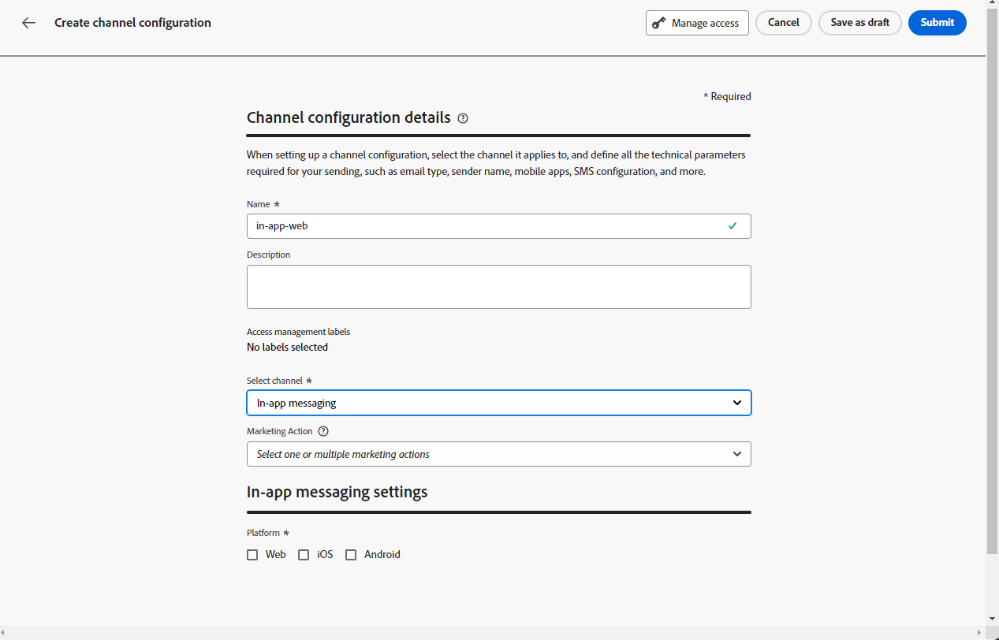

# Prerequisiti e configurazione {#inapp-configuration}

## Passaggi di configurazione {#inapp-steps}

Per inviare messaggi in-app nei tuoi percorsi e nelle tue campagne con [!DNL Journey Optimizer], devi eseguire i seguenti passaggi di configurazione.

1. Assicurati di disporre delle autorizzazioni corrette per le campagne Journey Optimizer prima di iniziare, anche se prevedi di utilizzare i messaggi in-app solo nei percorsi. Sono ancora necessarie le autorizzazioni per la campagna. [Ulteriori informazioni](../campaigns/get-started-with-campaigns.md#campaign-prerequisites).
1. Abilita Adobe Journey Optimizer nello stream di dati di raccolta dati Adobe Experience Platform e verifica il criterio di unione predefinito in Adobe Experience Platform, come descritto in [Prerequisiti per la consegna](#delivery-prerequisites) di seguito.
1. Creare una configurazione del canale dei messaggi in-app in Amministrazione > Canali > Configurazioni canale, come descritto in [questa sezione](#channel-prerequisites).
1. Se utilizzi esperimenti di contenuto, assicurati di seguire i requisiti elencati in [questa sezione](#experiment-prerequisite).

Al termine, puoi creare, configurare e inviare il primo messaggio in-app. Scopri come farlo in [questa sezione](create-in-app.md).

## Prerequisiti per la consegna {#delivery-prerequisites}

Affinché i messaggi in-app vengano recapitati correttamente, è necessario definire le seguenti impostazioni:

* Nella [raccolta dati di Adobe Experience Platform](https://experienceleague.adobe.com/docs/experience-platform/edge/datastreams/overview.html?lang=it){target="_blank"}, assicurati di avere uno stream di dati definito, ad esempio nel servizio **[!UICONTROL Adobe Experience Platform]** hai l&#39;opzione Adobe Experience Platform Edge e **[!UICONTROL Adobe Journey Optimizer]** abilitata.

  In questo modo gli eventi in entrata Journey Optimizer vengono gestiti correttamente da Adobe Experience Platform Edge. [Ulteriori informazioni](https://experienceleague.adobe.com/docs/experience-platform/edge/datastreams/configure.html){target="_blank"}

  >[!NOTE]
  >
  >L&#39;utilizzo degli attributi `context.datastream` è attualmente supportato solo per le campagne del canale web in Journey Optimizer. Il tentativo di utilizzare `context.datastream` nei messaggi in-app genererà errori di convalida, ad esempio `Invalid syntax Missing schema field: 'datastream`.

  

* In [Adobe Experience Platform](https://experienceleague.adobe.com/docs/experience-platform/profile/home.html?lang=it){target="_blank"}, assicurati di aver abilitato l&#39;opzione **[!UICONTROL Criterio di unione attivo su Edge]** per i criteri di unione predefiniti. A questo scopo, seleziona un criterio dal menu Experience Platform **[!UICONTROL Cliente]** > **[!UICONTROL Profili]** > **[!UICONTROL Criteri di unione]**. [Ulteriori informazioni](https://experienceleague.adobe.com/docs/experience-platform/profile/merge-policies/ui-guide.html#configure){target="_blank"}

  Questo criterio di unione viene utilizzato da [!DNL Journey Optimizer] canali in entrata per attivare e pubblicare correttamente le campagne in entrata sul server Edge. [Ulteriori informazioni](https://experienceleague.adobe.com/docs/experience-platform/profile/merge-policies/ui-guide.html?lang=it){target="_blank"}

  >[!NOTE]
  >
  >Quando utilizzi un criterio di unione personalizzato **[!UICONTROL Preferenza set di dati]**, assicurati di aggiungere il set di dati **[!UICONTROL Percorso in entrata]** all&#39;interno del criterio di unione specificato.

  

* Per risolvere i problemi relativi alla distribuzione delle esperienze Journey Optimizer Mobile, puoi utilizzare la visualizzazione **Edge Delivery** in **Adobe Experience Platform Assurance**. Questo plug-in consente di esaminare in dettaglio le chiamate di richiesta, verificare se si verificano le chiamate edge previste come previsto ed esaminare i dati del profilo, tra cui le mappe di identità, le appartenenze ai segmenti e le impostazioni di consenso. Inoltre, puoi rivedere le attività per le quali la richiesta si è qualificata e identificare quelle per le quali non si è qualificata.

  L&#39;utilizzo del plug-in **Edge Delivery** consente di ottenere le informazioni necessarie per comprendere e risolvere in modo efficace le implementazioni in entrata.

  [Ulteriori informazioni sulla visualizzazione Edge Delivery](https://experienceleague.adobe.com/it/docs/experience-platform/assurance/view/edge-delivery){target="_blank"}

## Creare una configurazione in-app {#channel-prerequisites}

Per creare una configurazione in-app in Journey Optimizer, effettua le seguenti operazioni:

1. Accedi al menu **[!UICONTROL Canali]** > **[!UICONTROL Impostazioni generali]** > **[!UICONTROL Configurazioni canale]**, quindi fai clic su **[!UICONTROL Crea configurazione canale]**.

   

1. Immetti un nome e una descrizione (facoltativa) per la configurazione, quindi seleziona il canale da configurare.

   >[!NOTE]
   >
   > I nomi devono iniziare con una lettera (A-Z). Può contenere solo caratteri alfanumerici. È inoltre possibile utilizzare i caratteri trattino basso `_`, punto `.` e trattino `-`.

1. Per assegnare etichette di utilizzo dei dati personalizzate o di base alla configurazione, è possibile selezionare **[!UICONTROL Gestisci accesso]**. [Ulteriori informazioni sul controllo degli accessi a livello di oggetto](../administration/object-based-access.md).

1. Seleziona **[!UICONTROL Azione di marketing]** per associare i criteri di consenso ai messaggi utilizzando questa configurazione. Tutti i criteri di consenso associati all’azione di marketing vengono utilizzati per rispettare le preferenze dei clienti. [Ulteriori informazioni](../action/consent.md#surface-marketing-actions)

1. Seleziona il canale **Messaggistica in-app**.

   

1. Selezionare la piattaforma per la quale si desidera definire le impostazioni. Questo consente di specificare l’app di destinazione per ogni piattaforma e garantisce la distribuzione coerente dei contenuti su più piattaforme.

   >[!NOTE]
   >
   >Per le piattaforme iOS e Android, la consegna si basa esclusivamente sull’ID app. Se entrambe le app condividono lo stesso ID app, il contenuto verrà distribuito a entrambi, indipendentemente dalla piattaforma selezionata nella **[!UICONTROL configurazione canale]**.
   >Per limitare la consegna dei messaggi in-app a una piattaforma specifica, devi implementare regole specifiche per il dispositivo nella logica di percorso o campagna.

   

1. Per il Web:

   * È possibile immettere un **[!UICONTROL URL pagina]** per applicare le modifiche a una pagina specifica.

   * Puoi creare una regola per eseguire il targeting di più URL che seguono lo stesso pattern.

     +++ Come creare una regola di corrispondenza Pagine.

      1. Seleziona **[!UICONTROL Regola di corrispondenza pagine]** come configurazione app e immetti il tuo **[!UICONTROL URL pagina]**.

      1. Nella finestra **[!UICONTROL Modifica regola di configurazione]**, definisci i criteri per i campi **[!UICONTROL Dominio]** e **[!UICONTROL Pagina]**.
      1. Dai menu a discesa delle condizioni, personalizza ulteriormente i criteri.

         Qui, ad esempio, per modificare gli elementi visualizzati in tutte le pagine dei prodotti di vendita del sito web Luma, seleziona Dominio > Inizia con > luma e Pagina > Contiene > vendite.

         

      1. Fai clic su **[!UICONTROL Aggiungi un&#39;altra regola di pagina]** per creare un&#39;altra regola, se necessario.

      1. Selezionare l&#39;**[!UICONTROL URL predefinito per l&#39;authoring e l&#39;anteprima]**.

      1. Salva le modifiche. La regola viene visualizzata nella schermata **[!UICONTROL Crea campagna]**.

     +++

1. Per iOS e Android:

   * Immetti **[!UICONTROL ID app]**.

1. Invia le modifiche.

Ora puoi selezionare la tua configurazione durante la creazione del messaggio in-app.

## Prerequisiti per la generazione di rapporti {#experiment-prerequisites}

>[!NOTE]
>
>Il set di dati viene utilizzato in sola lettura dal sistema di reporting [!DNL Journey Optimizer] e non influisce sulla raccolta o sull&#39;acquisizione dei dati.

Per abilitare il reporting per il canale in-app, devi assicurarti che il [set di dati](../data/get-started-datasets.md) utilizzato nell&#39;implementazione in-app [flusso di dati](https://experienceleague.adobe.com/docs/experience-platform/datastreams/overview.html){target="_blank"} sia incluso anche nella configurazione di reporting. In altre parole, quando configuri il reporting, se aggiungi un set di dati non presente nello stream di dati dell’app, i dati dell’app non verranno visualizzati nei rapporti. Scopri come aggiungere set di dati per il reporting in [questa sezione](../reports/reporting-configuration.md#add-datasets).

Se **non** utilizza i seguenti [gruppi di campi](https://experienceleague.adobe.com/docs/experience-platform/xdm/tutorials/create-schema-ui.html?lang=it#field-group){target="_blank"} predefiniti per lo schema del set di dati: `AEP Web SDK ExperienceEvent` e `Consumer Experience Event` (come definito in [questa pagina](https://experienceleague.adobe.com/docs/platform-learn/implement-web-sdk/initial-configuration/configure-schemas.html#add-field-groups){target="_blank"}), assicurati di aggiungere i seguenti gruppi di campi: `Experience Event - Proposition Interactions`, `Application Details`, `Commerce Details` e `Web Details`. Questi sono necessari per il reporting di [!DNL Journey Optimizer] in quanto tengono traccia di quali campagne e percorsi partecipano ogni profilo.

[Ulteriori informazioni sulla configurazione del reporting](../reports/reporting-configuration.md)

>[!NOTE]
>
>L’aggiunta di questi gruppi di campi non influisce sulla normale raccolta di dati. Viene aggiunto solo per le pagine in cui è in esecuzione una campagna o un percorso, lasciando invariati tutti gli altri tracciamenti

**Argomenti correlati:**

* [Creare un messaggio in-app](create-in-app.md)
* [Creare una campagna](../campaigns/create-campaign.md)
* [Progettare un messaggio in-app](design-in-app.md)
* [Rapporto in-app](../reports/campaign-global-report-cja-inapp.md)

