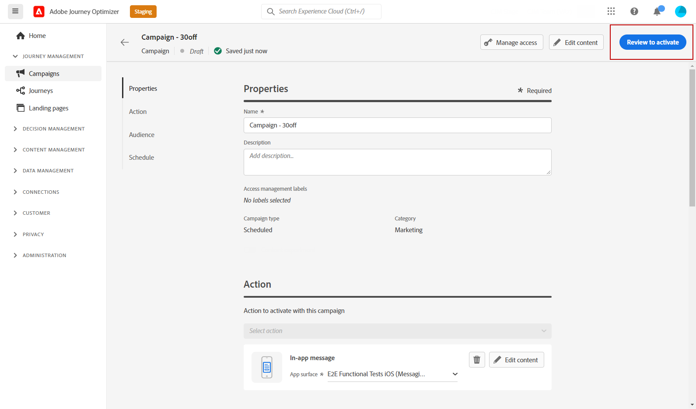

# Verifica e invia la notifica in-app {#create-in-app}

## Anteprima su dispositivo {#preview-device}

Se desideri visualizzare un’anteprima della notifica in-app prima che venga pubblicata per tutti gli utenti, puoi visualizzarla su un dispositivo specifico. Questa funzionalità ti consente di garantire che la notifica si presenti e funzioni come previsto sul dispositivo scelto, fornendo un’esperienza utente migliore per il pubblico.

Per farlo, segui la procedura indicata di seguito:

1. Clic **[!UICONTROL Anteprima sul dispositivo]**.

   

1. Dalla sezione **[!UICONTROL Connetti al dispositivo]** finestra, fai clic su **[!UICONTROL Inizio]**.

1. Inserisci il **[!UICONTROL URL di base]** dell’applicazione e fai clic su **[!UICONTROL Successivo]**.

   

1. Analizzare il codice QR con il dispositivo e immettere il codice PIN visualizzato.

Ora il messaggio in-app può essere attivato direttamente sul dispositivo, consentendoti di visualizzare l’anteprima e rivedere il messaggio su un dispositivo effettivo.

## Rivedere e attivare la notifica in-app{#in-app-review}

Una volta creato il messaggio in-app e definito e personalizzato il relativo contenuto, puoi rivederlo e attivarlo.

Per farlo, segui la procedura indicata di seguito:

1. Utilizza il **[!UICONTROL Controlla per attivare]** per visualizzare un riepilogo del messaggio.

   Il riepilogo ti consente di modificare la campagna, se necessario, e di verificare se un parametro è errato o mancante.

   

1. Verifica che la campagna sia configurata correttamente, quindi fai clic su **[!UICONTROL Attiva]**.

La campagna è ora attivata. La notifica in-app configurata nella campagna viene inviata immediatamente o alla data specificata.

Una volta inviati, puoi misurare l’impatto dei messaggi in-app nei rapporti della campagna o del Percorso. Per ulteriori informazioni sul reporting, consulta [questa sezione](../reports/campaign-global-report.md#inapp-report).

**Argomenti correlati:**

* [Creare un messaggio in-app](create-in-app.md)
* [Progettare un messaggio in-app](design-in-app.md)
* [Rapporto in-app](../reports/campaign-global-report.md#inapp-report)
* [Configurazione in-app](inapp-configuration.md)
