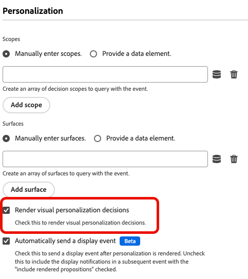

# Configurare il supporto per la messaggistica in-app web in Web SDK

I messaggi in-app sono notifiche che puoi inviare agli utenti all’interno dell’applicazione web, guidandoli verso punti di interesse specifici.

Puoi utilizzare queste notifiche per diversi scopi, ad esempio per promuovere nuove funzioni, presentare offerte speciali o facilitare l’onboarding degli utenti.

Utilizzando i messaggi in-app, puoi interagire in modo efficace con il pubblico e indirizzarli verso aspetti importanti dell’applicazione.

## Prerequisiti {#prerequisites}

### Versione estensione tag Web SDK {#extension-version}

La funzionalità di messaggistica in-app per web richiede la versione più recente dell’estensione tag Web SDK.

### Configurare un CSP per la messaggistica in-app web {#csp}

Quando configuri la messaggistica Web in-app, devi includere la seguente direttiva nei CSP:

```
default-src  blob:;
```

Per ulteriori informazioni sulla configurazione di un CSP, consulta [Documentazione sulla raccolta dati](https://experienceleague.adobe.com/docs/experience-platform/edge/use-cases/configuring-a-csp.html?lang=it){target="_blank"}.

## Configurare la messaggistica Web in-app utilizzando l’estensione tag Web SDK {#tag-extension}

Fare riferimento alla [pagina di configurazione dell&#39;estensione tag Web SDK](https://experienceleague.adobe.com/docs/experience-platform/tags/extensions/client/web-sdk/web-sdk-extension-configuration.html?lang=it){target="_blank"} per individuare le impostazioni descritte di seguito.

Dopo aver [installato](https://experienceleague.adobe.com/docs/experience-platform/tags/extensions/client/web-sdk/web-sdk-extension-configuration.html?lang=it#install-the-web-sdk-tag-extension){target="_blank"} l&#39;estensione tag Web SDK, eseguire la procedura seguente per configurare l&#39;estensione per la messaggistica in-app Web.

Nella sezione **[!UICONTROL Personalization]**, seleziona l&#39;opzione **[!UICONTROL Abilita archiviazione personalizzazione]**. Questa opzione consente al Web SDK di tenere traccia delle esperienze viste dall’utente nei vari caricamenti di pagina.


La messaggistica in-app Web supporta due tipi di trigger:

* [Invio di dati ad Experience Platform](#send-data-platform)
* [Attivazione manuale dei messaggi](#manual-trigger)

Consulta le sezioni seguenti per configurare l’estensione tag Web SDK in base ai trigger che desideri utilizzare.

### Passaggi di configurazione per il trigger **[!UICONTROL Invia dati ad Experience Platform]** {#send-data-platform}

1. Selezionare la proprietà tag che contiene l&#39;estensione Web SDK e [creare una nuova regola](https://experienceleague.adobe.com/docs/experience-platform/tags/ui/managing-resources/rules.html#create-a-rule){target="_blank"} con le impostazioni seguenti:

   * **[!UICONTROL Estensione]**: [!UICONTROL Core]
   * **[!UICONTROL Tipo evento]**: [!UICONTROL Libreria caricata (parte superiore della pagina)]

   

1. Seleziona **[!UICONTROL Mantieni modifiche]** per salvare la configurazione dell&#39;evento.

1. È ora necessario aggiungere un&#39;azione alla regola creata. Nella sezione [!DNL Actions] selezionare **[!UICONTROL Aggiungi]**.

   Utilizza le impostazioni **[!UICONTROL Azione]** seguenti:

   * **[!UICONTROL Estensione]**: [!UICONTROL Adobe Experience Platform Web SDK]
   * **[!UICONTROL Tipo azione]**: [!UICONTROL Invia evento]

   

1. Nella parte destra dello schermo, nella sezione **[!UICONTROL Personalization]**, abilita l&#39;opzione **[!UICONTROL Rendering delle decisioni di personalizzazione visiva]**.

   

1. Nella parte destra della schermata, nella sezione **[!UICONTROL Contesto della decisione]**, definisci le coppie **[!UICONTROL Chiave]**/**[!UICONTROL Valore]** utilizzate nella configurazione della campagna per qualificarti per il messaggio in-app.

   

1. Seleziona **[!UICONTROL Mantieni modifiche]** per salvare la configurazione.

1. Successivamente, devi aggiungere la regola appena creata alla libreria delle proprietà del tag. A questo scopo, vai a **[!UICONTROL Flusso di pubblicazione]** e seleziona la regola creata in precedenza.

   

1. Dopo aver aggiunto la regola alla libreria, seleziona **[!UICONTROL Salva e genera in sviluppo]**.

   

Il processo di configurazione è ora completato e il messaggio è pronto per essere mostrato agli utenti.

### Passaggi di configurazione per l&#39;utilizzo di trigger manuali {#manual-trigger}

1. Selezionare la proprietà tag che contiene l&#39;estensione Web SDK e [creare una nuova regola](https://experienceleague.adobe.com/docs/experience-platform/tags/ui/managing-resources/rules.html#create-a-rule){target="_blank"} con le impostazioni seguenti:

   * **[!UICONTROL Estensione]**: [!UICONTROL Core]
   * **[!UICONTROL Tipo evento]**: [!UICONTROL Fare clic]

1. Imposta il trigger per un elemento specifico sulla pagina, identificato da un selettore CSS a tua scelta.

   

1. È necessario aggiungere un&#39;azione alla regola creata. Nella sezione [!DNL Actions], seleziona **[!UICONTROL Aggiungi]** e utilizza le impostazioni **[!UICONTROL Azione]** seguenti:

   * **[!UICONTROL Estensione]**: [!UICONTROL Adobe Experience Platform Web SDK]
   * **[!UICONTROL Tipo azione]**: [!UICONTROL Valuta set di regole]

   

1. Sul lato destro della schermata, abilita l&#39;opzione **[!UICONTROL Esegui rendering delle decisioni di personalizzazione visiva]**.

   

1. Nella parte destra della schermata, nella sezione **[!UICONTROL Contesto della decisione]**, definisci le coppie **[!UICONTROL Chiave]**/**[!UICONTROL Valore]** utilizzate nella configurazione della campagna per qualificarti per il messaggio in-app.

   

1. Seleziona **[!UICONTROL Mantieni modifiche]** per salvare la configurazione.

1. Aggiungi la regola appena creata alla libreria delle proprietà dei tag. A questo scopo, vai a **[!UICONTROL Flusso di pubblicazione]** e seleziona la regola creata in precedenza.

   

1. Dopo aver aggiunto la regola alla libreria, seleziona **[!UICONTROL Salva e genera in sviluppo]**.

   

Il processo di configurazione è ora completato e il messaggio è pronto per essere mostrato agli utenti.

## Configurare la messaggistica Web in-app utilizzando la libreria Web SDK JavaScript {#js-library}

In alternativa all’utilizzo dell’estensione tag Web SDK, puoi anche configurare la messaggistica Web in-app direttamente dalla libreria Web SDK JavaScript.

I messaggi web in-app provenienti da Adobe Journey Optimizer possono essere visualizzati in due modi.

### Metodo 1: recuperare automaticamente il contenuto di personalizzazione {#automatic}

Per fare in modo che Web SDK recuperi automaticamente il contenuto di personalizzazione al caricamento della pagina, utilizzare il comando `sendEvent`, come illustrato nell&#39;esempio seguente.

```js
  alloy("sendEvent", {
      renderDecisions: true,
      personalization: {
          surfaces: ['#welcome']
      }
  });
```

### Metodo 2: recuperare manualmente il contenuto di personalizzazione in base all’azione dell’utente {#manual}

Per visualizzare il contenuto di personalizzazione solo dopo che l&#39;utente ha eseguito un&#39;azione specifica, utilizzare il comando `evaluateRulesets` come illustrato nell&#39;esempio seguente.

In questo esempio, il contenuto di personalizzazione viene visualizzato quando un utente fa clic sul pulsante **[!UICONTROL Acquista ora]** sul sito Web.

```js
 alloy("evaluateRulesets", {
     renderDecisions: true,
     personalization: {
         decisionContext: {
             "userAction": "buy_now"
         }
     }
 });
```

### Configurare l’archiviazione per la personalizzazione {#personalization-storage}

È possibile scegliere di mostrare i messaggi in-app agli utenti per un numero di volte impostato o ogni volta che visitano una pagina, tramite l&#39;opzione di configurazione `personalizationStorageEnabled`.

Nella [configurazione di Web SDK](https://experienceleague.adobe.com/docs/experience-platform/edge/fundamentals/configuring-the-sdk.html?lang=it){target="_blank"} impostare l&#39;opzione `personalizationStorageEnabled` in base alle proprie esigenze:

* `personalizationStorageEnabled: true` attiva il messaggio in-app con la frequenza definita nella [campagna](create-in-app-web.md#configure-inapp).
* `personalizationStorageEnabled: false` attiva il messaggio in-app a ogni caricamento di pagina.
