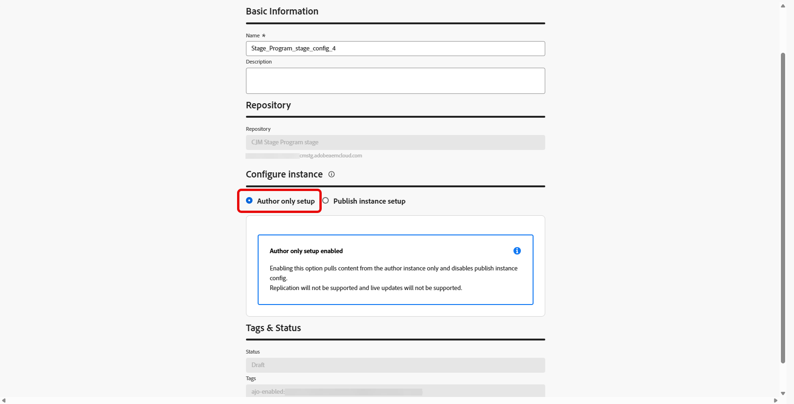

# Configurare l’accesso all’archivio Adobe Experience Manager {#aem-admin-settings}

Adobe Journey Optimizer si integra con **[!DNL Adobe Experience Manager as a Cloud Service]** in modo da poter utilizzare **Frammenti di contenuto** in Percorsi e campagne. **I frammenti di contenuto** vengono letti dall&#39;archivio di pubblicazione di Adobe Experience Manager per impostazione predefinita, gli amministratori possono passare all&#39;accesso di sola creazione o modificare l&#39;accesso di pubblicazione nel menu **[!UICONTROL Integrazione di AEM]**.

➡️ Quando l&#39;archivio è configurato, continuare con [Utilizzare i frammenti di contenuto di Experience Manager](../integrations/aem-fragments.md) per le attività di creazione e selezione in Journey Optimizer.

## Configurare gli archivi {#configure-ui}

>[!NOTE]
>
> **[!UICONTROL L&#39;integrazione di AEM]** salva le impostazioni del repository **per sandbox**. Ogni sandbox mantiene le proprie integrazioni e non si applicano tra le sandbox.

Journey Optimizer memorizza un’integrazione per organizzazione, sandbox e archivio Adobe Experience Manager. Se salvi una nuova integrazione per la stessa combinazione, questa sostituisce le impostazioni precedenti e viene mantenuta solo la configurazione più recente.

Per configurare l’archivio:

1. Accedi a **[!UICONTROL Amministrazione]** > **[!UICONTROL Canali]** > **[!UICONTROL Integrazione AEM]**.

1. Fai clic su **[!UICONTROL Crea integrazione]**.

   

1. Scegliere il repository da configurare e fare clic su **[!UICONTROL Avanti]**.

   Inoltre, puoi fare clic su **[!UICONTROL Visualizza]** per accedere a questo archivio.

   >[!IMPORTANT]
   >
   >Il salvataggio di una nuova configurazione per la stessa organizzazione, sandbox e repository **sostituisce** la configurazione predefinita, ovvero il repository **publish**.

   

1. Immetti un **[!UICONTROL Nome]** e una **[!UICONTROL Descrizione]**.

1. Scegli la tua configurazione:

   >[!BEGINTABS]

   >[!TAB Configurazione solo autore]

   Selezionare **[!UICONTROL Configurazione solo autore]** quando Journey Optimizer deve leggere i frammenti di contenuto solo dall&#39;ambiente Adobe Experience Manager **Author**. La replica dagli aggiornamenti di authoring a quelli di pubblicazione e pubblicazione in tempo reale non è supportata.

   

   >[!TAB Impostazione istanza di pubblicazione]

   1. Seleziona **[!UICONTROL Impostazione istanza di pubblicazione]** per attivare le impostazioni dell&#39;istanza di pubblicazione.

      

   1. Facoltativamente, abilita **[!UICONTROL Invia token all&#39;istanza di pubblicazione]** in modo che le credenziali del servizio vengano incluse nelle richieste all&#39;istanza di pubblicazione.

   1. Incolla un **[!UICONTROL JSON]** credenziali servizio valido per l&#39;autenticazione.

   1. Se necessario, fornisci un dominio personalizzato se l&#39;organizzazione non è in grado di raggiungere l&#39;host di pubblicazione predefinito di AEM (`publish-XX-XX.adobeaemcloud.com`) per recuperare il contenuto.

      

   >[!ENDTABS]

1. Fai clic su **[!UICONTROL Salva]**.

1. Per modificare o disabilitare l&#39;integrazione del repository, accedere alla configurazione creata in precedenza dal menu **[!UICONTROL Integrazione AEM]**.

Al momento del salvataggio, la sandbox utilizza l&#39;archivio per il selettore Frammento di contenuto e **Adobe Experience Manager Content Advisor**.

