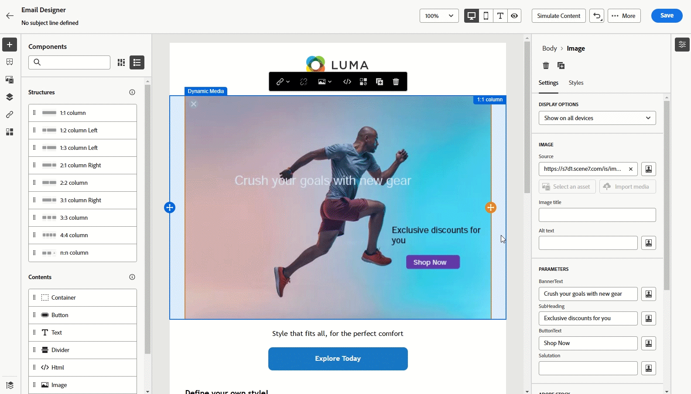
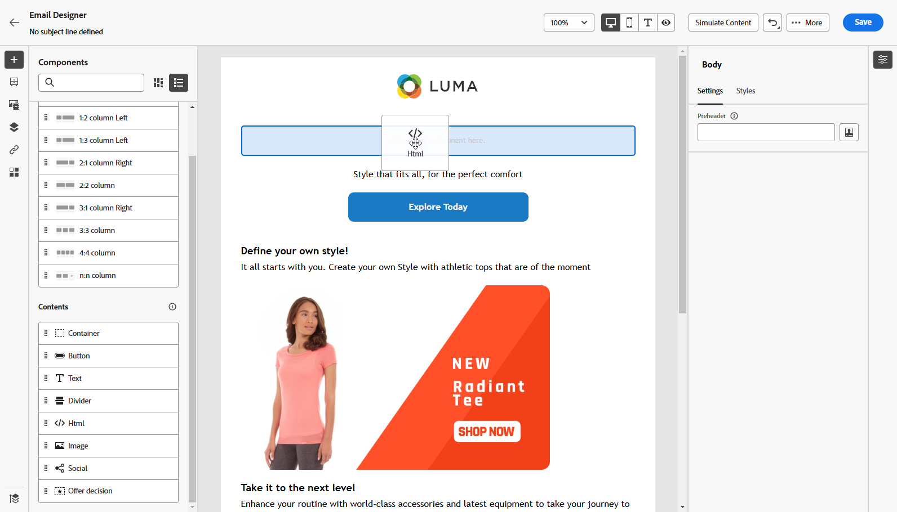

# Utilizzare Dynamic Media {#aem-dynamic}

>[!AVAILABILITY]
>
>Questa integrazione è disponibile esclusivamente per i clienti che utilizzano Dynamic Media Manager as a Cloud Service.

Il selettore delle risorse ora supporta Dynamic Media, consentendo di selezionare e utilizzare in modo semplice le rappresentazioni di elementi multimediali dinamici approvate in Journey Optimizer. Le modifiche apportate alle risorse in Adobe Experience Manager si riflettono immediatamente nel contenuto di Journey Optimizer, garantendo che le versioni più aggiornate siano sempre in uso senza richiedere aggiornamenti manuali.

Per ulteriori informazioni su Dynamic Media in Adobe Experience Manager as a Cloud Service, consulta la [documentazione di Experience Manager](https://experienceleague.adobe.com/en/docs/experience-manager-cloud-service/content/assets/dynamicmedia/dynamic-media).

## Aggiungere e gestire Dynamic Media

Migliora e ottimizza i contenuti per qualsiasi schermata o browser inserendo elementi multimediali dinamici da Adobe Experience Manager as a Cloud Service direttamente nel contenuto Journey Optimizer.  Puoi quindi ridimensionare, ritagliare, migliorare e apportare altre modifiche in base alle esigenze.

1. Trascina e rilascia un **[!UICONTROL componente HTML]** nel contenuto.

1. Selezionare **[!UICONTROL Mostra il codice sorgente]**.

   

1. Nel menu **[!UICONTROL Modifica HTML]**, passa a **[!UICONTROL Assets]** e fai clic su **[!UICONTROL Apri selettore risorse]**.

   In alternativa, puoi copiare e incollare l’URL della risorsa.

   

1. Sfoglia le risorse AEM e seleziona quella che desideri aggiungere al contenuto.

1. Regola i parametri dell’immagine (ad es. altezza, larghezza, rotazione, capovolgimento, luminosità, tonalità, ecc.) in base alle tue esigenze.

   Per un elenco completo dei parametri immagine che possono essere aggiunti all&#39;URL, consulta la [documentazione di Experience Manager](https://experienceleague.adobe.com/en/docs/dynamic-media-developer-resources/image-serving-api/image-serving-api/http-protocol-reference/command-reference/c-command-reference).

   

1. Fai clic su **[!UICONTROL Salva]**.

Il contenuto ora include gli elementi multimediali dinamici. Tutti gli aggiornamenti apportati in Experience Manager verranno visualizzati automaticamente in Journey Optimizer.

## Personalizzare la sovrapposizione testo

Personalizza facilmente qualsiasi elemento multimediale dinamico sostituendo la sovrapposizione di testo esistente con un nuovo testo a tua scelta, per consentire aggiornamenti e personalizzazione senza interruzioni.

Ad esempio, utilizzando la funzionalità di sperimentazione, puoi aggiornare la sovrapposizione di testo esistente sostituendola con un testo diverso per ogni trattamento, garantendo che sia personalizzata per ogni profilo quando aprono i messaggi.

1. Trascina e rilascia un **[!UICONTROL componente HTML]** nel contenuto.

1. Selezionare **[!UICONTROL Mostra il codice sorgente]**.

1. Dal menu **[!UICONTROL Modifica HTML]**, accedi a **[!UICONTROL Assets]** e quindi a **[!UICONTROL Apri selettore risorse]**.

   Puoi anche semplicemente copiare e incollare l’URL delle risorse.

1. Sfoglia le risorse AEM e seleziona quella che desideri aggiungere al contenuto.

1. Sostituire la sovrapposizione con il testo desiderato.

   

1. Aggiorna i parametri delle immagini:

   * **Livello**: inserisci l&#39;elemento di base in cui viene inserito il testo.
   * **Dimensioni**: aggiorna le dimensioni del blocco di testo.
   * **TextAttr**: modifica le dimensioni del carattere del testo.
   * **Pos**: imposta la posizione del testo nell&#39;immagine.

   >[!WARNING]
   >
   >Per aggiornare gli elementi multimediali dinamici è necessario il parametro Layer.

   

1. Fai clic su **[!UICONTROL Salva]**.

Il contenuto ora include la sovrimpressione del testo aggiornata.

## Aggiungere e gestire il modello Dynamic Media

Aggiungi facilmente il modello Dynamic Media in Journey Optimizer e aggiorna i contenuti multimediali quando necessario. Ora puoi incorporare campi di personalizzazione nei tuoi contenuti multimediali, consentendoti di creare contenuti più personalizzati e coinvolgenti all’interno di Journey Optimizer.

Ulteriori informazioni su [Modello Dynamic Media](https://experienceleague.adobe.com/en/docs/dynamic-media-classic/using/template-basics/quick-start-template-basics).

### Con componente immagine

Puoi inserire il modello dinamico direttamente nel contenuto utilizzando il componente Immagine:

1. Apri la campagna o il percorso e accedi al contenuto.

1. Trascina e rilascia un **componente immagine** nel layout.

   Per ulteriori informazioni sul componente Immagine, consulta [questa pagina](../email/content-components.md).

   

1. Sfoglia le risorse AEM e seleziona il modello Dynamic Media da aggiungere al contenuto.

   

1. Nelle **Impostazioni immagine**, accedi ai parametri del modello di elemento multimediale dinamico.

   I campi disponibili dipendono dai parametri aggiunti durante la [creazione del modello](https://experienceleague.adobe.com/en/docs/dynamic-media-classic/using/template-basics/creating-template-parameters#creating_template_parameters) in Adobe Experience Manager.

   

1. Compila i diversi campi e utilizza l’editor di personalizzazione per aggiungere contenuti personalizzati. Per creare un’esperienza più personalizzata, puoi utilizzare qualsiasi attributo, ad esempio il nome del profilo, la città o altri dettagli rilevanti.

   Ulteriori informazioni sulla personalizzazione in [questa pagina](../personalization/personalize.md).

   

1. Il contenuto condizionale può essere applicato al componente Dynamic Media per generare diverse varianti di contenuto. [Ulteriori informazioni](../personalization/dynamic-content.md)

1. Fai clic su **[!UICONTROL Salva]**.

Dopo aver eseguito i test e convalidato il contenuto, puoi inviare il messaggio al pubblico.

### Con componente HTML

Puoi inserire il modello dinamico direttamente nel contenuto utilizzando il componente HTML:

1. Apri la campagna o il percorso e accedi al contenuto.

1. Trascina e rilascia un **componente HTML** nel layout.

   

1. Selezionare **[!UICONTROL Mostra il codice sorgente]**.

   

1. Dal menu **[!UICONTROL Modifica HTML]**, accedi a **[!UICONTROL Assets]** e quindi a **[!UICONTROL Apri selettore risorse]**.

   Puoi anche semplicemente copiare e incollare l’URL delle risorse.

1. Regola i parametri di testo dell’immagine in base alle esigenze per soddisfare i requisiti della risorsa.

   

1. Fai clic su **[!UICONTROL Salva]**.

Dopo aver eseguito i test e convalidato il contenuto, puoi inviare il messaggio al pubblico.

<!--
## Personalization with Text Overlay

Easily customize any dynamic media by replacing the existing text overlay with new text of your choice, allowing for seamless updates and personalization.

In this example, our goal is to update the existing text overlay by replacing it with a new validity date and adding a personalization block, ensuring it is customized for each profile when they open their messages.

1. Drag and drop an **[!UICONTROL HTML component]** into your content.

1. Select **[!UICONTROL Show the source code]**.

1. From the **[!UICONTROL Edit HTML]** menu, access **[!UICONTROL Assets]** then **[!UICONTROL Open asset selector]**.

    You can also simply copy and paste your assets URL.

1. Browse through your AEM assets and select the one you want to add to your content.

1. Replace the overlay with the desired text.

    Here we change the validity date from 31st December 2024 to the 1st July 2025.

1. Add the required personalization fields to your image.

1. Click **[!UICONTROL Save]**.

Your content now includes your updated text overlay and personalization.

## Add Dynamic media conditional content

Enable conditional content in your dynamic media to better target your audience and deliver a more personalized experience.

1. Drag and drop an **[!UICONTROL HTML component]** into your content.

1. Select **[!UICONTROL Show the source code]**.

1. From the **[!UICONTROL Edit HTML]** menu, access **[!UICONTROL Assets]** then **[!UICONTROL Open asset selector]**.

    You can also simply copy and paste your assets URL.

1. Browse through your AEM assets and select the one you want to add to your content.

1. Once your dynamic media is inserted to your content, select **[!UICONTROL Enable conditional]** content from your HTML component toolbar to create your different user experiences. 

1. From the Variant - 1, click **[!UICONTROL Select condition]** to fine tune your audience.

1. Choose your condition or create a new one if needed and click **[!UICONTROL Select]**.

    [Learn more on conditions](../personalization/create-conditions.md)

1. Select your **[!UICONTROL Component]** and access the **[!UICONTROL Settings]** menu.

1. In the **[!UICONTROL Custom Attributes]** menu, populate the Dynamic Media text and personalization fields to customize the content for your audience.

-->
