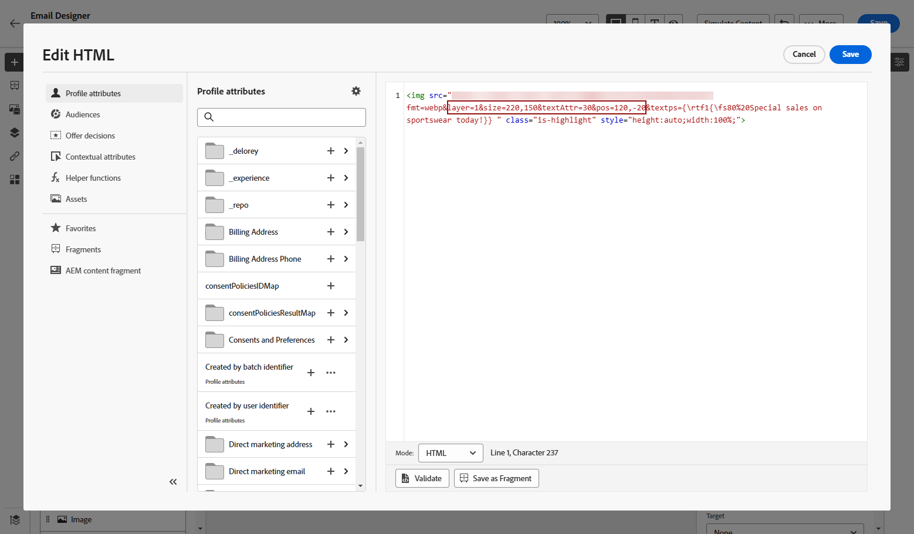
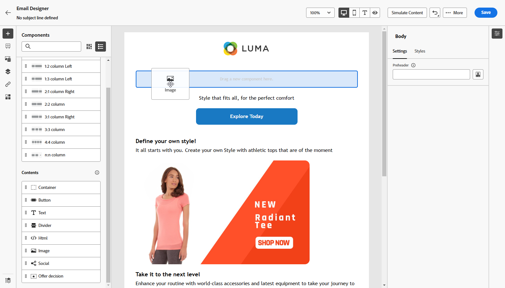
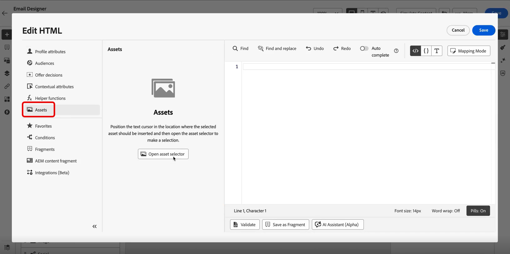
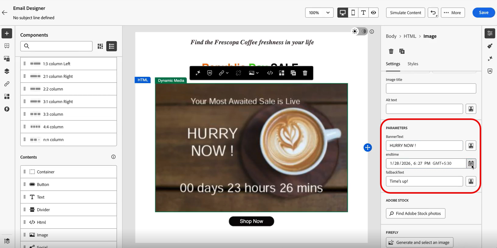

# Utilizzare gli elementi multimediali dinamici {#aem-dynamic}

>[!BEGINSHADEBOX]

**In questa pagina:** Scopri come inserire, regolare e personalizzare elementi multimediali dinamici di Adobe Experience Manager, inclusi sovrapposizioni di testo e modelli di elementi multimediali dinamici, all&#39;interno dei contenuti di Journey Optimizer.

>[!ENDSHADEBOX]

## Introduzione a Dynamic Media {#gs-aem-dynamic}

Il selettore delle risorse ora supporta Dynamic Media, consentendo di selezionare e utilizzare in modo semplice le rappresentazioni di elementi multimediali dinamici approvate in Journey Optimizer. Le modifiche apportate alle risorse in Adobe Experience Manager si riflettono immediatamente nel contenuto di Journey Optimizer, garantendo che le versioni più aggiornate siano sempre in uso senza richiedere aggiornamenti manuali.

Questa integrazione è disponibile solo per i clienti che utilizzano Dynamic Media Manager as a Cloud Service.

Per ulteriori informazioni su Dynamic Media in Adobe Experience Manager as a Cloud Service, consulta la [documentazione di Experience Manager](https://experienceleague.adobe.com/it/docs/experience-manager-cloud-service/content/assets/dynamicmedia/dynamic-media){target="_blank"}.

>[!AVAILABILITY]
>
>Per i clienti del settore sanitario, l&#39;integrazione è consentita solo dopo aver concesso in licenza le offerte aggiuntive Journey Optimizer Healthcare Shield e Adobe Experience Manager Extended Security for Healthcare.

## Considerazioni

* Assicurati che Dynamic Media con OpenAPI sia abilitato in Adobe Experience Manager as a Cloud Service. [Ulteriori informazioni](https://experienceleague.adobe.com/it/docs/experience-manager-cloud-service/content/assets/dynamicmedia/dynamic-media-open-apis/dynamic-media-open-apis-overview#enable-dynamic-media-open-apis){target="_blank"}.

* L&#39;integrazione Dynamic Media con Adobe Journey Optimizer è disponibile sia per la modalità Dynamic Media [Scene7](https://experienceleague.adobe.com/it/docs/experience-manager-65/content/assets/dynamic/config-dms7){target="_blank"} che per la modalità [con OpenAPI](https://experienceleague.adobe.com/it/docs/experience-manager-cloud-service/content/assets/dynamicmedia/dynamic-media-open-apis/dynamic-media-open-apis-overview){target="_blank"}.

* Per le risorse Scene7 di Dynamic Media, Journey Optimizer aggiunge modificatori predefiniti (`bfc=off&fmt=png-alpha`) all&#39;inizio dell&#39;URL. Se il predefinito imposta anche `fmt` o `bfc`, ha la precedenza, poiché Scene7 utilizza l&#39;ultima occorrenza di un parametro ripetuto. Per evitare risultati imprevisti, rimuovere `fmt`/`bfc` dal predefinito o spostarlo prima dei modificatori predefiniti nell&#39;URL.

* Per progettazione, il selettore risorse restituisce un formato URL basato su `/images`. Se desideri consegnare una risorsa nel suo formato originale, ad esempio GIF o SVG, devi aggiornare manualmente l&#39;URL per utilizzare il percorso `/content`. Ulteriori informazioni sono disponibili nella [documentazione sulle best practice di Dynamic Media](https://experienceleague.adobe.com/it/docs/experience-manager-cloud-service/content/assets/dynamicmedia/dm-journey/dm-best-practices#deliver-gif-images){target="_blank"}.

## Aggiungere e gestire Dynamic Media {#dynamic-media}

Migliora e ottimizza i contenuti per qualsiasi schermata o browser inserendo elementi multimediali dinamici da Adobe Experience Manager as a Cloud Service direttamente nel contenuto Journey Optimizer.  Puoi quindi ridimensionare, ritagliare, migliorare e apportare altre modifiche in base alle esigenze.

<!--
>[!AVAILABILITY]
>
>Older versions of Outlook (including 2016) do not support rendering of content with Dynamic Media.  We are actively working on a permanent fix to enhance compatibility. In the meantime, apply the following guidelines:
>
>* For Dynamic Media Scene7 URLs: Append `?bfc=on` to the image URL. This enables automatic format negotiation, ensuring the most compatible image format is delivered based on the client's capabilities.
>
>* For Dynamic Media with Open API: Use the `.avif` format. This format includes built-in fallback mechanisms to deliver a compatible format when necessary.
>
-->

Per aggiungere una risorsa Adobe Experience Manager al contenuto di HTML, effettua le seguenti operazioni:

1. Trascina e rilascia un **[!UICONTROL componente HTML]** nel contenuto.

1. Selezionare **[!UICONTROL Mostra il codice sorgente]**.

   

1. Nel menu **[!UICONTROL Modifica HTML]**, passa a **[!UICONTROL Assets]** e fai clic su **[!UICONTROL Apri selettore risorse]**.

   In alternativa, puoi copiare e incollare l’URL della risorsa.

   

1. Sfoglia le risorse AEM e seleziona quella che desideri aggiungere al contenuto.

1. Regola i parametri dell&#39;immagine (ad es. altezza, larghezza, rotazione, capovolgimento, luminosità, tonalità, ecc.) secondo necessità per soddisfare i requisiti delle risorse.

   Per un elenco completo dei parametri immagine che possono essere aggiunti all&#39;URL, consulta la [documentazione di Experience Manager](https://experienceleague.adobe.com/it/docs/dynamic-media-developer-resources/image-serving-api/image-serving-api/http-protocol-reference/command-reference/c-command-reference){target="_blank"}.

   

1. Fai clic su **[!UICONTROL Salva]**.

Il contenuto ora include gli elementi multimediali dinamici. Tutti gli aggiornamenti apportati in Experience Manager verranno visualizzati automaticamente in Journey Optimizer.

## Personalizzare la sovrapposizione testo {#text-overlay}

Personalizza facilmente qualsiasi elemento multimediale dinamico sostituendo la sovrapposizione di testo esistente con un nuovo testo a tua scelta, per consentire aggiornamenti e personalizzazione senza interruzioni.

Ad esempio, utilizzando la funzionalità di sperimentazione, puoi aggiornare la sovrapposizione di testo esistente sostituendola con un testo diverso per ogni trattamento, garantendo che sia personalizzata per ogni profilo quando aprono i messaggi.

>[!AVAILABILITY]
>
>**La personalizzazione sovrapposizione testo** è disponibile esclusivamente in Dynamic Media [modalità Scene7](https://experienceleague.adobe.com/it/docs/experience-manager-65/content/assets/dynamic/config-dms7){target="_blank"}. Poiché la modalità Scene7 non è accessibile ai clienti del settore sanitario, il contenuto viene riprodotto utilizzando una copia binaria dell’immagine Journey Optimizer. Per eventuali eccezioni, contatta il rappresentante Adobe.

Per personalizzare la sovrapposizione del testo, effettua le seguenti operazioni:

1. Trascina e rilascia un **[!UICONTROL componente HTML]** nel contenuto.

1. Selezionare **[!UICONTROL Mostra il codice sorgente]**.

1. Dal menu **[!UICONTROL Modifica HTML]**, accedi a **[!UICONTROL Assets]** e quindi a **[!UICONTROL Apri selettore risorse]**.

   Puoi anche semplicemente copiare e incollare l’URL delle risorse.

1. Sfoglia le risorse AEM e seleziona quella che desideri aggiungere al contenuto.

1. Sostituire la sovrapposizione con il testo desiderato.

   

1. Aggiorna i parametri delle immagini:

   * **Livello**: inserisci l&#39;elemento di base in cui viene inserito il testo.
   * **Dimensioni**: aggiorna le dimensioni del blocco di testo.
   * **TextAttr**: modifica le dimensioni del carattere del testo.
   * **Pos**: imposta la posizione del testo nell&#39;immagine.

   >[!WARNING]
   >
   >Per aggiornare gli elementi multimediali dinamici è necessario il parametro Layer.

   

1. Fai clic su **[!UICONTROL Salva]**.

Il contenuto ora include la sovrimpressione del testo aggiornata.

## Aggiungere e gestire il modello Dynamic Media {#dynamic-media-template}

Aggiungi facilmente il modello Dynamic Media in Journey Optimizer e aggiorna i contenuti multimediali quando necessario. Ora puoi incorporare campi di personalizzazione nei tuoi contenuti multimediali, consentendoti di creare contenuti più personalizzati e coinvolgenti all’interno di Journey Optimizer.

Ulteriori informazioni su [Modello Dynamic Media](https://experienceleague.adobe.com/it/docs/dynamic-media-classic/using/template-basics/quick-start-template-basics){target="_blank"}.

>[!AVAILABILITY]
>
>**Il modello Dynamic Media** è disponibile esclusivamente in modalità Dynamic Media [Scene7](https://experienceleague.adobe.com/it/docs/experience-manager-65/content/assets/dynamic/config-dms7). Poiché la modalità Scene7 non è accessibile ai clienti del settore sanitario, il contenuto non verrà renderizzato. Per eventuali eccezioni, contatta il supporto Experience Manager.

### Con componente immagine {#image-component}

Puoi inserire il modello dinamico direttamente nel contenuto utilizzando il componente Immagine:

1. Apri la campagna o il percorso e accedi al contenuto.

1. Trascina e rilascia un **componente immagine** nel layout.

   Per ulteriori informazioni sul componente Immagine, consulta [questa pagina](../email/content-components.md).

   

1. Sfoglia le risorse AEM e seleziona il modello Dynamic Media da aggiungere al contenuto.

   

1. Nelle **Impostazioni immagine**, accedi ai parametri del modello di elemento multimediale dinamico.

   I campi disponibili dipendono dai parametri aggiunti durante la [creazione del modello](https://experienceleague.adobe.com/it/docs/dynamic-media-classic/using/template-basics/creating-template-parameters#creating_template_parameters){target="_blank"} in Adobe Experience Manager.

   

1. Compila i diversi campi e utilizza l’editor di personalizzazione per aggiungere contenuti personalizzati. Per creare un’esperienza più personalizzata, puoi utilizzare qualsiasi attributo, ad esempio il nome del profilo, la città o altri dettagli rilevanti.

   Ulteriori informazioni sulla personalizzazione in [questa pagina](../personalization/personalize.md).

   

1. Il contenuto condizionale può essere applicato al componente Dynamic Media per generare diverse varianti di contenuto. [Ulteriori informazioni](../personalization/dynamic-content.md)

1. Fai clic su **[!UICONTROL Salva]**.

Dopo aver eseguito i test e convalidato il contenuto, puoi inviare il messaggio al pubblico.

### Con componente HTML {#html-component}

Puoi inserire il modello dinamico direttamente nel contenuto utilizzando il componente HTML:

1. Apri la campagna o il percorso e accedi al contenuto.

1. Trascina e rilascia un **componente HTML** nel layout.

   

1. Selezionare **[!UICONTROL Mostra il codice sorgente]**.

   

1. Dal menu **[!UICONTROL Modifica HTML]**, accedi a **[!UICONTROL Assets]** e quindi a **[!UICONTROL Apri selettore risorse]**.

   Puoi anche semplicemente copiare e incollare l’URL delle risorse.

1. Regola i parametri di testo dell’immagine in base alle esigenze per soddisfare i requisiti della risorsa.

   

1. Fai clic su **[!UICONTROL Salva]**.

Dopo aver eseguito i test e convalidato il contenuto, puoi inviare il messaggio al pubblico.

## Inserisci timer conto alla rovescia {#countdown}

Crea un’urgenza e massimizza le conversioni con i timer di conto alla rovescia di Dynamic Media che vengono aggiornati in tempo reale quando i destinatari aprono le e-mail. Questa funzione è ideale per vendite flash, offerte a tempo limitato e promozioni sensibili al tempo.

Ad esempio, come addetto al marketing per un marchio per la vendita al dettaglio, hai una vendita flash di 48 ore. Utilizzando il timer del conto alla rovescia nelle e-mail promozionali:

* Per i destinatari che aprono immediatamente, vedere &quot;47 ore rimanenti&quot;
* Per i destinatari che aprono 24 ore dopo, vedere &quot;23 ore rimanenti&quot;
* I destinatari che aprono dopo la fine della vendita vedranno &quot;Il tempo è scaduto!&quot;

Per ulteriori informazioni su come aggiungere timer di conto alla rovescia al modello Dynamic Media in Adobe Experience Manager, consulta [questo documento](assets/do-not-localize/countdown.pdf).

1. In **[!DNL Adobe Experience Manager]** creare un modello Dynamic Media e aggiungervi un componente timer per il conto alla rovescia.

   

1. In **[!DNL Journey Optimizer]**, creare una nuova campagna o aprirne una esistente, quindi accedere al Designer e-mail.

1. Trascina e rilascia un componente **HTML** o **Asset** nel contenuto dell&#39;e-mail.

1. Passa il puntatore del mouse sul componente e fai clic su **[!UICONTROL Mostra il codice sorgente]** (per i componenti di HTML) o su **[!UICONTROL Sfoglia]** (per i componenti di Asset).

   

1. Dal menu **[!UICONTROL Modifica HTML]**, passa a **[!UICONTROL Assets]** e fai clic su **[!UICONTROL Apri selettore risorse]** per sfogliare e selezionare il modello Dynamic Media pubblicato.

   

1. Abilita l’esperienza pillole attivando Pills (Pillole). Questo migliora la leggibilità nascondendo i percorsi attributo lunghi.

   

1. Nel menu **[!UICONTROL Attributi personalizzati]**, configura eventuali parametri URL personalizzabili in base alle esigenze del modello.

   Al termine, fai clic su **[!UICONTROL Salva]**.

   

1. In alternativa, puoi anche accedere ai parametri del modello Dynamic Media selezionando la risorsa nel Designer e-mail e quindi accedendo al menu **[!UICONTROL Impostazioni]**.

   Configura quanto segue:

   * **Testo banner**: il testo visualizzato con il timer
   * **Ora di fine**: la data e l&#39;ora in cui scade il conto alla rovescia. Immetti l’ora solo in GMT (ora di Greenwich). Il sistema non accetta altri fusi orari.
   * **Testo di fallback**: messaggio visualizzato al termine del timer

   

1. Fai clic su **[!UICONTROL Anteprima]** per visualizzare il timer con aggiornamenti del conto alla rovescia in tempo reale e verificare la configurazione.

Quando i destinatari aprono l’e-mail, visualizzano il tempo rimanente esatto per la vendita flash. Se riaprono l’e-mail in un secondo momento, il conto alla rovescia si aggiorna automaticamente per riflettere l’ora corrente rimanente. Dopo la data di fine, il messaggio predefinito viene visualizzato automaticamente.

## Video introduttivo {#video}

Scopri come integrare Adobe Experience Manager Dynamic Media con Adobe Journey Optimizer per abilitare gli aggiornamenti e la personalizzazione dei contenuti in tempo reale.

Questo tutorial illustra come modificare le immagini direttamente all’interno di AJO, aggiungere sovrapposizioni di testo utilizzando la modalità HTML, creare modelli Dynamic Media in AEM per l’iperpersonalizzazione e personalizzare le campagne adattando i contenuti ai diversi segmenti di pubblico. Questa integrazione consente ai marketer di creare in modo efficiente campagne coinvolgenti e personalizzate senza dover passare da un’applicazione all’altra.

>[!VIDEO](https://video.tv.adobe.com/v/3457695/?learn=on&enablevpops=&autoplay=true)

