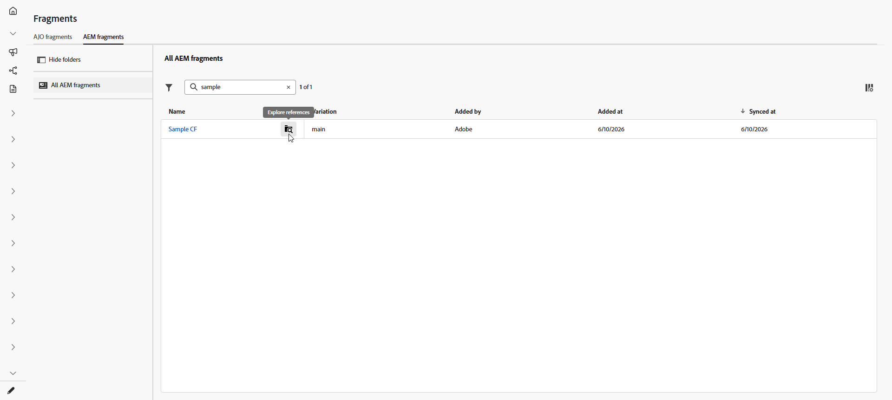
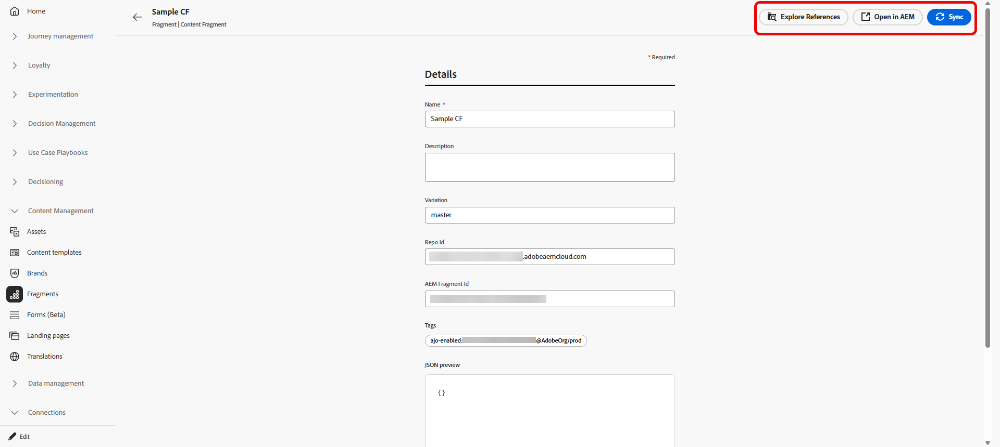
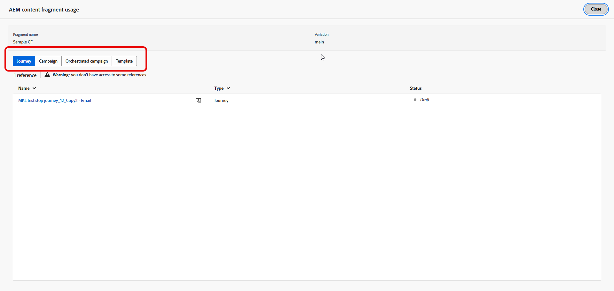

# Gestire i frammenti di contenuto Adobe Experience Manager {#aem-fragments}

Integrando Adobe Experience Manager as a Cloud Service o Managed Services con Adobe Journey Optimizer, puoi utilizzare i Frammenti di contenuto AEM nel contenuto e controllare lo stato dei Frammenti senza uscire da Journey Optimizer.

Quando ripubblichi un frammento già utilizzato in un Percorso o in una campagna, il timer di sincronizzazione inizia dopo che il frammento è **pubblicato** in Adobe Experience Manager. Il contenuto aggiornato è in genere disponibile in Journey Optimizer entro circa **5 minuti** per percorsi unitari e campagne. Per le consegne in batch, la modifica viene visualizzata nel **batch di elaborazione successivo**. Consulta [Utilizzare i frammenti di contenuto di Adobe Experience Manager](aem-fragments.md). In caso di ritardi, puoi sincronizzare manualmente il frammento da Journey Optimizer per estrarre l’ultima versione pubblicata.

## Accedere ai frammenti di contenuto di AEM {#access-aem-fragments}

1. Dal menu **[!UICONTROL Gestione contenuto]**, selezionare **[!UICONTROL Frammenti]**.

1. Apri la scheda **[!UICONTROL Frammenti di AEM]** per visualizzare i frammenti di contenuto disponibili da Adobe Experience Manager.

1. Dall&#39;elenco Frammenti, fare clic su  per **[!UICONTROL esplorare i riferimenti]**.

   

1. Seleziona un frammento per esaminarne lo stato e le azioni disponibili:

   * **[!UICONTROL Esplora riferimenti]**: visualizza i Percorsi, le campagne, le campagne orchestrate e i modelli che utilizzano il frammento.
   * **[!UICONTROL Apri in AEM]**: apri il frammento in Adobe Experience Manager per modificarlo o ripubblicarlo.
   * **[!UICONTROL Sincronizzazione]**: estrai l&#39;ultima versione pubblicata da Adobe Experience Manager a Journey Optimizer, ad esempio quando il contenuto ripubblicato non è stato visualizzato dopo la normale finestra di sincronizzazione. Se il controllo è disattivato, il frammento corrisponde già alla versione pubblicata in Experience Manager.

     

1. Il menu **[!UICONTROL Dettagli]** ti consente di rivedere i metadati e visualizzare in anteprima il payload sincronizzato:

   * **[!UICONTROL Nome]**: titolo del frammento di contenuto importato da Adobe Experience Manager.
   * **[!UICONTROL Descrizione]**: descrizione importata da Adobe Experience Manager.
   * **[!UICONTROL Variante]**: variante pubblicata attualmente rappresentata per questo frammento.
   * **[!UICONTROL ID repository]**: identificatore del repository per il frammento in Adobe Experience Manager.
   * **[!UICONTROL ID frammento AEM]**: identificatore univoco del frammento di contenuto in Adobe Experience Manager.
   * **[!UICONTROL Tag]**: tag assegnati in Adobe Experience Manager, inclusi i tag di abilitazione di Journey Optimizer che determinano se il frammento viene visualizzato nei selettori per l&#39;organizzazione e la sandbox. [Scopri come creare e assegnare i tag](aem-fragments.md#create-tag)
   * **[!UICONTROL Anteprima JSON]**: struttura JSON di sola lettura del contenuto del frammento utilizzato da Journey Optimizer.

1. In **[!UICONTROL Esplora riferimenti]**, utilizza le schede per visualizzare percorsi, campagne, campagne orchestrate e modelli che fanno riferimento al frammento.

   

➡️ [Ulteriori informazioni sui frammenti di contenuto](aem-fragments.md)

