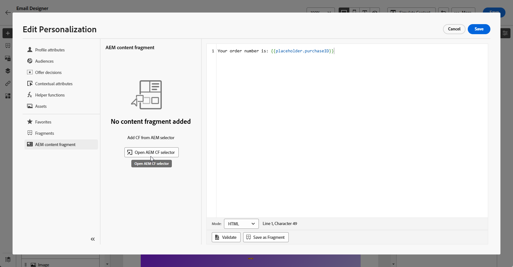

# Frammenti di contenuto di Adobe Experience Manager {#aem-fragments}

Integrando Adobe Experience Manager as a Cloud Service con Adobe Journey Optimizer, ora puoi incorporare facilmente i frammenti di contenuto AEM nei contenuti Journey Optimizer. Questa connessione diretta facilita il processo di accesso e utilizzo dei contenuti AEM, consentendo la creazione di campagne e percorsi personalizzati e dinamici.

Per ulteriori informazioni sui frammenti di contenuto di AEM, consulta [Utilizzo dei frammenti di contenuto](https://experienceleague.adobe.com/en/docs/experience-manager-cloud-service/content/sites/administering/content-fragments/content-fragments-with-journey-optimizer){target="_blank"} nella documentazione di Experience Manager.

>[!AVAILABILITY]
>
>Per i clienti del settore sanitario, l&#39;integrazione è abilitata solo dopo aver concesso in licenza le offerte aggiuntive Journey Optimizer Healthcare Shield e Adobe Experience Manager Enhanced Security.

## Limitazioni {#limitations}

* Per ridurre il rischio di errori accidentali, si consiglia di limitare il numero di utenti con accesso alla pubblicazione dei frammenti di contenuto.

* Per i contenuti multilingue, è supportato solo il flusso manuale.

* Varianti non supportate.

* La bozza per la campagna e il percorso pubblicati riflette i dati della pubblicazione più recente dei frammenti di contenuto di Experience Manager.

## Creare e assegnare un tag in Experience Manager

>[!IMPORTANT]
>
>Per consentire a Journey Optimizer di accedere ai frammenti di contenuto di Adobe Experience Manager tramite l&#39;API di gestione dei frammenti di contenuto, devi prima [configurare Dispatcher](https://experienceleague.adobe.com/en/docs/experience-manager-cloud-service/content/sites/administering/content-fragments/content-fragments-with-journey-optimizer#dispatcher-configuration).

Prima di utilizzare il frammento di contenuto in Journey Optimizer, è necessario creare un tag specifico per Journey Optimizer:

1. Accedi al tuo ambiente **Experience Manager**.

1. Dal menu **Strumenti**, seleziona **Assegnazione tag**.

   

1. Fare clic su **Crea tag**.

1. Verificare che l&#39;ID sia conforme alla sintassi seguente: `ajo-enabled:{AJO-OrgId}/{AJO-SandboxName}`.

1. Fai clic su **Crea**.

1. Definisci il modello per frammenti di contenuto come descritto nella [documentazione di Experience Manager](https://experienceleague.adobe.com/en/docs/experience-manager-cloud-service/content/sites/administering/content-fragments/content-fragment-models){target="_blank"} e assegna il nuovo tag Journey Optimizer creato.

Ora puoi iniziare a creare e configurare il frammento di contenuto per un utilizzo successivo in Journey Optimizer. Ulteriori informazioni sono disponibili nella [documentazione di Experience Manager](https://experienceleague.adobe.com/en/docs/experience-manager-cloud-service/content/sites/administering/content-fragments/managing){target="_blank"}.

## Aggiungere frammenti di contenuto Experience Manager {#aem-add}

Dopo aver creato e personalizzato i frammenti di contenuto di AEM, puoi importarli nella campagna o nel percorso di ottimizzazione del Percorso.

1. Crea la tua [campagna](../campaigns/create-campaign.md) o [Percorso](../building-journeys/journey-gs.md).

1. Per accedere al frammento di contenuto AEM, fai clic sull&#39; in un campo di testo qualsiasi oppure apri il codice sorgente tramite un componente di contenuto HTML.

   

1. Dal menu **[!UICONTROL Frammento di contenuto di AEM]** nel riquadro a sinistra, fare clic su **[!UICONTROL Apri selettore CF di AEM]**.

   

1. Seleziona un **[!UICONTROL frammento di contenuto]** dall&#39;elenco disponibile per l&#39;importazione nel contenuto di Journey Optimizer.

1. Fai clic su **[!UICONTROL Mostra filtri]** per ottimizzare l&#39;elenco dei frammenti di contenuto.

   Per impostazione predefinita, il filtro Frammento di contenuto è predefinito per visualizzare solo il contenuto approvato.

   

1. Dopo aver selezionato il **[!UICONTROL frammento di contenuto]**, fai clic su **[!UICONTROL Seleziona]** per aprirlo.

   

1. Fai clic su **[!UICONTROL Visualizza frammento]** per visualizzare le informazioni sul frammento. L&#39;apertura del menu **[!UICONTROL Informazioni frammento]** comporta l&#39;attivazione della modalità di sola lettura per l&#39;editor.

   Seleziona **[!UICONTROL Anteprima]** dal menu di destra per visualizzare il frammento in Adobe Experience Manager.

   

1. Fai clic sull&#39; per accedere al menu avanzato del frammento:

   * **[!UICONTROL Scambia frammento]**
   * **[!UICONTROL Esplora riferimenti]**
   * **[!UICONTROL Apri in AEM]**

   

1. Scegli i campi desiderati dal **[!UICONTROL frammento]** da aggiungere al contenuto.

   <!--
    Note that if you choose to copy the value, any future updates to the Content Fragment will not be reflected in your campaign or journey. However, using dynamic placeholders ensures real-time updates.-->

   

1. Per abilitare la personalizzazione in tempo reale, tutti i segnaposto utilizzati all&#39;interno di un **[!UICONTROL frammento di contenuto]** devono essere dichiarati esplicitamente dall&#39;utente come parametri nel tag helper del frammento. Puoi mappare questi segnaposto ad attributi di profilo, attributi contestuali, stringhe statiche o variabili predefinite utilizzando i metodi seguenti:

   1. **Mappatura attributi contestuali o di profilo**: assegnare il segnaposto a un attributo contestuale o di profilo, ad esempio nome = profile.person.name.firstName.

   1. **Mappatura stringa statica**: assegna un valore stringa fisso inserendolo tra virgolette doppie, ad esempio nome = &quot;John&quot;.

   1. **Mappatura variabile**: fare riferimento a una variabile dichiarata in precedenza all&#39;interno dello stesso HTML, ad esempio name = &#39;variableName&#39;.
In questo caso, assicurati che **_variableName_** sia dichiarato prima di aggiungere l&#39;ID frammento, utilizzando la seguente sintassi:

      ```html
       
      ```

   Nell&#39;esempio seguente, il segnaposto **_name_** è mappato all&#39;attributo **_profile.person.name.firstName_** all&#39;interno del frammento.

   {zoomable="yes"}


1. Fai clic su **[!UICONTROL Salva]**. Ora puoi testare e controllare il contenuto del messaggio come descritto in [questa sezione](../content-management/preview.md).

Dopo aver eseguito i test e convalidato il contenuto, puoi [inviare la tua campagna](../campaigns/review-activate-campaign.md) o [pubblicare il percorso](../building-journeys/publish-journey.md) al tuo pubblico.

Adobe Experience Manager consente di identificare le campagne o i percorsi Journey Optimizer in cui viene utilizzato un frammento di contenuto. Ulteriori informazioni sono disponibili nella [documentazione di Adobe Experience Manager](https://experienceleague.adobe.com/en/docs/experience-manager-cloud-service/content/sites/administering/content-fragments/extension-content-fragment-ajo-external-references).
