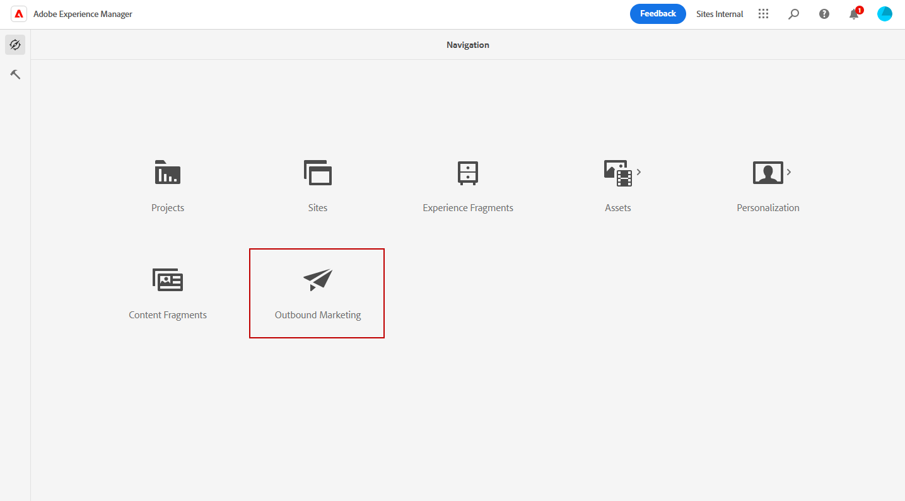
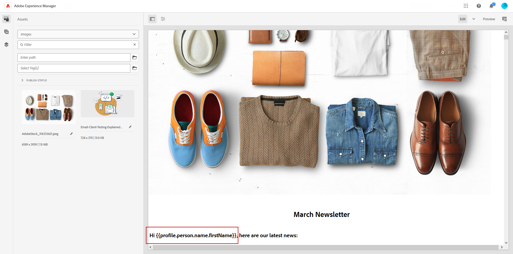
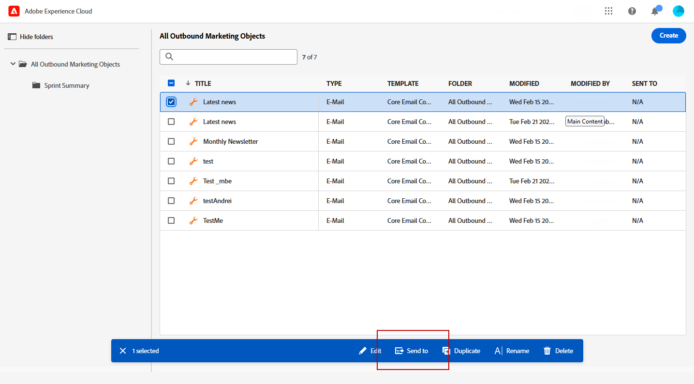
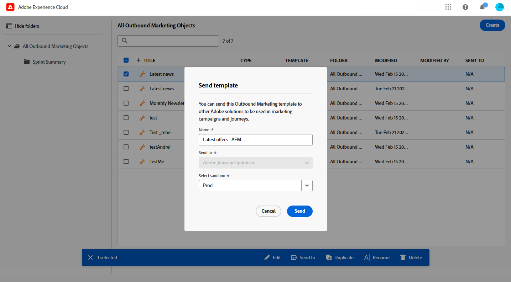
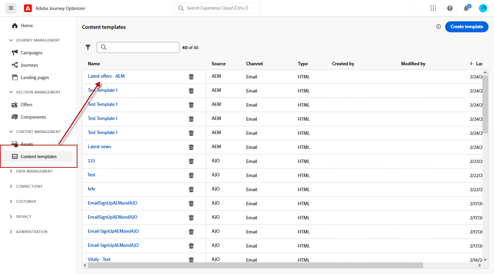
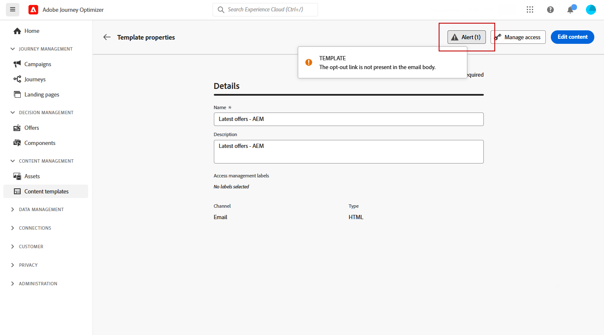
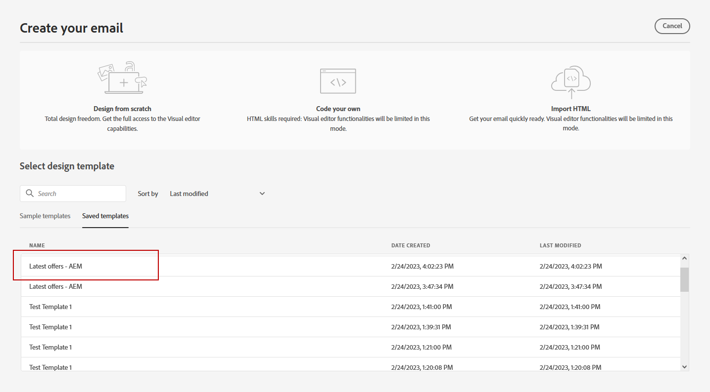
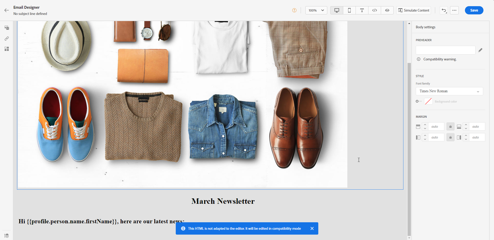
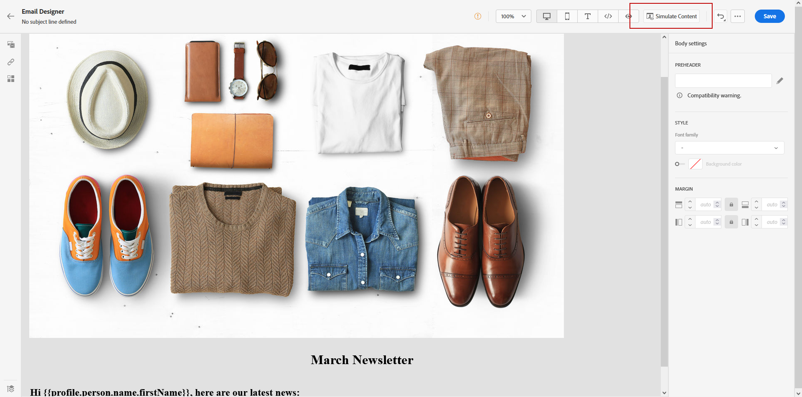
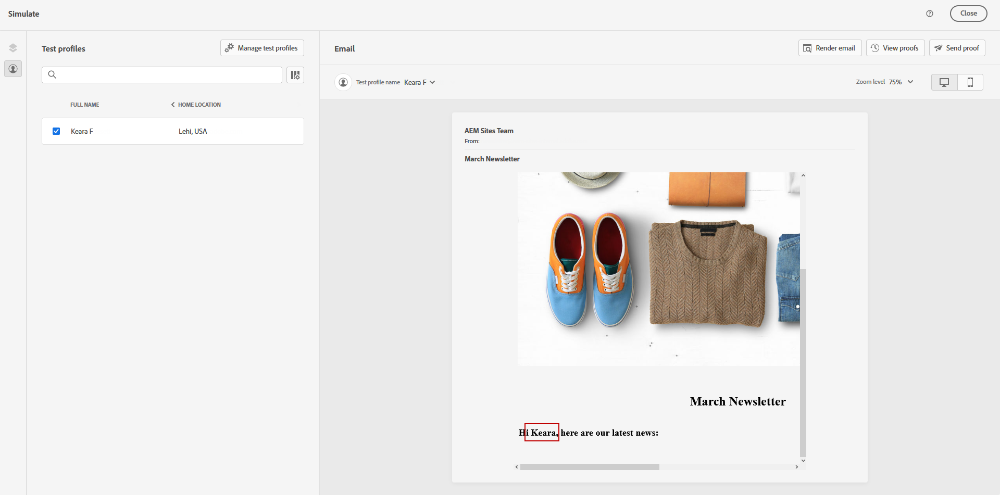

# Utilizzare i modelli di Adobe Experience Manager {#aem-templates}

>[!BEGINSHADEBOX]

**In questa pagina:** Scopri come progettare modelli in Adobe Experience Manager, esportarli in Journey Optimizer e personalizzarli come modelli di contenuto nel Designer e-mail.

>[!ENDSHADEBOX]

## Introduzione ai modelli di Adobe Experience Manager {#gs-aem-templates}

Con Adobe Journey Optimizer, puoi creare messaggi personalizzati tramite i siti Adobe Experience Manager. Inizia progettando i modelli utilizzando le origini di contenuto di Adobe Experience Manager, quindi inviali a Adobe Journey Optimizer. Una volta condivisi, è possibile accedere a questi modelli nel Designer e-mail di Adobe Journey Optimizer, semplificando la creazione e l’invio di messaggi al pubblico desiderato.

>[!AVAILABILITY]
>
>L’integrazione con Adobe Experience Manager è attualmente disponibile come versione beta solo per alcuni utenti.
>Come utente beta, usa [questo modulo](https://forms.office.com/pages/responsepage.aspx?id=Wht7-jR7h0OUrtLBeN7O4Wf0cbVTQ3tCpW_unE-w8-JUN1FaNlAzNkhPSUdaSkJXVFRCNTRJNVRFSy4u){target="_blank"} per condividere i tuoi commenti.

### Prerequisiti {#prerequisites}

Prima di iniziare a utilizzare questa funzionalità, assicurati di essere in linea con i seguenti requisiti:

* **Impostazioni Experience Manager**

  Questa funzionalità è disponibile con [Adobe Experience Manager as a Cloud Service](https://experienceleague.adobe.com/docs/experience-manager-cloud-service/content/overview/introduction.html?lang=it){target="_blank"}.

  Come parte del programma beta, la configurazione Cloud Service viene eseguita da Adobe in Adobe Experience Manager per connettersi a Adobe Journey Optimizer.

* **Autorizzazioni**

  Per creare, modificare ed eliminare modelli di contenuto in Adobe Journey Optimizer, è necessario disporre dell&#39;autorizzazione **[!DNL Manage Library Items]** inclusa nel profilo di prodotto **[!DNL Content Library Manager]**. [Ulteriori informazioni](../administration/ootb-product-profiles.md#content-library-manager)

### Guardrail e limitazioni{#aem-templates-limitations}

Per ottimizzare ulteriormente l’utilizzo di Adobe Experience Manager con Adobe Journey Optimizer, è importante essere consapevoli delle seguenti protezioni e limitazioni aggiuntive:

* Affinché la personalizzazione nel modello Experience Manager sia efficace, è necessaria la corretta sintassi Journey Optimizer. [Ulteriori informazioni](../personalization/personalization-syntax.md)

* L’esportazione di modelli in blocco non è attualmente supportata, i modelli devono essere esportati singolarmente.

* La sincronizzazione tra Experience Manager e Journey Optimizer non è attualmente disponibile. Se vengono apportate modifiche a un modello di Experience Manager dopo che è stato inviato a Journey Optimizer, l’utente dovrà riesportare il modello e inviarlo di nuovo a Journey Optimizer.

## Inviare un modello a Journey Optimizer{#aem-templates-send}

Per esportare un modello di Adobe Experience Manager in Adobe Journey Optimizer, effettua le seguenti operazioni:

1. Dalla home page di Adobe Experience Manager, seleziona **[!UICONTROL Marketing in uscita]**.

   

1. Dalla libreria dei contenuti, puoi utilizzare modelli configurati in precedenza o crearne uno da zero. [Ulteriori informazioni](https://experienceleague.adobe.com/docs/experience-manager-65/authoring/authoring/managing-pages.html#creating-a-new-page)

1. Incorporando la sintassi di personalizzazione di Journey Optimizer nel modello, puoi migliorarne le funzionalità di personalizzazione. [Ulteriori informazioni](../personalization/personalization-syntax.md)

   

1. Selezionare il modello da esportare in Journey Optimizer e fare clic su **[!UICONTROL Invia a]** dal menu avanzato.

   

1. Immetti il **[!UICONTROL Nome]** del modello di contenuto e seleziona la destinazione **[!UICONTROL Sandbox]**.

   

1. Dopo aver fatto clic sul pulsante **[!UICONTROL Invia]**, verrà avviato il processo di esportazione. Una volta completata l’esportazione, viene visualizzato il seguente messaggio nell’interfaccia utente: &quot;Modello &quot;XX&quot; inviato correttamente ad AJO&quot;.

Il modello viene aggiunto ai modelli di contenuto Adobe Journey Optimizer della sandbox selezionata.

## Utilizzare e personalizzare un modello di Adobe Experience Manager{#aem-templates-perso}

Una volta che il modello Experience Manager è disponibile in Journey Optimizer come modello di contenuto, puoi identificare e incorporare il contenuto necessario per l’e-mail, inclusa la personalizzazione.

1. In Journey Optimizer, dal menu **[!UICONTROL Modello di contenuto]**, accedi al modello importato.

   

1. Facendo clic sul pulsante **[!UICONTROL Avviso]**, puoi verificare rapidamente se mancano impostazioni importanti. In questo modo potrai verificare che i messaggi siano configurati correttamente e prevenire potenziali errori o problemi.

   

1. Nella finestra **[!UICONTROL Proprietà modello]**, fai clic sul pulsante **[!UICONTROL Gestisci accesso]** per assegnare etichette di utilizzo dei dati personalizzate o di base al modello. [Ulteriori informazioni sul controllo degli accessi a livello di oggetto (OLAC)](../administration/object-based-access.md)

1. Per personalizzare ulteriormente il modello Experience Manager e aggiungere la personalizzazione al contenuto, fai clic su **[!UICONTROL Modifica contenuto]**. In questo modo è possibile apportare facilmente modifiche e adattare il modello alle proprie esigenze specifiche. [Ulteriori informazioni](../email/get-started-email-design.md)

   >[!WARNING]
   >
   > Se desideri modificare e personalizzare il modello, potrai utilizzare solo la modalità di compatibilità.

1. Quando il modello di contenuto è pronto, [verificalo e convalidalo](../content-management/content-templates.md#content-templates).

1. Una volta definiti i contenuti, puoi utilizzarli durante la creazione di un nuovo messaggio e-mail sfogliando la raccolta **[!UICONTROL Modelli salvati]**. Quindi, selezionare **[!UICONTROL Usa questo modello]**.

   

1. Ora puoi modificare e personalizzare il contenuto. Per ulteriori informazioni su come creare il contenuto delle e-mail, consulta questa [pagina](../email/content-from-scratch.md).

   

1. Se hai aggiunto contenuto personalizzato al modello Experience Manager, utilizza uno dei metodi di simulazione per visualizzare in anteprima come verrà visualizzato nel messaggio: fai clic su **[!UICONTROL Simula contenuto]** per testare varianti di contenuto con dati di input di esempio o generazione automatica di IA, oppure fai clic su **[!UICONTROL Simula contenuto]**, quindi seleziona **[!UICONTROL Simula contenuto (profili AEP)]** dal menu a discesa per visualizzare in anteprima con i profili di test.

   [Ulteriori informazioni sull’anteprima e sui profili di test](../content-management/preview-test.md)

   

1. Quando visualizzi l’anteprima del messaggio, tutti gli elementi personalizzati vengono automaticamente sostituiti con i dati corrispondenti del profilo di test selezionato.

   Se necessario, è possibile aggiungere altri profili di test tramite il pulsante **[!UICONTROL Gestisci profili di test]**.

   

Quando l&#39;e-mail è pronta, completa la configurazione del [percorso](../building-journeys/journey-gs.md) o [campagna](../campaigns/create-campaign.md) e attivala per inviare il messaggio.
