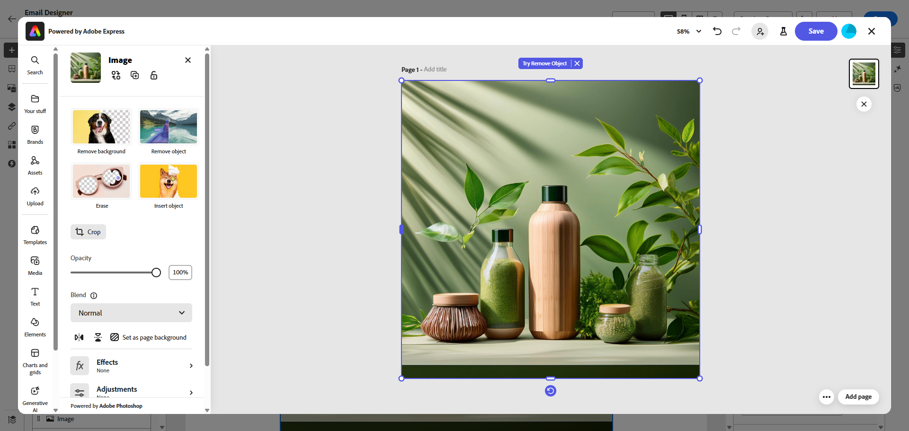

# Modificare le risorse con [!DNL Adobe Express]{#express}

>[!CONTEXTUALHELP]
>id="ajo_express_menu"
>title="Integrazione Adobe Express"
>abstract="Inizia a personalizzare le risorse con l’integrazione di Adobe Express. Questa funzione consente di ridimensionare le immagini, rimuovere gli sfondi, ritagliare gli elementi visivi e convertire le risorse in JPEG o PNG."

L’integrazione di Adobe Express in Adobe Journey Optimizer consente di accedere facilmente ai potenti strumenti di modifica di Adobe Express durante la creazione di contenuti. Questa integrazione consente di ridimensionare le immagini, rimuovere lo sfondo, ritagliare elementi visivi e convertire le risorse in JPEG o PNG senza dover passare da una soluzione all’altra.

>[!AVAILABILITY]
>
>L’integrazione di Adobe Express in Adobe Journey Optimizer non è attualmente disponibile per l’utilizzo con Healthcare Shield o Privacy and Security Shield.

Per ulteriori informazioni su Adobe Express, consulta [questa documentazione](https://helpx.adobe.com/it/express/user-guide.html).

Per accedere al menu **[!DNL Adobe Express]**, accedi alle **impostazioni immagine** da E-mail Designer e fai clic su **[!UICONTROL Modifica in Adobe Express]**.

➡️ [Scopri questa funzione nel video](#video)

## Utilizzo di Adobe Express con una licenza Enterprise {#licence}

Le funzioni descritte nelle sezioni seguenti sono accessibili agli utenti che non dispongono di una licenza Adobe Express Enterprise.

Con una licenza Enterprise, gli utenti hanno accesso completo all’editor web di Adobe Express, consentendo loro di modificare le impostazioni delle risorse, generare contenuto con Firefly, aggiungere testo e applicare ulteriori personalizzazioni.

Per ulteriori informazioni sui casi d&#39;uso disponibili per gli utenti con una licenza Enterprise per Adobe Express, consulta [Documentazione Web di Adobe Express](https://helpx.adobe.com/express/web.html).

## Utilizzo di Adobe Express senza una licenza Enterprise  {#edit}

Senza una licenza Enterprise, gli utenti possono accedere ai seguenti casi d’uso disponibili con Adobe Express:

* [Ridimensiona immagine](#resize)
* [Rimuovi sfondo](#background)
* [Ritaglia immagine](#crop-image)
* [Converti in JPEG o PNG](#convert)

### Ridimensiona immagine {#resize}

1. Dal menu Adobe Express, selezionare **[!UICONTROL Ridimensiona immagine]**.

   

1. Seleziona le **[!UICONTROL Proporzioni]** più adatte alle proporzioni della risorsa.

   

1. Utilizza il cursore per ingrandire e ritagliare la risorsa, quindi trascina per scorrere e regolare l’area visibile.

   

1. Fai clic su **[!UICONTROL Reimposta]** per ripristinare lo stato originale della risorsa.

1. Fai clic su **[!UICONTROL Applica]** una volta che il ridimensionamento dell&#39;immagine soddisfa le tue esigenze. Quindi **[!UICONTROL Salva]** la risorsa modificata.

1. Nella finestra **[!UICONTROL Carica immagine]**, fai clic su **[!UICONTROL Avanti]** e seleziona una cartella in cui memorizzare la risorsa modificata.

   Quindi fare clic su **[!UICONTROL Importa]**.

L&#39;immagine è ora pronta per essere utilizzata nel contenuto.

### Rimuovi sfondo {#background}

1. Dal menu Adobe Express, selezionare **[!UICONTROL Rimuovi sfondo]**.

   

1. La risorsa viene visualizzata automaticamente senza il relativo sfondo.

   Fai clic su **[!UICONTROL Applica]** per utilizzarlo nel contenuto.

   

1. Fai clic su **[!UICONTROL Salva]**.

1. Nella finestra **[!UICONTROL Carica immagine]**, fai clic su **[!UICONTROL Avanti]** e seleziona una cartella in cui memorizzare la risorsa modificata.

   Quindi fare clic su **[!UICONTROL Importa]**.

L&#39;immagine è ora pronta per essere utilizzata nel contenuto.

### Ritaglia immagine {#crop-image}

1. Dal menu di Adobe Express, seleziona **[!UICONTROL Ritaglia immagine]**.

   

1. Trascinate le maniglie d&#39;angolo per regolare e ritagliare l&#39;immagine come necessario.

   

1. Fai clic su **[!UICONTROL Applica]** per utilizzarlo nel contenuto. Quindi **[!UICONTROL Salva]** la risorsa modificata.

1. Nella finestra **[!UICONTROL Carica immagine]**, fai clic su **[!UICONTROL Avanti]** e seleziona una cartella in cui memorizzare la risorsa modificata.

   Quindi fare clic su **[!UICONTROL Importa]**.

L&#39;immagine è ora pronta per essere utilizzata nel contenuto.

### Converti in JPEG o PNG {#convert}

1. Dal menu Adobe Express, seleziona **[!UICONTROL Converti in JPEG]** o **[!UICONTROL Converti in PNG]** a seconda del formato originale dell&#39;immagine.

   

1. Fai clic su **[!UICONTROL Applica]** per avviare la conversione.

   

1. Fai clic su **[!UICONTROL Salva]**.

1. Con la modifica del formato, puoi salvarla come nuova immagine con un nome diverso. Aggiorna **[!UICONTROL Name]** e fai clic su **[!UICONTROL Save]**.

   

1. Nella finestra **[!UICONTROL Carica immagine]**, fai clic su **[!UICONTROL Avanti]** e seleziona una cartella in cui memorizzare la risorsa modificata.

   Quindi fare clic su **[!UICONTROL Importa]**.

L&#39;immagine è ora pronta per essere utilizzata nel contenuto.

## Video dimostrativo {#video}

Scopri come modificare le risorse in Adobe Journey Optimizer utilizzando gli strumenti di Adobe Express.

>[!VIDEO](https://video.tv.adobe.com/v/3455523/?quality=12)

