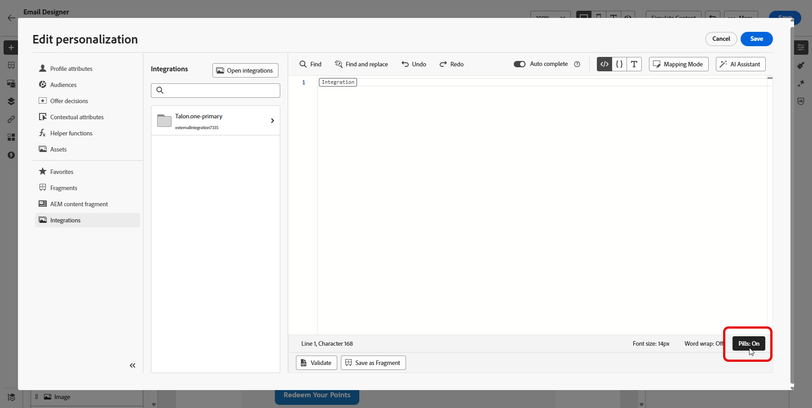
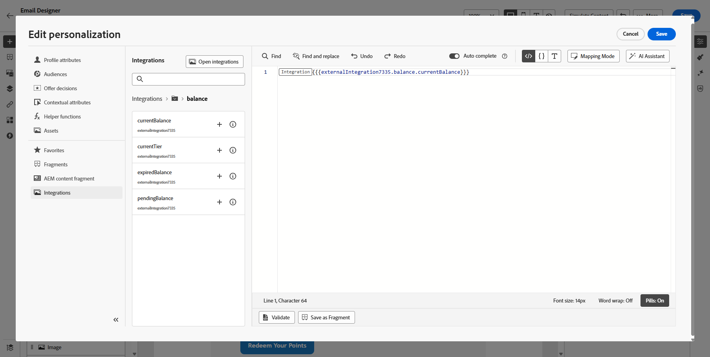

# Utilizzare le integrazioni {#external-sources}

## Panoramica

La funzionalità **Integrazioni** consente l&#39;integrazione diretta di origini dati di terze parti in Adobe Journey Optimizer. Questa funzione semplifica l’integrazione di dati esterni e origini di contenuto nelle campagne, consentendoti di fornire messaggi altamente personalizzati e dinamici su più canali.

Puoi utilizzare questa funzione per accedere a dati esterni e richiamare contenuti da strumenti di terze parti, ad esempio:

* **Punti premio** da sistemi fedeltà.
* **Informazioni sul prezzo** per i prodotti.
* **Consigli di prodotto** da motori di consigli.
* **Aggiornamenti logistici** come stato di consegna.

## Limitazioni della versione Beta {#limitations}

La versione beta presenta le seguenti limitazioni:

* I canali in uscita sono supportati solo.

* Per le risposte alle chiamate API è supportato solo il formato JSON. Le uscite di immagine HTML e raw binarie non sono disponibili.

* Sono supportate solo le API di recupero che hanno come target contenuti specifici; le API di elenco non sono disponibili.

* La funzione Integrazioni è disponibile sia per i Percorsi che per le campagne, ma non è supportata nei frammenti.

## Configurare l’integrazione {#configure}

In qualità di amministratore, puoi impostare integrazioni esterne seguendo questi passaggi:

1. Passa alla sezione **[!UICONTROL Configurazioni]** nel menu a sinistra e fai clic su **[!UICONTROL Gestisci]** dalla scheda **[!UICONTROL Integrazioni]**.

   Quindi, fai clic su **[!UICONTROL Crea integrazione]** per avviare una nuova configurazione.

   

1. Fornisci **[!UICONTROL Nome]** e **[!UICONTROL Descrizione]** per l&#39;integrazione.

   >[!NOTE]
   >
   >Questi campi non possono contenere spazi.

1. Immettere l&#39;endpoint API **[!UICONTROL URL]**, che può includere parametri di percorso con variabili che possono essere definite utilizzando etichette e valori predefiniti.

1. Configura il **[!UICONTROL Modello percorso]** con **[!UICONTROL Nome]** e **[!UICONTROL Valore predefinito]**.

   

1. Selezionare il **[!UICONTROL metodo HTTP]** tra GET e POST.

1. Fai clic su **[!UICONTROL Aggiungi intestazione]** e/o **[!UICONTROL Aggiungi parametri di query]** in base alle esigenze per la tua integrazione. Per ogni parametro, fornisci i seguenti dettagli:

   * **[!UICONTROL Parametro]**:: identificatore univoco utilizzato internamente per fare riferimento al parametro.

   * **[!UICONTROL Nome]**: il nome effettivo del parametro come previsto dall&#39;API.

   * **[!UICONTROL Tipo]**: scegliere **Costante** per un valore fisso o **Variabile** per l&#39;input dinamico.

   * **[!UICONTROL Valore]**: immettere il valore direttamente per le costanti oppure selezionare una mappatura variabile.

   * **[!UICONTROL Obbligatorio]**: specificare se questo parametro è obbligatorio.

   

1. Scegli un **[!UICONTROL tipo di autenticazione]**:

   * **[!UICONTROL Nessuna autenticazione]**: per le API aperte che non richiedono credenziali.

   * **[!UICONTROL Chiave API]**: autentica le richieste utilizzando una chiave API statica. Immetti il **[!UICONTROL nome chiave API &#x200B;]**, **[!UICONTROL valore chiave API &#x200B;]** e specifica la **[!UICONTROL posizione]**.

   * **[!UICONTROL Autenticazione di base]**: utilizza l&#39;autenticazione di base HTTP standard. Immettere **[!UICONTROL Nome utente]** e **[!UICONTROL Password]**.

   * **[!UICONTROL OAuth 2.0]**: esegui l&#39;autenticazione utilizzando il protocollo OAuth 2.0. Fai clic sull&#39;icona  per configurare o aggiornare il **[!UICONTROL payload]**.

   

1. Imposta la **[!UICONTROL configurazione dei criteri]**, ad esempio il periodo di **[!UICONTROL timeout]** per le richieste API e scegli di abilitare la limitazione, la cache e/o un nuovo tentativo.

1. Con il campo **[!UICONTROL Payload di risposta]**, puoi decidere quali campi dell&#39;output di esempio devono essere utilizzati per la personalizzazione dei messaggi.

   Fai clic sull&#39;icona  e incolla un payload di risposta JSON di esempio per rilevare automaticamente i tipi di dati.

1. Scegli i campi da esporre per la personalizzazione e specifica i tipi di dati corrispondenti.

   

1. Utilizza **[!UICONTROL Invia connessione di prova]** per convalidare l&#39;integrazione.

   Una volta convalidata, fai clic su **[!UICONTROL Attiva]**.

## Utilizzo di integrazioni esterne per la personalizzazione {#personalization}

In qualità di addetto marketing, puoi utilizzare integrazioni configurate per personalizzare il contenuto. Segui questi passaggi:

1. Accedi al contenuto della tua campagna e fai clic su **[!UICONTROL Aggiungi personalizzazione]** dal tuo **[!UICONTROL Componenti]** di testo o HTML.

[Ulteriori informazioni sui componenti](../email/content-components.md)

   

1. Passa alla sezione **[!UICONTROL Integrazioni]** e fai clic su **[!UICONTROL Apri integrazioni]** per visualizzare tutte le integrazioni attive.

   

1. Seleziona un&#39;integrazione e fai clic su **[!UICONTROL Salva]**.

   

1. Attiva la modalità **[!UICONTROL Pillole]** per sbloccare il menu di integrazione avanzato.

   

1. Per completare la configurazione dell&#39;integrazione, definire gli attributi di integrazione specificati in precedenza durante la [configurazione](#configure).

   Puoi assegnare valori a questi attributi utilizzando valori statici, che rimangono costanti, o attributi di profilo, che estraggono informazioni in modo dinamico dai profili utente.

   

1. Una volta definiti gli attributi di integrazione, puoi utilizzare i campi di integrazione nel contenuto per la messaggistica personalizzata facendo clic sull&#39;icona .

   

1. Fai clic su **[!UICONTROL Salva]**.

La personalizzazione dell’integrazione ora viene applicata correttamente al contenuto, garantendo a ogni destinatario un’esperienza personalizzata e rilevante in base agli attributi configurati.

