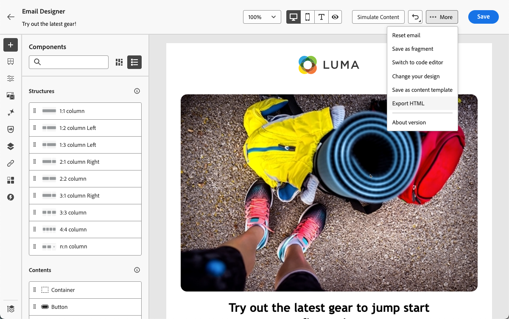

# Utilizzare GenStudio for Performance Marketing {#ajo-genstudio}

>[!CONTEXTUALHELP]
>id="ajo_genstudio_button"
>title="Utilizzare un modello creato con GenStudio"
>abstract="Grazie all’integrazione diretta con Adobe GenStudio for Performance Marketing, puoi importare facilmente un modello GenStudio ottimizzato con la tecnologia dell’intelligenza artificiale di Adobe."

## Introduzione a GenStudio {#gs-genstudio}

[Adobe GenStudio for Performance Marketing](https://experienceleague.adobe.com/it/docs/genstudio-for-performance-marketing/user-guide/home){target="_blank"} è un&#39;applicazione IA-first generativa che consente ai team di marketing di creare annunci ed e-mail personalizzati per promuovere campagne di marketing personalizzate e di forte impatto, conformi agli standard del brand e conformi ai criteri aziendali. Sfruttando la tecnologia di intelligenza artificiale Adobe, fornisce una suite completa di strumenti che semplificano le complessità della creazione e della gestione dei contenuti in modo che i creativi possano concentrarsi sull’innovazione.

>[!AVAILABILITY]
>
>* L’integrazione di GenStudio in [!DNL Adobe Journey Optimizer] attualmente non può essere utilizzata con le offerte che includono il componente aggiuntivo **Healthcare Shield** o **Privacy and Security Shield**.
>
>* Questa funzionalità è disponibile solo per il canale e-mail.

Per migliorare l&#39;efficienza del marketing e mantenere la coerenza del brand, puoi integrare perfettamente [!DNL **esperienze GenStudio for Performance Marketing**] con [!DNL **Adobe Journey Optimizer**]. Questo consente di sfruttare la creazione di contenuti basata sull&#39;intelligenza artificiale di [!DNL GenStudio] insieme alle funzionalità di orchestrazione avanzate di [!DNL Journey Optimizer].

>[!INFO]
>
>Per andare oltre, vedi questa [panoramica](https://business.adobe.com/it/products/genstudio-for-performance-marketing.html#watch-overview){target="_blank"} e una [demo](https://business.adobe.com/it/products/genstudio-for-performance-marketing.html#demo){target="_blank"} di [!DNL Adobe GenStudio for Performance Marketing].

➡️ [Scopri questa funzione nel video](#video)

## Prerequisiti {#genstudio-prerequisites}

Per utilizzare l&#39;integrazione di [!DNL GenStudio for Performance Marketing] con [!DNL Journey Optimizer], verificare che siano soddisfatti i seguenti requisiti:

* La tua organizzazione deve disporre di una licenza attiva per [!DNL GenStudio for Performance Marketing].

* Sia [!DNL GenStudio for Performance Marketing] che [!DNL Adobe Journey Optimizer] devono appartenere alla stessa organizzazione IMS.

* Per utilizzare le funzionalità di integrazione, gli utenti devono avere almeno il ruolo **Collaborator** o superiore in [!DNL GenStudio for Performance Marketing]. [Ulteriori informazioni sui ruoli utente in GenStudio](https://experienceleague.adobe.com/it/docs/genstudio-for-performance-marketing/user-guide/intro/user-roles){target="_blank"}

<!--To access the GenStudio integration in [!DNL Adobe Journey Optimizer] feature, users need to be granted the **xxx** permission. [Learn more](../administration/permissions.md)

>[!IMPORTANT]
>
>* Before starting using this capability, read out related [Guardrails and Limitations](#generative-guardrails).-->

<!--Guardrails and limitations {#genstudio-guardrails}

General guidelines for using the GenStudio integration in [!DNL Adobe Journey Optimizer] for email generation are listed below:

See if guidelines/limitations such as the ones listed [here](../content-management/gs-generative.md#generative-guardrails) for AI Assistant can apply.

The following limitations apply to GenStudio integration in [!DNL Adobe Journey Optimizer]:-->

## Sfruttare le funzionalità di GenStudio in Journey Optimizer {#use-genstudio}

L&#39;integrazione di [!DNL GenStudio for Performance Marketing] e [!DNL Journey Optimizer] consente agli addetti al marketing della tua azienda di collaborare meglio per semplificare i processi.

Ad esempio, un esperto di marketing tecnico, che utilizza [!DNL Journey Optimizer] per sviluppare e automatizzare campagne e-mail, può collaborare con un esperto di marketing delle prestazioni che crea contenuti utilizzando [!DNL GenStudio].

Con questa integrazione, entrambi possono collaborare per integrare facilmente i contenuti del brand da [!DNL GenStudio] a [!DNL Journey Optimizer], distribuendo e-mail coinvolgenti che mirano a segmenti di clienti specifici e stimolano le vendite.

### Funzionalità principali {#genstudio-capabilities}

Questa integrazione sfrutta funzionalità avanzate per la tua organizzazione di marketing:

* **Generazione di contenuti basata sull&#39;intelligenza artificiale**: sfrutta l&#39;intelligenza artificiale generativa di Adobe per creare in modo efficiente più varianti di e-mail nel brand, con suggerimenti di copie intelligenti ed elementi di progettazione.

* **Integrazione perfetta del flusso di lavoro**: esporta i modelli e-mail di Journey Optimizer in GenStudio, crea varianti con prompt AI e importali di nuovo in Journey Optimizer in un processo semplificato.

* **Gestione centralizzata delle risorse**: accedi a ContentHub di GenStudio, basato su Adobe Experience Manager Assets, per organizzare, archiviare e recuperare tutte le risorse digitali in un&#39;unica posizione centralizzata.

* **Sperimentazione dei contenuti**: importa più varianti di e-mail GenStudio in Journey Optimizer e sfrutta le funzionalità di sperimentazione per testare e identificare il contenuto con le prestazioni migliori.

* **Informazioni basate sulle prestazioni**: tieni traccia delle prestazioni delle campagne con analisi basate sull&#39;intelligenza artificiale per capire quali elementi creativi risuonano con il tuo pubblico e ottimizzare le campagne future.

### Casi d’uso comuni {#genstudio-use-cases}

Integrazione tra [!DNL GenStudio for Performance Marketing] e 
Journey Optimizer&rbrack; supporta vari scenari di marketing:

* **Campagne di lancio del prodotto**: genera rapidamente più varianti di e-mail per gli annunci di prodotti, testale con diversi segmenti di pubblico e ridimensiona la versione vincente in tutta la tua base di clienti.

* **Promozioni per le vacanze e stagionali**: crea contenuti per campagne sensibili al tempo su larga scala utilizzando i modelli di GenStudio, garantendo la coerenza del brand e rispettando scadenze ravvicinate.

* **Test A/B su scala**: crea numerose varianti di contenuto in GenStudio e testale sistematicamente in Journey Optimizer per migliorare continuamente le prestazioni delle e-mail.

* **Personalizzazione multisegmento**: genera contenuti personalizzati per diversi utenti tipo in GenStudio, quindi distribuisci ogni variante nel relativo segmento corrispondente in Journey Optimizer per la massima rilevanza.

## Utilizzare l’integrazione con GenStudio {#how-to-use}

Il flusso di lavoro di integrazione è costituito da due passaggi principali: esportare un modello da Journey Optimizer a GenStudio e importare nuovamente le esperienze GenStudio in Journey Optimizer.

### Esportare un modello di HTML da Journey Optimizer a GenStudio {#export-from-ajo-to-genstudio}

Per iniziare, esporta in [!DNL Journey Optimizer] un modello di HTML [!DNL GenStudio for Performance Marketing] contenente le linee guida del tuo marchio. Segui i passaggi seguenti.

1. In [!DNL Journey Optimizer], accedi al contenuto dell&#39;e-mail in un percorso o in una campagna. [Scopri come](../email/get-started-email-design.md#key-steps)

1. In E-mail Designer, seleziona **[!UICONTROL Esporta HTML]** dal pulsante **[!UICONTROL Altro]**.

   {zoomable="yes"}

1. Carica questo modello esportato da HTML in [!DNL GenStudio for Performance Marketing]. <!--Make sure you detect the fields that the generative AI uses to insert content in order to create an actionable template.-->

   >[!NOTE]
   >
   >Scopri come caricare un modello di HTML in [!DNL GenStudio] nella sezione dedicata della [Guida utente di Adobe GenStudio for Performance Marketing](https://experienceleague.adobe.com/it/docs/genstudio-for-performance-marketing/user-guide/content/templates/use-templates#templates-from-ajo-and-marketo){target="_blank"}.

1. In GenStudio, utilizza questo modello per creare diverse varianti di e-mail con prompt di IA e salvarle.

   >[!NOTE]
   >
   >Scopri come creare esperienze e-mail nella [sezione](https://experienceleague.adobe.com/it/docs/genstudio-for-performance-marketing/user-guide/create/create-email-experience){target="_blank"} dedicata a GenStudio.

### Sfruttare le esperienze GenStudio in Journey Optimizer {#leverage-genstudio-experiences}

Dopo aver creato le varianti e-mail in GenStudio, importale di nuovo in [!DNL Journey Optimizer] per utilizzarle nelle campagne. Segui i passaggi seguenti.

1. In [!DNL Journey Optimizer], [aggiungi un&#39;e-mail](../email/create-email.md) a una campagna.

1. Dalla schermata di configurazione della campagna, passa alla [schermata Modifica contenuto](../email/create-email.md#define-email-content) e fai clic su **[!UICONTROL Modifica corpo dell&#39;e-mail]** per aprire E-mail Designer. [Scopri come](../email/get-started-email-design.md#key-steps)

1. Nella home page di E-mail Designer, seleziona **[!UICONTROL Importa HTML]** e fai clic sul pulsante **[!UICONTROL Adobe GenStudio for Performance Marketing]**.

   {zoomable="yes"}

1. Sfoglia le esperienze GenStudio per iniziare a creare i contenuti. Puoi filtrare le esperienze in base a diversi criteri, ad esempio prodotti, utenti tipo, marchi o persino colori.

   <!--{zoomable="yes"}-->

1. Seleziona un&#39;esperienza e fai clic su **[!UICONTROL Usa]**.

   {zoomable="yes"}

1. Seleziona la cartella in cui desideri importare l’esperienza GenStudio.

   {zoomable="yes"}

1. Il contenuto selezionato viene visualizzato in E-mail Designer.

   {zoomable="yes"}

   >[!NOTE]
   >
   >Le esperienze GenStudio [create da un [!DNL Journey Optimizer] modello](#export-from-ajo-to-genstudio) vengono importate direttamente nel Designer e-mail con funzionalità di modifica complete. Le esperienze GenStudio create senza un modello [!DNL Journey Optimizer] vengono importate in [modalità di compatibilità](../email/existing-content.md), che potrebbe avere funzionalità di modifica limitate.

1. Utilizza gli [strumenti di modifica del contenuto e-mail](../email/content-from-scratch.md) e i [campi di personalizzazione](../personalization/personalize.md) per modificare l&#39;e-mail in base alle esigenze. Salva il contenuto.

1. Torna alla pagina di riepilogo della campagna e fai clic su **[!UICONTROL Crea esperimento]** per utilizzare la sperimentazione. [Scopri come creare un esperimento sui contenuti](../content-management/content-experiment.md)

   <!--{zoomable="yes"}-->

1. Crea diversi trattamenti e ripeti i passaggi precedenti per importare e sfruttare rapidamente le altre varianti di esperienza e-mail create in [!DNL GenStudio].

   {zoomable="yes"}

1. Salva le modifiche e [attiva](../campaigns/review-activate-campaign.md) la campagna.

1. Dopo aver eseguito l&#39;esperimento, tieni traccia delle prestazioni dei trattamenti della campagna con il [rapporto sulla campagna di sperimentazione](../reports/campaign-global-report-cja-experimentation.md). Puoi quindi interpretare i risultati dell’esperimento. [Scopri come](../content-management/get-started-experiment.md#interpret-results)

## Domande frequenti {#genstudio-faq}

Risposte alle domande frequenti sull&#39;integrazione di [!DNL GenStudio for Performance Marketing] con [!DNL Journey Optimizer].

+++Posso utilizzare l’integrazione GenStudio per canali diversi dall’e-mail?

Attualmente, l&#39;integrazione di [!DNL GenStudio for Performance Marketing] è disponibile solo per il canale e-mail. Il supporto per canali aggiuntivi potrebbe essere aggiunto nelle versioni future.
+++

+++L&#39;integrazione GenStudio è disponibile per tutti i clienti Journey Optimizer?

L&#39;integrazione non è attualmente disponibile per le organizzazioni che utilizzano le offerte aggiuntive **Healthcare Shield** o **Privacy and Security Shield**.
+++

+++Posso modificare il contenuto di GenStudio dopo averlo importato in Journey Optimizer?

Sì, dopo aver importato le esperienze GenStudio in [!DNL Journey Optimizer], puoi utilizzare gli [strumenti di modifica del contenuto](../email/content-from-scratch.md) di E-mail Designer e aggiungere [campi di personalizzazione](../personalization/personalize.md) per personalizzare ulteriormente il contenuto delle e-mail.
+++

+++Cosa succede alle esperienze GenStudio create senza un modello Journey Optimizer?

Le esperienze GenStudio create da un modello [!DNL Journey Optimizer] vengono importate direttamente nel Designer di posta elettronica. Le esperienze GenStudio create senza un modello [!DNL Journey Optimizer] vengono importate in [modalità di compatibilità](../email/existing-content.md).
+++

+++Posso testare più varianti di e-mail GenStudio in Journey Optimizer?

Sì, puoi creare diversi trattamenti per contenuti importando diverse varianti di e-mail GenStudio e utilizzando la funzione [sperimentazione sui contenuti](../content-management/content-experiment.md) di Journey Optimizer per verificare quale variante funziona meglio con il tuo pubblico.
+++

+++In che modo GenStudio garantisce la coerenza del marchio?

GenStudio utilizza i brand check basati sull’intelligenza artificiale per garantire che tutti i contenuti generati siano conformi agli standard e alle linee guida del brand. Quando carichi modelli che includono gli elementi del brand, GenStudio applica questi standard a tutte le varianti di contenuto create all’interno della piattaforma.
+++

+++Posso collaborare con altri membri del gruppo su esperienze GenStudio?

Sì, GenStudio è progettato per la collaborazione. Più membri del team con le autorizzazioni appropriate possono collaborare per creare e perfezionare le esperienze e-mail prima di importarle in [!DNL Journey Optimizer].
+++

## Video dimostrativo {#video}

Scopri come esportare un modello e-mail da Journey Optimizer a GenStudio for Performance Marketing, creare e-mail conformi al brand utilizzando il modello in GenStudio e importarle nuovamente in Journey Optimizer con facilità.

>[!VIDEO](https://video.tv.adobe.com/v/3456057/?captions=ita&quality=12)