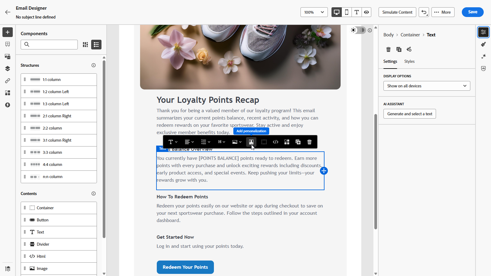
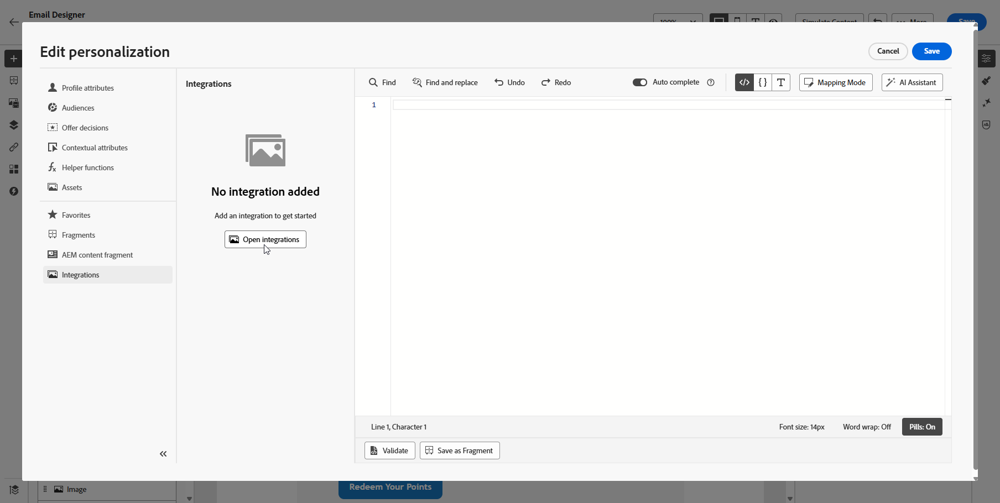
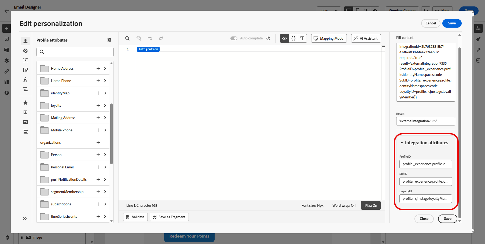

# Utilizzo di integrazioni esterne per la personalizzazione {#integrations-personalization}

Prima di utilizzare le integrazioni esterne nel contenuto, verificare che un amministratore abbia **configurato e attivato** ogni integrazione (endpoint, autenticazione, criteri, payload di risposta e attivazione) come descritto in [Operazioni con le integrazioni](integrations.md).

Puoi aggiungere fino a **3** integrazioni per **[!UICONTROL Frammento]** e fino a **5** nel messaggio. Le integrazioni provenienti solo da frammenti non vengono conteggiate per **5**.

## Applicare la personalizzazione dell’integrazione al contenuto {#apply-integration-personalization}

In qualità di addetto marketing, puoi utilizzare integrazioni configurate per personalizzare il contenuto. Segui questi passaggi:

1. Accedi al contenuto della tua campagna e fai clic su **[!UICONTROL Aggiungi personalizzazione]** dal tuo **[!UICONTROL Componenti]** di testo o HTML.

   [Ulteriori informazioni sui componenti](../email/content-components.md)

   

1. Passa alla sezione **[!UICONTROL Integrazioni]** e fai clic su **[!UICONTROL Apri integrazioni]** per visualizzare tutte le integrazioni attive.

   I **frammenti di Journey Optimizer** sono disponibili con le integrazioni ma supportano solo i canali in uscita. Dopo la pubblicazione di un frammento, l’aggiunta e il salvataggio di nuove integrazioni viene disattivato per evitare un impatto sui percorsi e sulle campagne esistenti.

   

1. Seleziona un&#39;integrazione e fai clic su **[!UICONTROL Salva]**.

   

1. Attiva la modalità **[!UICONTROL Pillole]** per sbloccare il menu di integrazione avanzato.

   

1. Quando si crea la personalizzazione dell&#39;integrazione, l&#39;helper integrazioni include un campo **`required`** che definisce il modo in cui gli errori o i dati mancanti interagiscono con il contenuto predefinito:

   * **`required=true`** (impostazione predefinita): il rendering viene interrotto per il messaggio. L&#39;invio è escluso con **`ExternalDataLookupExclusion`** e tale esclusione è registrata nel **set di dati di feedback del messaggio**.
   * **`required=false`**: la variabile dei risultati è impostata su **`null`** e il rendering continua. Utilizza testo predefinito, fallback o logica condizionale nel modello, in modo che i profili non ricevano contenuto vuoto quando l’integrazione non restituisce dati.

     

1. Per completare la configurazione dell&#39;integrazione, definire gli attributi di integrazione specificati in precedenza durante la [configurazione](integrations.md#configure).

   Puoi assegnare valori a questi attributi utilizzando valori statici, che rimangono costanti, o attributi di profilo, che estraggono informazioni in modo dinamico dai profili utente.

   

1. Una volta definiti gli attributi di integrazione, puoi utilizzare i campi di integrazione nel contenuto per la messaggistica personalizzata facendo clic sull&#39;icona .

   

   >[!NOTE]
   >
   >I token nel modello devono utilizzare solo i campi esposti dall&#39;amministratore nella configurazione dell&#39;integrazione. Ad esempio, `{{weatherResponse.temperature}}` è valido quando `temperature` è esposto; `{{weatherResponse.humidity}}` è rifiutato nell&#39;editor se `humidity` non è stato esposto.

1. Fai clic su **[!UICONTROL Salva]**.

La personalizzazione dell’integrazione ora viene applicata correttamente al contenuto, garantendo a ogni destinatario un’esperienza personalizzata e rilevante in base agli attributi configurati.

## Mappare una chiamata API su un’altra {#map-integration-chain}

Puoi concatenare le integrazioni in modo che i risultati di una chiamata vengano inseriti nel successivo, ad esempio segmenti di percorso, intestazioni o parametri di query. Le chiamate vengono eseguite in ordine nello stesso messaggio, che supporta una personalizzazione più ricca senza codice personalizzato.

Prima di iniziare, assicurati che:

* Un amministratore ha configurato e attivato ogni integrazione necessaria. Consulta [Configurare l&#39;integrazione](integrations.md).
* I segnaposto per percorsi variabili, le intestazioni e i parametri di query sono impostati nella configurazione dell’integrazione con etichette per gli addetti al marketing.
* L&#39;amministratore ha esposto i campi di risposta necessari nel payload **[!UICONTROL Risposta]** di ogni integrazione, in modo che vengano visualizzati durante l&#39;authoring.

L’esempio seguente utilizza un’integrazione di prenotazione che restituisce un numero di volo dalla prenotazione del profilo, quindi un’integrazione di informazioni di volo che utilizza tale numero per lo stato live (ritardi, destinazione). Mappa gli input della seconda integrazione alla risposta della prima chiamata.

1. Apri il messaggio o il frammento e apri l’editor di personalizzazione.

   

1. In **[!UICONTROL Integrazioni]**, fai clic su **[!UICONTROL Apri integrazioni]**.

   

1. Aggiungi l’integrazione la cui risposta alimenta la chiamata successiva, ad esempio i dati di prenotazione o prenotazione che includono l’identificatore del volo.

   

1. (Facoltativo) Aprire il menu della funzione **[!UICONTROL Helper]** e aggiungere un helper, ad esempio la funzione `Let`, se si desidera associare una variabile denominata alla risposta della prenotazione.

   >[!NOTE]
   >
   > Sono disponibili solo i campi esposti nel payload **[!UICONTROL Risposta]** definito dall&#39;amministratore. Non è possibile fare riferimento a proprietà non esposte nella configurazione.

1. Se utilizzi una variabile helper, mappa tale variabile sul campo restituito dall’integrazione della prenotazione per l’uso a valle, ad esempio il numero del volo nel payload del passeggero o della prenotazione.

   

1. Dal menu **[!UICONTROL Apri integrazioni]**, aggiungi la seconda integrazione, ad esempio lo stato del volo.

   

1. Nella seconda integrazione, apri **[!UICONTROL Attributi di integrazione]**. Per ogni input che deve riutilizzare i dati della prima chiamata, ad esempio una variabile di percorso, un’intestazione o un parametro di query, seleziona un’origine di mappatura dalla prima risposta di integrazione.

   Nell&#39;esperienza **[!UICONTROL Pills]**, puoi mappare l&#39;output della prima chiamata direttamente all&#39;input della seconda chiamata senza un&#39;istruzione `Let`. Se hai utilizzato `Let`, puoi eseguire il mapping attraverso tale variabile.

   

1. Inserisci i token della seconda integrazione nel contenuto con il controllo , ad esempio la destinazione dalla risposta di informazioni sul volo.

   

1. Salva il contenuto.

In **[!UICONTROL Simulazione]** o invio, Journey Optimizer esegue le integrazioni in ordine: la prima chiamata utilizza il contesto del profilo configurato e il risultato genera la seconda richiesta. Se una determinata integrazione viene eseguita al momento della simulazione o dell’invio dipende dalla configurazione e dal canale.

## Video introduttivo {#video}

Questo video mostra come le **Integrazioni** collegano Adobe Journey Optimizer alle API esterne in modo da poter richiamare dati e contenuti live in **canali in uscita**, e-mail, SMS e push, per una personalizzazione più rilevante.

>[!VIDEO](https://video.tv.adobe.com/v/3484118/?learn=on)
