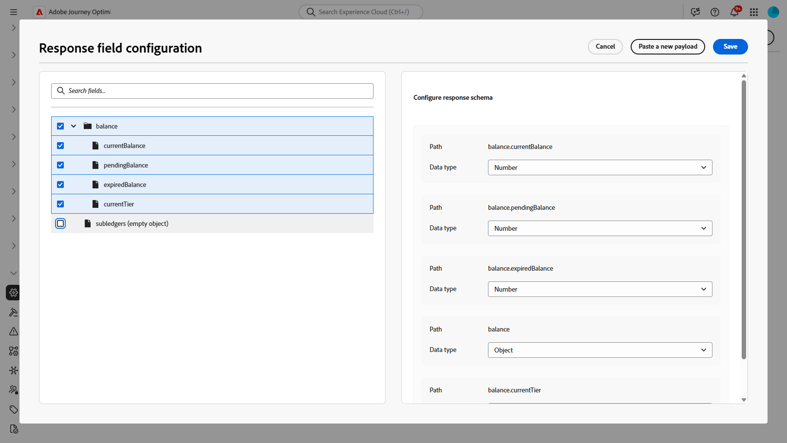

# Utilizzare le integrazioni {#external-sources}

>[!BEGINSHADEBOX]

**In questa pagina:** scopri come gli amministratori configurano, testano e attivano integrazioni esterne che collegano Adobe Journey Optimizer alle API di terze parti per contenuti personalizzati e dinamici nei canali in uscita.

>[!ENDSHADEBOX]

## Panoramica

La funzionalità **Integrazioni** collega Adobe Journey Optimizer a sistemi di terze parti i cui dati e contenuti componibili sono già gestiti altrove. Puoi far emergere tale materiale durante l’authoring e l’invio, il che supporta esperienze più reattive e personalizzate tra i canali utilizzati in Journey Optimizer.

Puoi utilizzare questa funzione per accedere a dati esterni e richiamare contenuti da strumenti di terze parti, ad esempio:

* **Punti premio** da sistemi fedeltà.
* **Informazioni sul prezzo** per i prodotti.
* **Consigli di prodotto** da motori di consigli.
* **Aggiornamenti logistici** come stato di consegna.

Per iniziare a utilizzare le integrazioni, è necessario concedere agli utenti le autorizzazioni **[!UICONTROL Gestisci configurazione integrazione AJO]** e **[!UICONTROL Visualizza configurazione integrazione AJO]**. [Ulteriori informazioni sulle autorizzazioni](../administration/permissions.md)

+++ Scopri come assegnare le autorizzazioni correlate alle integrazioni

1. Nel prodotto **[!UICONTROL Autorizzazioni]**, passa alla scheda **[!UICONTROL Ruoli]** e seleziona il **[!UICONTROL Ruolo]** desiderato.

1. Fai clic su **[!UICONTROL Modifica]** per modificare le autorizzazioni.

1. Aggiungi la risorsa **[!UICONTROL Configurazione integrazione AJO]**, quindi seleziona le autorizzazioni di integrazione appropriate dal menu a discesa.

   

1. Fai clic su **[!UICONTROL Salva]** per applicare le modifiche.

   Le autorizzazioni degli utenti già assegnati a questo ruolo verranno aggiornate automaticamente.

1. Per assegnare questo ruolo a nuovi utenti, passa alla scheda **[!UICONTROL Utenti]** nella dashboard **[!UICONTROL Ruoli]** e fai clic su **[!UICONTROL Aggiungi utente]**.

1. Immetti il nome o l’indirizzo e-mail dell’utente o sceglilo dall’elenco e fai clic su **[!UICONTROL Salva]**.

Se l’utente non è già stato creato in precedenza, consulta [questa documentazione](https://experienceleague.adobe.com/it/docs/experience-platform/access-control/abac/permissions-ui/users).

+++

## Configurare l’integrazione {#configure}

>[!AVAILABILITY]
>
> Questa funzione di integrazione è limitata ai canali in uscita (e-mail, SMS e push) e supporta il pull di JSON o HTML.

In qualità di amministratore, puoi impostare integrazioni esterne seguendo questi passaggi:

1. Passa alla sezione **[!UICONTROL Configurazioni]** nel menu a sinistra e fai clic su **[!UICONTROL Gestisci]** dalla scheda **[!UICONTROL Integrazioni]**.

   Quindi, fai clic su **[!UICONTROL Crea integrazione]** per avviare una nuova configurazione.

   

1. Facoltativamente, incolla un comando **cURL** per compilare automaticamente l&#39;URL, il metodo HTTP, le intestazioni e i parametri di query.

1. Fornisci **[!UICONTROL Nome]** e **[!UICONTROL Descrizione]** per l&#39;integrazione.

   >[!NOTE]
   >
   >Il campo **[!UICONTROL Name]** non può contenere spazi.

1. Immetti l&#39;endpoint API **[!UICONTROL URL]**.

   Per le variabili di percorso, racchiudi un&#39;etichetta tra parentesi graffe nell&#39;URL, ad esempio `https://api.example.com/v1/products/{{productId}}`, quindi imposta ogni segnaposto in **[!UICONTROL Modello di percorso]**.

1. Configura il **[!UICONTROL Modello percorso]** con **[!UICONTROL Nome]** e **[!UICONTROL Valore predefinito]** per ogni segnaposto aggiunto nell&#39;URL.

   **[!UICONTROL Name]** è un&#39;etichetta rivolta agli addetti al marketing solo nell&#39;editor e non viene inviata nella richiesta API.

   

1. Selezionare il **[!UICONTROL metodo HTTP]** tra GET e POST.

1. Fai clic su **[!UICONTROL Aggiungi intestazione]** e/o **[!UICONTROL Aggiungi parametri di query]** in base alle esigenze per la tua integrazione. Per ogni parametro, fornisci i seguenti dettagli:

   * **[!UICONTROL Parametro]**: il nome effettivo del parametro di intestazione o query previsto dall&#39;API.

   * **[!UICONTROL Nome]**: etichetta intuitiva per questo parametro. Gli autori lo selezionano durante la mappatura dei valori nelle campagne.

   * **[!UICONTROL Tipo]**: scegliere **Costante** per un valore fisso o **Variabile** per l&#39;input dinamico.

   * **[!UICONTROL Valore]**: immettere il valore direttamente per le costanti oppure selezionare una mappatura variabile.

   * **[!UICONTROL Obbligatorio]**: specificare se questo parametro è obbligatorio. Per i parametri **[!UICONTROL Variable]** obbligatori, se non viene risolto alcun valore in fase di esecuzione e non viene fornito alcun valore predefinito, la generazione della richiesta non riesce e viene generato un errore e la chiamata API in uscita non viene effettuata.

   

1. Scegli un **[!UICONTROL tipo di autenticazione]**:

   * **[!UICONTROL Nessuna autenticazione]**: per le API aperte che non richiedono credenziali.

   * **[!UICONTROL Chiave API]**: autentica le richieste utilizzando una chiave API statica. Immetti il **[!UICONTROL nome chiave API &#x200B;]**, **[!UICONTROL valore chiave API &#x200B;]** e specifica la **[!UICONTROL posizione]**.

   * **[!UICONTROL Autenticazione di base]**: utilizza l&#39;autenticazione di base HTTP standard. Immettere **[!UICONTROL Nome utente]** e **[!UICONTROL Password]**.

   * **[!UICONTROL OAuth 2.0]**: esegui l&#39;autenticazione utilizzando il protocollo OAuth 2.0. Fai clic sull&#39;icona  per configurare o aggiornare il **[!UICONTROL payload]**.

   

1. Imposta la **[!UICONTROL configurazione dei criteri]**, ad esempio il periodo di **[!UICONTROL timeout]** per le richieste API e scegli di abilitare la limitazione, la cache e/o un nuovo tentativo.

   >[!NOTE]
   >
   >Con la limitazione abilitata, le percentuali supportate sono da 50 a 5000 TPS. I limiti si applicano alla **integrazione**, non a ciascun endpoint API.
   >
   >Se la riesecuzione dei tentativi è abilitata, gli altri tentativi verranno ripetuti **tre** volte per impostazione predefinita, con **200 ms**, **400 ms** e **800 ms** tra i tentativi.

1. Con il campo **[!UICONTROL Payload di risposta]**, puoi decidere quali campi dell&#39;output di esempio devono essere utilizzati per la personalizzazione dei messaggi.

   Fai clic sull&#39;icona  e incolla un payload di risposta JSON di esempio per rilevare automaticamente i tipi di dati.

1. Scegli i campi da esporre per la personalizzazione e specifica i tipi di dati corrispondenti.

   

   >[!NOTE]
   >
   >La configurazione del payload **[!UICONTROL Risposta]** definisce la risposta prevista per l&#39;authoring, incluso qualsiasi schema applicato in quel passaggio. Gli addetti al marketing possono fare riferimento solo ai campi esposti; i token per altri percorsi non superano la convalida nell’editor.

1. Utilizza **[!UICONTROL Invia connessione di prova]** per convalidare l&#39;integrazione. [Ulteriori informazioni su come verificare la connessione](#connection)

   Una volta convalidata, fai clic su **[!UICONTROL Attiva]**.

1. Accedi all’integrazione appena creata per:

   * **Aggiornamento**: modificare solo i dettagli di **Autenticazione** e la **configurazione dei criteri**. Gli aggiornamenti sono applicabili a percorsi e campagne live. Prima di salvare le modifiche, usa il menu **[!UICONTROL Esplora riferimenti]** per confermare dove viene utilizzata l&#39;integrazione.
   * **Archivio**: archiviare una configurazione di integrazione.

   

Dopo l&#39;attivazione, fare clic sull&#39;icona del  per accedere al menu **[!UICONTROL Esplora riferimenti]** e per esaminare l&#39;utilizzo di questa configurazione, inclusi i percorsi e le campagne che dipendono da essa.

### Limiti e comportamento dei tempi di invio {#configure-send-time}

Al momento dell&#39;invio, per impostazione predefinita, le risposte dall&#39;API esterna possono arrivare a **4 MB**. Qualsiasi elemento di dimensioni maggiori viene trattato come un errore di integrazione e **i nuovi tentativi non vengono tentati** quando l&#39;errore è causato dalle dimensioni della risposta.

Le chiamate rispettano la frequenza di **limitazione** configurata: Journey Optimizer pianifica i tentativi fino a tale limite anche quando il sistema esterno è inattivo o restituisce errori. Se **cache** è abilitata, solo **risposte riuscite** vengono archiviate e riutilizzate fino alla scadenza della cache **TTL** definita; le risposte non riuscite non vengono mai memorizzate nella cache.

Ogni messaggio in coda dispone anche di una finestra di validità (TTL). Se l&#39;elaborazione è in ritardo e un messaggio si trova oltre la finestra, il sistema **lo scarta** ed emette un evento **`MessageValidityExclusion`** in modo che il lavoro non aggiornato si cancelli dalla coda e le risorse rimangano disponibili.

## Verifica della connessione {#connection}

**[!UICONTROL Invia connessione di prova]** convalida l&#39;URL dell&#39;endpoint, l&#39;autenticazione e la struttura delle richieste rispetto all&#39;API di destinazione prima dell&#39;attivazione, riducendo il rischio di errori di runtime durante l&#39;elaborazione dei messaggi.

1. Una volta definiti l&#39;URL, il metodo HTTP, le intestazioni e i parametri di query, fare clic su **[!UICONTROL Invia connessione di prova]** per eseguire un test di connettività e confermare la configurazione.

1. Nella finestra di dialogo **[!UICONTROL Invia connessione di prova]**, immetti i valori predefiniti per qualsiasi segnaposto **[!UICONTROL Variabile]** nel percorso URL, nelle intestazioni e nei parametri di query.

   Tali valori sono inclusi nella richiesta di test. Journey Optimizer richiama l’endpoint e segnala se la connessione è riuscita o meno.

   

1. Se il test restituisce una risposta corretta, selezionare **[!UICONTROL Utilizza come payload di risposta]** per copiare il corpo della risposta nel campo **[!UICONTROL Payload di risposta]**. Vedere il passaggio 10 in [Configurare l&#39;integrazione](#configure), dove è possibile rilevare i tipi di dati e selezionare i campi per la personalizzazione.

   

1. Se il test non riesce, espandi il menu a discesa **[!UICONTROL Errore]** per esaminare i dettagli dell&#39;errore, aggiornare la configurazione dell&#39;integrazione in base alle esigenze ed eseguire di nuovo **[!UICONTROL Invia connessione di test]**.

   

Dopo il completamento del test, selezionare **[!UICONTROL Attiva]** nella configurazione dell&#39;integrazione. Consulta [Configurare l&#39;integrazione](#configure).

