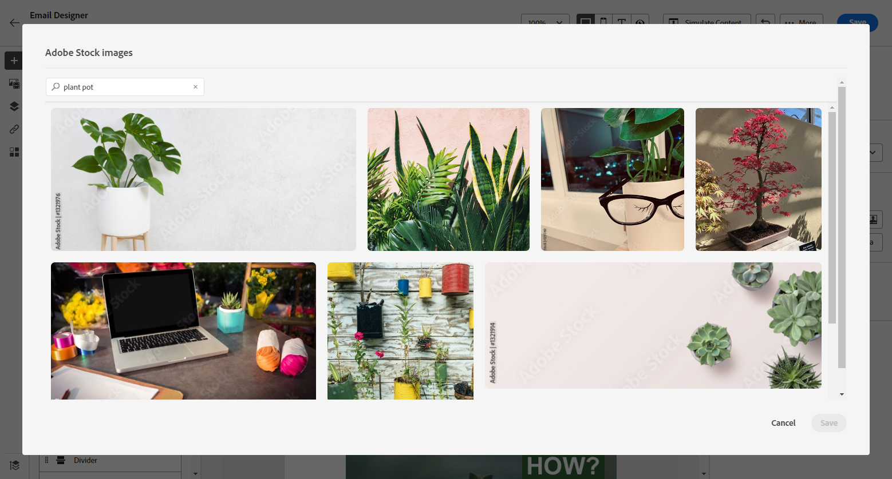
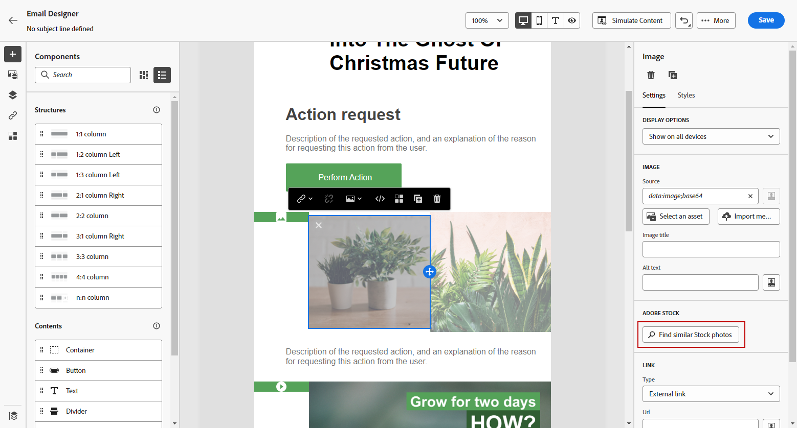
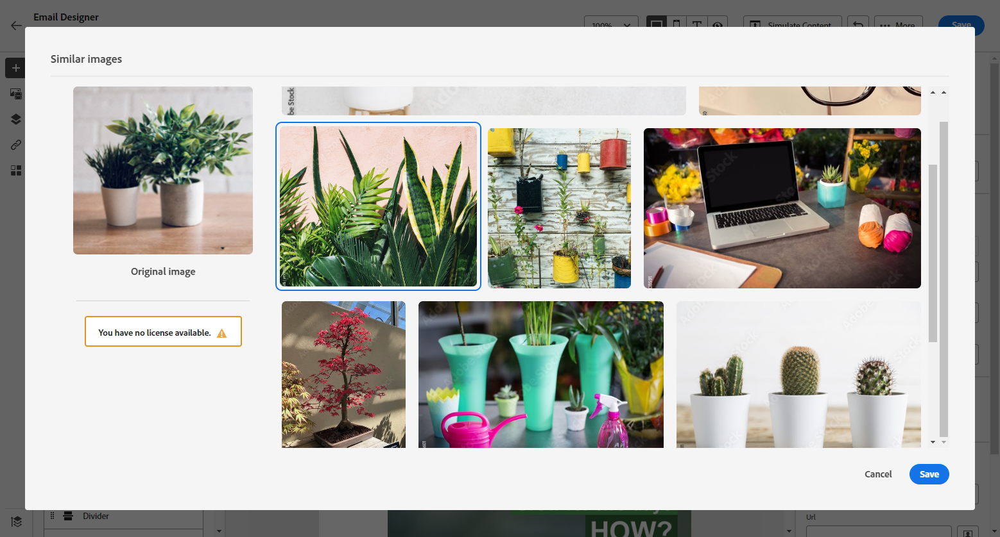

# Utilizzare [!DNL Adobe Stock] immagini {#stock}

## Introduzione a [!DNL Adobe Stock] {#get-started-stock}

Il plug-in per l’integrazione di E-mail designer di [!DNL Adobe Stock] e [!DNL Adobe Journey Optimizer] offre ai clienti un modo semplice per cercare le immagini da utilizzare nella creazione dei messaggi, acquistarne la licenza e salvarle.

[Adobe Stock](https://helpx.adobe.com/stock/get-started.html){target="_blank"} fornisce l&#39;accesso a milioni di foto, video, illustrazioni e grafica vettoriale di alta qualità, curate e gratuite. È possibile scegliere di acquistare un pacchetto di credito per concedere in licenza le risorse oppure acquistare una sola licenza Standard o Estesa per il cespite necessario. Adobe Stock fornisce anche una raccolta gratuita di risorse.

Con [!DNL Adobe Journey Optimizer], puoi caricare le immagini nelle e-mail direttamente da [!DNL Adobe Stock] e aggiungerle alla cartella **[!UICONTROL Risorse]** utilizzando l’opzione **[!UICONTROL Trova le foto di Adobe Stock]**. Inoltre, l’opzione **[!UICONTROL Trova foto Stock simili]** consente di trovare immagini che corrispondono al contenuto, al colore e alla composizione della risorsa utilizzata nella consegna.

## Autorizzazioni{#stock-permissions}

Le opzioni **[!UICONTROL Trova foto di Adobe Stock]** e **[!UICONTROL Trova immagine simile]** sono disponibili per gli utenti con accesso a un profilo di prodotto AEM Assets Essentials.

Per ulteriori informazioni, consulta [Documentazione di Experience Manager Assets](https://experienceleague.adobe.com/docs/experience-manager-assets-essentials/help/get-started-admins/deploy-administer.html#add-users-to-essentials){target="_blank"}.

## Inserisci un&#39;immagine da [!DNL Adobe Stock] {#add-stock-image}

Per aggiungere immagini da [!DNL Adobe Stock] al contenuto, eseguire la procedura seguente:

1. Dalla sezione **[!UICONTROL Componenti contenuto]** del Designer e-mail, trascina e rilascia una **Immagine**.

1. Fai clic sul pulsante **[!UICONTROL Trova foto di Adobe Stock]** sul lato sinistro di E-mail Designer.

   

1. Sfoglia la libreria o immetti un termine nel campo di ricerca.

   

1. Seleziona l&#39;immagine scelta e fai clic su **[!UICONTROL Salva]**.

   Se l&#39;immagine selezionata non dispone della licenza, è necessario [ottenere la licenza](#license-stock-image).

## Trova foto simili {#similar-stock-image}

È possibile sostituire qualsiasi immagine esistente nel contenuto dell&#39;e-mail con una foto di [!DNL Adobe Stock]. Tieni presente che questa opzione è disponibile per tutte le immagini: immagini Stock con o senza licenza e immagini dalla cartella Assets.

Per sfogliare foto simili, procedere come segue:

1. Selezionare l&#39;immagine da sostituire.
1. Fai clic sul pulsante **[!UICONTROL Trova foto Stock simili]** per visualizzare in [!DNL Adobe Stock] le risorse che corrispondono al contenuto, al colore e alla composizione dell&#39;immagine.

   

1. Seleziona l&#39;immagine scelta e fai clic su **[!UICONTROL Salva]**.

   

   Se l&#39;immagine selezionata non dispone della licenza, è necessario [ottenere la licenza](#license-stock-image).

1. Se necessario, personalizza l&#39;immagine con le schede **[!UICONTROL Impostazioni]** e **[!UICONTROL Stili]**. [Ulteriori informazioni sulle impostazioni dei componenti](../email/content-components.md).

## Ottieni la licenza da [!DNL Adobe Stock] {#license-stock-image}

Se l&#39;immagine è già concessa in licenza, viene rappresentata dall&#39;icona . In caso contrario, è necessario concedere la licenza.

Per ottenere la licenza e scaricare l&#39;immagine, effettuare le seguenti operazioni:

1. Selezionala e fai clic sull&#39;icona **[!UICONTROL Licenza immagine Adobe Stock]**.

   

   Si viene quindi reindirizzati al sito Web [!DNL Adobe Stock] per acquistare la licenza.

   

1. Per scaricare l&#39;immagine e rimuovere la filigrana, è necessario acquistare la risorsa dal sito Web [!DNL Adobe Stock].

   Questo acquisto dipende dal piano o dall’abbonamento Adobe Stock. Se disponi di più account Adobe Stock, verrai reindirizzato all’ultimo ID Stock utilizzato. In questo caso, assicurati di aver effettuato l’accesso all’account corretto prima di concedere la licenza alla risorsa.

   Per ulteriori informazioni sui piani e i prezzi di Adobe Stock, consulta la [documentazione di Adobe Stock](https://stock.adobe.com/plans){target="_blank"}.

   >[!WARNING]
   > Se viene inviata un’e-mail contenente un’immagine senza licenza, l’immagine mantiene la forma senza licenza con la filigrana.

1. Una volta completato l&#39;acquisto, puoi tornare all&#39;e-mail in [!DNL Adobe Journey Optimizer] e selezionare **[!UICONTROL Importa immagine Stock]** per importare l&#39;immagine con licenza nelle risorse.

   

1. Seleziona la cartella in cui memorizzare la risorsa. Per ulteriori informazioni su [!DNL Experience Manager Assets], fare riferimento a questa [pagina](assets.md#get-started-assets).

## Argomenti correlati{#stock-related-topics}

* [Progettazione di e-mail in Journey Optimizer](../email/get-started-email-design.md)
* [Impostazioni dei componenti per la progettazione delle e-mail](../email/content-components.md)
* [Guida introduttiva di Adobe Stock](https://helpx.adobe.com/stock/get-started.html){target="_blank"}.

