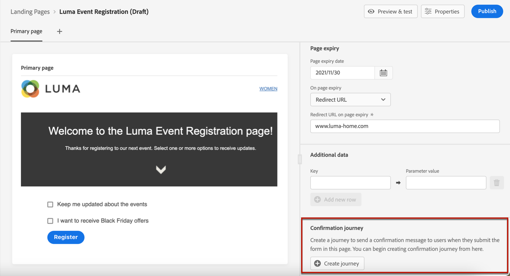
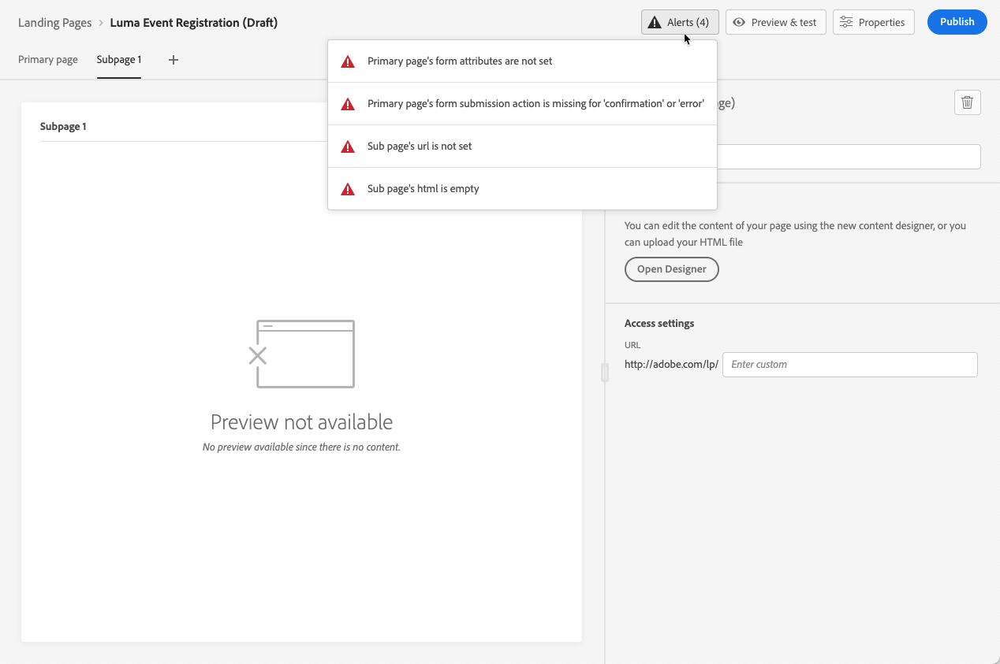

# Creare e pubblicare pagine di destinazione {#create-lp}

>[!CAUTION]
>
>L’utilizzo delle pagine di destinazione è attualmente disponibile in modalità di accesso anticipato solo per determinati utenti. Se desideri sfruttare questa funzione, contatta l’amministratore dell’account di Adobe.

## Accedere alle pagine di destinazione

Per accedere all’elenco delle pagine di destinazione, seleziona **[!UICONTROL Journey Management]** > **[!UICONTROL Landing pages]** dal menu a sinistra.

La **[!UICONTROL Landing Pages]** visualizza tutti gli elementi creati. Puoi filtrarli in base al loro stato o alla data di modifica.

## Creare una pagina di destinazione

I passaggi per creare una pagina di destinazione sono i seguenti:

1. Dall’elenco della pagina di destinazione, fai clic su **[!UICONTROL Create landing page]**.

   

1. Aggiungi un titolo. Se necessario, puoi aggiungere una descrizione.

   

1. Fai clic su **[!UICONTROL Create]**.

1. Viene visualizzata la pagina principale e le relative proprietà. Scopri come configurare le impostazioni della pagina [qui](#configure-primary-page).

   

1. Fai clic sull’icona + per aggiungere una pagina secondaria. Scopri come configurare le impostazioni [qui](#configure-subpages).

   

Una volta configurati e progettati i [pagina principale](#configure-primary-page) e [sottopagine](#configure-subpages) se presente, puoi [test](#test) e [pubblicare](#publish) la pagina di destinazione.

## Configurare la pagina principale {#configure-primary-page}

La pagina principale è quella immediatamente visualizzata dagli utenti che fanno clic sul collegamento alla pagina di destinazione, ad esempio da un’e-mail o da un sito web.

Per definire le impostazioni della pagina principale, segui la procedura seguente.

1. È possibile modificare il nome della pagina, ovvero **[!UICONTROL Primary page]** per impostazione predefinita.

1. Modifica il contenuto della pagina utilizzando la finestra di progettazione dei contenuti. Scopri come progettare il contenuto della pagina di destinazione [qui](design-lp.md).

   

1. Definisci l’URL della pagina di destinazione.

   >[!CAUTION]
   >
   >L’URL della pagina di destinazione deve essere univoco.

   

   La prima parte dell’URL è precompilata e non può essere modificata tramite l’interfaccia utente. Per configurarlo, contatta il tuo rappresentante commerciale di Adobe o il [Team di assistenza clienti Adobe](https://helpx.adobe.com/it/enterprise/admin-guide.html/enterprise/using/support-for-experience-cloud.ug.html){target=&quot;_blank&quot;}.

1. Puoi definire una data di scadenza per la pagina. In tal caso, è necessario selezionare un’azione alla scadenza della pagina:

   * **[!UICONTROL Redirect URL]**: Inserisci l’URL della pagina a cui verranno reindirizzati gli utenti alla scadenza della pagina.
   * **[!UICONTROL Custom page]**: [Configurare una pagina secondaria](#configure-subpages) e selezionalo dall’elenco a discesa visualizzato.
   * **[!UICONTROL Browser error]**: Digita il testo di errore che verrà visualizzato al posto della pagina.

   

   <!--1. In the **[!UICONTROL Additional data]** section, define a **[!UICONTROL Key]** and the corresponding **[!UICONTROL Parameter value]**. // you can define how the data entered in the landing page is managed once it has been submitted by a user??-->

1. Se hai selezionato uno o più elenchi di sottoscrizioni per la pagina principale, vengono visualizzati nella **[!UICONTROL Subscription list]** sezione .

   

1. Dalla pagina di destinazione, puoi creare direttamente un percorso che invia agli utenti un messaggio di conferma al momento dell’invio del modulo.

   

   Fai clic su **[!UICONTROL Create journey]** per iniziare [configurazione del percorso](../building-journeys/journey-gs.md#jo-build). Verrà eseguito il reindirizzamento al **[!UICONTROL Journey Management]** > **[!UICONTROL Journeys]** elenco.

## Configurare le pagine secondarie {#configure-subpages}

Puoi aggiungere tutte le pagine secondarie necessarie. Ad esempio, è possibile creare una pagina di ringraziamento che verrà visualizzata dopo l’invio del modulo da parte degli utenti. Puoi anche definire una pagina di errore che verrà chiamata quando si verifica un errore con la pagina di destinazione.

Per definire le impostazioni di una pagina secondaria, effettua le seguenti operazioni.

1. È possibile modificare il nome della pagina, ovvero **[!UICONTROL Subpage 1]** per impostazione predefinita.

1. Modifica il contenuto della pagina utilizzando la finestra di progettazione dei contenuti. Scopri come progettare il contenuto della pagina di destinazione [qui](design-lp.md).

1. Definisci l’URL della pagina di destinazione.

   La prima parte dell’URL è precompilata e non può essere modificata tramite l’interfaccia utente. Per configurarlo, contatta il tuo rappresentante commerciale di Adobe o il [Team di assistenza clienti Adobe](https://helpx.adobe.com/enterprise/admin-guide.html/enterprise/using/support-for-experience-cloud.ug.html){target=&quot;_blank&quot;}.

   >[!CAUTION]
   >
   >L’URL della pagina di destinazione deve essere univoco.

## Verificare la pagina di destinazione {#test}

Una volta definite le impostazioni e il contenuto della pagina di destinazione, puoi utilizzare i profili di test per visualizzarli in anteprima. Se hai inserito [contenuti personalizzati](../personalization/personalize.md), potrai controllare in che modo questo contenuto viene visualizzato nella pagina di destinazione, sfruttando i dati del profilo di test.

>[!CAUTION]
>
>Per visualizzare l’anteprima dei messaggi e inviare delle bozze, devi disporre dei profili di test. Scopri come creare profili di test in [questa pagina](../building-journeys/creating-test-profiles.md).

1. Nell’interfaccia della pagina di destinazione o nel designer del contenuto, fai clic sul pulsante **[!UICONTROL Preview & test]** per accedere alla selezione del profilo di test.

   

1. Seleziona uno o più profili di test.

   

   I passaggi per selezionare i profili di test sono gli stessi che per testare un messaggio. Essi sono descritti in [questa sezione](../preview.md#select-test-profiles).

1. Fai clic sul pulsante **[!UICONTROL Preview]** per verificare la pagina di destinazione.

   <!---->

1. Gli elementi personalizzati vengono sostituiti dai dati del profilo di test selezionati. Seleziona altri profili di test per visualizzare in anteprima il rendering per ogni variante della pagina di destinazione.

## Controllare gli avvisi {#alerts}

Durante la creazione della pagina di destinazione, gli avvisi ti avvisano quando è necessario eseguire azioni importanti prima della pubblicazione.

Gli avvisi vengono visualizzati in alto a destra dello schermo, come illustrato di seguito:

>[!NOTE]
>
>In caso contrario, non è stato rilevato alcun avviso.

Possono verificarsi due tipi di avvisi:

* **Avvisi** consulta consigli e best practice. <!--For example, a message will display if -->

* **Errori** impedisce la pubblicazione del messaggio fintanto che non sono stati risolti. Ad esempio, un messaggio ti avviserà che manca l’URL della pagina principale.

<!--All possible warnings and errors are detailed [below](#alerts-and-warnings).-->

>[!CAUTION]
>
> È necessario risolvere tutti **errore** avvisi prima della pubblicazione.

<!--The settings and elements checked by the system are listed below. You will also find information on how to adapt your configuration to resolve the corresponding issues.

**Warnings**:

* 

**Errors**:

* 

>[!CAUTION]
>
> To be able to publish your message, you need to resolve all **error** alerts.
-->

## Pubblicare la pagina di destinazione {#publish}

Quando la pagina di destinazione è pronta, puoi pubblicarla per renderla disponibile per l’uso in un messaggio o su un sito web.

>[!CAUTION]
>
>Prima della pubblicazione, controlla e risolvi gli avvisi. [Ulteriori informazioni](#alerts)

Una volta pubblicata, la pagina di destinazione viene aggiunta all’elenco della pagina di destinazione con la **[!UICONTROL Published]** stato.

Ora è attivo e il collegamento a esso è pronto per essere utilizzato in un [message](../create-message.md) e inviato attraverso un [percorso](../building-journeys/journey.md).
