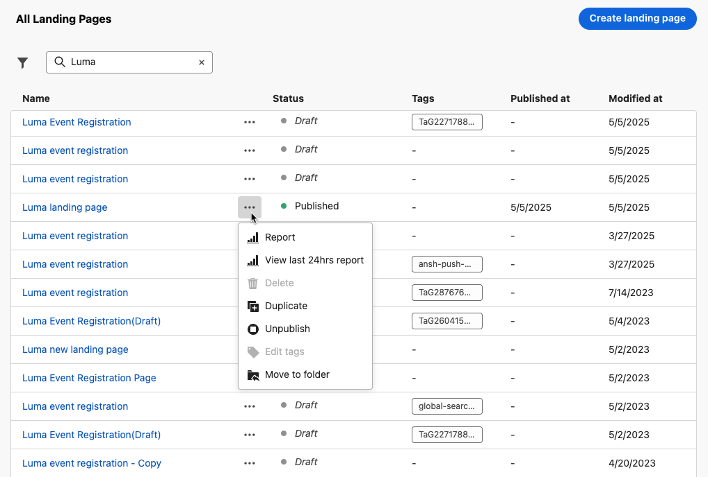

# Creare e pubblicare pagine di destinazione {#create-lp}

>[!CAUTION]
>
>Per poter testare e pubblicare le pagine di destinazione, è necessario disporre del **[!UICONTROL Pubblicare i messaggi]** autorizzazione.

Per indirizzare i clienti a una pagina web definita che desideri visualizzare quando fanno clic su un collegamento specifico, crea una pagina di destinazione in [!DNL Journey Optimizer], configura la pagina principale e le eventuali pagine secondarie, testala e pubblicala.

>[!CAUTION]
>
>Non puoi accedere alla pagina di destinazione semplicemente copiando e incollando in un browser l’URL definito quando [creazione della pagina](#create-landing-page), anche se pubblicato. È invece possibile testarlo utilizzando la funzione di anteprima come descritto in [questa sezione](#test-landing-page).

## Accedere alle pagine di destinazione {#access-landing-pages}

Per accedere all’elenco delle pagine di destinazione, seleziona **[!UICONTROL Gestione percorso]** > **[!UICONTROL Pagine di destinazione]** dal menu a sinistra.

Il **[!UICONTROL Pagine di destinazione]** mostra tutti gli elementi creati. Puoi filtrarli in base al loro stato o alla data di modifica.

Da questo elenco, è possibile accedere a [pagina di destinazione Live report](../reports/lp-report-live.md) o [pagina di destinazione Global report](../reports/lp-report-global.md) per gli elementi pubblicati.

Puoi anche eliminare, duplicare e annullare la pubblicazione di una pagina di destinazione.

>[!CAUTION]
>
>Se annulli la pubblicazione di una pagina di destinazione a cui viene fatto riferimento in un messaggio, il collegamento alla pagina di destinazione verrà interrotto e verrà visualizzata una pagina di errore.

Fai clic sui tre punti accanto a una pagina di destinazione per selezionare l’azione desiderata.

>[!NOTE]
>
>Non è possibile eliminare un [pubblicato](#publish-landing-page) pagina di destinazione. Per eliminarlo, devi prima annullarne la pubblicazione.

## Creare una pagina di destinazione {#create-landing-page}

>[!CONTEXTUALHELP]
>id="ajo_lp_create"
>title="Definire e configurare la pagina di destinazione"
>abstract="Per creare una pagina di destinazione, devi selezionare un predefinito; configurare la pagina principale e le pagine secondarie; e infine verificare la pagina prima di pubblicarla."
>additional-url="https://experienceleague.adobe.com/docs/journey-optimizer/using/landing-pages/lp-configuration/lp-presets.html?lang=it#lp-create-preset" text="Creare i predefiniti per pagine di destinazione"
>additional-url="https://experienceleague.adobe.com/docs/journey-optimizer/using/landing-pages/create-lp.html?lang=it#publish-landing-page" text="Pubblicare la pagina di destinazione"

>[!CONTEXTUALHELP]
>id="ajo_lp_access_management_labels"
>title="Assegnare etichette alla pagina di destinazione"
>abstract="Per proteggere le risorse digitali sensibili, puoi definire autorizzazioni con cui gestire l’accesso ai dati per a pagina di destinazione utilizzando specifiche etichette."
>additional-url="https://experienceleague.adobe.com/docs/journey-optimizer/using/access-control/object-based-access.html?lang=it" text="Controllo dell’accesso a livello di oggetto"

I passaggi principali per creare pagine di destinazione sono i seguenti:

1. Nell’elenco della pagina di destinazione, fai clic su **[!UICONTROL Crea pagina di destinazione]**.

   

1. Aggiungi un titolo. Se necessario, puoi aggiungere una descrizione.

   

1. Per assegnare etichette di utilizzo dei dati personalizzate o di base alla pagina di destinazione, seleziona **[!UICONTROL Gestisci accesso]**. [Ulteriori informazioni su OLAC (Object Level Access Control)](../administration/object-based-access.md)

1. Seleziona o crea tag Adobe Experience Platform da **[!UICONTROL Tag]** per categorizzare la pagina di destinazione e migliorare la ricerca. [Ulteriori informazioni](../start/search-filter-categorize.md#tags)

1. Seleziona un predefinito. Scopri come creare predefiniti per pagine di destinazione in [questa sezione](../landing-pages/lp-presets.md#lp-create-preset).

   

1. Fai clic su **[!UICONTROL Crea]**.

1. Viene visualizzata la pagina principale e le relative proprietà. Scopri come configurare le impostazioni della pagina principale [qui](#configure-primary-page).

   

1. Fai clic sull’icona + per aggiungere una pagina secondaria. Scopri come configurare le impostazioni delle pagine secondarie [qui](#configure-subpages).

   

Dopo aver configurato e progettato [pagina principale](#configure-primary-page)e [pagine secondarie](#configure-subpages) se presente, puoi [test](#test-landing-page) e [pubblicare](#publish-landing-page) la pagina di destinazione.

>[!CAUTION]
>
>Non puoi accedere alla pagina di destinazione semplicemente copiando e incollando l’URL definito in un browser web, anche se pubblicato. È invece possibile testarlo utilizzando la funzione di anteprima come descritto in [questa sezione](#test-landing-page).

## Configurare la pagina principale {#configure-primary-page}

>[!CONTEXTUALHELP]
>id="ajo_lp_primary_page"
>title="Definire le impostazioni della pagina principale"
>abstract="La pagina principale viene visualizzata immediatamente dagli utenti dopo aver fatto clic sul collegamento alla pagina di destinazione, ad esempio da un’e-mail o da un sito web."
>additional-url="https://experienceleague.adobe.com/docs/journey-optimizer/using/landing-pages/landing-pages-design/design-lp.html?lang=it" text="Progettare il contenuto della pagina di destinazione"

>[!CONTEXTUALHELP]
>id="ajo_lp_access_settings"
>title="Definire l’URL della pagina di destinazione"
>abstract="In questa sezione, definisci un URL univoco per la pagina di destinazione. Per la prima parte dell’URL, devi aver già impostato un sottodominio della pagina di destinazione come parte del predefinito selezionato."
>additional-url="https://experienceleague.adobe.com/docs/journey-optimizer/using/landing-pages/lp-configuration/lp-subdomains.html?lang=it" text="Configurare i sottodomini della pagina di destinazione"
>additional-url="https://experienceleague.adobe.com/docs/journey-optimizer/using/landing-pages/lp-configuration/lp-presets.html?lang=it#lp-create-preset" text="Creare i predefiniti per pagine di destinazione"

La pagina principale è quella che viene visualizzata immediatamente dagli utenti dopo che hanno fatto clic sul collegamento alla pagina di destinazione, ad esempio da un’e-mail o da un sito web.

Per definire le impostazioni della pagina principale, effettua le seguenti operazioni.

1. Puoi modificare il nome della pagina, che è **[!UICONTROL Pagina principale]** per impostazione predefinita.

1. Modifica il contenuto della pagina utilizzando il designer contenuto. Scopri come definire il contenuto della pagina di destinazione [qui](design-lp.md).

   

1. Definire l’URL della pagina di destinazione. La prima parte dell’URL richiede la configurazione precedente di un sottodominio della pagina di destinazione come parte del [predefinito](../landing-pages/lp-presets.md#lp-create-preset) hai selezionato. [Ulteriori informazioni](../landing-pages/lp-subdomains.md)

   >[!CAUTION]
   >
   >L’URL della pagina di destinazione deve essere univoco.
   >
   >Non puoi accedere alla pagina di destinazione semplicemente copiando e incollando questo URL in un browser web, anche se pubblicato. È invece possibile testarlo utilizzando la funzione di anteprima come descritto in [questa sezione](#test-landing-page).

   

1. Se desideri che la pagina di destinazione precarichi i dati del modulo già disponibili, seleziona la **[!UICONTROL Campi modulo precompilati con informazioni sul profilo]**.

   

   Quando questa opzione è abilitata, se un profilo ha già acconsentito o è già stato aggiunto a un elenco di abbonamenti, le sue scelte si rifletteranno sulla visualizzazione della pagina di destinazione.

   Ad esempio, se un profilo ha acconsentito alla ricezione di comunicazioni su eventi futuri, la casella di controllo corrispondente sarà già selezionata la prossima volta che la pagina di destinazione viene visualizzata su tale profilo.

   

1. Puoi definire una data di scadenza per la pagina. In tal caso, seleziona un’azione alla scadenza della pagina:

   * **[!UICONTROL URL di reindirizzamento]**: immetti l’URL della pagina a cui verranno reindirizzati gli utenti alla scadenza della pagina.
   * **[!UICONTROL Pagina personalizzata]**: [Configurare una pagina secondaria](#configure-subpages) e selezionala dall’elenco a discesa visualizzato.
   * **[!UICONTROL Errore del browser]**: digita il testo dell’errore che verrà visualizzato al posto della pagina.

   

1. In **[!UICONTROL Dati aggiuntivi]** , definisci una o più chiavi e i corrispondenti valori dei parametri. Potrai sfruttare queste chiavi nel contenuto della pagina principale e delle pagine secondarie utilizzando [Editor espressioni](../personalization/personalization-build-expressions.md). Ulteriori informazioni in [questa sezione](lp-content.md#use-form-component#use-additional-data).

   

1. Se hai selezionato uno o più elenchi di abbonamenti quando [progettazione della pagina principale](design-lp.md), vengono visualizzati nel **[!UICONTROL Elenco iscrizioni]** sezione.

   

1. Dalla pagina di destinazione, puoi [creare un percorso](../building-journeys/journey-gs.md#jo-build) che invierà un messaggio di conferma agli utenti quando invieranno il modulo. Scopri come creare un percorso di questo tipo alla fine di questo [caso d’uso](lp-use-cases.md#subscription-to-a-service).

   

   Clic **[!UICONTROL Crea percorso]** da reindirizzare al **[!UICONTROL Gestione percorso]** > **[!UICONTROL Percorsi]** elenco.

## Configurare le pagine secondarie {#configure-subpages}

>[!CONTEXTUALHELP]
>id="ajo_lp_subpage"
>title="Definire le impostazioni delle pagine secondarie"
>abstract="Puoi aggiungere fino a 2 pagine secondarie. Ad esempio, puoi creare una pagina di ringraziamento da visualizzare dopo l’invio di un modulo, e definire una pagina di errore da richiamare in caso di problemi relativi alla pagina di destinazione."
>additional-url="https://experienceleague.adobe.com/docs/journey-optimizer/using/landing-pages/landing-pages-design/design-lp.html?lang=it" text="Progettare il contenuto della pagina di destinazione"

>[!CONTEXTUALHELP]
>id="ajo_lp_access_settings-subpage"
>title="Definire l’URL della pagina di destinazione"
>abstract="In questa sezione, definisci un URL univoco per la pagina di destinazione. Per la prima parte dell’URL, devi aver già impostato un sottodominio della pagina di destinazione come parte del predefinito selezionato."
>additional-url="https://experienceleague.adobe.com/docs/journey-optimizer/using/landing-pages/lp-configuration/lp-subdomains.html?lang=it" text="Configurare i sottodomini della pagina di destinazione"
>additional-url="https://experienceleague.adobe.com/docs/journey-optimizer/using/landing-pages/lp-configuration/lp-presets.html?lang=it#lp-create-preset" text="Creare i predefiniti per pagine di destinazione"

Puoi aggiungere fino a 2 pagine secondarie. Ad esempio, puoi creare una pagina di ringraziamento da visualizzare dopo l’invio di un modulo, e definire una pagina di errore da richiamare in caso di problemi relativi alla pagina di destinazione.

Per definire le impostazioni delle pagine secondarie, effettuare le seguenti operazioni.

1. Puoi modificare il nome della pagina, che è **[!UICONTROL Pagina secondaria 1]** per impostazione predefinita.

1. Modifica il contenuto della pagina utilizzando il designer contenuto. Scopri come definire il contenuto della pagina di destinazione [qui](design-lp.md).

   >[!NOTE]
   >
   >Puoi inserire un collegamento alla pagina principale da qualsiasi pagina secondaria della stessa pagina di destinazione. Ad esempio, per reindirizzare gli utenti che hanno commesso un errore e desiderano effettuare nuovamente l’abbonamento, puoi aggiungere un collegamento dalla pagina secondaria di conferma alla pagina principale dell’abbonamento. Scopri come inserire collegamenti in [questa sezione](../email/message-tracking.md#insert-links).

1. Definire l’URL della pagina di destinazione. La prima parte dell’URL richiede la configurazione precedente di un sottodominio della pagina di destinazione. [Ulteriori informazioni](../landing-pages/lp-subdomains.md)

   >[!CAUTION]
   >
   >L’URL della pagina di destinazione deve essere univoco.
   >
   >Non puoi accedere alla pagina secondaria semplicemente copiando e incollando questo URL in un browser web, anche se pubblicato. È invece possibile testarlo utilizzando la funzione di anteprima come descritto in [questa sezione](#test-landing-page).

## Verificare la pagina di destinazione {#test-landing-page}

>[!CONTEXTUALHELP]
>id="ac_preview_lp_profiles"
>title="Visualizzare l’anteprima e testare la pagina di destinazione"
>abstract="Una volta definite le impostazioni e il contenuto della pagina di destinazione, puoi utilizzare i profili di test per visualizzarli in anteprima."
>additional-url="https://experienceleague.adobe.com/docs/journey-optimizer/using/audiences-profiles-identities/profiles/creating-test-profiles.html" text="Selezionare i profili di test"

Una volta definiti le impostazioni e il contenuto della pagina di destinazione, puoi utilizzare i profili di test per visualizzarne l’anteprima. Se è stato inserito [contenuti personalizzati](../personalization/personalize.md), potrai controllare come vengono visualizzati questi contenuti nella pagina di destinazione utilizzando i dati del profilo di test.

>[!CAUTION]
>
>Per poter testare le pagine di destinazione, è necessario disporre del **[!UICONTROL Pubblicare i messaggi]** autorizzazione.
>
>Per poter visualizzare in anteprima i messaggi e inviare le bozze, è necessario disporre di profili di test. Scopri come [creare profili di test](../audience/creating-test-profiles.md).

1. Nell’interfaccia della pagina di destinazione, fai clic su **[!UICONTROL Simula contenuto]** per accedere alla selezione del profilo di test.

   

   >[!NOTE]
   >
   >Il **[!UICONTROL Simula contenuto]** è accessibile anche dal designer del contenuto.

1. Dalla sezione **[!UICONTROL Simula]** , seleziona uno o più profili di test.

   

   I passaggi per selezionare i profili di test sono gli stessi utilizzati per testare un messaggio. Sono descritte in dettaglio [questa sezione](../email/preview.md#select-test-profiles).

1. Seleziona **[!UICONTROL Apri anteprima]** per verificare la pagina di destinazione.

   

1. L’anteprima della pagina di destinazione viene visualizzata in una nuova scheda. Gli elementi personalizzati vengono sostituiti dai dati del profilo di test selezionati.

   <!---->

1. Seleziona altri profili di test per visualizzare in anteprima il rendering per ogni variante della pagina di destinazione.

## Controllare gli avvisi {#check-alerts}

Durante la creazione della pagina di destinazione, gli avvisi ti avvisano quando devi eseguire azioni importanti prima di pubblicarla.

Gli avvisi vengono visualizzati in alto a destra dello schermo, come illustrato di seguito:

>[!NOTE]
>
>Se questo pulsante non è visualizzato, non è stato rilevato alcun avviso.

Possono verificarsi due tipi di avvisi:

* **Avvisi** consulta consigli e best practice. <!--For example, a message will display if -->

* **Errori** impedisci la pubblicazione della pagina di destinazione se non sono risolti. Ad esempio, se manca l’URL della pagina principale, verrà visualizzato un avviso.

<!--All possible warnings and errors are detailed [below](#alerts-and-warnings).-->

>[!CAUTION]
>
> È necessario risolvere tutti **errore** avvisi prima della pubblicazione.

<!--The settings and elements checked by the system are listed below. You will also find information on how to adapt your configuration to resolve the corresponding issues.

**Warnings**:

* 

**Errors**:

* 

>[!CAUTION]
>
> To be able to publish your message, you must resolve all **error** alerts.
-->

## Pubblicare la pagina di destinazione {#publish-landing-page}

>[!CAUTION]
>
>Per poter pubblicare le pagine di destinazione, devi disporre del **[!UICONTROL Pubblicare i messaggi]** autorizzazione.

Una volta che la pagina di destinazione è pronta, puoi pubblicarla per renderla disponibile per l’utilizzo in un messaggio.

>[!CAUTION]
>
>Prima di pubblicare, controlla e risolvi gli avvisi. [Ulteriori informazioni](#check-alerts)

Una volta pubblicata, la pagina di destinazione viene aggiunta all’elenco delle pagine di destinazione con **[!UICONTROL Pubblicato]** stato.

Ora è attivo e pronto per essere utilizzato in un [!DNL Journey Optimizer] messaggio che verrà inviato tramite un [percorso](../building-journeys/journey.md).

>[!NOTE]
>
>Non puoi accedere alla pagina di destinazione semplicemente copiando e incollando in un browser l’URL definito quando [creazione della pagina](#create-landing-page), anche se pubblicato. È invece possibile testarlo utilizzando la funzione di anteprima come descritto in [questa sezione](#test-landing-page).

Puoi monitorare l’impatto della pagina di destinazione tramite rapporti specifici. [Ulteriori informazioni](../reports/lp-report-live.md)
