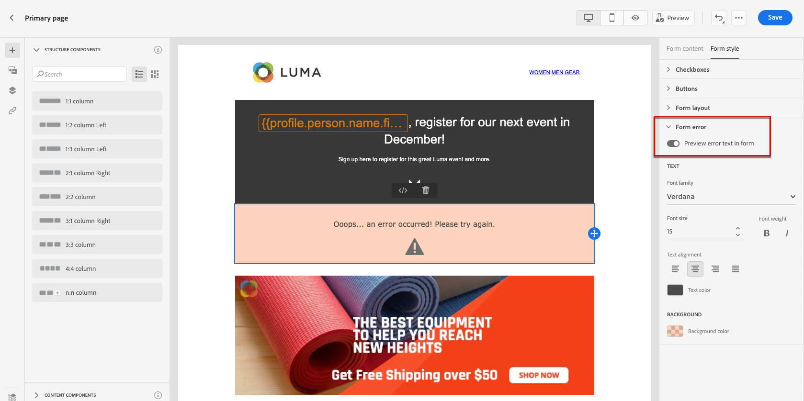

# Progettazione del contenuto della pagina di destinazione {#design-lp-content}

Per iniziare a creare contenuto dalla destinazione [pagina principale](create-lp.md#configure-primary-page) o [sottopagine](create-lp.md#configure-subpages), passa il mouse sul contenuto della pagina principale e fai clic su **[!UICONTROL Open Designer]** oppure fai clic sul pulsante corrispondente nella palette a destra.

Da qui puoi:

* **Progettare da zero la pagina di destinazione** tramite l’interfaccia del designer del contenuto e sfrutta le immagini [Adobe Experience Manager Assets Essentials](../assets-essentials.md). Scopri come progettare i contenuti o utilizzare modelli incorporati [in questa sezione](../create-email-content.md).

* **Codice o incolla di HTML raw** direttamente nella finestra di progettazione dei contenuti. Scopri come codificare i contenuti personalizzati [in questa sezione](../existing-content.md#import-raw-html-code).

* **Importare contenuto HTML esistente** da un file o da una cartella .zip. Scopri come importare il contenuto [in questa sezione](../existing-content.md#import-html-content-from-file).

>[!NOTE]
>
>La finestra di progettazione del contenuto della pagina di destinazione è simile per lo più alla finestra di progettazione e-mail. Ulteriori informazioni sulla progettazione dei contenuti con [!DNL Journey Optimizer] [qui](../design-emails.md).

Per definire il contenuto specifico della pagina di destinazione, effettua le seguenti operazioni.

1. Trascina e rilascia la pagina di destinazione specifica **[!UICONTROL Form]** dalla palette a sinistra nell’area di lavoro principale.

   

   >[!NOTE]
   >
   >La **[!UICONTROL Form]** può essere utilizzato solo una volta sulla stessa pagina.

1. Selezionala. La **[!UICONTROL Form content]** nella palette a destra viene visualizzata la scheda che consente di modificare i diversi campi del modulo.

   

1. Da **[!UICONTROL Checkbox 1]** Puoi modificare l’etichetta corrispondente a questa casella di controllo.

1. Definisci se questa casella di controllo è per consentire agli utenti di accedere o uscire: acconsentono a ricevere comunicazioni o chiedono di non essere più contattati?

   

1. Scegli cosa verrà aggiornato tra le tre opzioni seguenti:

   

   * **[!UICONTROL Subscription list]**: Seleziona l’elenco di sottoscrizioni da aggiornare se il profilo seleziona questa casella di controllo. Ulteriori informazioni sugli elenchi di abbonamenti in [questa sezione](subscription-list.md).

      

   * **[!UICONTROL Channel (email)]**: L&#39;opt-in o l&#39;opt-out si applica all&#39;intero canale. Ad esempio, se un profilo che effettua la rinuncia ha due indirizzi e-mail, entrambi gli indirizzi saranno esclusi da tutte le tue comunicazioni.

   * **[!UICONTROL Email entity]**: L’opzione di consenso o rinuncia si applica solo all’indirizzo e-mail utilizzato per accedere alla pagina di destinazione. Ad esempio, se un profilo ha due indirizzi e-mail, solo quello utilizzato per il consenso riceverà le comunicazioni dal tuo marchio.

1. Fai clic su **[!UICONTROL Add field]** > **[!UICONTROL Checkbox]** per aggiungere un’altra casella di controllo. Ripeti i passaggi precedenti per definirne le proprietà.

   

1. Fai clic su **[!UICONTROL Call to action]** per espandere la sezione corrispondente. Ti consente di definire il comportamento del pulsante nel **[!UICONTROL Form]** componente.

   

1. Definisci cosa accade quando fai clic sul pulsante :

   * **[!UICONTROL Redirect URL]**: Inserisci l’URL della pagina a cui verranno reindirizzati gli utenti.
   * **[!UICONTROL Confirmation text]**: Digita il testo di conferma che verrà visualizzato.
   * **[!UICONTROL Link to a subpage]**: Configura un [sottopagine](create-lp.md#configure-subpages) e selezionalo dall’elenco a discesa visualizzato.

   

1. Definisci cosa accade quando fai clic sul pulsante in caso di errore:

   * **[!UICONTROL Redirect URL]**: Inserisci l’URL della pagina a cui verranno reindirizzati gli utenti.
   * **[!UICONTROL Error text]**: Digitare il testo di errore che verrà visualizzato. Puoi visualizzare in anteprima il testo dell’errore selezionando la casella di controllo corrispondente.

      

   * **[!UICONTROL Link to a subpage]**: Configura un [sottopagine](create-lp.md#configure-subpages) e selezionalo dall’elenco a discesa visualizzato.

1. Se si desidera eseguire aggiornamenti aggiuntivi al momento dell’invio del modulo, selezionare **[!UICONTROL Opt in]** o **[!UICONTROL Opt out]** e definisci se desideri aggiornare un elenco di abbonamenti, il canale o solo l’indirizzo e-mail utilizzato.

   

1. Salva il contenuto e fai clic sulla freccia accanto al nome della pagina per tornare alla pagina [proprietà della pagina di destinazione](create-lp.md#configure-primary-page).

   

<!--Will the name Email Designer be kept if you can also design LP with the same tool? > To modify in Messages section > content designer or Designer-->

