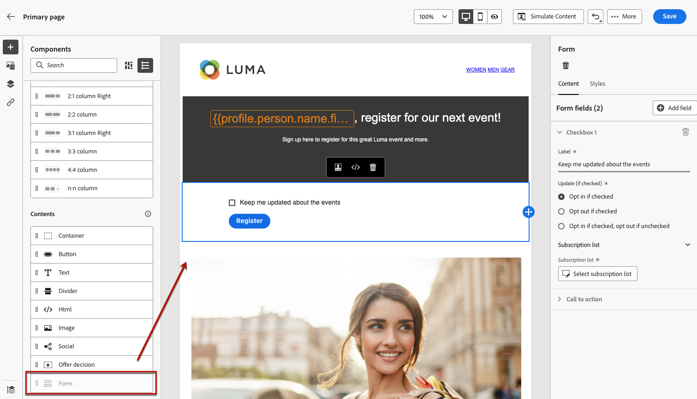
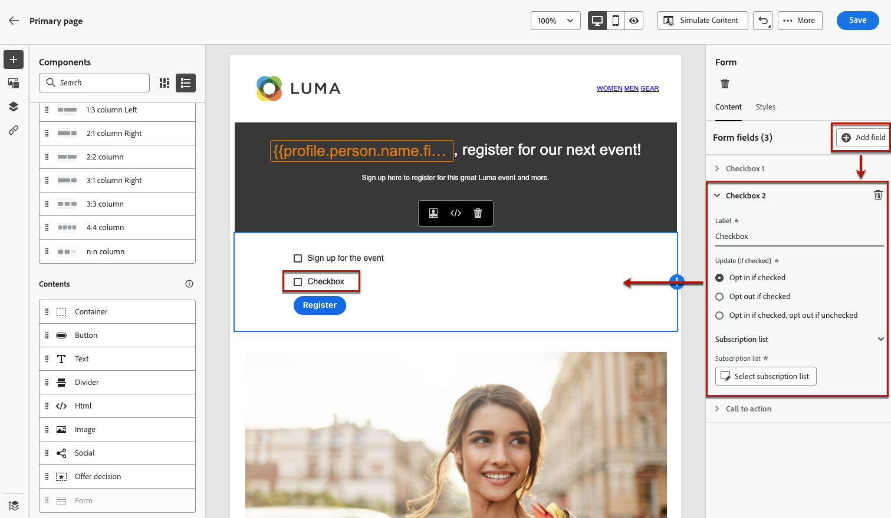

# Design the landing page content {#design-lp-content}

**[!UICONTROL Open Designer]** You can also click the corresponding button from the right palette.

From there, you can:

* **** 

* **** 

* **** 

>[!NOTE]
>
>The landing page content designer is mostly similar to the email designer. [ [!DNL Journey Optimizer]](../messages/design-emails.md)

## Define landing page-specific content {#define-lp-specific-content}

To define specific content that will enable users to select and submit their choices from your landing page, follow the steps below.

1. **[!UICONTROL Form]**

   

   >[!NOTE]
   >
   >**[!UICONTROL Form]**

1. Select it. **[!UICONTROL Form content]**

   

   >[!NOTE]
   >
   >**[!UICONTROL Form style]** [Ulteriori informazioni](#define-lp-styles)

1. **[!UICONTROL Checkbox 1]**

1. Define if this checkbox is to opt users in or out: do they agree to receive communications or do they ask not to be contacted any more?

   

1. Choose what will be updated between the three following options:

   

   * **[!UICONTROL Subscription list]** 

      

   * **[!UICONTROL Channel (email)]** For example, if a profile that opts out has two email addresses, both addresses will be excluded from all your communications.

   * **[!UICONTROL Email identity]** For example, if a profile has two email addresses, only the one that was used to opt in will receive communications from your brand.

1. **[!UICONTROL Add field]****[!UICONTROL Checkbox]** Repeat the steps above to define its properties.

   

1. **[!UICONTROL Call to action]** **[!UICONTROL Form]**

   

1. Define what will happen upon clicking the button:

   * **[!UICONTROL Redirect URL]**
   * **[!UICONTROL Confirmation text]**
   * **[!UICONTROL Link to a subpage]**

   

1. Define what will happen upon clicking the button in case an error occurs:

   * **[!UICONTROL Redirect URL]**
   * **[!UICONTROL Error text]** 

   * **[!UICONTROL Link to a subpage]**

   

1. **[!UICONTROL Opt in]****[!UICONTROL Opt out]**

   

1. 

   

<!--Will the name Email Designer be kept if you can also design LP with the same tool? > To modify in Messages section > content designer or Designer-->

## Define landing page form styles {#define-lp-styles}

1. **[!UICONTROL Form style]**

   

1. **[!UICONTROL Checkboxes]** For example, you can adjust the font family or size, and the checkbox border color.

   

1. **[!UICONTROL Buttons]** For example, you can add a border, edit the label color on hover, or adjust the alignement of the button.

   

   **[!UICONTROL Preview]** 

   

1. **[!UICONTROL Form layout]**

   

1. **[!UICONTROL Form error]** Check the corresponing option to preview the error text on the form.

   

