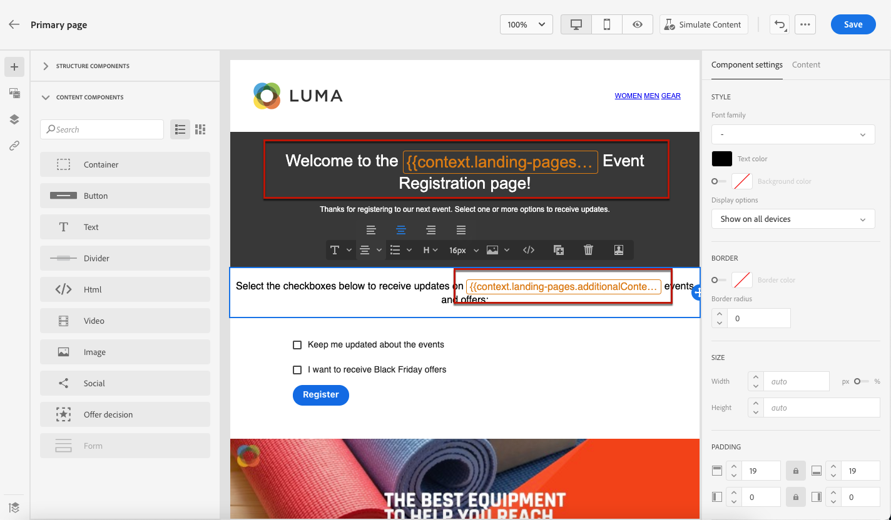

# Definire il contenuto specifico della pagina di destinazione {#lp-content}

>[!CONTEXTUALHELP]
>id="ac_lp_components"
>title="Utilizzare i componenti per contenuti"
>abstract="I componenti per contenuti sono dei segnaposto di contenuto vuoti che possono essere utilizzati per creare il layout di una pagina di destinazione. Per definire contenuti specifici che consentano agli utenti di selezionare e inviare le proprie scelte, utilizza il componente modulo."
>additional-url="https://experienceleague.adobe.com/docs/journey-optimizer/using/email/design-email/add-content/content-components.html?lang=it#add-content-components" text="Aggiungere componenti per contenuti"

Per progettare il contenuto di una pagina di destinazione, puoi utilizzare gli stessi componenti utilizzati per un’e-mail. [Ulteriori informazioni](../email/content-components.md#add-content-components)

Per progettare contenuti specifici che consentano agli utenti di selezionare e inviare le proprie scelte, [utilizzare il componente modulo](#use-form-component) e definirne il [stili specifici della pagina di destinazione](#lp-form-styles).

>[!NOTE]
>
>Puoi anche creare una pagina di destinazione click-through senza **[!UICONTROL Modulo]** componente. In tal caso, gli utenti visualizzeranno la pagina di destinazione, ma non dovranno inviare alcun modulo. Questa funzione può essere utile se desideri visualizzare una pagina di destinazione solo senza richiedere alcuna azione da parte dei destinatari, ad esempio consenso o rinuncia, oppure se desideri fornire informazioni che non richiedono l’input dell’utente.

Utilizzando la finestra di progettazione del contenuto della pagina di destinazione, puoi anche sfruttare i dati contestuali provenienti dalla pagina principale di una pagina secondaria. [Ulteriori informazioni](#use-primary-page-context)

## Utilizzare il componente modulo {#use-form-component}

>[!CONTEXTUALHELP]
>id="ac_lp_formfield"
>title="Impostare i campi del componente modulo"
>abstract="Definisci in che modo i destinatari visualizzeranno e invieranno le loro scelte dalla pagina di destinazione."
>additional-url="https://experienceleague.adobe.com/docs/journey-optimizer/using/landing-pages/landing-pages-design/lp-content.html?lang=it#lp-form-styles" text="Definire gli stili del modulo della pagina di destinazione"

>[!CONTEXTUALHELP]
>id="ac_lp_submission"
>title="Eventi successivi al clic sul pulsante"
>abstract="Definisci gli eventi che si verificheranno dopo l’invio del modulo della pagina di destinazione."

Per definire contenuti specifici che consentano agli utenti di selezionare e inviare le scelte effettuate dalla pagina di destinazione, utilizza **[!UICONTROL Modulo]** componente. A questo scopo, segui i passaggi riportati qui sotto.

1. Trascina e rilascia la pagina di destinazione specifica **[!UICONTROL Modulo]** dalla palette a sinistra all’area di lavoro principale.

   

   >[!NOTE]
   >
   >Il **[!UICONTROL Modulo]** il componente può essere utilizzato una sola volta sulla stessa pagina.

1. Selezionala. Il **[!UICONTROL Contenuto modulo]** La scheda viene visualizzata nella palette a destra per consentire la modifica dei diversi campi del modulo.

   

   >[!NOTE]
   >
   >Passa a **[!UICONTROL Stili]** per modificare gli stili del contenuto del componente modulo. [Ulteriori informazioni](#define-lp-styles)

1. Dalla sezione **[!UICONTROL Casella di controllo 1]** sezione, puoi modificare l’etichetta corrispondente a questa casella di controllo.

1. Definisci se questa casella di controllo deve consentire o meno agli utenti di ricevere comunicazioni: accettano di ricevere comunicazioni o chiedono di non essere più contattati?

   

   Seleziona una delle tre opzioni seguenti:

   * **[!UICONTROL Consenso se selezionata]**: gli utenti devono selezionare la casella per il consenso (opt-in).
   * **[!UICONTROL Rinuncia se selezionata]**: gli utenti devono selezionare la casella per rimuovere il consenso (rinuncia).
   * **[!UICONTROL Consenso se selezionata, rinuncia se non selezionata]**: questa opzione ti consente di inserire una singola casella di controllo per il consenso/diniego. Gli utenti devono selezionare la casella di controllo per il consenso (opt-in) e deselezionarla per la rinuncia (opt-out).

1. Scegli cosa verrà aggiornato tra le tre opzioni seguenti:

   

   * **[!UICONTROL Elenco iscrizioni]**: seleziona l’elenco di iscrizioni che verrà aggiornato se il profilo seleziona questa casella di controllo. Ulteriori informazioni su [elenchi di abbonamenti](subscription-list.md).

      <!---->

   * **[!UICONTROL Canale (e-mail)]**: il consenso o la rinuncia si applica all’intero canale. Ad esempio, se un profilo che rinuncia ha due indirizzi e-mail, entrambi gli indirizzi saranno esclusi da tutte le tue comunicazioni.

   * **[!UICONTROL Identità e-mail]**: il consenso o la rinuncia si applica solo all’indirizzo e-mail utilizzato per accedere alla pagina di destinazione. Ad esempio, se un profilo ha due indirizzi e-mail, solo quello utilizzato per il consenso riceverà le comunicazioni dal tuo marchio.

1. Clic **[!UICONTROL Aggiungi campo]** > **[!UICONTROL Casella di controllo]** per aggiungere un&#39;altra casella di controllo. Ripeti i passaggi precedenti per definirne le proprietà.

   

1. Puoi anche aggiungere una **[!UICONTROL Campo di testo]**.

   

   * Inserisci il **[!UICONTROL Etichetta]** che verrà visualizzata sopra il campo nel modulo.

   * Immetti un **[!UICONTROL Segnaposto]** testo. Viene visualizzato all’interno del campo prima che l’utente lo riempia.

   * Controlla la **[!UICONTROL Rendi obbligatorio il campo modulo]** se necessario. In tal caso, la pagina di destinazione può essere inviata solo se l’utente ha compilato questo campo. Se non viene compilato un campo obbligatorio, quando l’utente invia la pagina viene visualizzato un messaggio di errore.

   

1. Dopo aver aggiunto tutte le caselle di controllo e/o i campi di testo desiderati, fai clic su **[!UICONTROL Invito all’azione]** per espandere la sezione corrispondente. Consente di definire il comportamento del pulsante nella **[!UICONTROL Modulo]** componente.

   

1. Definisci cosa accade quando fai clic sul pulsante:

   * **[!UICONTROL URL di reindirizzamento]**: immetti l’URL della pagina a cui verranno reindirizzati gli utenti.
   * **[!UICONTROL Testo di conferma]**: digita il testo di conferma che verrà visualizzato.
   * **[!UICONTROL Collegamento a una pagina secondaria]**: Configura una [pagina secondaria](create-lp.md#configure-subpages) e selezionala dall’elenco a discesa visualizzato.

   

1. Definisci cosa accade quando fai clic sul pulsante in caso di errore:

   * **[!UICONTROL URL di reindirizzamento]**: immetti l’URL della pagina a cui verranno reindirizzati gli utenti.
   * **[!UICONTROL Testo di errore]**: digita il testo dell’errore che verrà visualizzato. È possibile visualizzare in anteprima il testo dell’errore durante la definizione del [stili di modulo](#define-lp-styles).

   * **[!UICONTROL Collegamento a una pagina secondaria]**: Configura una [pagina secondaria](create-lp.md#configure-subpages) e selezionala dall’elenco a discesa visualizzato.

   

1. Per apportare ulteriori aggiornamenti all&#39;invio del modulo, selezionare **[!UICONTROL Consenso accordato]** o **[!UICONTROL Rinuncia]**, e definisci se desideri aggiornare un elenco di abbonamenti, il canale o solo l’indirizzo e-mail utilizzato.

   

1. Salva il contenuto e fai clic sulla freccia accanto al nome della pagina per tornare al [proprietà pagina di destinazione](create-lp.md#configure-primary-page).

   

## Definire gli stili del modulo della pagina di destinazione {#lp-form-styles}

1. Per modificare gli stili del contenuto del componente modulo, passa in qualsiasi momento a **[!UICONTROL Stile]** scheda.

   

1. Il **[!UICONTROL Campi]** La sezione viene espansa per impostazione predefinita e consente di modificare l&#39;aspetto del campo di testo, ad esempio il carattere dell&#39;etichetta e del segnaposto, la posizione dell&#39;etichetta, il colore di sfondo del campo o il bordo del campo.

   

1. Espandi **[!UICONTROL Caselle di controllo]** per definire l&#39;aspetto delle caselle di controllo e del testo corrispondente. Ad esempio, è possibile regolare la famiglia o la dimensione del carattere o il colore del bordo della casella di controllo.

   

1. Espandi **[!UICONTROL Pulsanti]** per modificare l&#39;aspetto del pulsante nel modulo del componente. È ad esempio possibile modificare il tipo di carattere, aggiungere un bordo, modificare il colore dell&#39;etichetta al passaggio del mouse o regolare l&#39;allineamento del pulsante.

   

   Puoi visualizzare in anteprima alcune impostazioni, ad esempio il colore delle etichette dei pulsanti al passaggio del mouse, utilizzando **[!UICONTROL Simula contenuto]** pulsante. Ulteriori informazioni sulla verifica delle pagine di destinazione [qui](create-lp.md#test-landing-page).

   <!---->

1. Espandi **[!UICONTROL Layout modulo]** per modificare le impostazioni di layout, ad esempio il colore di sfondo, la spaziatura interna o il margine.

   

1. Espandi **[!UICONTROL Errore modulo]** sezione per regolare la visualizzazione del messaggio di errore visualizzato in caso di problemi. Seleziona l’opzione corrispondente per visualizzare in anteprima il testo dell’errore nel modulo.

   

## Usa contesto pagina principale {#use-primary-page-context}

Puoi utilizzare dati contestuali provenienti da un’altra pagina all’interno della stessa pagina di destinazione.

Ad esempio, se colleghi una casella di controllo <!-- or the submission of the page--> a un [elenco iscrizioni](subscription-list.md) nella pagina di destinazione principale, puoi utilizzare l’elenco di iscrizioni nella pagina secondaria di ringraziamento.

Supponiamo che tu colleghi due caselle di controllo nella pagina principale a due diversi elenchi di abbonamento. Se un utente si abbona a uno di questi, desideri visualizzare un messaggio specifico al momento dell’invio del modulo, a seconda della casella di controllo selezionata.

A questo scopo, segui i passaggi riportati qui sotto:

1. Nella pagina principale, collega ogni casella di controllo della proprietà **[!UICONTROL Modulo]** al relativo elenco di abbonamenti. [Maggiori informazioni](#use-form-component).

   

1. Nella pagina secondaria posizionare il puntatore del mouse nel punto in cui si desidera inserire il testo e selezionare **[!UICONTROL Aggiungi personalizzazione]** dalla barra degli strumenti contestuale.

   

1. In **[!UICONTROL Modifica personalizzazione]** finestra, seleziona **[!UICONTROL Attributi contestuali]** > **[!UICONTROL Pagine di destinazione]** > **[!UICONTROL Contesto pagina principale]** > **[!UICONTROL Abbonamento]**.

1. Vengono elencati tutti gli elenchi di iscrizioni selezionati nella pagina principale. Seleziona gli elementi rilevanti utilizzando l’icona +.

   

1. Aggiungi le condizioni rilevanti utilizzando le funzioni helper dell’editor di espressioni. [Ulteriori informazioni](../personalization/functions/functions.md)

   

   >[!CAUTION]
   >
   >Se nell’espressione è presente un carattere speciale, ad esempio un trattino, è necessario applicare l’escape al testo, incluso il trattino.

1. Salva le modifiche.

Ora, quando gli utenti selezionano una delle caselle di controllo,

all’invio del modulo viene visualizzato il messaggio corrispondente alla casella di controllo selezionata.

<!---->

>[!NOTE]
>
>Se un utente seleziona le due caselle di controllo, verranno visualizzati entrambi i testi.

<!--
## Use landing page additional data {#use-additional-data}

When [configuring the primary page](create-lp.md#configure-primary-page), you can create additional data to enable storing information when the landing page is being submitted.

>[!NOTE]
>
>This data may not be visible to users who visit the page.

If you defined one or more keys with their corresponding values when [configuring the primary page](create-lp.md#configure-primary-page), you can leverage these keys in the content of your primary page and subpages using the [Expression editor](../personalization/personalization-build-expressions.md).

///When you reuse the same text on a page, this enables you to dynamically change that text if needed, without going through each occurrence.

For example, if you define the company name as a key, you can quickly update it everywhere (on all the pages of a given landing page) by changing it only once in the [primary page settings](create-lp.md#configure-primary-page).///

To leverage these keys in a landing page, follow the steps below:

1. When configuring the primary page, define a key and its corresponding value in the **[!UICONTROL Additional data]** section. [Learn more](create-lp.md#configure-primary-page)

    

1. When editing your primary page with the designer, place the pointer of your mouse where you want to insert your key and select **[!UICONTROL Add personalization]** from the contextual toolbar.

    

1. In the **[!UICONTROL Edit Personalization]** window, select **[!UICONTROL Contextual attributes]** > **[!UICONTROL Landing Pages]** > **[!UICONTROL Additional Context]**.

    

1. All the keys that you created when configuring the primary page are listed. Select the key of your choice using the + icon.

    

1. Save your changes and repeat the steps above as many times as needed.

    

    You can see that the personalization item corresponding to your key is now displayed everywhere you inserted it.
-->