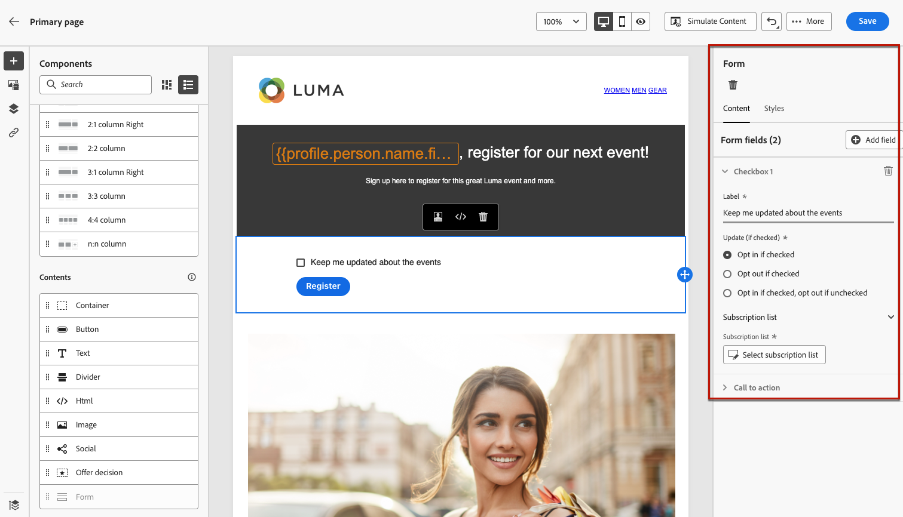
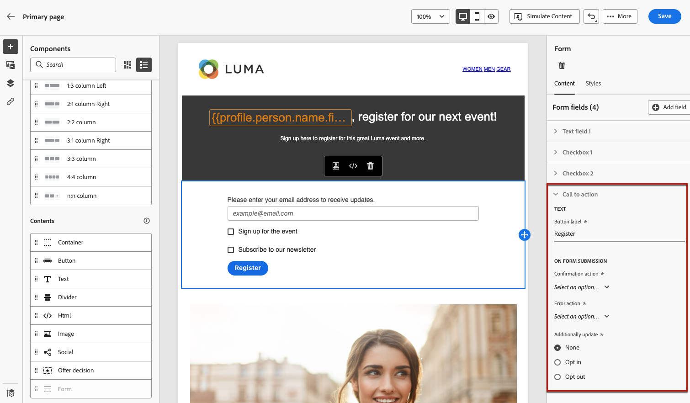

# Definire il contenuto specifico per la pagina di destinazione {#lp-content}

Per definire contenuti specifici che consentano agli utenti di selezionare e inviare le proprie scelte dalla pagina di destinazione, utilizza la funzione **[!UICONTROL Form]** componente. A questo scopo, segui i passaggi riportati qui sotto.

>[!NOTE]
>
>Puoi anche creare una pagina di destinazione click-through senza **[!UICONTROL Form]** componente. In tal caso, agli utenti verrà visualizzata la pagina di destinazione, ma non sarà richiesto loro di inviare alcun modulo. Questa funzione può essere utile solo se desideri mostrare una pagina di destinazione senza richiedere alcuna azione da parte dei destinatari, ad esempio consenso o rinuncia, oppure se desideri fornire informazioni che non richiedono l’input dell’utente.

## Utilizzare il componente modulo {#use-form-component}

1. Trascina e rilascia la pagina di destinazione specifica **[!UICONTROL Form]** dalla palette a sinistra nell’area di lavoro principale.

   

   >[!NOTE]
   >
   >La **[!UICONTROL Form]** può essere utilizzato solo una volta sulla stessa pagina.

1. Selezionala. La **[!UICONTROL Form content]** nella palette a destra viene visualizzata la scheda che consente di modificare i diversi campi del modulo.

   

   >[!NOTE]
   >
   >Passa alla **[!UICONTROL Form style]** in qualsiasi momento per modificare gli stili del contenuto del componente modulo. [Ulteriori informazioni](#define-lp-styles)

1. Da **[!UICONTROL Checkbox 1]** Puoi modificare l’etichetta corrispondente a questa casella di controllo.

1. Definisci se questa casella di controllo è per consentire agli utenti di accedere o uscire: acconsentono a ricevere comunicazioni o chiedono di non essere più contattati?

   

   Seleziona una delle tre opzioni seguenti:

   * **[!UICONTROL Opt in if checked]**: gli utenti devono selezionare la casella di controllo per il consenso (opt-in).
   * **[!UICONTROL Opt out if checked]**: gli utenti devono selezionare la casella per rimuovere il proprio consenso (opt-out).
   * **[!UICONTROL Opt in if checked, opt out if unchecked]**: questa opzione consente di inserire una singola casella di controllo per l’opt-in/opt-out. Gli utenti devono selezionare la casella di controllo per il consenso (opt-in) e deselezionarla per la rinuncia (opt-out).

1. Scegli cosa verrà aggiornato tra le tre opzioni seguenti:

   

   * **[!UICONTROL Subscription list]**: Seleziona l’elenco di sottoscrizioni da aggiornare se il profilo seleziona questa casella di controllo. Ulteriori informazioni su [elenchi di abbonamenti](subscription-list.md).

      

   * **[!UICONTROL Channel (email)]**: L&#39;opt-in o l&#39;opt-out si applica all&#39;intero canale. Ad esempio, se un profilo che effettua la rinuncia ha due indirizzi e-mail, entrambi gli indirizzi saranno esclusi da tutte le tue comunicazioni.

   * **[!UICONTROL Email identity]**: L’opzione di consenso o rinuncia si applica solo all’indirizzo e-mail utilizzato per accedere alla pagina di destinazione. Ad esempio, se un profilo ha due indirizzi e-mail, solo quello utilizzato per il consenso riceverà le comunicazioni dal tuo marchio.

1. Fai clic su **[!UICONTROL Add field]** > **[!UICONTROL Checkbox]** per aggiungere un’altra casella di controllo. Ripeti i passaggi precedenti per definirne le proprietà.

   

1. Dopo aver aggiunto tutte le caselle di controllo desiderate, fai clic su **[!UICONTROL Call to action]** per espandere la sezione corrispondente. Ti consente di definire il comportamento del pulsante nel **[!UICONTROL Form]** componente.

   

1. Definisci cosa accade quando fai clic sul pulsante :

   * **[!UICONTROL Redirect URL]**: Inserisci l’URL della pagina a cui verranno reindirizzati gli utenti.
   * **[!UICONTROL Confirmation text]**: Digita il testo di conferma che verrà visualizzato.
   * **[!UICONTROL Link to a subpage]**: Configura un [sottopagine](create-lp.md#configure-subpages) e selezionalo dall’elenco a discesa visualizzato.

   

1. Definisci cosa accade quando fai clic sul pulsante in caso di errore:

   * **[!UICONTROL Redirect URL]**: Inserisci l’URL della pagina a cui verranno reindirizzati gli utenti.
   * **[!UICONTROL Error text]**: Digitare il testo di errore che verrà visualizzato. Puoi visualizzare in anteprima il testo dell’errore durante la definizione della [stili di modulo](#define-lp-styles).

   * **[!UICONTROL Link to a subpage]**: Configura un [sottopagine](create-lp.md#configure-subpages) e selezionalo dall’elenco a discesa visualizzato.

   

1. Se si desidera apportare ulteriori aggiornamenti al momento dell’invio del modulo, selezionare **[!UICONTROL Opt in]** o **[!UICONTROL Opt out]** e definisci se desideri aggiornare un elenco di abbonamenti, il canale o solo l’indirizzo e-mail utilizzato.

   

1. Salva il contenuto e fai clic sulla freccia accanto al nome della pagina per tornare alla pagina [proprietà della pagina di destinazione](create-lp.md#configure-primary-page).

   

<!--Will the name Email Designer be kept if you can also design LP with the same tool? > To modify in Messages section > content designer or Designer-->

## Definire gli stili del modulo della pagina di destinazione {#lp-form-styles}

1. Per modificare gli stili del contenuto del componente modulo, passare in qualsiasi momento al **[!UICONTROL Form style]** scheda .

   

1. Espandi la **[!UICONTROL Checkboxes]** per definire l’aspetto delle caselle di controllo e del testo corrispondente. Ad esempio, è possibile modificare la famiglia o la dimensione del font e il colore del bordo della casella di controllo.

   

1. Espandi la **[!UICONTROL Buttons]** per modificare l’aspetto del pulsante nel modulo del componente. Ad esempio, è possibile aggiungere un bordo, modificare il colore dell’etichetta al passaggio del mouse o regolare l’allineamento del pulsante.

   

   Puoi visualizzare in anteprima alcune delle impostazioni, ad esempio il colore dell’etichetta del pulsante al passaggio del mouse utilizzando **[!UICONTROL Preview]** pulsante . Ulteriori informazioni sul test delle pagine di destinazione [qui](create-lp.md#test-landing-page).

   

1. Espandi la **[!UICONTROL Form layout]** per modificare le impostazioni di layout, ad esempio il colore di sfondo, la spaziatura o il margine.

   

1. Espandi la **[!UICONTROL Form error]** per regolare la visualizzazione del messaggio di errore visualizzato in caso di problemi. Selezionare l’opzione corrispondente per visualizzare in anteprima il testo di errore nel modulo.

   
