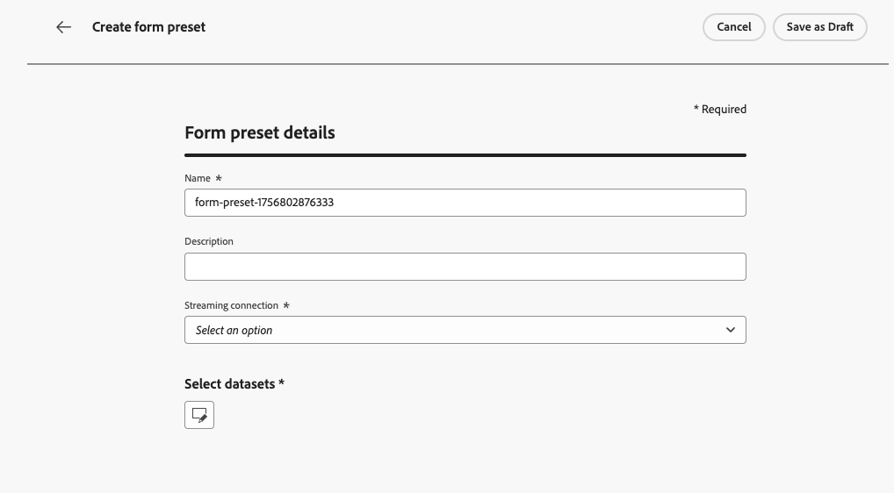
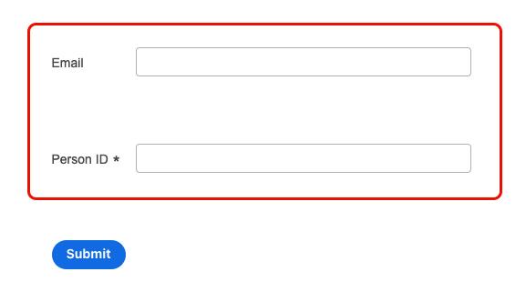
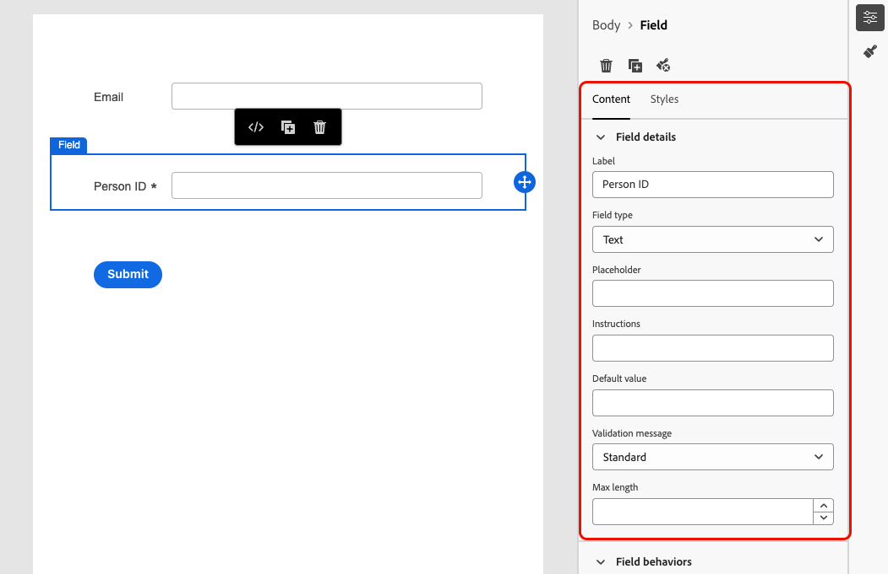

# Utilizzare i moduli nelle pagine di destinazione {#lp-forms}

>[!AVAILABILITY]
>
>Al momento questa funzionalità è in disponibilità limitata per la clientela negli Stati Uniti e in Australia. Per ottenere l’accesso, contatta il tuo rappresentante Adobe.

Per acquisire i dati del profilo con le pagine di destinazione [!DNL Journey Optimizer] e arricchire i set di dati [!DNL Experience Platform], puoi sfruttare i moduli nelle pagine di destinazione.

## Creare un predefinito per moduli {#create-form-preset}

>[!CONTEXTUALHELP]
>id="ajo_lp_form_connection"
>title="Seleziona l’endpoint da utilizzare"
>abstract="Definisci l’endpoint di streaming a cui vengono inviati i dati al momento dell’invio del modulo."
>additional-url="https://experienceleague.adobe.com/en/docs/experience-platform/sources/ui-tutorials/create/streaming/http" text="Creare una connessione streaming API HTTP"

>[!CONTEXTUALHELP]
>id="ajo_lp_form_dataset"
>title="Selezionare un set di dati"
>abstract="Definisci un set di dati in cui memorizzare e riflettere le risposte del modulo. Puoi digitare per cercare un set di dati specifico o selezionarlo dall’elenco."

Prima di poter creare un modulo, devi creare un predefinito dedicato in cui selezionare l’endpoint di connessione in cui vengono inviati i dati di invio del modulo e il set di dati in cui verranno memorizzati i dati acquisiti tramite il modulo.

Una volta che i dati arrivano sull’endpoint di streaming, vengono collegati alle informazioni del set di dati. Utilizzando le connessioni di origine/destinazione generate e il flusso di origine, i dati vengono quindi inviati al set di dati.

Durante la creazione di un predefinito:

* Puoi impostare più predefiniti utilizzando diverse combinazioni di set di dati e connessioni in streaming.
* Lo stesso set di dati o la stessa connessione in streaming possono essere riutilizzati in più predefiniti.
* Ogni connessione in streaming genera automaticamente risorse quali:
   * **Connessione Source** - origine dei dati.
   * **Connessione di destinazione** - in cui i dati vengono archiviati o utilizzati.
   * **Flusso di Source**: la pipeline che sposta i dati dalla connessione di origine in [!DNL Experience Platform], gestendo la mappatura, la trasformazione e la convalida.

<!--
>[!NOTE]
>
> To access and edit form presets, you must have the **[!UICONTROL Manage form presets]** permission on the production sandbox. Learn more about permissions in [this section](../administration/high-low-permissions.md#administration-permissions).TBC
-->

Per creare un predefinito per moduli, effettua le seguenti operazioni.

1. Per accedere all&#39;inventario **[!UICONTROL Predefiniti modulo]**, seleziona **[!UICONTROL Amministrazione]** > **[!UICONTROL Canali]** >**[!UICONTROL Impostazioni modulo]** dal menu a sinistra.

1. Fare clic su **[!UICONTROL Crea predefinito modulo]**.

1. Aggiorna il nome per recuperarlo più facilmente e aggiungi una descrizione, se necessario.

   {width=80%}

1. Selezionare la **[!UICONTROL connessione in streaming]** da utilizzare per il modulo. Questo è l’endpoint di streaming a cui vengono inviati i dati al momento dell’invio del modulo.

   >[!NOTE]
   >
   >Per ulteriori informazioni sulla creazione di una connessione sorgente in streaming, consulta la [documentazione di Experience Platform](https://experienceleague.adobe.com/en/docs/experience-platform/sources/ui-tutorials/create/streaming/http){target="_blank"}.

1. Seleziona un **[!UICONTROL Set di dati]** da collegare al modulo. Qui verranno memorizzate e riflesse le risposte del modulo. Puoi digitare per cercare un set di dati specifico o selezionarlo dall’elenco.

   >[!NOTE]
   >
   >Al momento sono disponibili solo [!DNL Adobe Experience Platform] set di dati per la selezione. È possibile selezionare un set di dati alla volta. [Ulteriori informazioni sui set di dati](../data/get-started-datasets.md)

1. Fai clic su **[!UICONTROL Pubblica]**. Il predefinito è ora pronto per essere utilizzato in un modulo.

## Accedere e gestire i moduli {#access-forms}

Per accedere all&#39;elenco dei moduli, seleziona **[!UICONTROL Gestione contenuto]** > **[!UICONTROL Forms]** dal menu a sinistra.

Vengono visualizzati tutti i moduli esistenti. Puoi filtrare i moduli in base al loro stato, alla data di creazione o di modifica.

## Creare e progettare un modulo {#create-form}

>[!CONTEXTUALHELP]
>id="ajo_lp_form_preset"
>title="Seleziona un predefinito"
>abstract="Scegliere un predefinito predefinito contenente la connessione da utilizzare e un set di dati predefinito per il modulo."
>additional-url="https://experienceleague.adobe.com/en/docs/journey-optimizer/using/content-management/landing-pages/lp-forms#create-form-preset" text="Creare un predefinito per moduli"

Per creare un modulo, attieniti alla procedura seguente.

1. Nell&#39;elenco **[!UICONTROL Forms]** fare clic su **[!UICONTROL Crea modulo]**.

1. Aggiungi un nome. Se necessario, puoi aggiungere una descrizione.

   

1. Selezionare un **[!UICONTROL predefinito]** contenente la connessione da utilizzare e un set di dati predefinito per il modulo. [Scopri come creare un predefinito per moduli](#create-form-preset)

1. Fai clic su **[!UICONTROL Crea]**. Verrà aperto Progettazione moduli, che consente di aggiungere strutture e contenuto [componenti](../email/content-components.md#add-content-components) per creare il contenuto. Puoi utilizzare i componenti [Testo](../email/content-components.md#text) e **[!UICONTROL Campo]**.

1. Per acquisire i dati e gli attributi del profilo, aggiungi campi specifici al modulo. [Ulteriori informazioni](#define-fields)

1. Configura e progetta questi campi. [Ulteriori informazioni](#configure-fields)

1. Puoi regolare il layout, lo stile e le dimensioni del modulo in base alle esigenze utilizzando il riquadro **[!UICONTROL Stili]**. [Ulteriori informazioni sullo stile](../email/get-started-email-style.md)

1. Dopo aver configurato tutti i campi, fai clic su **[!UICONTROL Salva e chiudi]**.

1. Configura la pagina di ringraziamento. [Scopri come](#thank-you-page)

1. **[!UICONTROL Pubblica]** il modulo per renderlo disponibile per la selezione nelle pagine di destinazione.

### Definire campi specifici {#define-fields}

Per aggiungere campi specifici al modulo, trascina una struttura nell&#39;area di lavoro e trascina un componente **[!UICONTROL Campo]** all&#39;interno di.<!--**[!UICONTROL Select field attribute]** or **[!UICONTROL Add custom field]**.-->

Quindi seleziona una delle seguenti opzioni:

>[!BEGINTABS]

>[!TAB Seleziona attributo campo]

Utilizza questa opzione per selezionare un attributo basato sullo schema del set di dati collegato al modulo.

>[!NOTE]
>
>Il set di dati è definito nel predefinito selezionato per il modulo. [Ulteriori informazioni](#create-form-preset)

{width=100%}

Ad esempio, puoi impostare l’E-mail e l’ID persona. Quando gli utenti compilano questi campi, le informazioni immesse vengono salvate nel set di dati selezionato.

{width=55%}

Per mappare i dati raccolti con un profilo, seleziona un campo di identità del profilo. I campi di identità sono contrassegnati come **[!UICONTROL Obbligatori]** nell&#39;elenco degli attributi. Puoi filtrarli.

{width=65%}

>[!TAB Aggiungi campo personalizzato]

Con questa opzione, puoi semplicemente definire un campo libero senza mapparlo su un campo nel set di dati collegato.

{width=85%}

>[!ENDTABS]

### Configurare e progettare un campo {#configure-fields}

Dopo aver selezionato un attributo di campo o aggiunto un campo personalizzato, è possibile modificarne ulteriormente i dettagli e il comportamento all’invio del modulo.

1. Nella sezione **[!UICONTROL Dettagli campo]** della scheda **[!UICONTROL Contenuto]** a destra, puoi specificare i seguenti elementi in base alle esigenze:

   * Regola l&#39;**[!UICONTROL etichetta]** per renderlo chiaro ai destinatari del modulo.
   * Modifica il tipo di campo **&#x200B;**&#x200B;in base alle tue esigenze. Può essere una casella di controllo, valuta, data, cursore, URL e così via.

     >[!NOTE]
     >
     >Gli altri dettagli del campo possono variare in base al tipo di campo selezionato.

   * Aggiungi un **[!UICONTROL segnaposto]**.<!--To explain-->
   * Specificare **[!UICONTROL Istruzioni]**.<!--How will they be displayed in the form? To explain-->
   * Immetti un **[!UICONTROL valore predefinito]** che verrà visualizzato prima che gli utenti del modulo compilino il campo.
   * È possibile definire un **[!UICONTROL messaggio di convalida]** personalizzato.
   * Imposta una **[!UICONTROL lunghezza massima]**. Viene visualizzato un messaggio di errore se i destinatari del modulo superano il limite durante la compilazione del campo.

   {width=85%}

1. Nella sezione **[!UICONTROL Comportamenti campo]** è possibile definire quanto segue:

   * Seleziona **[!UICONTROL Obbligatorio]** per rendere questo campo obbligatorio. Gli utenti che non compilano il campo non possono inviare il modulo.
   * Seleziona **[!UICONTROL Sensibile]** per fare in modo che il campo faccia distinzione tra maiuscole e minuscole. <!--To confirm - do you mean retain capitalization when added to the dataset?-->
   * Seleziona **[!UICONTROL Precompilato abilitato]** per compilare il campo dalle informazioni del profilo, se disponibili.<!--Even for a custom field, or a field not mapped to a profile? What happens if no data is available?-->
   * Selezionare **[!UICONTROL Abilita maschera di input]** per sostituire l&#39;input degli utenti con caratteri generici. È possibile utilizzare *9* per indicare qualsiasi numero, *a* per indicare qualsiasi lettera o * per indicare qualsiasi numero o lettera.<!--Not sure how you define that in the form-->

   {width=75%}

### Configurare la pagina di ringraziamento {#thank-you-page}

>[!CONTEXTUALHELP]
>id="ajo_lp_forms_thankyou_page"
>title="Pagina di ringraziamento"
>abstract="Configurare l&#39;operazione da eseguire quando un utente compila o inoltra il modulo."

Tornando ai dettagli del modulo, dalla sezione **[!UICONTROL Pagina di ringraziamento]** configura ciò che accade quando un utente compila il modulo.

Imposta una delle azioni seguenti:

* **[!UICONTROL Resta a pagina]** - Questa opzione mantiene il visitatore sulla stessa pagina quando il modulo è stato inviato.
* **[!UICONTROL Pagina di destinazione]** - Seleziona una [pagina di destinazione](create-lp.md) pubblicata alla quale l&#39;utente viene reindirizzato dopo l&#39;invio del modulo.
* **[!UICONTROL URL esterno]** - Immettere l&#39;URL completo come pagina di follow-up. Una volta inviato il modulo, l’utente viene indirizzato all’URL specificato.
* **[!UICONTROL Reindirizzamento condizionale]**: imposta le regole per visualizzare in modo dinamico azioni di follow-up diverse in base alle risposte del modulo.

  Puoi definire una regola per ogni pubblico specifico. Ad esempio, puoi visualizzare una pagina di destinazione specifica per i residenti negli Stati Uniti, un’altra pagina per i residenti in Canada e così via. Infine, imposta un’azione predefinita per gli utenti che non rientrano in alcuna regola definita.

  >[!NOTE]
  >
  >Le condizioni definite in una regola vengono lette in sequenza.

  {width=40%}

## Modificare un modulo pubblicato {#edit-form}

Una volta pubblicato un modulo, è comunque possibile modificarlo. Segui i passaggi seguenti.

1. Accedere all&#39;[elenco moduli](#access-forms) e selezionare un modulo pubblicato.

1. Fare clic sul pulsante **[!UICONTROL Modifica modulo]**.

   {width=90%}

1. Viene creata una nuova versione del modulo con lo stato Bozza. Fare clic su **[!UICONTROL Crea bozza versione]**.

1. Aggiorna il modulo in base alle esigenze e fai clic su **[!UICONTROL Salva]**. Il modulo è ora nello stato **[!UICONTROL Pubblicato (con bozza)]**:

   * Lo stato della versione corrente continua a **[!UICONTROL Pubblicato]** fino a quando non viene pubblicata la versione aggiornata.

   * La versione aggiornata ha lo stato **[!UICONTROL Bozza]**.

1. Nel riepilogo del modulo è possibile spostarsi tra le due versioni del modulo.

   {width=70%}

1. Nella sezione **[!UICONTROL Bozza]** è possibile pubblicare o eliminare la bozza, nonché modificare i dettagli o il contenuto del modulo.

   {width=75%}

## Sfruttare il modulo in una pagina di destinazione {#leverage-form-in-lp}

Ora puoi incorporare questo modulo in una pagina di destinazione per acquisire i dati corrispondenti agli attributi definiti nel modulo e salvarlo nel set di dati selezionato. Segui i passaggi seguenti.

1. Crea una pagina di destinazione. [Scopri come](create-lp.md#create-landing-page)

1. Seleziona **[!UICONTROL Acquisizione dati]** come tipo di pagina di destinazione e fai clic su **[!UICONTROL Crea]**.

   {width=65%}

1. Configura la pagina principale. [Scopri come](create-lp.md#configure-primary-page)

1. Apri [Progettazione pagine di destinazione](design-lp.md).

1. Trascina e rilascia un **[!UICONTROL componente struttura]** nel contenuto. Trascina e rilascia un componente **[!UICONTROL Modulo]** nella struttura.

   >[!NOTE]
   >
   >In una pagina di destinazione è possibile selezionare solo i moduli pubblicati.

1. Nella sezione **[!UICONTROL Incorpora modulo]**, seleziona il modulo creato.

   

   >[!NOTE]
   >
   >Puoi aggiornare il modulo selezionato utilizzando il pulsante **[!UICONTROL Modifica modulo]**. Il modulo viene aperto in una nuova scheda. I passaggi per modificare il contenuto del modulo sono descritti in [questa sezione](#create-form).

1. Nella sezione **[!UICONTROL Tipo di completamento]**, configura cosa accade quando un utente compila il modulo:

   * Scegliere **[!UICONTROL Definito modulo]** per selezionare l&#39;azione definita nel modulo incorporato. [Ulteriori informazioni](#thank-you-page)

   * Puoi anche selezionare una [pagina di destinazione](create-lp.md) pubblicata a cui l&#39;utente viene reindirizzato dopo l&#39;invio del modulo.

   * Oppure definisci un **[!UICONTROL URL esterno]** come pagina di follow-up a cui gli utenti vengono indirizzati quando inviano il modulo.

1. Salva e verifica la pagina di destinazione. [Scopri come](create-lp.md#test-landing-page)

Una volta che la pagina di destinazione è [pubblicata](create-lp.md#publish-landing-page) e utilizzata in un percorso, quando gli utenti compilano il modulo, le informazioni immesse vengono acquisite nel set di dati selezionato.

>[!NOTE]
>
>Se annulli la pubblicazione di un modulo utilizzato in una pagina di destinazione, lo modifichi e lo pubblichi nuovamente, la pagina di destinazione utilizza sempre l’ultima versione pubblicata del modulo.
