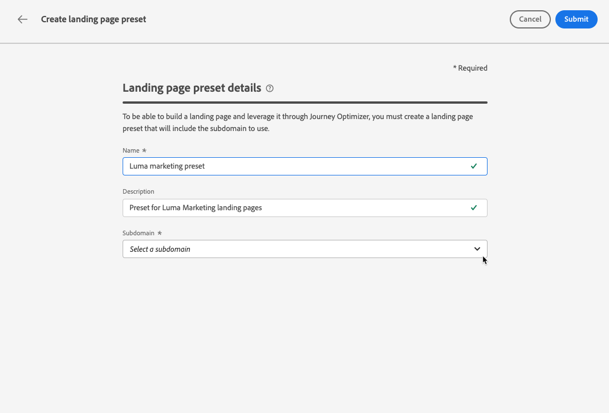

# Definire i predefiniti per la pagina di destinazione {#lp-presets}

>[!CONTEXTUALHELP]
>id="ajo_admin_config_lp_subdomain_header"
>title="Creare un predefinito per la pagina di destinazione"
>abstract="Per creare una pagina di destinazione e utilizzarla tramite Journey Optimizer, devi creare un predefinito per pagine di destinazione che includa il sottodominio da utilizzare."

## Introduzione ai predefiniti per pagine di destinazione {#gs-lp-presets}

Quando [crei una pagina di destinazione](../landing-pages/create-lp.md#create-lp), devi selezionare un predefinito per la pagina di destinazione per poterla creare e sfruttarlo tramite **[!DNL Journey Optimizer]**. Il predefinito include il sottodominio da utilizzare per le pagine di destinazione basate su questo predefinito.

Prima di creare un predefinito, accertati di aver configurato in precedenza almeno un sottodominio della pagina di destinazione. [Scopri come creare un sottodominio della pagina di destinazione](lp-subdomains.md).

## Accedere ai predefiniti della pagina di destinazione {#access-lp-presets}

Per accedere ai predefiniti per pagine di destinazione, effettua le seguenti operazioni:

1. Accedi al menu **[!UICONTROL Amministrazione]** > **[!UICONTROL Canali]**.

1. Seleziona **[!UICONTROL Impostazioni pagina di destinazione]** > **[!UICONTROL Predefiniti pagina di destinazione]**.

   

1. Fai clic su un’etichetta del predefinito per accedere ai dettagli del predefinito per pagina di destinazione.

   

## Creare un predefinito per la pagina di destinazione {#lp-create-preset}

Per creare un predefinito per pagina di destinazione, effettua le seguenti operazioni:

1. Sfoglia il menu **[!UICONTROL Amministrazione]** > **[!UICONTROL Canali]**, quindi seleziona **[!UICONTROL Impostazioni pagina di destinazione]** > **[!UICONTROL Predefiniti pagina di destinazione]**.

1. Seleziona **[!UICONTROL Crea predefinito per pagina di destinazione]**.

   

1. Immettete un nome e una descrizione per il predefinito.

   I nomi devono iniziare con una lettera (A-Z) e contenere solo caratteri alfanumerici, il carattere di sottolineatura `_`, il punto`.` e il trattino `-`.

1. Seleziona un sottodominio della pagina di destinazione dall’elenco a discesa.

   

   >[!NOTE]
   >
   >Per poter selezionare un sottodominio, accertati di aver configurato in precedenza almeno un sottodominio della pagina di destinazione. [Scopri come](lp-subdomains.md)

   Vengono visualizzate le impostazioni corrispondenti al sottodominio selezionato.

1. Puoi selezionare il sottodominio della pagina di destinazione per l&#39;**[!UICONTROL URL di tracciamento]** selezionando l&#39;opzione **[!UICONTROL Come sottodominio della pagina di destinazione]**. [Ulteriori informazioni sul tracciamento](../email/message-tracking.md)

   

   Ad esempio, se l’URL della pagina di destinazione è &quot;pages.mail.luma.com&quot; e l’URL di tracciamento è &quot;data.mail.luma.com&quot;, puoi scegliere &quot;pages.mail.luma.com&quot; da utilizzare come sottodominio di tracciamento.

   >[!CAUTION]
   >
   >Il sottodominio della pagina di destinazione selezionato viene utilizzato per specificare l&#39;**[!UICONTROL URL di tracciamento]** <!--and **[!UICONTROL Image Delivery URL]** -->se il sottodominio è stato creato utilizzando un [sottodominio esistente](lp-subdomains.md#lp-use-existing-subdomain).
   >
   >Se il sottodominio è stato creato utilizzando l&#39;opzione [Aggiungi il tuo dominio](lp-subdomains.md#lp-configure-new-subdomain), viene utilizzato il sottodominio principale (ovvero il primo sottodominio delegato).

1. Fai clic su **[!UICONTROL Invia]** per confermare la creazione del predefinito per pagina di destinazione. <!--You can also save the preset as draft and resume its configuration later on.-->

   <!---->

1. Una volta creato il predefinito per pagina di destinazione, viene visualizzato nell&#39;elenco con lo stato **[!UICONTROL Attivo]**. È pronto per essere utilizzato nelle pagine di destinazione.

Ora puoi [creare pagine di destinazione](../landing-pages/create-lp.md) in [!DNL Journey Optimizer].
<!--
>[!NOTE]
>
>Learn how to create channel configurations for push notifications and emails in [this section](channel-surfaces.md).-->

**Argomenti correlati**:

* [Introduzione alle pagine di destinazione](../landing-pages/get-started-lp.md)
* [Creare una pagina di destinazione](../landing-pages/create-lp.md#create-lp)
