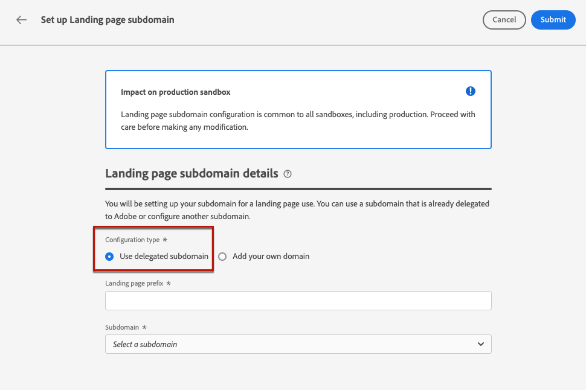
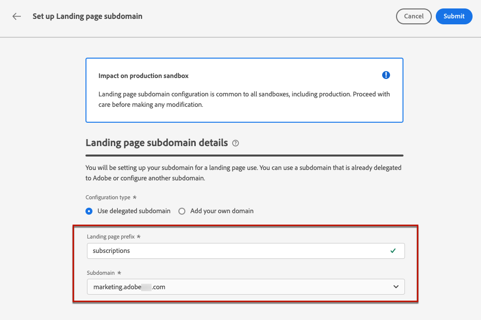

# Configurare i sottodomini della pagina di destinazione {#lp-subdomains}

>[!CONTEXTUALHELP]
>id="ajo_admin_subdomain_lp_header"
>title="Delegare un sottodominio della pagina di destinazione"
>abstract="Devi configurare il sottodominio da utilizzare per una pagina di destinazione. Puoi utilizzare un sottodominio già delegato ad Adobe o configurarne un altro."

>[!CONTEXTUALHELP]
>id="ajo_admin_subdomain_lp"
>title="Delegare un sottodominio della pagina di destinazione"
>abstract="Devi configurare un sottodominio da utilizzare per le pagine di destinazione, da usare per creare un predefinito per la pagina di destinazione. Puoi utilizzare un sottodominio già delegato ad Adobe o configurarne uno nuovo."
>additional-url="https://experienceleague.adobe.com/docs/journey-optimizer/using/landing-pages/lp-configuration/lp-presets.html?lang=it#lp-create-preset" text="Creare i predefiniti per pagine di destinazione"

>[!CONTEXTUALHELP]
>id="ajo_admin_config_lp_subdomain"
>title="Creare un predefinito per la pagina di destinazione"
>abstract="Per creare un predefinito per la pagina di destinazione, accertati di aver configurato in precedenza almeno un sottodominio per la pagina di destinazione da selezionare dall’elenco dei nomi di sottodominio."
>additional-url="https://experienceleague.adobe.com/docs/journey-optimizer/using/landing-pages/lp-configuration/lp-presets.html?lang=it#lp-create-preset" text="Creare i predefiniti per pagine di destinazione"

## Introduzione ai sottodomini delle pagine di destinazione {#gs-lp-subdomains}

Per poter creare dei predefiniti](lp-presets.md) per [le pagine di destinazione, devi impostare i sottodomini che utilizzerai per le pagine di destinazione.

È possibile utilizzare un sottodominio già delegato a Adobe Systems oppure configurare un altro sottodominio. Scopri ulteriori informazioni sulla delega di sottodomini a Adobe Systems in [questa sezione](../configuration/delegate-subdomain.md).

La configurazione del sottodominio della pagina di destinazione è **comune a tutti gli ambienti**. Pertanto:

* Per accesso e modificare i sottodomini della pagina di ]**destinazione, devi disporre della**[!UICONTROL  autorizzazione Gestisci Pagina sottodomini di destinazione nella sandbox di produzione.

* Qualsiasi modifica apportata a un sottodominio della pagina di destinazione influisce anche sulle sandbox di produzione.

## Usa un sottodominio esistente {#lp-use-existing-subdomain}

Per utilizzare un sottodominio già delegato ad Adobe, segui i passaggi seguenti:

1. Accedi al menu **[!UICONTROL Amministrazione]** > **[!UICONTROL Canali]**, quindi seleziona **[!UICONTROL Impostazioni pagina di destinazione]** > **[!UICONTROL Sottodomini pagina di destinazione]**.

1. Fai clic su **[!UICONTROL Imposta sottodominio]**.

   

1. Selezionare **[!UICONTROL Usa dominio]** delegato dalla **[!UICONTROL sezione Tipo di]** configurazione.

   

1. Immetti il prefisso che verrà visualizzato nell’URL della pagina di destinazione.

   Sono consentiti solo caratteri alfanumerici e trattini.

1. Seleziona un sottodominio delegato dall’elenco.

   Non puoi selezionare un sottodominio già utilizzato come sottodominio della pagina di destinazione.

   <!--Capital letters are not allowed in subdomains. TBC by PM-->

   

   Non è possibile utilizzare più sottodomini delegati dello stesso dominio principale. Ad esempio, se &quot;marketing1.yourcompany.com&quot; è già delegato ad Adobe per le pagine di destinazione, non potrai utilizzare &quot;marketing2.yourcompany.com&quot;. Tuttavia, essendo supportati i sottodomini multilivello per le pagine di destinazione, puoi procedere utilizzando un sottodominio di &quot;marketing1.yourcompany.com&quot; (come &quot;email.marketing1.yourcompany.com&quot;) o un dominio padre diverso.

   >[!CAUTION]
   >
   >Se si seleziona un dominio delegato ad Adobe utilizzando il metodo [CNAME](../configuration/delegate-subdomain.md#cname-subdomain-delegation), è necessario creare il record DNS nella piattaforma di hosting. Per generare il record DNS, la procedura è la stessa di quando configuri un nuovo sottodominio pagina di destinazione. Scopri come in [questa sezione](#lp-configure-new-subdomain).

1. Fai clic su **[!UICONTROL Invia]**.

1. Dopo l&#39;invio, il sottodominio viene visualizzato nell&#39;elenco con lo stato **[!UICONTROL Elaborazione]**. Per ulteriori informazioni sugli stati dei sottodomini, consulta [questa sezione](../configuration/about-subdomain-delegation.md#access-delegated-subdomains).<!--Same statuses?-->

   

   Prima di poter utilizzare quel sottodominio per inviare messaggi, è necessario attendere che Adobe Systems esegua i controlli richiesti, che possono richiedere **fino a 4 ore**.<!--Learn more in [this section](delegate-subdomain.md#subdomain-validation).-->

1. Una volta che i controlli hanno esito positivo, il sottodominio ottiene lo **[!UICONTROL stato Operazione riuscita]** . È pronto per essere utilizzato per creare dei predefiniti per le pagine di destinazione.

## Configurare un nuovo sottodominio {#lp-configure-new-subdomain}

>[!CONTEXTUALHELP]
>id="ajo_admin_lp_subdomain_dns"
>title="Generare il record DNS corrispondente"
>abstract="Per configurare un nuovo sottodominio per la pagina di destinazione, devi copiare le informazioni del server dei nomi di Adobe visualizzate nell’interfaccia di Journey Optimizer e incollarle nella soluzione di hosting del dominio per generare il record DNS corrispondente. Una volta superati i controlli di verifica, il sottodominio è pronto per essere utilizzato per creare i predefiniti per pagine di destinazione."

Per configurare un nuovo sottodominio, segui i passaggi indicati di seguito.

1. Accedi al menu **[!UICONTROL Amministrazione]** > **[!UICONTROL Canali]**, quindi seleziona **[!UICONTROL Impostazioni pagina di destinazione]** > **[!UICONTROL Sottodomini pagina di destinazione]**.

1. Fai clic su **[!UICONTROL Imposta sottodominio]**.

1. Seleziona **[!UICONTROL Aggiungi il tuo dominio]** dalla sezione Tipo di ]****[!UICONTROL  configurazione.

   

1. Specifica il sottodominio da delegare.

   >[!CAUTION]
   >
   >* Non puoi utilizzare un sottodominio della pagina di destinazione esistente.
   >
   >* Nei sottodomini non sono consentite lettere maiuscole.

   Non è consentito delegare un sottodominio non valido ad Adobe. Assicurati di immettere un sottodominio valido di proprietà della tua organizzazione, ad esempio marketing.yourcompany.com.

   Per le pagine di destinazione, sono supportati i sottodomini a più livelli. Ad esempio, puoi utilizzare &quot;email.marketing.yourcompany.com&quot;.

1. Viene visualizzato il record da inserire nei server DNS. Copia questo record o scaricare un file CSV, quindi passa alla soluzione di hosting del dominio per generare il record DNS corrispondente.

1. Assicurati che il record DNS sia stato generato nella soluzione di hosting del dominio. Se tutto è configurato correttamente, seleziona la casella &quot;Confirmo...&quot;, quindi fai clic su **[!UICONTROL Invia]**.

   

   Quando configuri un nuovo sottodominio pagina di destinazione, punta sempre a un record CNAME.

1. Una volta inviata la delega del sottodominio, il sottodominio viene visualizzato nell&#39;elenco con lo stato di **[!UICONTROL elaborazione]** . Per ulteriori informazioni sugli stati dei sottodomini, consulta [questa sezione](../configuration/about-subdomain-delegation.md#access-delegated-subdomains).<!--Same statuses?-->

   Prima di poter utilizzare quel sottodominio per le tue pagine di destinazione, devi attendere che Adobe Systems esegua i controlli richiesti, che possono richiedere **fino a 4 ore**.<!--Learn more in [this section](#subdomain-validation).-->

1. Una volta completati i controlli, il sottodominio ottiene lo stato **[!UICONTROL Completato]**. È pronto per essere utilizzato per creare predefiniti per pagine di destinazione.

   Se non riesci a creare il record di convalida nella soluzione di hosting, il sottodominio verrà contrassegnato come **[!UICONTROL Non riuscito]**.

## Annullare la delega di un sottodominio {#undelegate-subdomain}

Se desideri annullare la delega di un sottodominio di una pagina di destinazione, contatta il tuo rappresentante Adobe.

Tuttavia, è necessario eseguire diversi passaggi nell&#39;interfaccia di utente prima di contattare Adobe Systems.

>[!NOTE]
>
>È possibile annullare la delega solo dei sottodomini con lo stato **[!UICONTROL Operazione riuscita]**. I sottodomini con stato **[!UICONTROL Bozza]** e **[!UICONTROL Non riuscito]** possono essere semplicemente eliminati dall&#39;interfaccia utente.

Eseguire innanzitutto i passaggi seguenti in [!DNL Journey Optimizer]:

1. Annulla la pubblicazione di tutte le pagine di destinazione associate al sottodominio. [Scopri come](create-lp.md#access-landing-pages)

1. Disattiva tutte le configurazioni di canale associate al sottodominio. [Scopri come](../configuration/channel-surfaces.md#deactivate-a-surface)

<!--
1. If the landing page subdomain is using an email subdomain that was [already delegated](#lp-use-existing-subdomain) to Adobe, undelegate the email subdomain. [Learn how](../configuration/delegate-subdomain.md#undelegate-subdomain)

1. Stop the active campaigns associated with the subdomains. [Learn how](../campaigns/modify-stop-campaign.md#stop)

1. Stop the active journeys associated with the subdomains. [Learn how](../building-journeys/end-journey.md#stop-journey)
-->

Una volta fatto, contatta il tuo rappresentante Adobe Systems con il sottodominio che desideri annullare.

Una volta gestito il richiesta da Adobe Systems, il dominio non delegato non viene più visualizzato nella pagina di inventario dei sottodomini.

>[!CAUTION]
>
>Dopo l’annullamento della delega di un sottodominio:
>
>   * Non è possibile riattivare le configurazioni del canale che utilizzavano quel sottodominio.
>
>   * Non puoi delegare nuovamente il sottodominio esatto tramite l’interfaccia utente. Se lo desideri, contatta il tuo rappresentante Adobe.