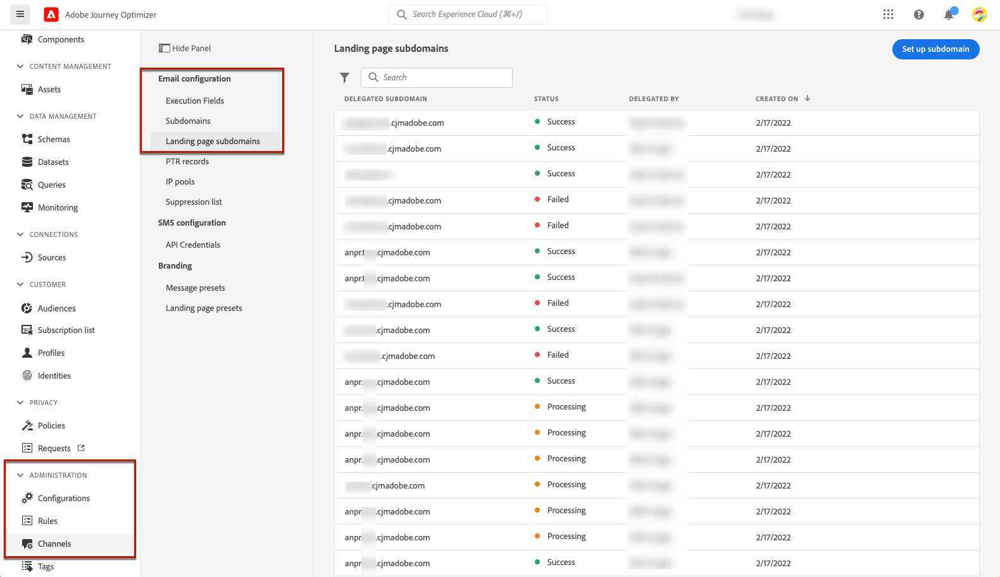

# Configurare i sottodomini della pagina di destinazione {#lp-subdomains}

>[!CONTEXTUALHELP]
>id="ajo_admin_subdomain_lp_header"
>title="Delegare un sottodominio della pagina di destinazione"
>abstract="Devi configurare il sottodominio da utilizzare per la pagina di destinazione. Puoi utilizzare un sottodominio già delegato ad Adobe o configurarne un altro."

>[!CONTEXTUALHELP]
>id="ajo_admin_subdomain_lp"
>title="Delegare un sottodominio della pagina di destinazione"
>abstract="Devi configurare un sottodominio da utilizzare per le pagine di destinazione, da usare per creare un predefinito per la pagina di destinazione. Puoi utilizzare un sottodominio già delegato ad Adobe o configurarne uno nuovo."
>additional-url="https://experienceleague.adobe.com/docs/journey-optimizer/using/landing-pages/lp-configuration/lp-presets.html?lang=it#lp-create-preset" text="Creare i predefiniti per pagine di destinazione"

>[!CONTEXTUALHELP]
>id="ajo_admin_config_lp_subdomain"
>title="Creare un predefinito per la pagina di destinazione"
>abstract="Per creare un predefinito per la pagina di destinazione, accertati di aver configurato in precedenza almeno un sottodominio per la pagina di destinazione da selezionare dall’elenco dei nomi di sottodominio."
>additional-url="https://experienceleague.adobe.com/docs/journey-optimizer/using/landing-pages/lp-configuration/lp-presets.html?lang=it#lp-create-preset" text="Creare i predefiniti per pagine di destinazione"

Essere in grado di [creare predefiniti per pagine di destinazione](lp-presets.md), devi impostare i sottodomini da utilizzare per le pagine di destinazione.

Puoi utilizzare un sottodominio già delegato ad Adobe oppure configurare un altro sottodominio. Ulteriori informazioni sulla delega dei sottodomini all’Adobe in [questa sezione](../configuration/delegate-subdomain.md).

>[!CAUTION]
>
>La configurazione del sottodominio della pagina di destinazione è comune a tutti gli ambienti. Pertanto:
>
>* Per accedere e modificare i sottodomini della pagina di destinazione, devi disporre del **[!UICONTROL Gestire i sottodomini della pagina di destinazione]** autorizzazione per la sandbox di produzione.
>
> * Qualsiasi modifica a un sottodominio della pagina di destinazione influirà anche sulle sandbox di produzione.

## Usa un sottodominio esistente {#lp-use-existing-subdomain}

Per utilizzare un sottodominio già delegato ad Adobe, segui i passaggi seguenti.

1. Accedere a **[!UICONTROL Amministrazione]** > **[!UICONTROL Canali]** , quindi seleziona **[!UICONTROL Configurazione e-mail]** > **[!UICONTROL Sottodomini della pagina di destinazione]**.

   

1. Clic **[!UICONTROL Configurare il sottodominio]**.

   

1. Seleziona **[!UICONTROL Usa dominio delegato]** dal **[!UICONTROL Tipo di configurazione]** sezione.

   

1. Immetti il prefisso che verrà visualizzato nell’URL della pagina di destinazione.

   >[!NOTE]
   >
   >Sono consentiti solo caratteri alfanumerici e trattini.

1. Seleziona un sottodominio delegato dall’elenco.

   >[!NOTE]
   >
   >Non puoi selezionare un sottodominio già utilizzato come sottodominio della pagina di destinazione.

   <!--Capital letters are not allowed in subdomains. TBC by PM-->

   

   Non è possibile utilizzare più sottodomini delegati dello stesso dominio principale. Ad esempio, se &quot;marketing1.yourcompany.com&quot; è già delegato ad Adobe per le pagine di destinazione, non potrai utilizzare &quot;marketing2.yourcompany.com&quot;. Tuttavia, poiché i sottodomini a più livelli sono supportati per le pagine di destinazione, puoi procedere utilizzando un sottodominio &quot;marketing1.yourcompany.com&quot; (ad esempio &quot;email.marketing1.yourcompany.com&quot;) o un dominio padre diverso.

   >[!CAUTION]
   >
   >Se selezioni un dominio delegato ad Adobe utilizzando [metodo CNAME](../configuration/delegate-subdomain.md#cname-subdomain-delegation), è necessario creare il record DNS sulla piattaforma di hosting. Per generare il record DNS, il processo è lo stesso di quando configuri un nuovo sottodominio della pagina di destinazione. Scopri come in [questa sezione](#lp-configure-new-subdomain).

1. Fai clic su **[!UICONTROL Invia]**.

1. Una volta inviato, il sottodominio viene visualizzato nell’elenco con **[!UICONTROL Elaborazione]** stato. Per ulteriori informazioni sugli stati dei sottodomini, consulta [questa sezione](../configuration/about-subdomain-delegation.md#access-delegated-subdomains).<!--Same statuses?-->

   

   >[!NOTE]
   >
   >Prima di poter utilizzare tale sottodominio per inviare messaggi, devi attendere che Adobe esegua i controlli richiesti, che possono richiedere fino a 4 ore.<!--Learn more in [this section](delegate-subdomain.md#subdomain-validation).-->

1. Quando i controlli hanno esito positivo, il sottodominio ottiene il **[!UICONTROL Completato]** stato. È pronto per essere utilizzato per creare predefiniti per pagine di destinazione.

## Configurare un nuovo sottodominio {#lp-configure-new-subdomain}

>[!CONTEXTUALHELP]
>id="ajo_admin_lp_subdomain_dns"
>title="Generare il record DNS corrispondente"
>abstract="Per configurare un nuovo sottodominio per la pagina di destinazione, devi copiare le informazioni del server dei nomi di Adobe visualizzate nell’interfaccia di Journey Optimizer e incollarle nella soluzione di hosting del dominio per generare il record DNS corrispondente. Una volta superati i controlli di verifica, il sottodominio è pronto per essere utilizzato per creare i predefiniti per pagine di destinazione."

Per configurare un nuovo sottodominio, segui i passaggi indicati di seguito.

1. Accedere a **[!UICONTROL Amministrazione]** > **[!UICONTROL Canali]** , quindi seleziona **[!UICONTROL Configurazione e-mail]** > **[!UICONTROL Sottodomini della pagina di destinazione]**.

1. Clic **[!UICONTROL Configurare il sottodominio]**.

1. Seleziona **[!UICONTROL Aggiungi il tuo dominio]** dal **[!UICONTROL Tipo di configurazione]** sezione.

   

1. Specifica il sottodominio da delegare.

   >[!CAUTION]
   >
   >Non puoi utilizzare un sottodominio della pagina di destinazione esistente.
   >
   >Nei sottodomini non sono consentite lettere maiuscole.

   La delega di un sottodominio non valido a Adobe non è consentita. Assicurati di immettere un sottodominio valido di proprietà della tua organizzazione, ad esempio marketing.yourcompany.com.

   >[!NOTE]
   >
   >Per le pagine di destinazione, sono supportati i sottodomini a più livelli. Ad esempio, puoi utilizzare &quot;email.marketing.yourcompany.com&quot;.

1. Viene visualizzato il record da inserire nei server DNS. Copia questo record o scarica un file CSV, quindi accedi alla soluzione di hosting del tuo dominio per generare il record DNS corrispondente.

1. Assicurati che il record DNS sia stato generato nella soluzione di hosting del dominio. Se tutto è configurato correttamente, seleziona la casella &quot;Confermo...&quot;, quindi fai clic su **[!UICONTROL Invia]**.

   

   >[!NOTE]
   >
   >Quando configuri un nuovo sottodominio della pagina di destinazione, punterà sempre a un record CNAME.

1. Una volta inviata la delega del sottodominio, il sottodominio viene visualizzato nell’elenco con **[!UICONTROL Elaborazione]** stato. Per ulteriori informazioni sugli stati dei sottodomini, consulta [questa sezione](../configuration/about-subdomain-delegation.md#access-delegated-subdomains).<!--Same statuses?-->

   >[!NOTE]
   >
   >Prima di poter utilizzare tale sottodominio per le pagine di destinazione, devi attendere che Adobe esegua i controlli richiesti, che possono richiedere fino a 4 ore.<!--Learn more in [this section](#subdomain-validation).-->

1. Quando i controlli hanno esito positivo, il sottodominio ottiene il **[!UICONTROL Completato]** stato. È pronto per essere utilizzato per creare predefiniti per pagine di destinazione.

   Il sottodominio verrà contrassegnato come **[!UICONTROL Non riuscito]** se non riesci a creare il record di convalida nella soluzione di hosting.
