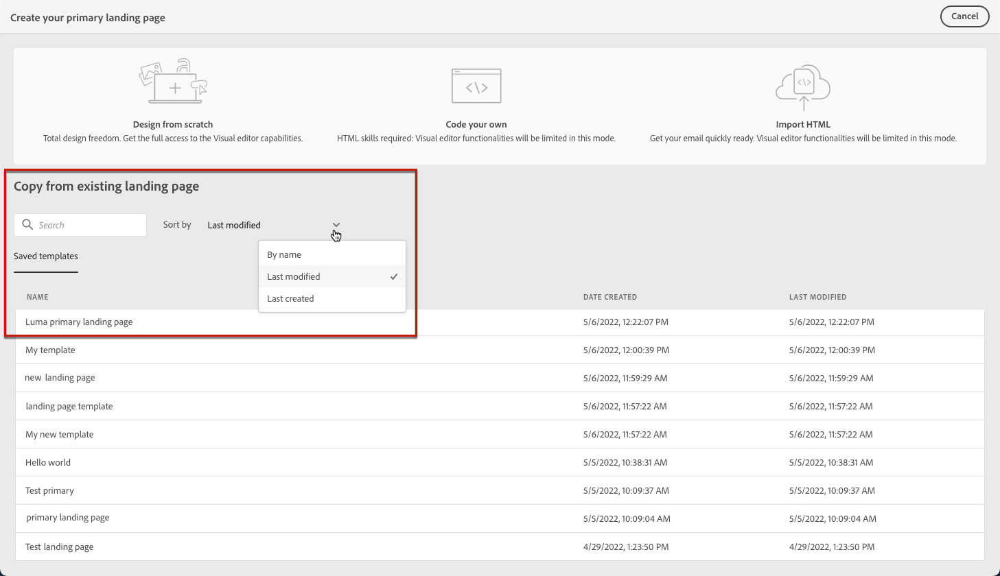

# Utilizzare i modelli di pagina di destinazione {#work-with-templates}

## Salvare una pagina come modello {#save-as-template}

Una volta progettato il tuo [contenuto della pagina di destinazione](lp-content.md), puoi salvarlo per un riutilizzo futuro. Per farlo, segui la procedura indicata di seguito.

1. Fai clic sui puntini di sospensione in alto a destra dello schermo.

1. Seleziona **[!UICONTROL Salva modello di progettazione]** dal menu a discesa.

   

1. Aggiungi un nome per questo modello.

   

1. Fai clic su **[!UICONTROL Salva]**.

La prossima volta che crei una pagina di destinazione, puoi utilizzare questo modello per creare il contenuto. Scopri come in [sezione](#use-saved-template) sotto.

## Utilizzare un modello salvato {#use-saved-template}

1. Apri [designer del contenuto della pagina di destinazione](design-lp.md). Viene visualizzato l’elenco di tutti i modelli salvati in precedenza.

1. Puoi ordinarli **[!UICONTROL Per nome]**, **[!UICONTROL Ultima modifica]** e **[!UICONTROL Ultima creazione]**.

   

1. Seleziona il modello desiderato dall’elenco.

1. Una volta selezionato, è possibile spostarsi tra tutti i modelli salvati utilizzando le frecce destra e sinistra.

   

1. Fai clic su **[!UICONTROL Utilizza questa pagina di destinazione]**.

1. Modifica il contenuto nel modo desiderato mediante la finestra di progettazione della pagina di destinazione.

>[!NOTE]
>
>I modelli di pagina principale e di pagina secondaria sono gestiti separatamente, il che significa che non è possibile utilizzare un modello di pagina principale per creare una pagina secondaria, e viceversa.
