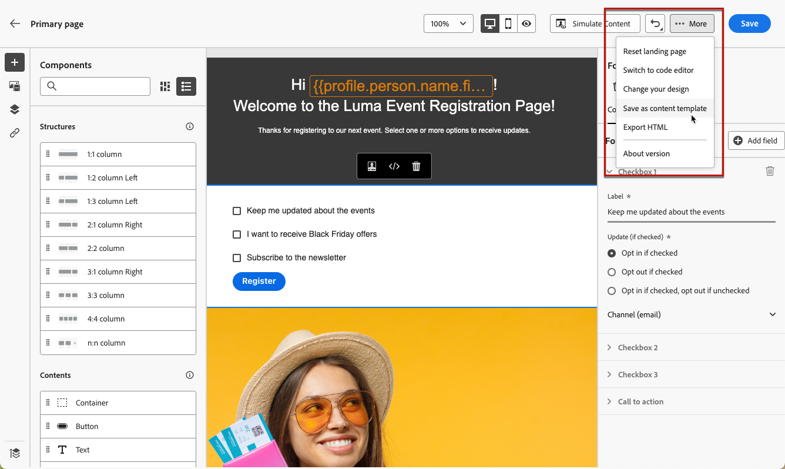

# Lavorare con i modelli di pagine di destinazione {#work-with-templates}

## Salvare una pagina come modello {#save-as-template}

Dopo aver progettato il contenuto della [pagina di destinazione](lp-content.md), puoi salvarlo per un riutilizzo futuro. Per farlo, segui la procedura indicata di seguito.

1. Fai clic sui puntini di sospensione in alto a destra.

1. Seleziona **[!UICONTROL Salva come modello di contenuto]** dal menu a discesa.

   

1. Aggiungi il nome da assegnare al modello.

   

1. Fai clic su **[!UICONTROL Salva]**.

La prossima volta che crei una pagina di destinazione, puoi utilizzare questo modello per creare i contenuti. Scopri come nella [sezione](#use-saved-template) di seguito.

## Utilizzare un modello salvato {#use-saved-template}

1. Apri la [finestra di progettazione del contenuto della pagina di destinazione](design-lp.md). Viene visualizzato l’elenco di tutti i modelli salvati in precedenza.

1. Puoi ordinarli **[!UICONTROL Per nome]**, **[!UICONTROL Ultima modifica]** e **[!UICONTROL Ultima creazione]**.

   

1. Seleziona il modello desiderato dall’elenco.

1. Una volta selezionato, è possibile spostarsi tra tutti i modelli salvati utilizzando le frecce destra e sinistra.

   

1. Fare clic su **[!UICONTROL Usa questo modello]**.

1. Modifica il contenuto nel modo desiderato utilizzando il designer della pagina di destinazione.

>[!NOTE]
>
>I modelli di pagina principale e i modelli di pagina secondaria vengono gestiti separatamente, il che significa che non è possibile utilizzare un modello di pagina principale per creare una pagina secondaria e viceversa.
