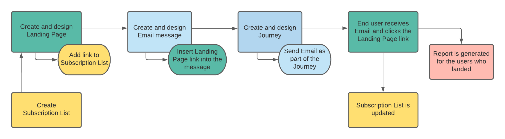
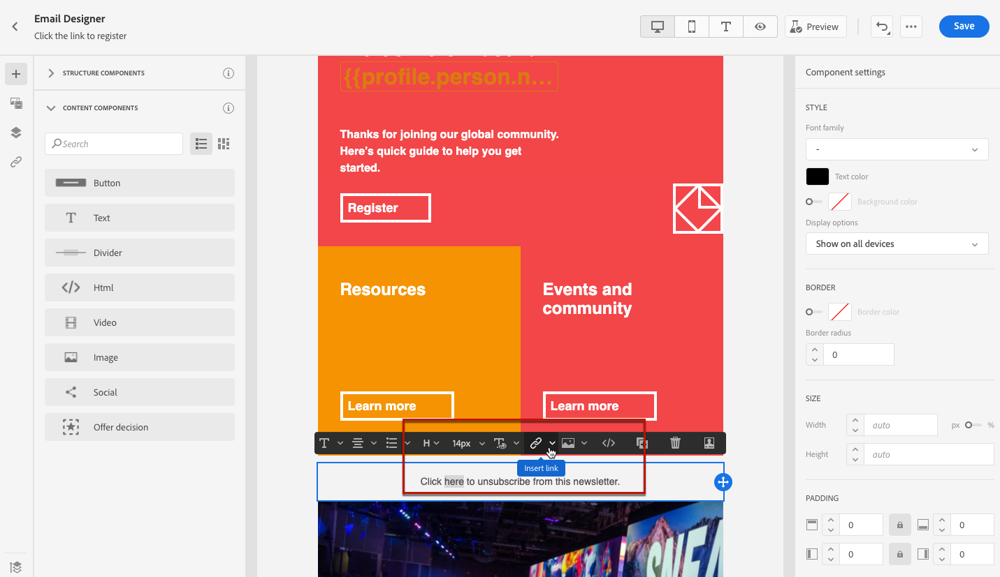
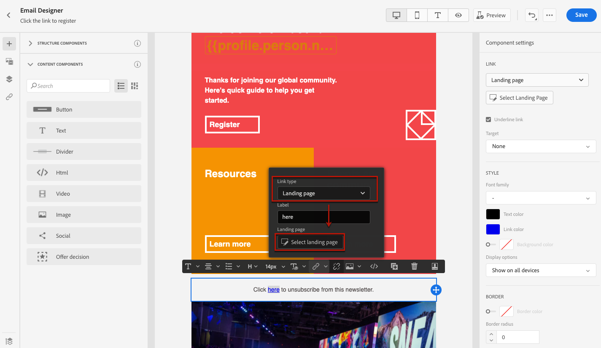

# Casi di utilizzo della pagina di destinazione {#lp-use-cases}

Di seguito sono riportati alcuni esempi di come è possibile utilizzare [!DNL Journey Optimizer] pagine di destinazione per consentire ai clienti di scegliere se accettare o meno alcune o tutte le tue comunicazioni.

<!--The main use cases are:
* Subscription to a service
* Opt-in
* Opt-out-->

## Iscrizione a un servizio {#subscription-to-a-service}

Uno dei casi d’uso più comuni consiste nell’invitare i clienti a [abbonamento a un servizio](subscription-list.md) (ad esempio una newsletter o un evento) tramite una pagina di destinazione. Le fasi principali sono presentate sul grafico seguente:

Ad esempio, supponiamo che il mese prossimo organizzi un evento e desideri avviare una campagna di registrazione degli eventi<!--to keep your customers that are interested updated on that event-->. A questo scopo, invierai un’e-mail con un collegamento a una pagina di destinazione che consentirà ai destinatari di registrarsi a questo evento. Gli utenti che si registrano verranno aggiunti all’elenco di sottoscrizioni creato a questo scopo.

### Configurare la pagina di destinazione {#set-up-lp}

1. Crea l&#39;elenco di iscrizione dell&#39;evento, che memorizzerà gli utenti registrati. Scopri come creare un elenco di abbonamenti [qui](subscription-list.md#define-subscription-list).

   

1. [Creare una pagina di destinazione](create-lp.md) per consentire ai destinatari di registrarsi all’evento.

1. Configurare la registrazione [pagina di destinazione principale](create-lp.md#configure-primary-page).

1. Durante la progettazione della [contenuto della pagina di destinazione](design-lp.md), seleziona l’elenco di sottoscrizioni creato per aggiornarlo con i profili che selezionano la casella di controllo della registrazione.

   

1. Crea una pagina di ringraziamento che verrà visualizzata ai destinatari dopo l’invio del modulo di registrazione. Scopri come configurare le pagine secondarie di destinazione [qui](create-lp.md#configure-subpages).

   

1. [Pubblica](create-lp.md#publish) la pagina di destinazione.

1. [Creare un messaggio e-mail](../messages/create-message.md) per annunciare che la registrazione è ora aperta per il tuo evento.

1. [Inserire un collegamento](../messages/message-tracking.md#insert-links) nel contenuto del messaggio. Seleziona **[!UICONTROL Landing page]** come **[!UICONTROL Link type]** e scegli la [pagina di destinazione](create-lp.md#configure-primary-page) creato per la registrazione.

   

1. Salva il contenuto e [pubblica il messaggio](../messages/publish-manage-message.md).

1. Invia il messaggio tramite un [percorso](../building-journeys/journey.md) per indirizzare il traffico verso la pagina di destinazione della registrazione.

   

   Una volta ricevuta l’e-mail, se i destinatari fanno clic sul collegamento alla pagina di destinazione, verranno indirizzati alla pagina di ringraziamento e verranno aggiunti all’elenco di iscrizione.

### Invia un messaggio e-mail di conferma {#send-confirmation-email}

Inoltre, puoi inviare un’e-mail di conferma ai destinatari che si sono registrati per l’evento. A questo scopo, segui i passaggi riportati qui sotto.

1. Crea un altro [percorso](../building-journeys/journey.md). Puoi eseguire questa operazione direttamente dalla pagina di destinazione facendo clic sul pulsante **[!UICONTROL Create journey]** pulsante . Puoi trovare ulteriori informazioni [qui](create-lp.md#configure-primary-page)

   

1. Apri **[!UICONTROL Events]** categoria e rilascia a **[!UICONTROL Segment Qualification]** nell’area di lavoro. Puoi trovare ulteriori informazioni [qui](../building-journeys/segment-qualification-events.md)

1. Fai clic in **[!UICONTROL Segment]** e selezionare l&#39;elenco di sottoscrizioni creato.

   

1. Seleziona l’e-mail di conferma desiderata e inviala attraverso il percorso.

   

Tutti gli utenti che si sono registrati al tuo evento riceveranno l’e-mail di conferma.

<!--The event registration's subscription list tracks the profiles who registered and you can send them targeted event updates.-->

## Rinuncia {#opt-out}

Per consentire ai destinatari di annullare l’iscrizione alle comunicazioni, puoi includere un collegamento a una pagina di destinazione di rinuncia nelle e-mail.

Ulteriori informazioni sulla gestione del consenso dei destinatari e sull’importanza di questo in [questa sezione](../messages/consent.md).

### Gestione degli opt-out {#opt-out-management}

Come requisito legale, è necessario dare ai destinatari la possibilità di annullare l’iscrizione alla ricezione di comunicazioni da parte di un marchio. Ulteriori informazioni sulle normative applicabili sono disponibili nella [documentazione di Experience Platform](https://experienceleague.adobe.com/docs/experience-platform/privacy/regulations/overview.html?lang=it#regulations){target=&quot;_blank&quot;}.

Pertanto, devi sempre includere un **collegamento per l’annullamento dell’iscrizione** in ogni e-mail inviata ai destinatari:

* Facendo clic su questo collegamento, i destinatari verranno indirizzati a una pagina di destinazione contenente un pulsante per confermare l’opt-out.
* Facendo clic sul pulsante di rinuncia, i dati del profilo vengono aggiornati con queste informazioni.

### Configurare la rinuncia {#configure-opt-out}

Per consentire ai destinatari di un’e-mail di annullare l’iscrizione alle comunicazioni tramite una pagina di destinazione, segui i passaggi riportati di seguito.

1. Crea la pagina di destinazione. [Ulteriori informazioni](create-lp.md)

1. Definisci la pagina principale. [Ulteriori informazioni](create-lp.md#configure-primary-page)

1. [Progettazione](design-lp.md) il contenuto della pagina principale: utilizza la pagina di destinazione specifica **[!UICONTROL Form]** componente, definire un **[!UICONTROL Opt-out]** seleziona e scegli di aggiornare **[!UICONTROL Channel (email)]**: il profilo che controlla la casella di rinuncia nella pagina di destinazione verrà escluso da tutte le comunicazioni.

   

   <!--You can also build your own landing page and host it on the third-party system of your choice. To keep?-->

1. Aggiungi una conferma [sottopagine](create-lp.md#configure-subpages) che verranno visualizzati agli utenti che inviano il modulo.

   

   >[!NOTE]
   >
   >Assicurati di fare riferimento alla pagina secondaria nella pagina principale **[!UICONTROL Call to action]** della sezione **[!UICONTROL Form]** componente. [Ulteriori informazioni](design-lp.md)

1. Dopo aver configurato e definito il contenuto delle pagine, [pubblicare](create-lp.md#publish) la pagina di destinazione.

   

1. [Creare un messaggio e-mail](../messages/create-message.md) in [!DNL Journey Optimizer].

1. Selezionare il testo nel contenuto e [inserire un collegamento](../messages/message-tracking.md#insert-links) mediante la barra degli strumenti contestuale. Puoi anche utilizzare un collegamento su un pulsante.

   

1. Seleziona **[!UICONTROL Landing page]** dal **[!UICONTROL Link type]** elenco a discesa e seleziona il [pagina di destinazione](create-lp.md#configure-primary-page) creato per la rinuncia.

   

1. Salva il contenuto e [pubblica il messaggio](../messages/publish-manage-message.md).

1. Invia il tuo messaggio attraverso un percorso. [Ulteriori informazioni](../building-journeys/journey.md).

1. Una volta ricevuto il messaggio, se un destinatario fa clic sul collegamento di annullamento all’abbonamento nell’e-mail, viene visualizzata la pagina di destinazione.

   

   Se il destinatario seleziona la casella e invia il modulo:

   * Il destinatario con rinuncia viene reindirizzato alla schermata del messaggio di conferma.

   * I dati del profilo vengono aggiornati e non riceveranno comunicazioni dal tuo marchio a meno che non siano nuovamente abbonati.

Per verificare che la scelta del profilo corrispondente sia stata aggiornata, passa ad Experience Platform e accedi al profilo selezionando uno spazio dei nomi di identità e un valore di identità corrispondente. Per ulteriori informazioni, consulta la [documentazione di Experience Platform](https://experienceleague.adobe.com/docs/experience-platform/profile/ui/user-guide.html?lang=it#getting-started){target=&quot;_blank&quot;}.

Nella scheda **[!UICONTROL Attributes]**, puoi vedere che il valore di **[!UICONTROL choice]** è stato modificato in **[!UICONTROL no]**.

<!--

### Other ways to opt out

You can also enable your recipients to unsubscribe whithout using landing pages.

* **One-click opt-out**

    You can add a one-click opt-out link into your email content. This will enable your recipients to quickly unsubscribe from your communications, without being redirected to a landing page where they need to confirm opting out. [Learn more](../messages/message-tracking.md#one-click-opt-out-link)

* **Unsubscribe link in header**

    If the recipients' email client supports displaying an unsubscribe link in the email header, emails sent with [!DNL Journey Optimizer] automatically include this link. [Learn more](../messages/consent.md#unsubscribe-email)
-->
