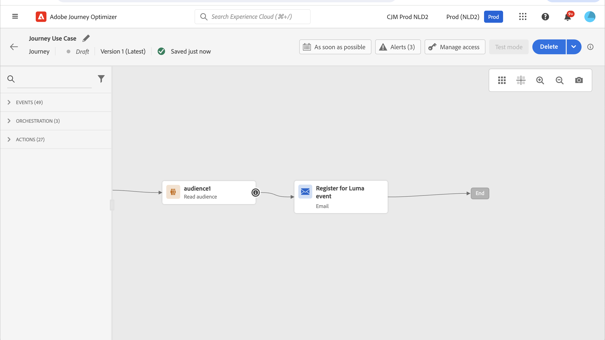
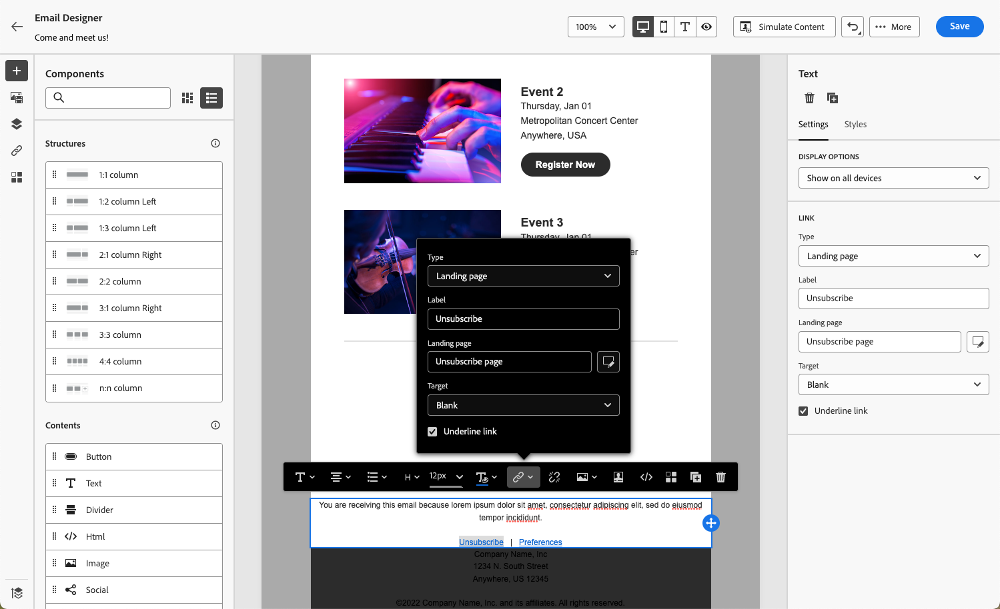
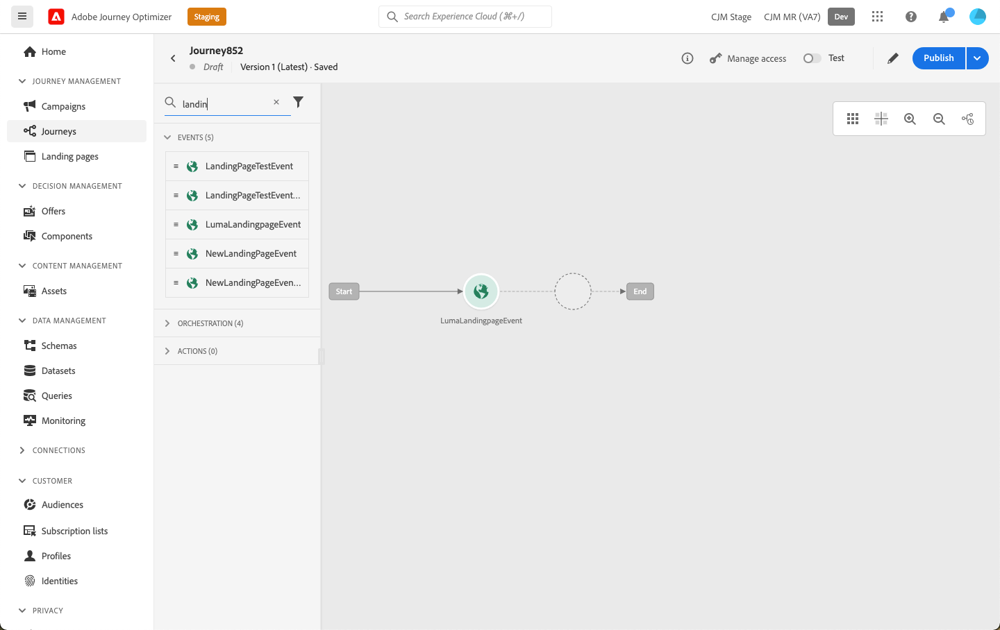

# Casi di utilizzo della pagina di destinazione {#lp-use-cases}

Di seguito sono riportati alcuni esempi di come è possibile utilizzare [!DNL Journey Optimizer] pagine di destinazione per consentire ai clienti di scegliere se accettare o meno alcune o tutte le tue comunicazioni.

## Iscrizione a un servizio {#subscription-to-a-service}

Uno dei casi d’uso più comuni consiste nell’invitare i clienti a [abbonamento a un servizio](subscription-list.md) (ad esempio una newsletter o un evento) tramite una pagina di destinazione. Le fasi principali sono presentate sul grafico seguente:

Ad esempio, supponiamo che il mese prossimo organizzi un evento e desideri avviare una campagna di registrazione degli eventi<!--to keep your customers that are interested updated on that event-->. A questo scopo, invierai un’e-mail con un collegamento a una pagina di destinazione che consentirà ai destinatari di registrarsi a questo evento. Gli utenti che si registrano verranno aggiunti all’elenco di sottoscrizioni creato a questo scopo.

### Configurare una pagina di destinazione {#set-up-lp}

1. Crea l&#39;elenco di iscrizione dell&#39;evento, che memorizzerà gli utenti registrati. Scopri come creare un elenco di abbonamenti [qui](subscription-list.md#define-subscription-list).

   

1. [Creare una pagina di destinazione](create-lp.md) per consentire ai destinatari di registrarsi all’evento.

   

1. Configurare la registrazione [pagina di destinazione principale](create-lp.md#configure-primary-page).

1. Durante la progettazione della [contenuto della pagina di destinazione](design-lp.md), seleziona l’elenco di sottoscrizioni creato per aggiornarlo con i profili che selezionano la casella di controllo della registrazione.

   

1. Crea una pagina di ringraziamento che verrà visualizzata ai destinatari dopo l’invio del modulo di registrazione. Scopri come configurare le pagine secondarie di destinazione [qui](create-lp.md#configure-subpages).

   

1. [Pubblica](create-lp.md#publish) la pagina di destinazione.

1. In una [percorso](../building-journeys/journey.md), aggiungi un **E-mail** attività per indirizzare il traffico alla pagina di destinazione della registrazione.

   

1. [Progettazione dell’e-mail](../messages/get-started-content.md) per annunciare che la registrazione è ora aperta per il tuo evento.

1. [Inserire un collegamento](../design/message-tracking.md#insert-links) nel contenuto del messaggio. Seleziona **[!UICONTROL Pagina di destinazione]** come **[!UICONTROL Tipo di collegamento]** e scegli la [pagina di destinazione](create-lp.md#configure-primary-page) creato per la registrazione.

   

   >[!NOTE]
   >
   >Per poter inviare il messaggio, accertati che la pagina di destinazione selezionata non sia ancora scaduta. Scopri come aggiornare la data di scadenza [in questa sezione](create-lp.md#configure-primary-page).

   Una volta ricevuta l’e-mail, se i destinatari fanno clic sul collegamento alla pagina di destinazione, verranno indirizzati alla pagina di ringraziamento e verranno aggiunti all’elenco di iscrizione.

### Invia un messaggio e-mail di conferma {#send-confirmation-email}

Inoltre, puoi inviare un’e-mail di conferma ai destinatari che si sono registrati per l’evento. A questo scopo, segui i passaggi riportati qui sotto.

1. Crea un altro [percorso](../building-journeys/journey.md). Puoi eseguire questa operazione direttamente dalla pagina di destinazione facendo clic sul pulsante **[!UICONTROL Crea percorso]** pulsante . Puoi trovare ulteriori informazioni [qui](create-lp.md#configure-primary-page)

   

1. Apri **[!UICONTROL Eventi]** categoria e rilascia a **[!UICONTROL Qualificazione del segmento]** nell’area di lavoro. Puoi trovare ulteriori informazioni [qui](../building-journeys/segment-qualification-events.md)

1. Fai clic in **[!UICONTROL Segmento]** e selezionare l&#39;elenco di sottoscrizioni creato.

   

1. Aggiungi un’e-mail di conferma e inviala tramite il percorso.

   

Tutti gli utenti che si sono registrati al tuo evento riceveranno l’e-mail di conferma.

<!--The event registration's subscription list tracks the profiles who registered and you can send them targeted event updates.-->

## Rinuncia {#opt-out}

Per consentire ai destinatari di annullare l’iscrizione alle comunicazioni, puoi includere un collegamento a una pagina di destinazione di rinuncia nelle e-mail.

Ulteriori informazioni sulla gestione del consenso dei destinatari e sull’importanza di questo in [questa sezione](../privacy/opt-out.md).

### Gestione degli opt-out {#opt-out-management}

Come requisito legale, è necessario dare ai destinatari la possibilità di annullare l’iscrizione alla ricezione di comunicazioni da parte di un marchio. Ulteriori informazioni sulle normative applicabili sono disponibili nella [documentazione di Experience Platform](https://experienceleague.adobe.com/docs/experience-platform/privacy/regulations/overview.html?lang=it#regulations){target=&quot;_blank&quot;}.

Pertanto, devi sempre includere un **collegamento che consenta di annullare l’iscrizione** in ogni e-mail inviata ai destinatari:

* Facendo clic su questo collegamento, i destinatari verranno indirizzati a una pagina di destinazione contenente un pulsante per confermare l’opt-out.
* Facendo clic sul pulsante di rinuncia, i dati del profilo vengono aggiornati con queste informazioni.

### Configurare la rinuncia {#configure-opt-out}

Per consentire ai destinatari di un’e-mail di annullare l’iscrizione alle comunicazioni tramite una pagina di destinazione, segui i passaggi riportati di seguito.

1. Crea la pagina di destinazione. [Ulteriori informazioni](create-lp.md)

1. Definisci la pagina principale. [Ulteriori informazioni](create-lp.md#configure-primary-page)

1. [Progettazione](design-lp.md) il contenuto della pagina principale: utilizza la pagina di destinazione specifica **[!UICONTROL Modulo]** componente, definire un **[!UICONTROL Rinuncia]** seleziona e scegli di aggiornare **[!UICONTROL Canale (e-mail)]**: il profilo che controlla la casella di rinuncia nella pagina di destinazione verrà escluso da tutte le comunicazioni.

   

   <!--You can also build your own landing page and host it on the third-party system of your choice.-->

1. Aggiungi una conferma [sottopagine](create-lp.md#configure-subpages) che verranno visualizzati agli utenti che inviano il modulo.

   

   >[!NOTE]
   >
   >Assicurati di fare riferimento alla pagina secondaria nella pagina principale **[!UICONTROL Invito all&#39;azione]** della sezione **[!UICONTROL Modulo]** componente. [Ulteriori informazioni](design-lp.md)

1. Dopo aver configurato e definito il contenuto delle pagine, [pubblicare](create-lp.md#publish) la pagina di destinazione.

   

1. [Creare un messaggio e-mail](../messages/get-started-content.md) in un percorso.

1. Seleziona il testo nel contenuto e [inserisci un collegamento](../design/message-tracking.md#insert-links) utilizzando la barra degli strumenti contestuale. Puoi anche utilizzare un collegamento su un pulsante.

   

1. Seleziona **[!UICONTROL Pagina di destinazione]** dal **[!UICONTROL Tipo di collegamento]** elenco a discesa e seleziona il [pagina di destinazione](create-lp.md#configure-primary-page) creato per la rinuncia.

   

   >[!NOTE]
   >
   >Per poter inviare il messaggio, accertati che la pagina di destinazione selezionata non sia ancora scaduta. Scopri come aggiornare la data di scadenza [in questa sezione](create-lp.md#configure-primary-page).

1. Pubblica ed esegui il percorso. [Ulteriori informazioni](../building-journeys/journey.md).

1. Una volta ricevuto il messaggio, se un destinatario fa clic sul collegamento di annullamento all’abbonamento nell’e-mail, viene visualizzata la pagina di destinazione.

   

   Se il destinatario seleziona la casella e invia il modulo:

   * Il destinatario con rinuncia viene reindirizzato alla schermata del messaggio di conferma.

   * I dati del profilo vengono aggiornati e non riceveranno comunicazioni dal tuo marchio a meno che non siano nuovamente abbonati.

Per verificare che la scelta del profilo corrispondente sia stata aggiornata, passa ad Experience Platform e accedi al profilo selezionando uno spazio dei nomi delle identità e un valore di identità corrispondente. Per ulteriori informazioni, consulta la [documentazione di Experience Platform](https://experienceleague.adobe.com/docs/experience-platform/profile/ui/user-guide.html?lang=it#getting-started){target=&quot;_blank&quot;}.

In **[!UICONTROL Attributi]** è possibile visualizzare il valore per **[!UICONTROL scelta]** è stato modificato in **[!UICONTROL no]**.

<!--

### Other ways to opt out

You can also enable your recipients to unsubscribe whithout using landing pages.

* **One-click opt-out**

    You can add a one-click opt-out link into your email content. This will enable your recipients to quickly unsubscribe from your communications, without being redirected to a landing page where they need to confirm opting out. [Learn more](../privacy/opt-out.md#one-click-opt-out-link)

* **Unsubscribe link in header**

    If the recipients' email client supports displaying an unsubscribe link in the email header, emails sent with [!DNL Journey Optimizer] automatically include this link. [Learn more](../privacy/opt-out.md#unsubscribe-header)

////////

## Leverage landing page submission event {#leverage-lp-event}

You can use information that was submitted on a landing page to send communications to your customers. For example, if a user subscribes to a given subscription list, you can leverage that information to send an email recommending other subscription lists to that user.

To do this, you need to create an event containing the landing page submission information and use it in a journey. Follow the steps below.

1. Go to **[!UICONTROL Administration]** > **[!UICONTROL Configurations]**, and in the **[!UICONTROL Events]** section, select **[!UICONTROL Manage]**.

    

1. The list of events displays. Select **[!UICONTROL Create Event]**.

    

1. The event configuration pane opens on the right side of the screen. Configure a rule-based unitary event. [Learn more](../event/about-creating.md)

1. Define the schema: select **[!UICONTROL AJO Email Tracking Experience Event Schema v.1]** (available by default in [!DNL Journey Optimizer]).

    

1. In the **[!UICONTROL Fields]** section, select the following elements:

    * **[!UICONTROL _experience]** > **[!UICONTROL customerJourneyManagement]** > **[!UICONTROL messageInteraction]** > **[!UICONTROL Interaction Type]**
    
    * **[!UICONTROL _experience]** > **[!UICONTROL customerJourneyManagement]** > **[!UICONTROL messageInteraction]** > **[!UICONTROL Landing Page Details]** > **[!UICONTROL Landing Page ID]**

    

1. Click inside the **[!UICONTROL Event ID condition]** field. Using the simple expression editor, define the condition for the **[!UICONTROL Interaction Type]** and **[!UICONTROL Landing Page ID]** fields. This will be used by the system to identify the events that will trigger your journey.

    

    >[!NOTE]
    >
    >To find the landing page ID, you can insert the landing page as a link into an email and select the source code from the contextual toolbar to display the landing page information.
    >
    >

1. Save your changes.

1. Create a [journey](../building-journeys/journey.md). You can do it directly from the landing page by clicking the **[!UICONTROL Create journey]** button. Learn more [here](create-lp.md#configure-primary-page)

    

1. In the journey, unfold the **[!UICONTROL Events]** category and drop the event that you created into the canvas. Learn more [here](../building-journeys/segment-qualification-events.md)

    

1. Unfold the **[!UICONTROL Actions]** category and drop an email action into the canvas.

    

///How do you use the information from the event to send an email to the users? -->
