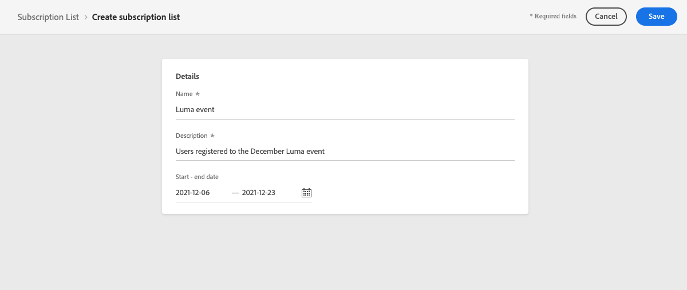

# Casi di utilizzo della pagina di destinazione {#lp-use-cases}

Di seguito sono riportati alcuni esempi di come utilizzare le pagine di destinazione di [!DNL Journey Optimizer] per consentire ai clienti di rinunciare alla ricezione di alcune o di tutte le comunicazioni.

## Abbonati a un servizio {#subscription-to-a-service}

Uno dei casi d&#39;uso più comuni consiste nell&#39;invitare i clienti a [abbonarsi a un servizio](subscription-list.md) (ad esempio una newsletter o un evento) tramite una pagina di destinazione. I passaggi principali sono illustrati nel grafico seguente:

Si supponga, ad esempio, di organizzare un evento il mese prossimo e di voler avviare una campagna di registrazione dell&#39;evento<!--to keep your customers that are interested updated on that event-->. A questo scopo, stai per inviare un’e-mail contenente un collegamento a una pagina di destinazione che consentirà ai destinatari di registrarsi per questo evento. Gli utenti che si registrano verranno aggiunti all&#39;elenco di iscrizioni creato a questo scopo.

### Configurare una pagina di destinazione {#set-up-lp}

Per impostare una pagina di destinazione per la registrazione degli eventi, crea un elenco di iscrizioni, progetta la pagina di destinazione con un modulo di registrazione e configura le pagine e le impostazioni necessarie. Segui questi passaggi:

1. Crea l&#39;elenco di iscrizioni della registrazione dell&#39;evento, in cui verranno archiviati gli utenti registrati. Scopri come creare un elenco di iscrizioni [qui](subscription-list.md#define-subscription-list).

   

1. [Crea una pagina di destinazione](create-lp.md) per consentire ai destinatari di registrarsi all&#39;evento.

   

1. Configura la registrazione [pagina di destinazione principale](create-lp.md#configure-primary-page).

1. Durante la progettazione del contenuto della [pagina di destinazione](design-lp.md), seleziona l&#39;elenco di iscrizioni creato per aggiornarlo con i profili che selezionano la casella di controllo di registrazione.

   

1. Crea una pagina di ringraziamento che verrà visualizzata ai destinatari dopo l’invio del modulo di registrazione. Scopri come configurare le pagine secondarie di destinazione [qui](create-lp.md#configure-subpages).

   

1. [Pubblica](create-lp.md#publish-landing-page) la pagina di destinazione.

1. In un [percorso](../building-journeys/journey.md), aggiungi un&#39;attività **E-mail** per indirizzare il traffico alla pagina di destinazione della registrazione.

   

1. [Progetta l&#39;e-mail](../email/get-started-email-design.md) per annunciare che la registrazione è ora aperta per il tuo evento.

1. [Inserisci un collegamento](../email/message-tracking.md#insert-links) nel contenuto del messaggio. Seleziona **[!UICONTROL Pagina di destinazione]** come **[!UICONTROL Tipo di collegamento]** e scegli la [Pagina di destinazione](create-lp.md#configure-primary-page) creata per la registrazione.

   

   >[!NOTE]
   >
   >Per poter inviare il messaggio, assicurati che la pagina di destinazione selezionata non sia ancora scaduta. Scopri come aggiornare la data di scadenza [ in questa sezione](create-lp.md#configure-primary-page).

   Una volta ricevuta l’e-mail, se i destinatari fanno clic sul collegamento alla pagina di destinazione, verranno indirizzati alla pagina di ringraziamento e verranno aggiunti all’elenco di iscrizioni.

### Invia un’e-mail di conferma {#send-confirmation-email}

Inoltre, puoi inviare un’e-mail di conferma ai destinatari che si sono registrati per l’evento. A questo scopo, segui i passaggi riportati qui sotto.

1. Crea un altro [percorso](../building-journeys/journey.md). Puoi eseguire questa operazione direttamente dalla pagina di destinazione facendo clic sul pulsante **[!UICONTROL Crea percorso]**. [Ulteriori informazioni](create-lp.md#configure-primary-page)

   

1. Espandi la categoria **[!UICONTROL Eventi]** e rilascia un&#39;attività **[!UICONTROL Qualifica pubblico]** nell&#39;area di lavoro. [Ulteriori informazioni](../building-journeys/audience-qualification-events.md)

1. Fai clic nel campo **[!UICONTROL Pubblico]** e seleziona l&#39;elenco iscrizioni creato.

   

1. Aggiungi un’e-mail di conferma a tua scelta e inviala tramite il percorso.

   

Tutti gli utenti che si sono registrati all’evento riceveranno l’e-mail di conferma.

<!--The event registration's subscription list tracks the profiles who registered and you can send them targeted event updates.-->

## Pagina di destinazione di rinuncia {#opt-out}

Per consentire ai destinatari di annullare l’iscrizione alle comunicazioni, puoi includere nelle e-mail un collegamento a una pagina di destinazione di rinuncia.

>[!NOTE]
>
>Ulteriori informazioni sulla gestione del consenso dei destinatari e sui motivi per cui è importante in [questa sezione](../privacy/opt-out.md).

### Gestione degli opt-out {#opt-out-management}

Come requisito legale, è necessario dare ai destinatari la possibilità di annullare l’iscrizione alla ricezione di comunicazioni da parte di un marchio. Ulteriori informazioni sulle normative applicabili sono disponibili nella [documentazione di Experience Platform](https://experienceleague.adobe.com/docs/experience-platform/privacy/regulations/overview.html?lang=it#regulations){target="_blank"}.

Pertanto, devi sempre includere un **collegamento per l’annullamento dell’iscrizione** in ogni e-mail inviata ai destinatari:

* Facendo clic su questo collegamento, i destinatari verranno indirizzati a una pagina di destinazione contenente un pulsante per confermare l’opt-out.
* Facendo clic sul pulsante di opt-out, i dati del profilo verranno aggiornati con queste informazioni.

### Configurare la rinuncia e-mail {#configure-opt-out}

Per consentire ai destinatari di un’e-mail di annullare l’abbonamento alle comunicazioni tramite una pagina di destinazione, segui i passaggi seguenti:

1. Crea la pagina di destinazione. [Ulteriori informazioni](create-lp.md)

1. Definisci la pagina principale. [Ulteriori informazioni](create-lp.md#configure-primary-page)

1. [Progetta](design-lp.md) il contenuto della pagina principale: utilizza il componente **[!UICONTROL Modulo]** specifico per la pagina di destinazione, definisci una casella di controllo **[!UICONTROL Rinuncia]** e scegli di aggiornare **[!UICONTROL Canale (e-mail)]**: il profilo che controlla la casella di rinuncia nella pagina di destinazione verrà escluso da tutte le comunicazioni.

   

   <!--You can also build your own landing page and host it on the third-party system of your choice.-->

1. Aggiungi una [pagina secondaria](create-lp.md#configure-subpages) di conferma che verrà visualizzata agli utenti che inviano il modulo.

   

   >[!NOTE]
   >
   >Assicurati di fare riferimento alla pagina secondaria nella sezione **[!UICONTROL Call to action]** della pagina principale del componente **[!UICONTROL Form]**. [Ulteriori informazioni](design-lp.md)

1. Dopo aver configurato e definito il contenuto delle pagine, [pubblica](create-lp.md#publish-landing-page) la pagina di destinazione.

1. [Creazione di un messaggio e-mail](../email/get-started-email-design.md) in un percorso.

1. Seleziona il testo nel contenuto e [inserisci un collegamento](../email/message-tracking.md#insert-links) utilizzando la barra degli strumenti contestuale. Puoi anche utilizzare un collegamento su un pulsante.

1. Seleziona **[!UICONTROL Pagina di destinazione]** dall&#39;elenco a discesa **[!UICONTROL Tipo di collegamento]** e seleziona la [pagina di destinazione](create-lp.md#configure-primary-page) creata per la rinuncia.

   

   >[!NOTE]
   >
   >Per poter inviare il messaggio, assicurati che la pagina di destinazione selezionata non sia ancora scaduta. Scopri come aggiornare la data di scadenza [ in questa sezione](create-lp.md#configure-primary-page).

1. Pubblica ed esegui il percorso. [Ulteriori informazioni](../building-journeys/journey.md).

1. Una volta ricevuto il messaggio, se un destinatario fa clic sul collegamento per annullare l’abbonamento nell’e-mail, viene visualizzata la pagina di destinazione.

   

   >[!WARNING]
   >
   >Fai clic sul collegamento per annullare l’iscrizione nell’e-mail per aprire solo la pagina di destinazione. Il destinatario deve **inviare il modulo facendo clic sul pulsante di rinuncia nella pagina di destinazione** per completare l&#39;annullamento dell&#39;abbonamento e aggiornare il consenso al profilo.

   Se il destinatario seleziona la casella e invia il modulo:

   * Il destinatario che ha rinunciato viene reindirizzato alla schermata del messaggio di conferma.

   * I dati del profilo vengono aggiornati e non riceveranno comunicazioni dal brand a meno che non si rinnovi l’abbonamento.

Per verificare che la scelta del profilo corrispondente sia stata aggiornata, passa ad Experience Platform e accedi al profilo selezionando uno spazio dei nomi di identità e un valore di identità corrispondente. Per ulteriori informazioni, consulta la [documentazione di Experience Platform](https://experienceleague.adobe.com/docs/experience-platform/profile/ui/user-guide.html?lang=it#getting-started){target="_blank"}.

Nella scheda **[!UICONTROL Attributi]**, puoi vedere che il valore di **[!UICONTROL scelta]** è stato modificato in **[!UICONTROL no]**.

Le informazioni di rinuncia sono memorizzate nel **Set di dati del servizio di consenso**. [Ulteriori informazioni sui set di dati](../data/get-started-datasets.md)

>[!NOTE]
>
>Se il metodo di unione per il criterio di unione predefinito [Adobe Experience Platform](https://experienceleague.adobe.com/docs/experience-platform/profile/home.html?lang=it){target="_blank"} **[!UICONTROL Profili]** è **[!UICONTROL Precedenza set di dati]**, assicurati di abilitare il **[!UICONTROL Set di dati del servizio di consenso di AJO]** e di assegnargli l&#39;ordine di priorità nel criterio di unione. [Ulteriori informazioni](https://experienceleague.adobe.com/docs/experience-platform/profile/merge-policies/ui-guide.html#dataset-precedence-profile){target="_blank"}
>
>Anche se non sono stati aggiunti batch a questo set di dati, questo conterrà comunque le informazioni di consenso/rinuncia.

**Vedere anche:**

* [Rinuncia con un clic](../email/email-opt-out.md#one-click-opt-out)
* [Collegamento per la rinuncia nell’intestazione dell’e-mail](../email/email-opt-out.md#unsubscribe-header)

<!--

### Other ways to opt out

You can also enable your recipients to unsubscribe whithout using landing pages.

* **One-click opt-out**

    You can add a one-click opt-out link into your email content. This will enable your recipients to quickly unsubscribe from your communications, without being redirected to a landing page where they need to confirm opting out. [Learn more](../privacy/opt-out.md#opt-out-personalization)

* **Unsubscribe link in header**

    If the recipients' email client supports displaying an unsubscribe link in the email header, emails sent with [!DNL Journey Optimizer] automatically include this link. [Learn more](../email/email-opt-out.md#unsubscribe-header)

-->

## Sfruttare l’evento di invio della pagina di destinazione {#leverage-lp-event}

Puoi utilizzare le informazioni inviate in una pagina di destinazione per eseguire ulteriori azioni. Ad esempio, se un utente si iscrive a un determinato elenco di abbonamenti, puoi sfruttare tali informazioni per inviare all’utente un messaggio e-mail di raccomandazione di altri elenchi di abbonamenti.

A questo scopo, devi creare un [evento unitario basato su regole](../event/about-creating.md) basato sullo **[!UICONTROL schema AJO Email Tracking Experience Event]** contenente le informazioni di invio e [utilizzare questo evento in un percorso](../building-journeys/general-events.md).

>[!NOTE]
>
>Quando si lavora con gli eventi di invio della pagina di destinazione, tenere presente che il campo evento `interactionType` potrebbe non sempre riflettere con precisione l&#39;azione utente specifica. Per determinare con precisione se un utente ha rinunciato, effettuato l&#39;abbonamento o eseguito un&#39;altra azione, verificare sempre gli attributi effettivi del profilo (ad esempio le preferenze di consenso) o i valori dei campi modulo, anziché affidarsi esclusivamente all&#39;evento `interactionType`.

<!--DETAILED STEPS TBC:

Follow the steps below.

1. Go to **[!UICONTROL Administration]** > **[!UICONTROL Configurations]**, and in the **[!UICONTROL Events]** section, select **[!UICONTROL Manage]**.

    

1. The list of events displays. Select **[!UICONTROL Create Event]**.

    

1. The event configuration pane opens on the right side of the screen. Configure a rule-based unitary event. [Learn more](../event/about-creating.md)

1. Define the schema: select **[!UICONTROL AJO Email Tracking Experience Event Schema v.1]** (available by default in [!DNL Journey Optimizer]).

    

1. In the **[!UICONTROL Fields]** section, select the following elements:

    * **[!UICONTROL _experience]** > **[!UICONTROL customerJourneyManagement]** > **[!UICONTROL messageInteraction]** > **[!UICONTROL Interaction Type]**
    
    * **[!UICONTROL _experience]** > **[!UICONTROL customerJourneyManagement]** > **[!UICONTROL messageInteraction]** > **[!UICONTROL Landing Page Details]** > **[!UICONTROL Landing Page ID]**

    

1. Click inside the **[!UICONTROL Event ID condition]** field. Using the simple personalization editor, define the condition for the **[!UICONTROL Interaction Type]** and **[!UICONTROL Landing Page ID]** fields. This will be used by the system to identify the events that will trigger your journey.

    

    >[!NOTE]
    >
    >To find the landing page ID, you can insert the landing page as a link into an email and select the source code from the contextual toolbar to display the landing page information.
    >
    >

1. Save your changes.

1. Create a [journey](../building-journeys/journey.md). You can do it directly from the landing page by clicking the **[!UICONTROL Create journey]** button. Learn more [here](create-lp.md#configure-primary-page)

    

1. In the journey, unfold the **[!UICONTROL Events]** category and drop the event that you created into the canvas. Learn more [here](../building-journeys/audience-qualification-events.md)

    

1. Unfold the **[!UICONTROL Actions]** category and drop an email action into the canvas.

    

///How do you use the information from the event to send an email to the users? -->
