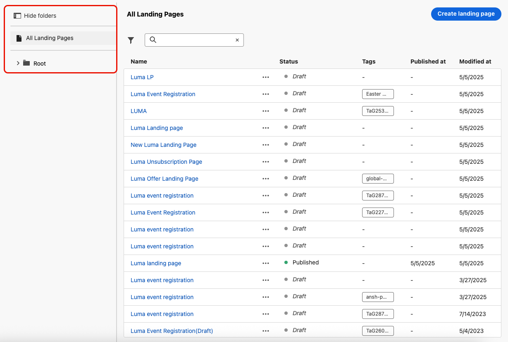

# Gestire le pagine di destinazione {#manage-lp}

## Accedere alle pagine di destinazione {#access-landing-pages}

Per accedere all&#39;elenco delle pagine di destinazione, seleziona **[!UICONTROL Gestione contenuto]** > **[!UICONTROL Pagine di destinazione]** dal menu a sinistra.

Vengono visualizzate tutte le pagine di destinazione esistenti.

Il riquadro a sinistra consente di organizzare le pagine di destinazione in cartelle. Per impostazione predefinita, vengono visualizzati tutti gli elementi. Quando selezioni una cartella, vengono visualizzate solo le pagine di destinazione e le cartelle incluse nella cartella selezionata. [Ulteriori informazioni](#folders)

Per trovare un elemento specifico, inizia a digitare un nome nel campo di ricerca. Quando viene selezionata una [cartella](#folders), la ricerca viene applicata a tutte le pagine di destinazione o cartelle nel primo livello della gerarchia della cartella<!--(not nested items)-->.

Puoi filtrare le pagine di destinazione in base al loro stato, alla data di modifica o ai tag.

Da questo elenco, puoi fare clic sui tre punti accanto a una pagina di destinazione e selezionare l’azione desiderata:

* Per le [pagine di destinazione pubblicate](create-lp.md#publish-landing-page), accedi al [report pagina di destinazione](../reports/lp-report-global-cja.md) e alle [ultime 24 ore dal vivo](../reports/lp-report-live.md).

* **Elimina** e **Annulla pubblicazione** di una pagina di destinazione. Impossibile eliminare una pagina di destinazione [pubblicata](create-lp.md#publish-landing-page). Per eliminarlo, devi prima annullarne la pubblicazione.

  >[!CAUTION]
  >
  >Se annulli la pubblicazione di una pagina di destinazione a cui viene fatto riferimento in un messaggio, il collegamento alla pagina di destinazione verrà interrotto e gli utenti riceveranno una pagina di errore se tentano di accedervi.

* **Duplica** qualsiasi pagina di destinazione.

* Modifica i [tag](../start/search-filter-categorize.md#tags) associati a una pagina di destinazione.

* Sposta la pagina di destinazione in una cartella. [Ulteriori informazioni](#folders)

## Utilizzare le cartelle per gestire le pagine di destinazione {#folders}

>[!CONTEXTUALHELP]
>id="ajo_lp_folders"
>title="Organizzare le pagine di destinazione in cartelle"
>abstract="Utilizza le cartelle per categorizzare e gestire le pagine di destinazione in base alle esigenze della tua organizzazione."

Per navigare facilmente nelle pagine di destinazione, puoi utilizzare le cartelle per organizzarle in modo più efficace in una gerarchia strutturata. Questo consente di categorizzare e gestire gli articoli in base alle esigenze dell&#39;organizzazione.

1. Fare clic sul pulsante **[!UICONTROL Tutte le pagine di destinazione]** per visualizzare tutti gli elementi creati in precedenza senza il raggruppamento di cartelle.

   

1. Fare clic sulla cartella **[!UICONTROL Root]** per visualizzare tutte le cartelle create.

   >[!NOTE]
   >
   >Se non hai ancora creato le cartelle, vengono visualizzate tutte le pagine di destinazione.

1. Fare clic su una cartella all&#39;interno della cartella **[!UICONTROL Root]** per visualizzarne il contenuto.

1. Facendo clic sulla cartella **[!UICONTROL Root]** o su qualsiasi altra cartella, viene visualizzato il pulsante **[!DNL Create folder]**. Selezionala.

   

1. Digitare un nome per la nuova cartella e fare clic su **[!UICONTROL Salva]**. La nuova cartella viene visualizzata nella cartella **[!UICONTROL Root]** o nella cartella attualmente selezionata.

1. Puoi fare clic sul pulsante **[!UICONTROL Altre azioni]** per rinominare o eliminare la cartella.

   

1. Utilizzando il pulsante **[!UICONTROL Altre azioni]**, puoi anche spostare le pagine di destinazione in un&#39;altra cartella esistente.

1. Ora puoi passare alla cartella appena creata. Ogni nuova pagina di destinazione [create](create-lp.md#create-landing-page) da qui viene salvata nella cartella corrente.

   
