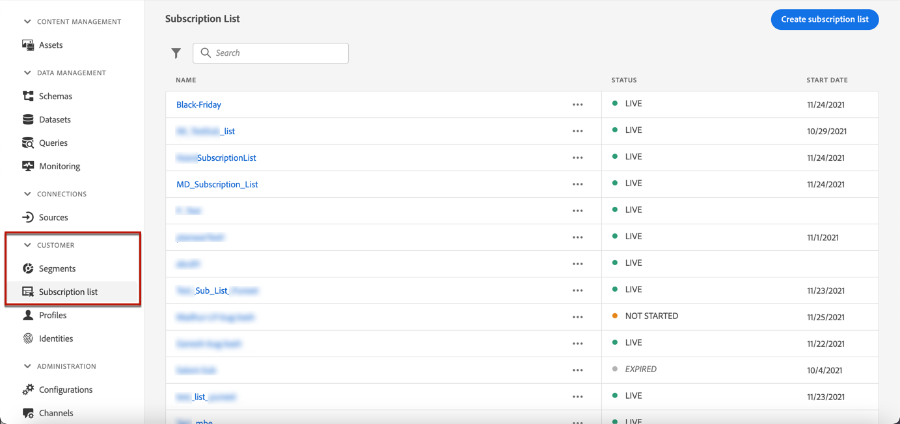

# Elenchi di iscrizione {#create-subscription-list}

## Che cos’è un elenco di abbonamenti?

Un servizio di abbonamento si riferisce a beni e servizi di marketing forniti ai clienti che hanno acconsentito a ricevere comunicazioni su un soggetto/evento/interesse/ecc specifico. su base continuativa. In [!DNL Journey Optimizer], questi clienti con consenso vengono raccolti in un elenco di sottoscrizioni.

Un servizio di abbonamento può essere:

* una newsletter, ad esempio: &quot;Serie in esecuzione&quot;
* un evento, ad esempio: &quot;Vertice 2021&quot;
* un webinar, ad esempio: &quot;Ulteriori informazioni su crypto&quot;
* un interesse per un particolare prodotto/sport/servizio/ecc., ad esempio: &quot;Interessato a comprare una casa nei prossimi 12 mesi&quot;
* una preferenza sulle modalità di notifica, ad esempio: &quot;Ricevi nuove notifiche sulle canzoni via e-mail&quot;

I profili possono essere aggiunti a un elenco di abbonamenti tramite un [pagina di destinazione](create-lp.md). Un esempio è presentato in [questa sezione](lp-use-cases.md#subscription-to-a-service).

## Definire un elenco di sottoscrizione {#define-subscription-list}

Per creare un elenco di iscrizioni, segui i passaggi riportati di seguito.

1. Per accedere agli elenchi di sottoscrizione, selezionare **[!UICONTROL Customer]** > **[!UICONTROL Subscription list]**.

   

1. Fai clic sul pulsante **[!UICONTROL Create subscription list]**.

   

1. Aggiungi un nome e una descrizione. Questi campi sono obbligatori.

1. Puoi definire una data di inizio e una data di fine.

   

1. Fai clic su **[!UICONTROL Save]**.

Nell’elenco vengono visualizzati tutti gli elenchi di sottoscrizioni creati. Puoi filtrarli in base alla data di creazione o di modifica e al relativo stato.

Gli stati possibili sono i seguenti:

* **[!UICONTROL Not started]**: Hai definito una data di inizio successiva al giorno corrente. I profili abbonati non riceveranno ancora comunicazioni relative a questo elenco di abbonamenti.
* **[!UICONTROL Live]**: Il giorno corrente è compreso tra la data di inizio e la data di fine dell’elenco degli abbonamenti oppure non hai definito le date di fine/inizio, il che significa che l’elenco degli abbonamenti è sempre attivo.
* **[!UICONTROL Expired]**: La data di fine viene passata, pertanto l’elenco di sottoscrizione non è più valido. Qualsiasi profilo sottoscritto non riceverà altre comunicazioni relative a questo elenco di abbonamenti.

Una volta creato l’elenco di sottoscrizioni, puoi utilizzarlo in una pagina di destinazione. I profili che effettuano il consenso tramite il modulo della pagina di destinazione verranno aggiunti all’elenco. [Ulteriori informazioni](design-lp.md)

È inoltre possibile utilizzare gli elenchi di sottoscrizioni come segmenti quando [percorsi edilizi](../building-journeys/journey-gs.md#jo-build) e aggiunta di personalizzazione.

>[!NOTE]
>
>Puoi monitorare l’impatto dell’elenco di abbonamenti tramite report specifici. [Ulteriori informazioni](subscription-report.md)

<!--

**Questions**

* Can't see the newly created subscription list in UI because their name included spacing > bug - to follow up (should be fixed for Dec. release)

* Can you update the subscription list in a way other than through a LP? Not in UI but with APIs > to follow up with Fred

-->
