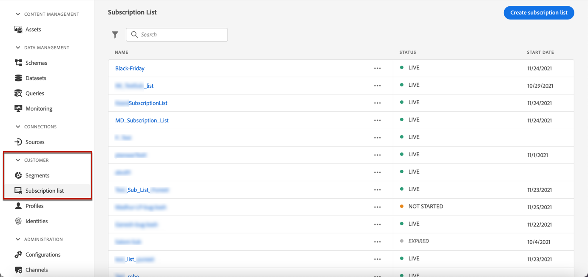
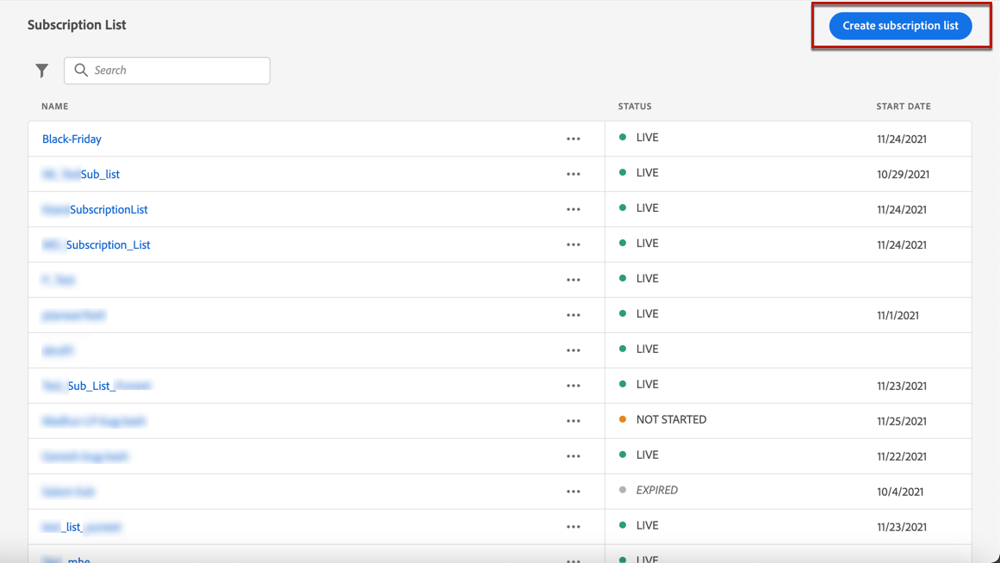
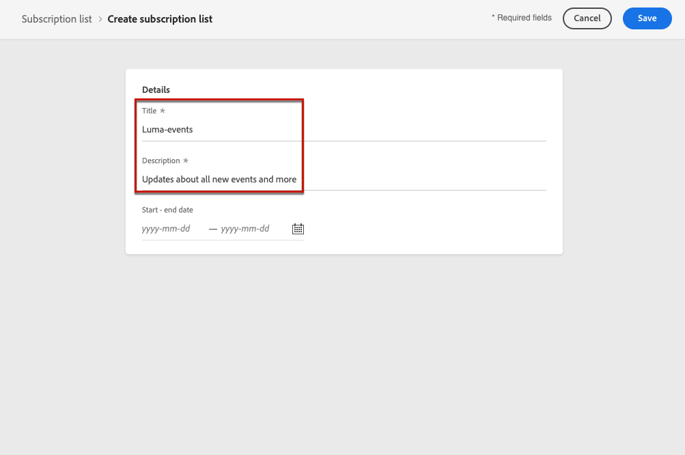
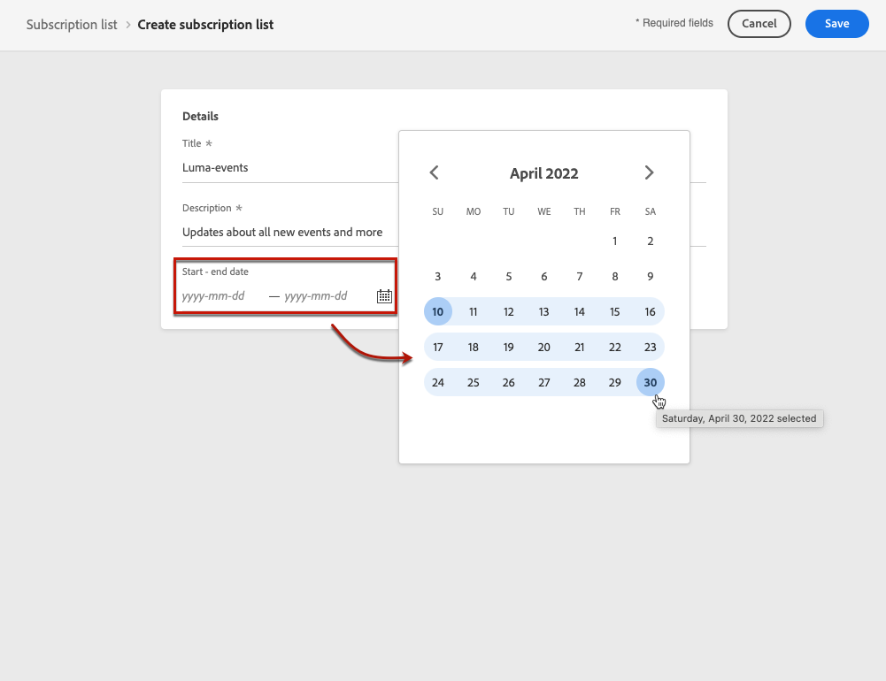
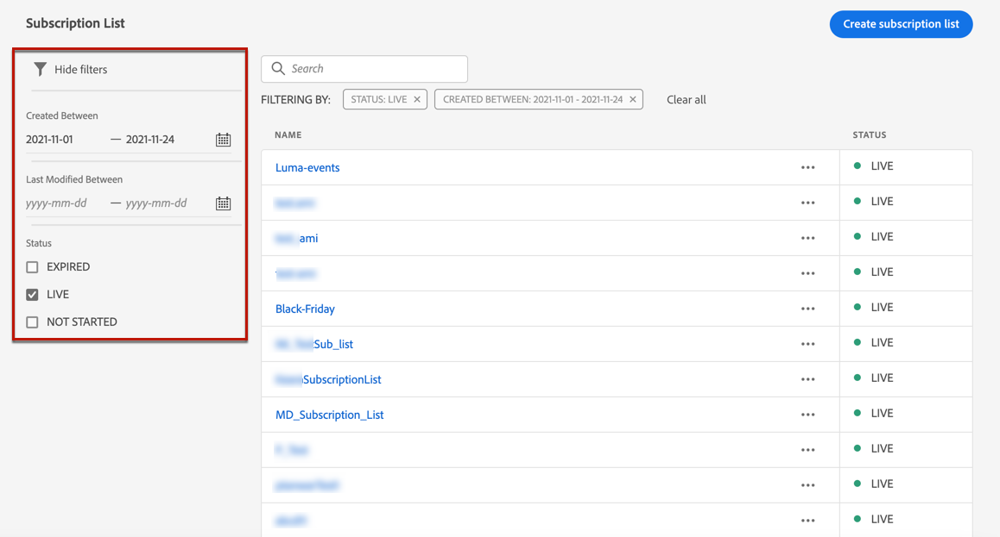

# Elenchi di abbonamenti {#create-subscription-list}

>[!CONTEXTUALHELP]
>id="ajo_subscription_list"
>title="Configurare un elenco di iscrizioni"
>abstract="Crea un elenco di iscrizioni per raccogliere i profili che hanno acconsentito a ricevere comunicazioni su uno specifico argomento o evento. "
>additional-url="https://experienceleague.adobe.com/it/docs/journey-optimizer/using/content-management/landing-pages/subscription-list#define-subscription-list" text="Creare un elenco di iscrizione"

Un servizio di abbonamento si riferisce a beni e servizi di marketing forniti a clienti che hanno acconsentito a ricevere comunicazioni su un argomento/evento/interesse specifico/ecc. su base continuativa. In [!DNL Journey Optimizer], these opted-in customers are gathered into a subscription list.

A subscription service can be used for:

* a newsletter, for example: &quot;Running series&quot;
* an event, for example: &quot;Summit 2021&quot;
* a webinar, for example: &quot;Learn more about crypto&quot;
* an interest on a particular product/sport/service/etc., for example: &quot;Interested to buy a house in the next 12 months&quot;
* una preferenza sulla modalità di notifica, ad esempio: &quot;Ricevi notifiche di nuove canzoni tramite e-mail&quot;

The profiles can be added to a subscription list through a [landing page](create-lp.md). An example is presented in [this section](lp-use-cases.md#subscription-to-a-service).

## Creare un elenco di iscrizione {#define-subscription-list}

>[!NOTE]
>
>When you create a subscription list, an associated streaming segment is automatically generated in Adobe Experience Platform. For the streaming segment to be created successfully, the merge policy must have the **Active-On-Edge** option enabled. Learn more about streaming segment eligibility criteria in the [Adobe Experience Platform documentation](https://experienceleague.adobe.com/it/docs/experience-platform/segmentation/methods/streaming-segmentation).

Per creare un elenco di iscrizioni, segui i passaggi indicati di seguito.

1. Per accedere agli elenchi delle sottoscrizioni, selezionare **[!UICONTROL Cliente]** > **[!UICONTROL Elenco sottoscrizioni]**.

   

1. Selezionare il pulsante **[!UICONTROL Crea elenco iscrizioni]**.

   

1. Aggiungi un titolo e una descrizione. Questi campi sono obbligatori.

   

   >[!CAUTION]
   >
   >Attualmente non è possibile utilizzare la spaziatura o immettere un nome già esistente per un altro elenco di iscrizioni nel campo **[!UICONTROL Titolo]**.

1. Puoi definire una data di inizio e una data di fine.

   

1. Seleziona o crea tag Adobe Experience Platform dal campo **[!UICONTROL Tag]** per categorizzare la pagina di destinazione ai fini di una ricerca migliorata. [Ulteriori informazioni](../start/search-filter-categorize.md#tags)

1. Fai clic su **[!UICONTROL Salva]**.

## Utilizzare un elenco di iscrizioni {#use-subscription-lists}

Una volta creato l’elenco degli abbonamenti, puoi:

* Add profiles to the subscription list

  You can invite persons to **join the list**, by subscribing to a newsletter, or registering to an event. You can also **send personalized messages** to the subscribers.

  For example, to invite an audience to register to an event or subscribe to a newsletter, you can send them a message with a link to a landing page for them to join the event or subscribe. Profiles who opt-in through the landing page form are added to the subscription list that you created for this purpose.

* Inviare messaggi agli abbonati

  Puoi anche utilizzare gli elenchi di abbonamenti come tipi di pubblico durante la creazione di percorsi e l’aggiunta di personalizzazione.

  For example, when a customer subscribes to a streaming service, it can trigger the immediate dispatch of a welcome email series, encouraging them to log into the app for the first time and set their viewing preferences.

Learn how to use your subscription list in [this use case](lp-use-cases.md#subscription-to-a-service).

## Browse your subscription lists {#browse-subscription-lists}

The list displays all the subscription lists created. You can filter them based on the creation date or modification date, and their status.

I possibili stati sono i seguenti:

* **[!UICONTROL Non iniziato]**: è stata definita una data di inizio successiva al giorno corrente. I profili abbonati non riceveranno ancora comunicazioni relative a questo elenco di abbonamenti.
* **[!UICONTROL Live]**: il giorno corrente è compreso tra la data di inizio e la data di fine dell&#39;elenco di iscrizioni, oppure non sono state definite date di fine/inizio, il che significa che l&#39;elenco di iscrizioni è sempre live.
* **[!UICONTROL Scaduto]**: la data di fine è passata, pertanto l&#39;elenco iscrizioni non è più valido. I profili abbonati non riceveranno più comunicazioni relative a questo elenco di abbonamenti.

## Monitorare gli elenchi di iscrizioni {#monitor-subscription-lists}

You can monitor your subscription list impacts through dedicated reports. You can access two types of reports:

* Rapporto live dell’elenco iscrizioni

  I rapporti live, accessibili dalla scheda Ultime 24 ore, visualizzano gli eventi che si sono verificati nelle ultime 24 ore, con un intervallo di tempo minimo di due minuti dall’occorrenza dell’evento. [Ulteriori informazioni](../reports/subscription-report-live.md)

* Subscription list All time reports, with Customer Journey Analytics

  Questi rapporti si concentrano sugli eventi che si sono verificati almeno due ore fa e coprono gli eventi in un periodo di tempo selezionato. Il **report abbonamenti** offre informazioni essenziali sugli abbonamenti e sugli annullamenti di abbonamenti dei profili associati a elenchi specifici, consentendoti di comprendere l&#39;efficacia delle diverse campagne e iniziative di abbonamento nel promuovere il coinvolgimento e le conversioni. [Ulteriori informazioni](../reports/subscription-report-global-cja.md)
