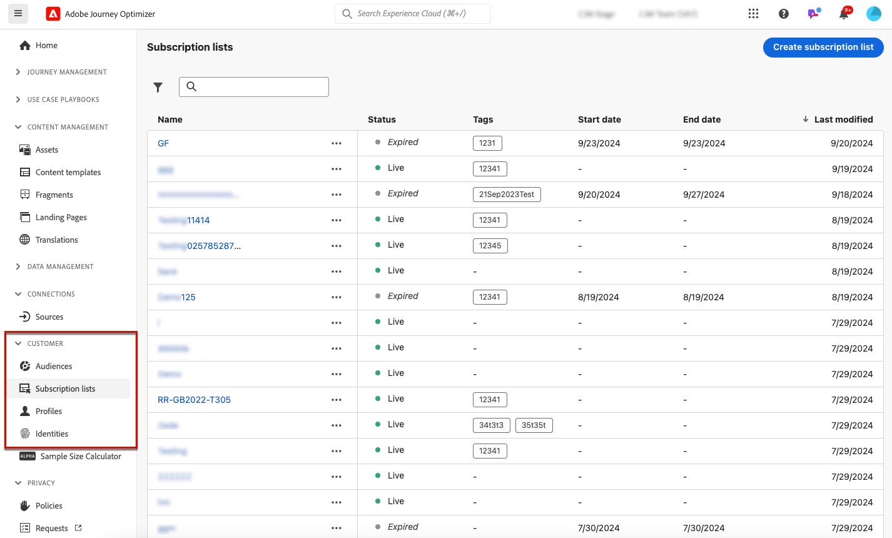
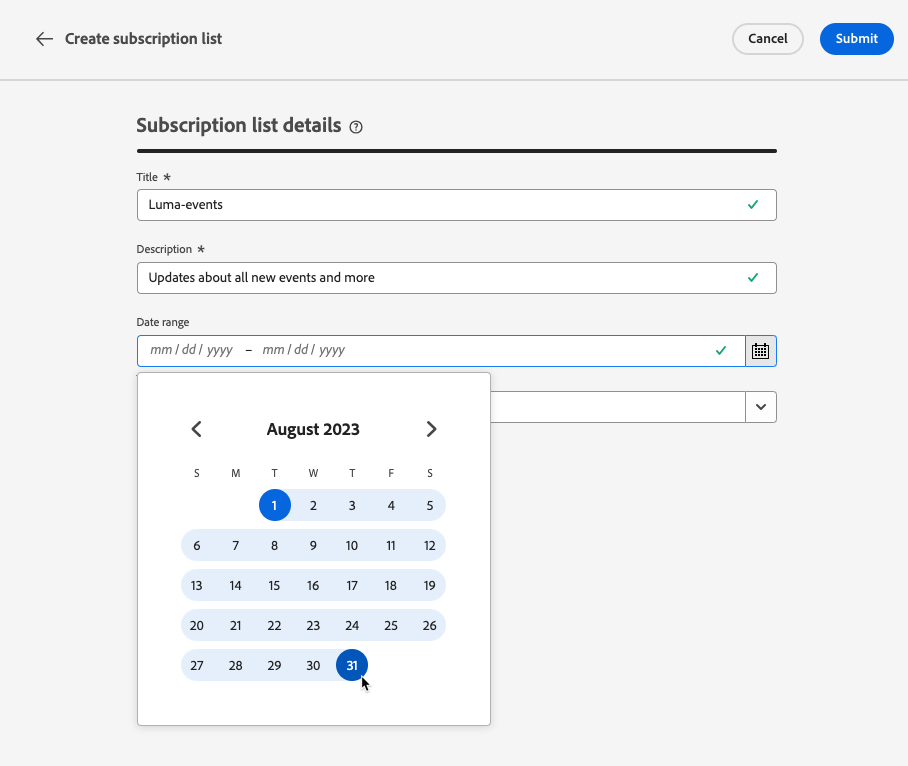

# Elenchi di abbonamenti {#create-subscription-list}

>[!CONTEXTUALHELP]
>id="ajo_subscription_list"
>title="Configurare un elenco di iscrizioni"
>abstract="Crea un elenco di iscrizioni per raccogliere i profili che hanno acconsentito a ricevere comunicazioni su uno specifico argomento o evento. "
>additional-url="https://experienceleague.adobe.com/it/docs/journey-optimizer/using/content-management/landing-pages/subscription-list#define-subscription-list" text="Creare un elenco di iscrizione"

Un servizio di abbonamento si riferisce a beni e servizi di marketing forniti a clienti che hanno acconsentito a ricevere comunicazioni su un argomento/evento/interesse specifico/ecc. su base continuativa. In [!DNL Journey Optimizer], i clienti che hanno prestato il consenso sono raccolti in un elenco di abbonamenti.

Un servizio di abbonamento può essere utilizzato per:

* una newsletter, ad esempio: &quot;Serie in esecuzione&quot;
* un evento, ad esempio: &quot;Summit 2021&quot;
* un webinar, ad esempio: &quot;Ulteriori informazioni su crypto&quot;
* un interesse su un particolare prodotto/sport/servizio/ecc., ad esempio: &quot;Interessato ad acquistare una casa nei prossimi 12 mesi&quot;
* una preferenza sulla modalità di notifica, ad esempio: &quot;Ricevi notifiche di nuove canzoni tramite e-mail&quot;

I profili possono essere aggiunti a un elenco di iscrizioni tramite una [pagina di destinazione](create-lp.md). Un esempio è presentato in [questa sezione](lp-use-cases.md#subscription-to-a-service).

## Creare un elenco di iscrizione {#define-subscription-list}

>[!NOTE]
>
>Quando crei un elenco di abbonamenti, in Adobe Experience Platform viene generato automaticamente un segmento di streaming associato. Affinché il segmento di streaming venga creato correttamente, il criterio di unione deve avere l&#39;opzione **Attivo su Edge** abilitata. Ulteriori informazioni sui criteri di idoneità per i segmenti in streaming sono disponibili nella [documentazione di Adobe Experience Platform](https://experienceleague.adobe.com/en/docs/experience-platform/segmentation/methods/streaming-segmentation).

Per creare un elenco di iscrizioni, segui i passaggi indicati di seguito.

1. Per accedere agli elenchi delle sottoscrizioni, selezionare **[!UICONTROL Cliente]** > **[!UICONTROL Elenco sottoscrizioni]**.

   

1. Selezionare il pulsante **[!UICONTROL Crea elenco iscrizioni]**.

   

1. Aggiungi un titolo e una descrizione. Questi campi sono obbligatori.

   

   >[!CAUTION]
   >
   >Attualmente non è possibile utilizzare la spaziatura o immettere un nome già esistente per un altro elenco di iscrizioni nel campo **[!UICONTROL Titolo]**.

1. Puoi definire una data di inizio e una data di fine.

   

1. Seleziona o crea tag Adobe Experience Platform dal campo **[!UICONTROL Tag]** per categorizzare la pagina di destinazione ai fini di una ricerca migliorata. [Ulteriori informazioni](../start/search-filter-categorize.md#tags)

1. Fai clic su **[!UICONTROL Salva]**.

## Utilizzare un elenco di iscrizioni {#use-subscription-lists}

Una volta creato l’elenco degli abbonamenti, puoi:

* Aggiungere profili all’elenco degli abbonamenti

  È possibile invitare persone a **partecipare all&#39;elenco**, sottoscrivendo una newsletter o registrandosi a un evento. Puoi anche **inviare messaggi personalizzati** ai sottoscrittori.

  Ad esempio, per invitare un pubblico a registrarsi a un evento o a iscriversi a una newsletter, puoi inviare loro un messaggio con un collegamento a una pagina di destinazione in modo che possano partecipare all’evento o iscriversi. I profili che effettuano il consenso tramite il modulo della pagina di destinazione vengono aggiunti all’elenco di iscrizioni creato a questo scopo.

* Inviare messaggi agli abbonati

  Puoi anche utilizzare gli elenchi di abbonamenti come tipi di pubblico durante la creazione di percorsi e l’aggiunta di personalizzazione.

  Ad esempio, quando un cliente si abbona a un servizio di streaming, può attivare l’invio immediato di una serie e-mail di benvenuto, incoraggiandolo ad accedere all’app per la prima volta e a impostare le proprie preferenze di visualizzazione.

Scopri come utilizzare il tuo elenco di iscrizioni in [questo caso d&#39;uso](lp-use-cases.md#subscription-to-a-service).

## Sfogliare gli elenchi delle iscrizioni {#browse-subscription-lists}

Nell&#39;elenco vengono visualizzati tutti gli elenchi di iscrizioni creati. Puoi filtrarli in base alla data di creazione o di modifica e al loro stato.

I possibili stati sono i seguenti:

* **[!UICONTROL Non iniziato]**: è stata definita una data di inizio successiva al giorno corrente. I profili abbonati non riceveranno ancora comunicazioni relative a questo elenco di abbonamenti.
* **[!UICONTROL Live]**: il giorno corrente è compreso tra la data di inizio e la data di fine dell&#39;elenco di iscrizioni, oppure non sono state definite date di fine/inizio, il che significa che l&#39;elenco di iscrizioni è sempre live.
* **[!UICONTROL Scaduto]**: la data di fine è passata, pertanto l&#39;elenco iscrizioni non è più valido. I profili abbonati non riceveranno più comunicazioni relative a questo elenco di abbonamenti.

## Monitorare gli elenchi di iscrizioni {#monitor-subscription-lists}

Puoi monitorare l’impatto dell’elenco degli abbonamenti tramite rapporti dedicati. Puoi accedere a due tipi di rapporti:

* Rapporto live dell’elenco iscrizioni

  I rapporti live, accessibili dalla scheda Ultime 24 ore, visualizzano gli eventi che si sono verificati nelle ultime 24 ore, con un intervallo di tempo minimo di due minuti dall’occorrenza dell’evento. [Ulteriori informazioni](../reports/subscription-report-live.md)

* Elenco iscrizioni Tutti i rapporti temporali, con Customer Journey Analytics

  Questi rapporti si concentrano sugli eventi che si sono verificati almeno due ore fa e coprono gli eventi in un periodo di tempo selezionato. Il **report abbonamenti** offre informazioni essenziali sugli abbonamenti e sugli annullamenti di abbonamenti dei profili associati a elenchi specifici, consentendoti di comprendere l&#39;efficacia delle diverse campagne e iniziative di abbonamento nel promuovere il coinvolgimento e le conversioni. [Ulteriori informazioni](../reports/subscription-report-global-cja.md)
