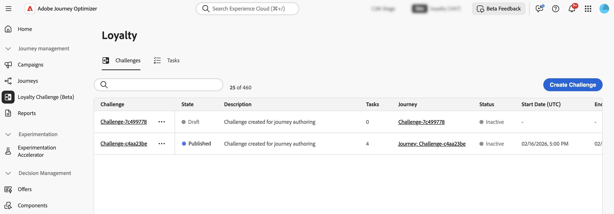

# Accesso e gestione di sfide e attività {#access-loyalty-challenges}

>[!BEGINSHADEBOX]

**Documentazione sulle sfide di fedeltà:**

* [Introduzione alle sfide di fedeltà](get-started.md)
* **Accedi e gestisci sfide e attività** ◀︎ **Sei qui**
* [Creare le sfide](create-challenges.md)
* [Creare le attività](create-tasks.md)

>[!ENDSHADEBOX]

>[!AVAILABILITY]
>
>Questa funzionalità è attualmente in **versione beta privata**. Ulteriori informazioni sulle [etichette di disponibilità](../rn/releases.md#availability-labels).

## Accesso e gestione di sfide e attività

Per accedere alle sfide di fidelizzazione, passa a Journey Optimizer e seleziona **[!UICONTROL Sfida di fidelizzazione (Beta)]** nella sezione **[!UICONTROL Gestione Percorso]**. L’interfaccia Sfide di fedeltà fornisce una posizione centralizzata per visualizzare, gestire e organizzare tutte le sfide e le attività.

L’interfaccia consente di accedere a due inventari principali:

* **Sfide**: visualizza e gestisci tutte le sfide relative alla fedeltà, monitora il loro stato ed esegui azioni rapide quali la visualizzazione, la modifica, la duplicazione o l&#39;eliminazione delle sfide
* **Attività**: sfoglia le attività riutilizzabili che possono essere utilizzate in più sfide e gestisci le definizioni delle attività in modo indipendente

## Inventario delle sfide {#challenges-tab}

Nella scheda **[!UICONTROL Problemi]** sono visualizzate tutte le sfide ordinate in base alla data dell&#39;ultima modifica, con le sfide modificate più di recente visualizzate per prime.

Informazioni chiave visualizzate:

* **[!UICONTROL Stato]**: stato corrente della sfida (bozza o pubblicato)
* **[!UICONTROL Attività]**: numero di attività configurate nella richiesta di verifica
* **[!UICONTROL Percorso]**: collegamento al percorso generato automaticamente associato alla richiesta di verifica
* **[!UICONTROL Stato]**: stato corrente del percorso generato automaticamente che soddisfa la richiesta di verifica.
* **[!UICONTROL Data di inizio/fine (UTC)]**: quando la richiesta di verifica diventa attiva e scade

Dalla scheda Sfide è possibile eseguire le azioni seguenti per le sfide:

* **Visualizza la sfida**: seleziona il nome della sfida per aprirne la pagina dei dettagli
* **Duplica una sfida**: seleziona l&#39;icona  e scegli **[!UICONTROL Duplica]**. Viene creata una copia con tutte le attività, il contenuto e i messaggi intatti.
* **Elimina una sfida**: seleziona l&#39;icona  e scegli **[!UICONTROL Elimina]**.

  >[!IMPORTANT]
  >
  >Puoi eliminare una sfida anche quando viene pubblicata. Considera l’impatto prima di eliminarlo.

* **Modifica una richiesta di verifica**: seleziona il nome della richiesta di verifica per aprirne la pagina dei dettagli e apportare le modifiche desiderate.

  Quando apri una sfida pubblicata per la modifica, devi innanzitutto ripristinarla allo stato Bozza. Tutte le personalizzazioni apportate direttamente al percorso generato automaticamente andranno perse. Dopo aver apportato le modifiche, salva e pubblica di nuovo la sfida, quindi pubblica il percorso associato. [Scopri come avviare una sfida](create-challenges.md#launch)

  >[!IMPORTANT]
  >
  >Il ripristino di una richiesta di verifica pubblicata in bozza non può essere annullato. Prima di procedere, considera l’impatto sul percorso attivo.

## Inventario attività {#tasks-tab}

Nella scheda **[!UICONTROL Attività]** sono visualizzate tutte le attività riutilizzabili che possono essere utilizzate in più sfide. Le attività create qui diventano disponibili per la selezione durante la creazione o la modifica di qualsiasi sfida.

Informazioni chiave visualizzate:

* **[!UICONTROL Descrizione]**: breve descrizione di ciò che l&#39;attività richiede
* **[!UICONTROL Attività attività]**: tipo di attività (acquisto, spesa)
* **[!UICONTROL SKU]**: elementi idonei e/o esclusi
* **[!UICONTROL Utilizzato nelle sfide]**: numero di sfide che attualmente utilizzano questa attività

Dalla scheda Attività è possibile eseguire le azioni seguenti sulle attività:

* **Visualizza/Modifica attività**: selezionare il nome dell&#39;attività per visualizzare la configurazione completa e modificare l&#39;attività
* **Duplica attività**: seleziona l&#39;icona  e scegli **[!UICONTROL Duplica]**
* **Elimina un&#39;attività**: seleziona l&#39;icona  e scegli **[!UICONTROL Elimina]**.

  >[!IMPORTANT]
  >
  >È possibile eliminare un&#39;attività anche quando viene utilizzata in una o più sfide. Considera l’impatto sulle sfide che fanno riferimento all’attività prima di eliminarla.
