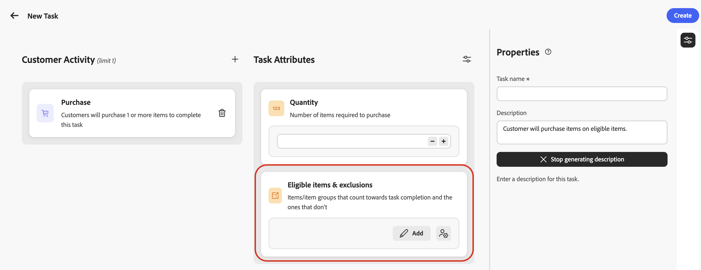

# Creare le attività {#create-tasks}

>[!BEGINSHADEBOX]

**Sommario**

[Introduzione alle sfide di fedeltà](get-started.md)

<table style="table-layout:fixed">
<tr style="border: 0;">
<td style="vertical-align:top;">

**Crea e gestisci le sfide**

* [Accesso e gestione di sfide e attività](access-loyalty-challenges.md)
* [Creare le sfide](create-challenges.md)
* **Crea attività** ◀︎ **Sei qui**
* [Monitorare le prestazioni della sfida fedeltà](loyalty-reporting.md)

</td>
<td style="vertical-align:top;">

**Configura e integra**

* [Configurare le sfide relative alla fedeltà](loyalty-admin.md)
* [Dati e set di dati sulla fedeltà](loyalty-data-and-datasets.md)
* [Riferimento API per le sfide di fedeltà](https://developer.adobe.com/journey-optimizer-apis/references/loyalty-challenges){target="_blank"}

</td>
</tr>
</table>

>[!ENDSHADEBOX]

>[!AVAILABILITY]
>
>Questa funzionalità è attualmente in **versione beta privata**. Per informazioni dettagliate sul ciclo di rilascio e sulle fasi di disponibilità, consulta [Ciclo di rilascio di Journey Optimizer](../rn/releases.md).

Le attività definiscono le azioni o i milestone specifici che i clienti devono completare per ottenere premi in una sfida di fedeltà. Puoi configurare le attività di acquisto e spesa oppure **[!UICONTROL Attività evento personalizzate]** che tengono traccia degli eventi di esperienza di Adobe Experience Platform già acquisiti dalla tua organizzazione.

Ogni attività rappresenta un’azione misurabile che contribuisce al completamento della sfida. Le attività sono componenti riutilizzabili che possono essere creati in modo indipendente e quindi aggiunti a una o più sfide, oppure creati direttamente all’interno di una sfida.

## Creare un’attività {#create-task}

>[!CONTEXTUALHELP]
>id="ajo_loyalty_task_create"
>title="Creare un’attività"
>abstract="Seleziona un’attività del cliente (acquisto, spesa o evento personalizzato), quindi configura gli attributi specifici dell’attività. Nel riquadro Proprietà imposta il nome e la descrizione dell’attività."

È possibile creare attività da due punti di ingresso. Il processo di configurazione è lo stesso indipendentemente da dove si inizia.

>[!BEGINTABS]

>[!TAB Dall&#39;inventario delle attività]

Seleziona la scheda **[!UICONTROL Attività]** e seleziona **[!UICONTROL Crea attività]**. Le attività create dall’inventario vengono salvate e sono disponibili per il riutilizzo in più sfide.

>[!TAB Dall&#39;interno di una sfida]

Apri una sfida esistente o creane una nuova. Seleziona **[!UICONTROL Aggiungi attività]** e fai clic sul pulsante **[!UICONTROL Nuovo]**. Le attività create in questo modo vengono automaticamente aggiunte alla sfida e salvate nell’inventario Attività per essere riutilizzate in altre sfide.

>[!ENDTABS]

## Scegli l’attività del cliente {#choose-activity}

Selezionare il tipo di attività che i clienti devono eseguire per completare questa attività:

* **[!UICONTROL Acquisto]**: i clienti devono acquistare uno o più elementi per completare questa attività
* **[!UICONTROL Spesa]**: i clienti devono spendere una somma specificata per completare l&#39;attività
* **[!UICONTROL Evento personalizzato]**: i clienti devono eseguire un&#39;attività rappresentata da un evento esperienza Adobe Experience Platform. Ad esempio, un check-in in un hotel, un’azione da app mobile o un invio di una recensione. L&#39;evento sottostante deve essere già stato acquisito in Experience Platform e mappato tramite una definizione di evento nel menu **[!UICONTROL Amministratore fedeltà]**. [Scopri come configurare le definizioni degli eventi](loyalty-admin.md#event-definitions)

Per selezionare un&#39;attività, fare clic sull&#39;icona **+** e selezionare l&#39;attività cliente che meglio si allinea agli obiettivi dei risultati. Ogni tipo di attività dispone di attributi configurabili specifici per definire e modellare ulteriormente i requisiti delle attività.

## Definire gli attributi del task {#define-attributes}

Configura gli attributi del task in base al tipo di attività selezionato. Sfoglia le schede seguenti per visualizzare gli attributi disponibili per ciascun tipo di attività:

>[!BEGINTABS]

>[!TAB Attività di acquisto]

Attributi disponibili per **Attività di acquisto**:

* **[!UICONTROL Quantità]**: immettere il numero di articoli da acquistare per completare l&#39;attività.
* **[!UICONTROL Elementi ed esclusioni idonei]**: definisci gli elementi o i gruppi di elementi che contano per il completamento dell&#39;attività e quelli che non lo fanno, oppure scegli **[!UICONTROL Porta i tuoi dati]** per determinare l&#39;idoneità dai tuoi dati esterni. [Ulteriori informazioni](#eligible-items-exclusions)
* **[!UICONTROL Importo valore spesa minimo]**: impostare un requisito importo acquisto minimo.
* **[!UICONTROL Numero massimo di transazioni]**: limitare il numero di transazioni che è possibile utilizzare per completare l&#39;attività.

>[!TAB Attività di spesa]

Attributi disponibili per le attività **Spend**:

* **[!UICONTROL Importo]**: immettere l&#39;importo totale di spesa necessario per completare l&#39;attività.
* **[!UICONTROL Elementi ed esclusioni idonei]**: definisci gli elementi o i gruppi di elementi che contano per il completamento dell&#39;attività e quelli che non lo fanno. [Ulteriori informazioni su elementi ed esclusioni idonei](#eligible-items-exclusions)
* **[!UICONTROL Numero massimo di transazioni]**: specificare il numero di transazioni consentite per soddisfare il requisito di spesa. Puoi attivare questo attributo dall’icona dei parametri.

>[!TAB Attività evento personalizzata]

Attributi disponibili per le attività **[!UICONTROL Custom event]**:

* **[!UICONTROL Valori evento personalizzati]**: immettere i valori per l&#39;evento personalizzato che i clienti devono completare. Utilizza una virgola per separare ogni valore. Questi valori devono corrispondere alle definizioni degli eventi configurate nel menu **[!UICONTROL Amministratore fedeltà]**. [Scopri come configurare le definizioni degli eventi](loyalty-admin.md#event-definitions)

>[!ENDTABS]

## Definire gli articoli idonei e le esclusioni {#eligible-items-exclusions}

>[!CONTEXTUALHELP]
>id="ajo_loyalty_task_eligible_items_exclusion"
>title="Articoli idonei ed esclusioni"
>abstract="Per entrambe le attività **Acquisto** e **Spesa**, utilizza l’attributo **[!UICONTROL Articoli idonei ed esclusioni]** per selezionare quali articoli e gruppi contano rispetto al completamento delle atttività e quali sono esclusi. Cerca articoli o gruppi nell’inventario dei prodotti configurato dagli amministratori, quindi includili o escludili in base alle esigenze."

<!-- SCREENSHOT: Eligible items & exclusions picker showing the item and group table with Include and Exclude actions -->

Per le attività **Acquisto** e **Spesa**, puoi utilizzare la sezione **[!UICONTROL Elementi ed esclusioni idonei]** per definire quali elementi e gruppi sono idonei e quali sono esclusi. Questo consente di eseguire il targeting di prodotti, categorie o punti vendita specifici per allinearli agli obiettivi della sfida.

Gli elementi e i gruppi disponibili nel selettore sono definiti dagli utenti amministratori nel menu **[!UICONTROL Amministratore fedeltà]**. Gli amministratori caricano l’inventario dei prodotti utilizzato per gli articoli idonei e configurano esclusioni a livello di organizzazione che vengono applicate automaticamente quando gli addetti al marketing generano attività. [Scopri come configurare l’inventario dei prodotti](loyalty-admin.md#product-inventory) e [esclusioni](loyalty-admin.md#exclusions)

**[!UICONTROL Le attività evento personalizzato]** non utilizzano elementi ed esclusioni idonei. Il completamento è determinato dai **[!UICONTROL valori evento personalizzati]** configurati.

Ad esempio, è possibile limitare un&#39;attività a specifiche categorie di prodotti oppure escludere le gift card o gli articoli promozionali dal conteggio per il completamento dell&#39;attività.

### Imposta gli elementi idonei per l&#39;attività

Per definire gli elementi idonei, seleziona **[!UICONTROL Aggiungi]** dalla sezione **[!UICONTROL Elementi ed esclusioni idonei]**.

Nel selettore, seleziona gli elementi o i gruppi che devono essere conteggiati per il completamento dell&#39;attività, quindi seleziona **[!UICONTROL Includi]**. Gli elementi e i gruppi inclusi vengono aggiunti all’elenco degli idonei.

Se non viene selezionato alcun articolo o gruppo idoneo, gli acquisti non sono limitati a una serie di scorte specifica, a meno che non siano configurate esclusioni.

### Escludi elementi dall&#39;attività

Per escludere elementi dall&#39;attività, selezionare **[!UICONTROL Aggiungi]** dalla sezione **[!UICONTROL Elementi ed esclusioni idonei]**.

Seleziona gli elementi o i gruppi che non devono essere conteggiati per il completamento dell&#39;attività, quindi seleziona **[!UICONTROL Escludi]**.

Gli elementi dell’elenco di esclusioni globali vengono aggiunti automaticamente come esclusioni. Le esclusioni hanno priorità rispetto alle inclusioni: gli elementi elencati come esclusi non vengono conteggiati, anche se fanno anche parte di un gruppo incluso.

### Acquisisci i tuoi dati per idoneità ed esclusioni {#byod-personalization}

>[!AVAILABILITY]
>
>L&#39;opzione **[!UICONTROL Porta i tuoi dati]** è attualmente disponibile per un gruppo limitato di organizzazioni e sarà resa disponibile in modo più ampio in una versione futura.

Oltre a selezionare elementi e gruppi in Journey Optimizer, puoi anche gestire l&#39;idoneità dai dati esterni delle sfide di fedeltà in fase di esecuzione utilizzando l&#39;opzione **[!UICONTROL Porta i tuoi dati]**.

Quando **[!UICONTROL Porta i tuoi dati]** è selezionato, l&#39;idoneità per partecipante viene risolta in fase di runtime dai dati sincronizzati con l&#39;ambiente delle sfide di fedeltà anziché da un elenco di ID elemento.

Per utilizzare questa opzione, seleziona l&#39;icona di personalizzazione in **[!UICONTROL Elementi ed esclusioni idonei]**, quindi scegli **[!UICONTROL Porta i tuoi dati]**.

>[!IMPORTANT]
>
>Quando si assegna questa attività a una sfida, selezionare **[!UICONTROL Standard]** come tipo di sfida. Non selezionare **[!UICONTROL Porta i tuoi dati]** a livello di sfida, poiché tale opzione è riservata alle sfide completamente basate sui dati in cui l&#39;intera struttura, incluse attività e premi, viene fornita esternamente.

## Definire le proprietà dell’attività {#define-task-properties}

Nel riquadro **[!UICONTROL Proprietà]** dell&#39;attività configurare le informazioni di base sull&#39;attività:

* **[!UICONTROL Nome attività]**: immettere un nome descrittivo per l&#39;attività.
* **[!UICONTROL Descrizione attività]**: la descrizione viene generata automaticamente in base all&#39;attività e agli attributi configurati. Per immettere una descrizione personalizzata, disattiva l’opzione di generazione automatica e immetti la descrizione nel campo di testo.

Dopo aver configurato tutti gli attributi e le proprietà, selezionare **[!UICONTROL Crea]** per salvare l&#39;attività. L’attività viene salvata nell’inventario Attività e, se creata dall’interno di una sfida, viene aggiunta automaticamente a tale sfida.
