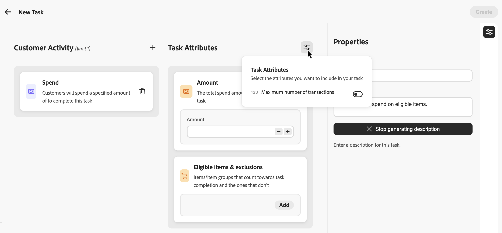

# Creare le attività {#create-tasks}

>[!BEGINSHADEBOX]

**Documentazione sulle sfide di fedeltà:**

* [Introduzione alle sfide di fidelizzazione](get-started.md) - Panoramica, flusso di lavoro, prerequisiti
* [Accesso e gestione delle sfide di fidelizzazione](access-loyalty-challenges.md) - Gestione di inventario, sfide e attività
* [Crea problemi](create-challenges.md) - Genera e configura problemi
* **Crea attività** ◀︎ **Sei qui** - Definisci le attività di verifica

>[!ENDSHADEBOX]

>[!AVAILABILITY]
>
>Questa funzionalità è attualmente in **versione beta privata** e potrebbe non essere disponibile nel tuo ambiente. Per richiedere l’accesso, contatta il rappresentante Adobe. Ulteriori informazioni sulle [etichette di disponibilità](../rn/releases.md#availability-labels).

Le attività definiscono le azioni o i milestone specifici che i clienti devono completare per ottenere premi in una sfida di fedeltà. Puoi configurare tipi di attività, quantità e requisiti di prodotto per creare esperienze di fidelizzazione coinvolgenti e personalizzate.

Ogni attività rappresenta un’azione misurabile che contribuisce al completamento della sfida. Le attività sono componenti riutilizzabili che possono essere creati in modo indipendente e quindi aggiunti a una o più sfide, oppure creati direttamente all’interno di una sfida.

## Creare un’attività {#create-task}

È possibile creare attività da due punti di ingresso. Il processo di configurazione è lo stesso indipendentemente da dove si inizia.

>[!BEGINTABS]

>[!TAB Dall&#39;inventario delle attività]

Seleziona la scheda **[!UICONTROL Attività]** e seleziona **[!UICONTROL Crea attività]**.

Le attività create dall’inventario vengono salvate e sono disponibili per il riutilizzo in più sfide.

>[!TAB Dall&#39;interno di una sfida]

Apri una sfida esistente o creane una nuova. Seleziona **[!UICONTROL Aggiungi attività]** e fai clic sul pulsante **[!UICONTROL Nuovo]**.

Le attività create in questo modo vengono automaticamente aggiunte alla sfida e salvate nell’inventario Attività per essere riutilizzate in altre sfide.

>[!ENDTABS]

## Scegli l’attività del cliente {#choose-activity}

Selezionare il tipo di attività che i clienti devono eseguire per completare questa attività:

* **[!UICONTROL Acquisto]**: i clienti devono acquistare uno o più elementi per completare questa attività
* **[!UICONTROL Spesa]**: i clienti devono spendere una somma specificata per completare l&#39;attività

Per selezionare un tipo di attività, fare clic sull&#39;icona `+` e selezionare l&#39;attività del cliente che meglio si allinea agli obiettivi dei risultati. Ogni tipo di attività dispone di attributi configurabili specifici per definire e modellare ulteriormente i requisiti delle attività.

## Definire gli attributi {#define-attributes}

Configura gli attributi del task in base al tipo di attività selezionato:

>[!BEGINTABS]

>[!TAB Attività di acquisto]

Configura i seguenti attributi:

* **[!UICONTROL Quantità]**: immettere il numero di articoli da acquistare per completare l&#39;attività
* **[!UICONTROL Elementi ed esclusioni idonei]**: definisci gli elementi o i gruppi di elementi che contano per il completamento dell&#39;attività e quelli che non lo fanno. Ulteriori informazioni su [definizione di elementi ed esclusioni idonei](#eligible-items-exclusions)

**Attributi opzionali** (attivati tramite l&#39;icona dei parametri):

* **[!UICONTROL Importo valore di spesa minimo]**: imposta un requisito importo di acquisto minimo
* **[!UICONTROL Numero massimo di transazioni]**: limita il numero di transazioni utilizzabili per completare l&#39;attività

>[!TAB Attività di spesa]

Configura i seguenti attributi:

* **[!UICONTROL Importo]**: immettere l&#39;importo totale di spesa necessario per completare l&#39;attività.
* **[!UICONTROL Numero massimo di transazioni]**: specificare il numero di transazioni consentite per soddisfare il requisito di spesa. È possibile disattivare questo attributo dall&#39;icona dei parametri se non si desidera limitare il numero di transazioni.
* **[!UICONTROL Elementi ed esclusioni idonei]**: (facoltativo) definisci gli elementi o i gruppi di elementi che contano per il completamento dell&#39;attività e quelli che non lo fanno. Ulteriori informazioni su [definizione di elementi ed esclusioni idonei](#eligible-items-exclusions)

>[!ENDTABS]

## Definire gli articoli e le esclusioni idonei {#eligible-items-exclusions}

<!-- SCREENSHOT: Eligible items & exclusions popup showing the two sections: "Eligible task purchases are limited to the following" and "The following are excluded from this task" with text input fields -->

Per entrambe le attività **Acquisto** e **Spesa**, puoi utilizzare l&#39;attributo **[!UICONTROL Elementi ed esclusioni idonei]** per definire quali elementi e gruppi sono idonei e quali sono esclusi. Questo consente di eseguire il targeting di prodotti, categorie o posizioni specifici per allinearli agli obiettivi della sfida.

I casi d&#39;uso includono: limitazione di un&#39;attività di spesa a specifiche categorie di prodotti o esclusione di biglietti regalo o articoli promozionali dal conteggio al completamento dell&#39;attività.

* Per definire gli elementi idonei, utilizzare **[!UICONTROL Gli acquisti di attività idonee sono limitati alla seguente]** sezione. Immetti ID articolo, categorie o ID destinazione specifici, separati da virgole.

  Esempio: `SKU001, SKU002, CategoryA`

  Immettere `*` per rendere idonei tutti gli acquisti (comportamento predefinito se lasciato vuoto).

* Per escludere elementi dall&#39;attività, utilizzare **[!UICONTROL I seguenti elementi sono esclusi da questa sezione dell&#39;attività]**. Immetti ID articolo, categorie o ID destinazione specifici che non devono essere conteggiati per il completamento dell&#39;attività.

  Esempio: `CLEARANCE01, GIFTCARD, SALE_CATEGORY`

  >[!NOTE]
  >
  >Le esclusioni hanno la precedenza sugli elementi idonei. Se un elemento corrisponde sia a un elemento idoneo che a un’esclusione, verrà escluso dall’attività.

## Definire le proprietà dell’attività {#define-task-properties}

Nel riquadro **[!UICONTROL Proprietà]** dell&#39;attività configurare le informazioni di base sull&#39;attività:

* **[!UICONTROL Nome attività]**: immettere un nome descrittivo per l&#39;attività. Questo nome è visibile a te e al tuo team, ma potrebbe non essere mostrato ai clienti a seconda della progettazione della scheda di contenuto.
* **[!UICONTROL Descrizione attività]**: la descrizione viene generata automaticamente in base al tipo di attività e agli attributi configurati per l&#39;attività. Puoi disattivare la generazione automatica e immettere una descrizione personalizzata, se necessario.

Dopo aver configurato tutti gli attributi e le proprietà, selezionare **[!UICONTROL Crea]** per salvare l&#39;attività. L’attività viene salvata nell’inventario Attività e, se creata dall’interno di una sfida, viene aggiunta automaticamente a tale sfida.
