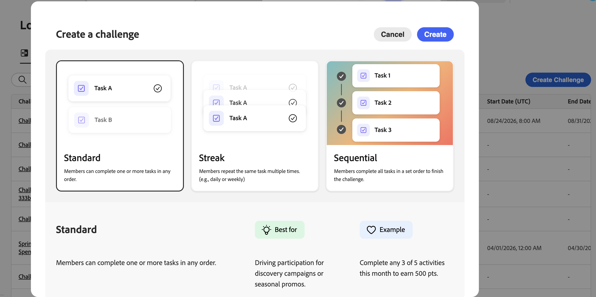

# Introduzione alle sfide di fidelizzazione {#get-started-loyalty-challenges}

>[!CONTEXTUALHELP]
>id="ajo_loyalty_inventory"
>title="Sfide fedeltà"
>abstract="Le sfide relative alla fedeltà ti consentono di creare programmi di fidelizzazione coinvolgenti e basati sulla gamification che influenzano il comportamento dei clienti e consolidano le relazioni con il brand. Crea sfide che premiano i clienti per azioni specifiche: dagli acquisti effettuati e la scrittura di recensioni, fino all’interazione sui social media ai consigli agli amici."

>[!AVAILABILITY]
>
>La fedeltà di Journey Optimizer non è attualmente disponibile per i clienti di Healthcare Shield e Privacy and Security Shield. La disponibilità per i clienti di Healthcare Shield e Privacy and Security Shield verrà aggiornata non appena le funzionalità saranno pronte in futuro.

## Panoramica {#overview}

Le sfide relative alla fedeltà ti consentono di creare programmi di fidelizzazione coinvolgenti e basati sulla gamification che influenzano il comportamento dei clienti e consolidano le relazioni con il brand. Crea sfide che premiano i clienti per azioni specifiche: dagli acquisti effettuati e la scrittura di recensioni, fino all’interazione sui social media ai consigli agli amici.

Con Sfide di fedeltà, puoi:

* **Progetta tipi di sfida flessibili**: crea sfide standard, sequenziali o in streaming per soddisfare gli obiettivi aziendali
* **Configura i premi in modo strategico**: consegna punti alle attività cardine o al completamento completo per mantenere l&#39;impegno
* **Personalizza l&#39;esperienza**: utilizza le schede dei contenuti e la messaggistica multicanale per creare esperienze coinvolgenti e di marchio
* **Integrazione perfetta**: collegati con i provider fedeltà esistenti e sfrutta i dati di Experience Platform
* **Tieni traccia automaticamente**: monitora l&#39;avanzamento dei clienti tramite percorsi generati automaticamente senza sviluppo personalizzato
* **Misura le prestazioni**: utilizza dashboard di reporting incorporati per tenere traccia dei KPI del programma, dei risultati delle sfide e delle metriche a livello di attività

Puoi creare questi tipi di esperienze di sfida:

* **Sfide standard**: i clienti completano un numero specificato di attività in qualsiasi ordine. Utilizzate questo tipo quando desiderate la flessibilità e più percorsi per il completamento.\
  *Esempio: &quot;Summer Wellness Challenge&quot; - Completa 3 attività su 5: acquistare prodotti per la salute, condividere sui social media, contattare un amico, scrivere una recensione o partecipare a un evento virtuale*

* **Sfide di Streak**: i clienti completano la stessa attività più volte consecutivamente. Utilizza questo tipo per incoraggiare un comportamento coerente e ripetuto nel tempo.\
  *Esempio: &quot;Coffee Lover&#39;s Week&quot; - Acquista prodotti a base di caffè per 7 giorni consecutivi per sbloccare un premio per bevande gratuite*

* **Sfide sequenziali**: i clienti completano le attività in un ordine definito. Utilizza questo tipo di guida per i clienti attraverso un percorso specifico o un processo di onboarding.\
  *Esempio: &quot;Nuovo Percorso membro&quot; - Iscriviti alle e-mail → Effettua il tuo primo acquisto → Scrivi una recensione del prodotto → Fai riferimento a un amico (completa nell&#39;ordine esatto)*

* **Problemi relativi ai dati** (disponibilità limitata): il framework delle sfide (attività e premi) viene assemblato dall&#39;integrazione dei dati delle sfide di fidelizzazione. Puoi configurare Impostazioni, Contenuto e Messaggistica come faresti per qualsiasi altro tipo di sfida.

>[!TIP]
>Puoi anche creare e gestire le sfide relative alla fidelizzazione utilizzando **Gestione delle sfide di fidelizzazione** in [Competenze del Percorso CX Coworker](../start/ajo-coworker-skills.md#loyalty-challenge-management) con richieste in linguaggio naturale per una creazione più rapida delle sfide.

➡️ [Guarda una panoramica della funzione](#video)

## Come funziona {#how-it-works}

L’utilizzo delle sfide di fidelizzazione prevede tre fasi principali, vale a dire configurazione, esecuzione e misurazione, che vengono in genere condivise tra i ruoli di amministratore e professionista.

**1. Configura il programma** *(admin)*

Prima di poter creare le sfide, un amministratore configura le basi del programma: fornitori di premi, definizioni di eventi che associano le azioni dei clienti ai completamenti delle attività, inventario dei prodotti ed elenchi di esclusione. [Scopri come configurare le sfide relative alla fedeltà](loyalty-admin.md).

**2. Sfide dell&#39;autore e dell&#39;avvio** *(professionista)*

Gli addetti al marketing creano problemi selezionando un tipo (Standard, Streak, Sequenziale o Con i tuoi dati), configurando le impostazioni (pubblico, pianificazione, regole) e definendo attività e premi. Facoltativamente, possono rendere visibile la sfida su interfacce rivolte ai membri utilizzando una **scheda di contenuti** o **esperienza basata su codice** e impostare le notifiche del canale per i momenti chiave del ciclo di vita della sfida. Una volta configurata, pubblica la sfida, genera il percorso automatico e pubblicalo per rendere effettiva la sfida. [Scopri come creare le sfide](create-challenges.md).

**3. Monitora le prestazioni** *(professionista/analista)*

Una volta che una sfida è attiva, le dashboard di reporting integrate forniscono metriche a livello di sfida: prestazioni del funnel del pubblico, tassi di completamento delle attività, emissione di premi e impatto sui ricavi. Il motore di approfondimenti basato sull’intelligenza artificiale genera anche consigli contestuali per aiutare a ottimizzare le prestazioni del programma. [Scopri i rapporti sulla fedeltà](loyalty-reporting.md).

## Prerequisiti {#prerequisites}

Prima di utilizzare le sfide di fedeltà, assicurati di disporre di:

+++Autorizzazioni richieste

Per utilizzare le sfide di fedeltà, devi essere assegnato a un ruolo di fedeltà. I ruoli predefiniti sono disponibili per amministratori, professionisti e analisti nella sandbox di Prod. Per le sandbox non di produzione, l’amministratore deve creare un ruolo personalizzato con le autorizzazioni di fedeltà richieste.

Se non riesci ad accedere alla funzione o se hai bisogno di autorizzazioni aggiuntive, contatta l’amministratore. [Scopri come configurare le autorizzazioni per le sfide di fedeltà](loyalty-permissions.md).

+++

+++Configurare il programma fedeltà (amministratori)

Gli amministratori configurano i provider di premi, le definizioni degli eventi, l&#39;inventario dei prodotti, le esclusioni e le impostazioni globali nel menu **[!UICONTROL Amministratore fedeltà]**. Gli addetti al marketing che creano solo problemi non devono accedere a questo menu. [Scopri come configurare le sfide relative alla fedeltà](loyalty-admin.md)

Contatta l&#39;amministratore se il menu **[!UICONTROL Amministratore fedeltà]** non è visibile nel menu di navigazione a sinistra.

+++

+++Pubblico target

Assicurati che il pubblico di destinazione di cui hai bisogno esista in Adobe Experience Platform prima di creare la tua sfida. Durante la configurazione della sfida, seleziona il pubblico che definisce quali clienti sono idonei a partecipare. [Scopri come utilizzare i tipi di pubblico](../audience/about-audiences.md).

+++

## Argomenti di approfondimento {#lets-dive-deeper}

Ora che sai cosa sono le sfide della fedeltà e come funzionano, è il momento di entrare nei dettagli. Esplora i seguenti argomenti per accedere all’interfaccia, creare la prima sfida e definire le attività che i clienti completeranno.

<table style="table-layout:fixed">
<tr style="border: 0;">
  <td>
    
    

    <a href="access-loyalty-challenges.md"><strong>Accesso e gestione di attività e sfide</strong></a>
    

    

    <em>Scopri come accedere all'inventario e gestire sfide e attività</em>
    

  </td>
  <td>
    
    

    <a href="create-challenges.md"><strong>Creare le sfide</strong></a>
    

    

    <em>Scopri come creare e configurare la tua prima sfida fedeltà</em>
    

  </td>
  <td>
    
    

    <a href="create-tasks.md"><strong>Creare le attività</strong></a>
    

    

    <em>Scopri come definire le attività completate dai clienti per le sfide</em>
    

  </td>
  <td>
    
    

    <a href="loyalty-reporting.md"><strong>Monitoraggio delle prestazioni</strong></a>
    

    

    <em>Tieni traccia di KPI del programma, risultati della sfida e metriche delle attività con dashboard incorporati</em>
    

  </td>
  <!--
    <a href="loyalty-admin.md"><strong>Configure the loyalty program</strong></a>
  <td>
    <a href="loyalty-admin.md">
    <em>Set up reward providers, event definitions, and org settings for fulfillment</em>
    </a>
    

-->
    <a href="loyalty-admin.md"><strong>Configurare le sfide di fidelizzazione</strong></a>
    

    

    <em>Imposta i provider di premi, le definizioni degli eventi e le impostazioni dell'organizzazione</em>
    

  </td>
</tr>
</table>

## Documentazione delle API {#api-reference}

Per gestire le sfide di fidelizzazione a livello di programmazione, utilizza l&#39;API [Sfide di fedeltà](https://developer.adobe.com/journey-optimizer-apis/references/loyalty-challenges){target="_blank"}. L’API consente di creare, aggiornare e gestire le sfide e le attività tramite endpoint REST.

## Video introduttivo {#video}

**Per chi non ha mai risposto alle sfide di fidelizzazione?** Guarda questa panoramica per comprendere le funzionalità e i vantaggi:

>[!VIDEO](https://video.tv.adobe.com/v/3496441?quality=12)

