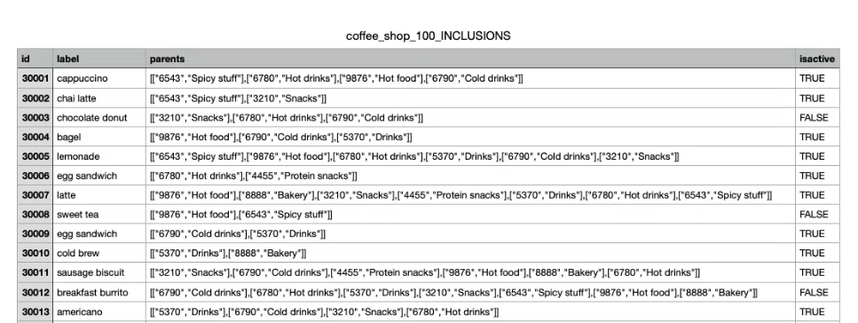

# Configurare le sfide relative alla fedeltà {#loyalty-admin}

<!-- Unpublished draft: Loyalty Admin UI documentation is not validated for Experience League. This page uses hide: true until review. -->

>[!BEGINSHADEBOX]

**Sommario**

[Introduzione alle sfide di fedeltà](get-started.md)

<table style="table-layout:fixed">
<tr style="border: 0;">
<td style="vertical-align:top;">

**Crea e gestisci le sfide**

* [Accesso e gestione di sfide e attività](access-loyalty-challenges.md)
* [Creare le sfide](create-challenges.md)
* [Creare le attività](create-tasks.md)
* [Monitorare le prestazioni della sfida fedeltà](loyalty-reporting.md)

</td>
<td style="vertical-align:top;">

**Configura e integra**

* **Configura le sfide fedeltà** ◀︎ **Sei qui**
* [Guida alla definizione del premio](reward-definition-guide.md)
* [Guida di Event Transformer](event-transformer-guide.md)
* [Dati e set di dati sulla fedeltà](loyalty-data-and-datasets.md)
* [Riferimento API per le sfide di fedeltà](https://developer.adobe.com/journey-optimizer-apis/references/loyalty-challenges){target="_blank"}

</td>
</tr>
</table>

>[!ENDSHADEBOX]

>[!AVAILABILITY]
>
>Questa funzionalità è attualmente in **versione beta privata**. Per informazioni dettagliate sul ciclo di rilascio e sulle fasi di disponibilità in [!DNL Journey Optimizer], vedere [ciclo di rilascio](../rn/releases.md).

## Panoramica {#access-loyalty-admin}

La configurazione delle sfide di fidelizzazione collega [!DNL Journey Optimizer] ai sistemi di fidelizzazione esterni impostando l&#39;evasione dei premi, la mappatura degli eventi, l&#39;inventario dei prodotti e le esclusioni prima che gli addetti al marketing creino le sfide.

>[!NOTE]
>
>La configurazione delle sfide di fidelizzazione richiede l&#39;accesso dell&#39;amministratore all&#39;istanza [!DNL Journey Optimizer], oltre alle autorizzazioni necessarie per le sfide di fidelizzazione. Per ottenere l’accesso, contatta il tuo amministratore Adobe.

Per aprire l&#39;interfaccia di configurazione, seleziona il menu **[!UICONTROL Amministratore fedeltà]** dal menu di navigazione a sinistra. L’interfaccia è organizzata in schede:

* **Impostazioni globali** - Selezionare lo spazio dei nomi dell&#39;identità Experience Platform per il programma. [Scopri come configurare le impostazioni globali](#global-settings)
* **Provider di premi**: collega le API che soddisfano i premi quando i clienti avanzano o completano le sfide. [Scopri come configurare i provider di premi](#reward-providers).
* **Definizioni evento** — Mappa gli eventi esperienza in arrivo alle attività utilizzate nelle **[!UICONTROL attività evento personalizzato]**. [Scopri come configurare le definizioni degli eventi](#event-definitions).
* **Inventario prodotti**: carica i mapping da elemento a gruppo da utilizzare nelle regole di idoneità dell&#39;attività. [Scopri come configurare l&#39;inventario dei prodotti](#product-inventory)
* **Esclusioni**: consente di caricare esclusioni di gruppi e elementi a livello di organizzazione per la configurazione dell&#39;attività. [Scopri come configurare le esclusioni](#exclusions)

## Impostazioni globali {#global-settings}

>[!CONTEXTUALHELP]
>id="ajo_loyalty_admin_global_settings"
>title="Impostazioni globali"
>abstract="Le impostazioni globali definiscono la configurazione a livello di organizzazione per le sfide fedeltà, incluso lo spazio dei nomi delle identità utilizzato per identificare i membri in eventi e sfide."

Apri la scheda **[!UICONTROL Impostazioni globali]** per configurare le impostazioni globali per le sfide di fedeltà.


* Nella sezione **[!UICONTROL Configurazione organizzazione]**, seleziona lo spazio dei nomi delle identità [Adobe Experience Platform](https://experienceleague.adobe.com/it/docs/experience-platform/identity/features/namespaces) per le sfide di fidelizzazione. Questo spazio dei nomi deve corrispondere al modo in cui i profili dei membri vengono identificati nei dati.

  ➡️ [Scopri come utilizzare gli spazi dei nomi delle identità](https://experienceleague.adobe.com/it/docs/experience-platform/identity/features/namespaces){target="_blank"}

* Utilizza la sezione **[!UICONTROL Generazione rapporti]** per impostare la metrica di priorità della tua organizzazione per il dashboard Approfondimenti fedeltà. Questa impostazione determina quali informazioni ricevono enfasi nel feed, consentendoti di concentrarsi sulla metrica più importante per la tua attività.

  Selezionare una delle opzioni KPI riportate di seguito.

  * **[!UICONTROL Ricavi]** - Assegna priorità agli approfondimenti relativi alle transazioni monetarie e alle prestazioni di vendita
  * **[!UICONTROL Coinvolgimento]**: assegna priorità agli approfondimenti relativi all&#39;attività e alla partecipazione dei membri
  * **[!UICONTROL Rimborsi]** — Assegna priorità alle informazioni relative ai tassi di rimborso dei premi e all&#39;attività
  * **[!UICONTROL Conversioni]** — Assegna priorità agli approfondimenti relativi alle metriche di conversione e al completamento dell&#39;obiettivo

  Quando selezioni un KPI, gli approfondimenti relativi a tale metrica ricevono un incremento di punteggio che li porta a raggiungere la parte superiore del feed. Ciò significa che vengono visualizzate per prime le informazioni più rilevanti per l’indicatore KPI selezionato. Nessun approfondimento nascosto: il feed insight completo continua a essere visualizzato, classificato in base alla significatività, con l’indicatore KPI selezionato prioritizzato rispetto alle altre metriche. Questa impostazione influisce solo sul modo in cui le informazioni vengono classificate nel feed e non modifica il modo in cui funziona il programma fedeltà o in cui vengono valutate le sfide. Puoi modificare la selezione dei KPI in qualsiasi momento e il feed di insight assegna nuovamente le priorità al successivo ciclo di aggiornamento in modo da riflettere la nuova priorità.

  Per ulteriori informazioni sugli approfondimenti sulla fedeltà e sul monitoraggio delle prestazioni, consulta [Monitorare le prestazioni della sfida fedeltà](loyalty-reporting.md).

## Provider di premi {#reward-providers}

>[!CONTEXTUALHELP]
>id="ajo_loyalty_admin_reward_providers"
>title="Provider di premi"
>abstract="Il “provider di premi” definisce il sistema esterno che viene chiamato da [!DNL Journey Optimizer] per erogare i premi ai clienti che completano le sfide. Configura l’endpoint del provider, le definizioni dei premi, le impostazioni proxy e l’autenticazione per ogni integrazione."

>[!CONTEXTUALHELP]
>id="ajo_loyalty_admin_reward_providers_connection"
>title="Connessione provider di premi"
>abstract="Configura in che modo [!DNL Journey Optimizer] si connette alla tua API dei premi: nome provider, descrizione, URL endpoint e intestazioni HTTP necessari per le chiamate di erogazione."

>[!CONTEXTUALHELP]
>id="ajo_loyalty_admin_reward_providers_details"
>title="Definizioni dei premi"
>abstract="Le definizioni dei premi specificano ogni tipo di premio che questo provider può emettere (ad esempio, punti o stelle) e il payload che viene inviato da [!DNL Journey Optimizer] quando i premi vengono erogati."

>[!CONTEXTUALHELP]
>id="ajo_loyalty_admin_reward_providers_proxy"
>title="Proxy per i premi"
>abstract="Facoltativamente, puoi indirizzare le chiamate di erogazione tramite un server proxy invece di inviarle direttamente all’endpoint API per i premi. Configura l’host, la porta, le credenziali e se il proxy è abilitato. Il valore delle credenziali si presenta solitamente con questo formato: `{ "userName": "test", "password": "xxxx" }`"

Un **provider di premi** indica a [!DNL Journey Optimizer] dove inviare le chiamate di evasione quando viene registrato l&#39;avanzamento della richiesta di verifica o viene completata una richiesta di verifica. Ad esempio, un’API che attribuisce punti fedeltà o stelle a un account membro.

Utilizzare questa sezione per la configurazione del provider end-to-end (connessione, proxy, generatore di token di autenticazione e risorse di definizione dei premi). Per informazioni dettagliate sulla progettazione della definizione dei premi e sulla strategia di payload, vedere [Guida alla definizione dei premi](reward-definition-guide.md).

Per creare un provider di premi, eseguire la procedura seguente:

1. Apri la scheda **[!UICONTROL Provider di premi]** e seleziona **[!UICONTROL Crea provider di premi]**.

   

1. Immetti un **[!UICONTROL Nome]** e una **[!UICONTROL Descrizione]**.

1. Nel campo **[!UICONTROL URL]**, immetti l&#39;endpoint API che riceve le richieste di evasione.

1. Aggiungi **[!UICONTROL Intestazioni]** in base alle esigenze della tua API (ad esempio, chiavi API o tipi di contenuto).

1. Configura le risorse associate al tuo provider di premi. Espandi ciascuna sezione seguente per i dettagli del campo:

   +++Definizioni dei premi

   Aggiungi una voce per tipo di premio supportato dal provider (ad esempio punti programma, stelle o credito monetario). Per ogni definizione:

   * Immetti un **[!UICONTROL Nome]** e una **[!UICONTROL Descrizione]**.
   * Specificare se la definizione è **[!UICONTROL Abilitata]**.
   * Attiva **[!UICONTROL Predefinito]** per contrassegnare una definizione come predefinita per questo provider.
   * Definisci come il payload dei premi verrà trasformato nella richiesta di payload di evasione, utilizzando l’espressione JSONata.

   Per ulteriori informazioni, vedere [Guida alla definizione del premio](reward-definition-guide.md#writing-the-rewardjsonata-expression).

   

   +++

   +++Proxy per i premi

   Indirizza le chiamate di evasione tramite un server intermedio invece di inviarle direttamente all’endpoint. Nelle schermate del provider di premi e **[!UICONTROL Crea proxy]**, utilizza il campo **[!UICONTROL Credenziali]** per l&#39;autenticazione proxy.

   * Immetti un **[!UICONTROL Nome]** e una **[!UICONTROL Descrizione]**.
   * Immettere **[!UICONTROL Host]** e **[!UICONTROL Porta]**.
   * Specificare se il proxy è **[!UICONTROL abilitato]**.
   * In **[!UICONTROL Credenziali]**, immettere il nome utente e la password proxy come JSON. Il valore delle credenziali è in genere simile al seguente:

     ```json
     { "userName": "test", "password": "xxxx" }
     ```

   

   +++

   +++Generatore di token di autenticazione

   Da utilizzare quando l’API richiede un token Bearer o un’autenticazione simile.

   * Immetti un **[!UICONTROL Nome]** e una **[!UICONTROL Descrizione]**.
   * In **[!UICONTROL Tipo di autenticazione]** immettere il tipo di autenticazione, ad esempio Bearer.
   * Seleziona il metodo HTTP (ad esempio, POST).
   * Immetti l&#39;URL dell&#39;endpoint del token e la **[!UICONTROL chiave token]** nella risposta (ad esempio, `access_token`).
   * Specificare se il generatore di token di autenticazione è **[!UICONTROL Abilitato]**.
   * Aggiungi le intestazioni richieste dall’endpoint token.

   [!DNL Journey Optimizer] utilizza questa configurazione per ottenere un nuovo token prima di ogni chiamata all&#39;API di ricompensa.

   

   +++

1. Selezionare **[!UICONTROL Crea provider di premi]**. Il provider e tutte le risorse configurate vengono salvati insieme.

Dopo il salvataggio, il provider viene visualizzato nell&#39;elenco dei provider di premi. Gli addetti al marketing possono selezionarlo durante la configurazione dei premi per la sfida. [Scopri come configurare i premi per le sfide](create-challenges.md#rewards)

Per modificare un provider di premi, aprire la scheda **[!UICONTROL Provider di premi]**, selezionare il provider e aggiornare i campi in uso. Le modifiche alle definizioni dei premi, ai proxy e ai generatori di token di autenticazione vengono salvate automaticamente quando vengono aggiornate.

>[!NOTE]
>
>**[!UICONTROL Acquisisci i tuoi dati]**: le sfide ti consentono di ottenere premi grazie alla tua integrazione dei dati. I provider di premi configurati in questo punto non sono applicabili a queste sfide. [Scopri come creare le sfide per i tuoi dati](create-challenges.md#create-the-challenge)

## Definizioni degli eventi {#event-definitions}

>[!CONTEXTUALHELP]
>id="ajo_loyalty_admin_event_definitions"
>title="Definizioni degli eventi"
>abstract="Le definizioni degli eventi indicano a [!DNL Journey Optimizer] come identificare e interpretare i dati degli eventi provenienti da origini esterne. Ogni definizione mappa un tipo di evento specifico, ad esempio un acquisto o un check-in, in modo che il sistema possa tenere traccia dell’avanzamento del cliente verso le attività della sfida."

>[!CONTEXTUALHELP]
>id="ajo_loyalty_admin_event_schema"
>title="Schema e trasformatore degli eventi"
>abstract="Nella sezione Schema evento, fornisci un’espressione JSONata **[!UICONTROL Transformer]** per mappare i campi evento in arrivo nel formato previsto da Sfide di fedeltà."

>[!CONTEXTUALHELP]
>id="ajo_loyalty_admin_event_identification"
>title="Identificazione degli eventi"
>abstract="Nella sezione Identificazione evento, fornisci il nome dell’evento e l’ID dello schema XDM richiesto utilizzato per identificare gli eventi in arrivo."

**[!UICONTROL Le definizioni degli eventi]** indicano a [!DNL Journey Optimizer] quali eventi di esperienza Adobe Experience Platform in ingresso elaborare. Ad esempio, un acquisto o il check-in in un hotel. Gli addetti al marketing fanno riferimento a queste definizioni quando creano **[!UICONTROL attività evento personalizzato]** nel generatore di attività. Gli eventi che non corrispondono ad alcuna definizione vengono ignorati.

Utilizza questa sezione per l’impostazione della definizione end-to-end (identificazione dell’evento più espressione del trasformatore). Per informazioni dettagliate sull&#39;authoring dei trasformatori, consulta [Guida del trasformatore di eventi](event-transformer-guide.md).

Quando l&#39;organizzazione invia eventi nel proprio formato JSON, [**[!UICONTROL Transformer]**](event-transformer-guide.md#writing-the-transformer) consente a [!DNL Journey Optimizer] di mappare e analizzare i payload in ingresso in modo che gli eventi possano essere tracciati correttamente.

Per creare una definizione di evento, effettua le seguenti operazioni:

1. Apri la scheda **[!UICONTROL Definizioni evento]** e crea una nuova definizione.

   

1. In **[!UICONTROL Identificazione evento]**, immettere i valori richiesti:

   * **[!UICONTROL Nome]** — Etichetta per la definizione dell&#39;evento (ad esempio, `Coffee purchase`).
   * **[!UICONTROL ID schema XDM]** — ID dello schema XDM di Experience Platform per questo tipo di evento.

1. In **[!UICONTROL Schema evento]**, fornisci l&#39;espressione [JSONata](event-transformer-guide.md#writing-the-transformer) richiesta che mappa il payload nel formato previsto da Sfide di fedeltà.

1. Salva la definizione dell’evento. Viene visualizzato nell&#39;elenco **[!UICONTROL Definizioni evento]** ed è disponibile quando gli addetti al marketing creano **[!UICONTROL attività evento personalizzato]**. [Scopri come creare le attività](create-tasks.md#choose-activity)

## Inventario dei prodotti {#product-inventory}

>[!CONTEXTUALHELP]
>id="ajo_loyalty_admin_product_inventory"
>title="Inventario dei prodotti"
>abstract="Carica un file CSV che mappa gli identificatori degli articoli ai gruppi di prodotti. I marketer possono fare riferimento a questi gruppi durante la configurazione degli articoli idonei per le attività di acquisto e spesa senza inserire l’ID di ciascun articolo."

La scheda **[!UICONTROL Inventario prodotti]** raggruppa gli elementi del catalogo in modo che gli addetti al marketing possano eseguirne il targeting nelle attività senza immettere ogni ID elemento. Carica un **file CSV** che associa ogni identificatore di elemento a uno o più **gruppi di prodotti** (lo stesso elemento può appartenere a più gruppi). I gruppi importati sono disponibili durante la configurazione dell’idoneità delle attività. [Scopri come creare le attività](create-tasks.md)

Per caricare un file di inventario dei prodotti, effettua le seguenti operazioni:

1. Prepara un file CSV che associa ogni identificatore di elemento a uno o più gruppi di prodotti. Espandi la sezione seguente per visualizzare un esempio.

   +++Esempio di CSV dell’inventario dei prodotti

   

   +++

1. Apri la scheda **[!UICONTROL Inventario prodotti]**.

1. Seleziona **[!UICONTROL Carica]** e scegli il tuo file CSV.

   

1. Esaminare i dati importati nell&#39;elenco di inventario. L’elenco mostra una riga per elemento. La colonna **[!UICONTROL Gruppi inclusi in]** mostra ogni gruppo di prodotti per l&#39;elemento come pillola o più pillole quando l&#39;elemento appartiene a più gruppi.

   

1. Per visualizzare tutti gli elementi di un gruppo di prodotti, selezionare la pillola del gruppo nella colonna **[!UICONTROL Gruppi inclusi in]** su qualsiasi riga. Nella vista Dettagli gruppo sono elencati tutti gli elementi del gruppo.

   

1. Apri **[!UICONTROL Cronologia caricamento]** per visualizzare i caricamenti CSV precedenti.

## Esclusioni {#exclusions}

>[!CONTEXTUALHELP]
>id="ajo_loyalty_admin_exclusions"
>title="Esclusioni"
>abstract="Carica un file CSV che definisce i gruppi e gli articoli del catalogo da escludere a livello di programma. I gruppi di esclusione importati vengono visualizzati quando i marketer configurano articoli idonei ed esclusioni per le attività."

La scheda **[!UICONTROL Esclusioni]** definisce gli elementi e i gruppi di catalogo esclusi a livello di programma, pertanto gli addetti al marketing non devono elencare le stesse esclusioni per ogni attività. Carica un **file CSV** che associa ogni identificatore di elemento a uno o più **gruppi di esclusione** (lo stesso elemento può appartenere a più gruppi).

Dopo l&#39;importazione, gli elementi e i gruppi esclusi vengono visualizzati nel generatore di attività quando gli addetti al marketing configurano **[!UICONTROL Elementi ed esclusioni idonei]**. [Scopri come definire elementi ed esclusioni idonei per le attività](create-tasks.md#eligible-items-exclusions)

Per caricare le esclusioni, effettua le seguenti operazioni:

1. Prepara un file CSV che associa ogni identificatore di elemento a uno o più gruppi di esclusione. Espandi la sezione seguente per visualizzare un esempio.

   +++Esempio di CSV delle esclusioni

   

   +++

1. Apri la scheda **[!UICONTROL Esclusioni]**.

1. Seleziona **[!UICONTROL Carica]** e scegli il tuo file CSV.

   

1. Esamina i dati importati nell’elenco delle esclusioni. L’elenco mostra una riga per elemento. La colonna **[!UICONTROL Gruppi inclusi in]** mostra ogni gruppo di esclusione per l&#39;elemento come pillola o più pillole quando l&#39;elemento appartiene a più gruppi.

<!-- SCREENSHOT: Exclusions list after CSV upload -->

1. Per visualizzare tutti gli elementi di un gruppo di esclusione, seleziona la pillola del gruppo nella colonna **[!UICONTROL Gruppi inclusi in]** su qualsiasi riga. Nella vista Dettagli gruppo sono elencati tutti gli elementi del gruppo.

<!-- SCREENSHOT: Exclusion group details -->

1. Apri **[!UICONTROL Cronologia caricamento]** per visualizzare i caricamenti CSV precedenti.
