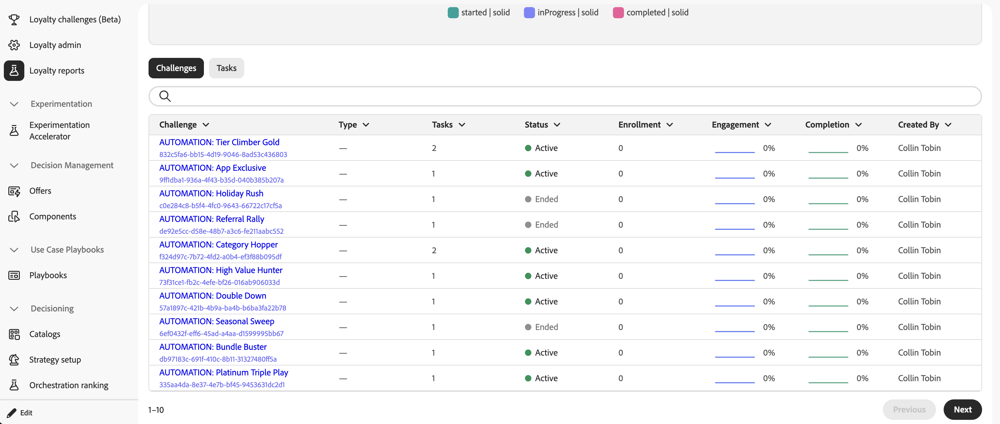

# Monitorare le prestazioni della sfida fedeltà {#loyalty-reporting}

>[!BEGINSHADEBOX]

**Documentazione sulle sfide di fedeltà**

[Introduzione alle sfide di fedeltà](get-started.md)

+++Creare e gestire le sfide

* [Accesso e gestione di sfide e attività](access-loyalty-challenges.md)
* [Creare le sfide](create-challenges.md)
* [Creare le attività](create-tasks.md)
* **Monitora le prestazioni della sfida fedeltà** ◀︎ **Sei qui**

+++

+++Configurare e integrare

<!-- * [Configure loyalty challenges](loyalty-admin.md) -->
* [Dati e set di dati sulla fedeltà](loyalty-data-and-datasets.md)
* [Riferimento API per le sfide di fedeltà](https://developer.adobe.com/journey-optimizer-apis/references/loyalty-challenges){target="_blank"}

+++

>[!ENDSHADEBOX]

>[!AVAILABILITY]
>
>Questa funzionalità è attualmente in **versione beta privata**. Per informazioni dettagliate sul ciclo di rilascio e sulle fasi di disponibilità, consulta [Ciclo di rilascio di Journey Optimizer](../rn/releases.md).

Il reporting sulle sfide di fedeltà fornisce dashboard a livello di sfida che consentono di monitorare metriche chiave quali prestazioni del funnel del pubblico, tassi di completamento delle attività, emissione di premi e impatto sui ricavi. Tutti i dati provengono da Adobe Customer Journey Analytics e sono presentati in un’interfaccia personalizzata.

<!--
A direct **Analyze in CJA** button will be added to the reporting interface before the feature reaches general availability.
-->

## Accedere ai rapporti sulla fedeltà {#access-reports}

Per aprire le dashboard di reporting sulla fedeltà, passa a **[!UICONTROL Sfide fedeltà (Beta)]** in Journey Optimizer e seleziona **[!UICONTROL Rapporti fedeltà]** nella barra di navigazione a sinistra.

L’interfaccia di reporting offre tre visualizzazioni, ciascuna con un diverso livello di dettaglio. **[Panoramica](#overview)** visualizza un riepilogo di tutte le sfide attive. Due schede al di sotto consentono di passare da una visualizzazione più granulare all’altra:

* **[Problemi](#challenges-view)**: suddivisione per singola sfida con funzionalità di drill-down,
* **[Attività](#tasks-view)**: visualizzazione a livello di attività delle metriche di ricavi e completamento.

Puoi regolare l’intervallo di date per tutte le visualizzazioni utilizzando il selettore di date nella parte superiore della pagina. Sono disponibili anche predefiniti per date standard.

## Panoramica {#overview}

La pagina **Panoramica** mostra le metriche aggregate per tutte le sfide attive per il periodo selezionato.

Nella parte superiore della pagina vengono visualizzate le metriche seguenti:

**Membri fedeltà** - Numero di membri del programma fedeltà attivi durante il periodo selezionato.
**Segnalazioni per la sfida** - Numero totale di nuove iscrizioni per la sfida per tutte le sfide.
**Ricavi** - Ricavi totali legati all&#39;attività di verifica durante il periodo.
**Percentuale media di completamento** - Percentuale di clienti iscritti che hanno completato almeno una sfida.

Al di sotto di queste metriche, una timeline del **Daily Challenge Engagement** mostra l&#39;evoluzione della partecipazione alla sfida nel corso del periodo, tracciando tre serie:

* Clienti che **hanno iniziato** una sfida,
* Clienti che sono passati allo stato **in corso**,
* Clienti che **hanno completato** una richiesta di verifica.

## Vista Problemi {#challenges-view}

La scheda **Sfide** suddivide le prestazioni per singola sfida. Ogni sfida è elencata con colonne chiave come Tipo, Stato, Iscrizione, Completamento e altro ancora. L’elenco è ordinato per l’ultima data di modifica e visualizza dieci problemi alla volta. Utilizza il pulsante **Successivo** in basso per sfogliare ulteriormente.

Seleziona una sfida dall’elenco per aprirne la vista dei dettagli. Il rapporto include diversi blocchi di metrica come i grafici Ricavo totale, Iscrizione, Tasso di completamento e Tasso di andamento, nonché un raggruppamento giornaliero.

+++Esempio di rapporto sulla sfida

+++

## Vista Attività {#tasks-view}

La scheda **Attività** fornisce una visualizzazione delle prestazioni dell&#39;attività con una verifica incrociata. Puoi passare dalle attività principali in base ai ricavi alle attività principali in base ai completamenti, per concentrarti sulla metrica più rilevante per te.

La scheda evidenzia inoltre le prime 6 attività in base alle entrate, fornendo una rapida visualizzazione di quali attività generano maggior valore.

Sotto il grafico a radar, un elenco di attività mostra ogni attività con colonne chiave come Completamenti, Entrate e le sfide a cui appartiene ogni attività. L&#39;elenco è ordinato in base alle entrate e mostra dieci attività alla volta. Utilizza il pulsante **Successivo** per sfogliare ulteriormente.

